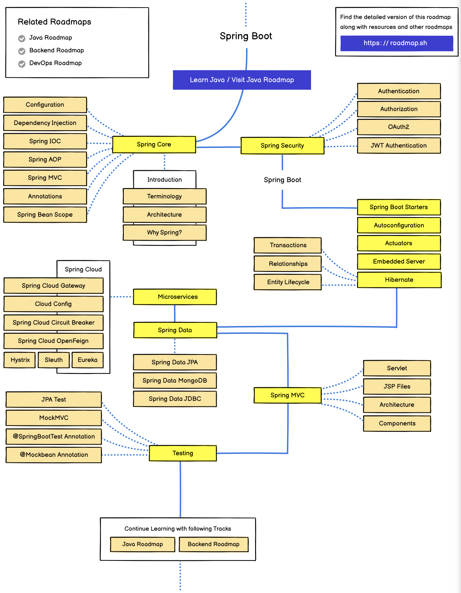
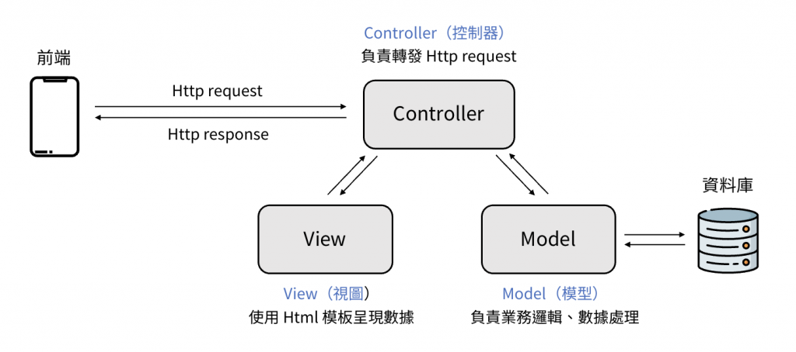
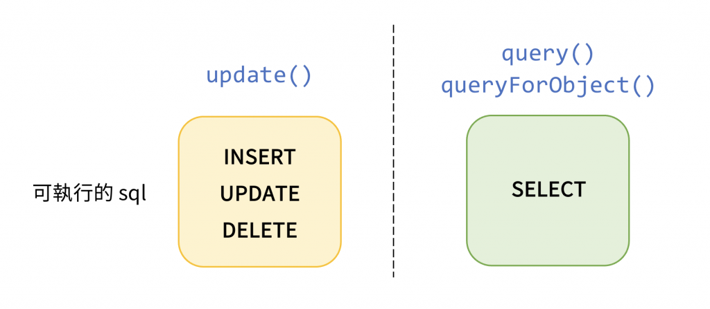
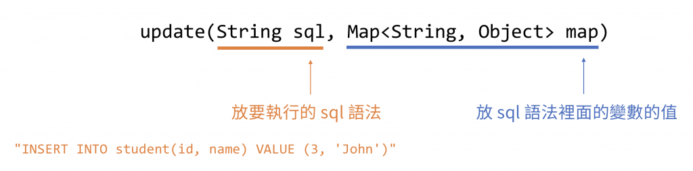
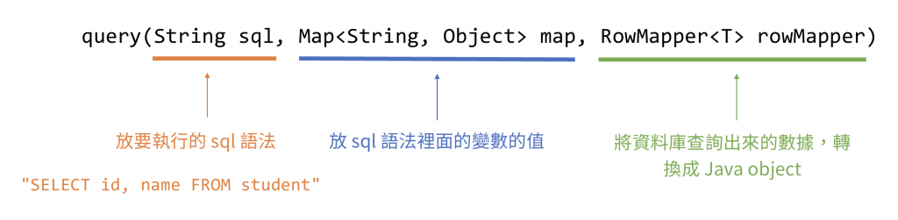
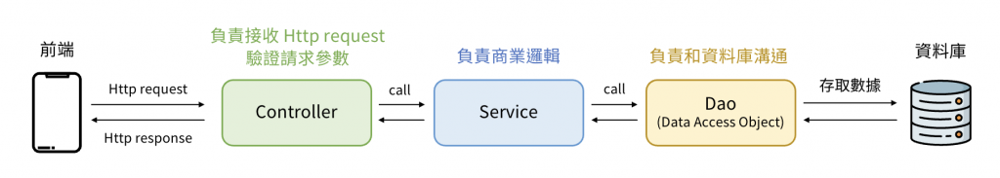
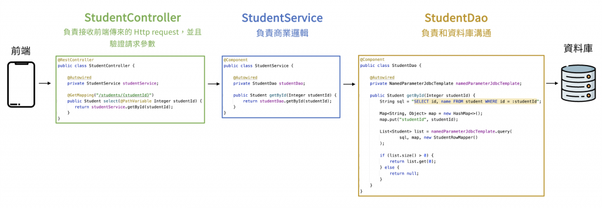
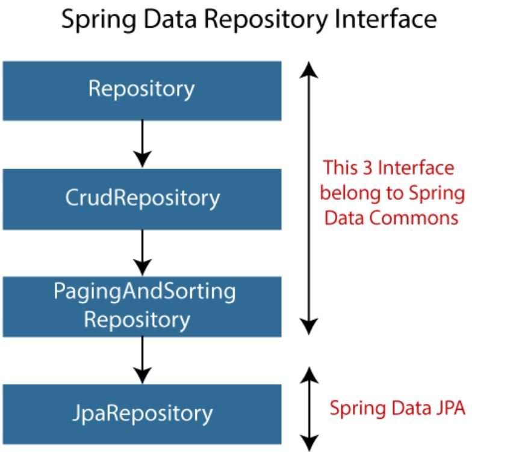
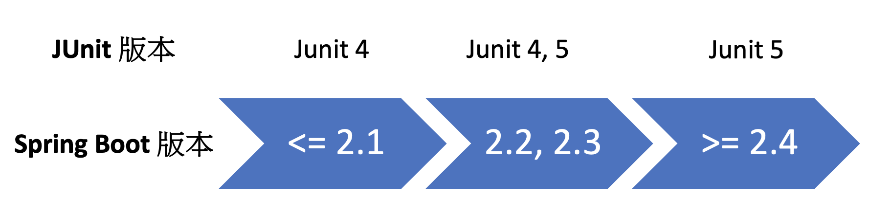

# Spring Boot 框架

- 學習 Spring Boot 框架的基本觀念 & 功能

[TOC]

## 學習路線

- 2024 年
  

## 建立 Spring Boot 專案

- **Spring Boot 框架** 實際上背後仍是使用 Spring 框架的功能，只是包裝得更簡單，希望達到 **開箱即用**
- Spring Boot 特性
	- Convention over configuration: **約定大於配置 or 慣例優於設定**
    	- **不需添加任何設定**，只要知道運作規則，就能直接使用
    	- 所有 project 皆遵循 **一致的標準化設定**
- IDE: IntelliJ Ulitimate 版本
- New Project -> Spring Initializr
    - Type(套件管理包工具): Gradle 或 Maven
    - JDK: 選擇 OpenJDK 的版本 (e.g. 17.0.4)
    	- 需留意 JDK 與 Java 的版本需一致!
    - Java: 程式語言的版本 (e.g. 17)
    	- Java 版本也會與 Spring Boot 版本有相依性
        	- Java 11 開發 Spring Boot 2
            - Java 17 開法 Spring Boot 3
    - Packaging: JAR 或 WAR
- Spring Boot 預設域名(domain) = `http://localhost:8080`
- Spring Boot 預設當 **返回型別是使用者自定義 class** 時 (e.g. Student)，會 **自動轉換成 JSON 格式** 放到 response body 回傳出去

    - 背後是使用 Jackson library 來完成 Java class <-> JSON object

- IntelliJ IDE
    - 預設會自動儲存所有程式碼變動
    - MacOS: `option + Enter` 顯示目前紅色波浪錯誤的可能解決方法有哪些
    - MacOS: `shift + option` 移動程式碼 (以 row 為單位)
    - MacOS 選取多個檔案: 按住 command 鍵
    - MacOS 深入檢視 method, interface: 按住 command 鍵 + 滑鼠點選該 method, interface
    - 輸入 `sout` = `System.out.println();`
    - 輸入 `psvm` = `public static void main(String[] args) {}`
    - 快速產生 class 的 constructor(), getter(), setter() 方法: `右鍵 -> generate -> 選擇要產生的 method 類型`

### 專案目錄結構

```markdown
project-name
├── .idea/
├── .mvn/
├── src/
│   ├── main/
│   	├── java/               # 放 Java 程式
│   	├── resources/          # 放 Spring Boot 設定檔
│   	├── static/
│   	├── templates/
│   	└── application.properties  # 最重要的 Spring Boot 設定檔
│   ├── test/
│   	├── java/               # 放測試用的 Java 程式
│   	└── resources/          # 放測試用的 Spring Boot 設定檔
└── pom.xml                		# Maven 管理套件的設定檔
```

- Spring Boot 設定檔 (**application.properties**)

    - 存放 Spring Boot 的設定值，用於定義 Spring Boot 應用程式的配置參數
        - 應用程式參數: log, port ...等
		- 環境配置: dev, test, prod ...等
		- 自定義參數
    - 使用 properties 語法: `key=value`
    	- `=` 的前後不需加上空白鍵
    	- key 可以有 `.` 符號，相當於中文 "的"
    	- value 若為 String 型別，不需要加上 `" "`
    	- 用 `#` 表示註解 (comment)

	```properties
	count=5
	my.name=Hans
	my.age=28
	# this is a comment
	```

- 套件管理的設定檔 (**pom.xml**)
    - Maven 管理套件的設定檔，用於管理套件的設定、版本、依賴關係

    - 設定 Spring Boot 版本。更新後，需按右鍵 Maven -> Reload Project
	```xml
	<parent>
		<groupId>org.springframework.boot</groupId>
		<artifactId>spring-boot-starter-parent</artifactId>
		<version>3.2.5</version>
		<relativePath/> <!-- lookup parent from repository -->
	</parent>
	```

### Annotation (註解)

- `@SpringBootApplication`: 加在 class 上，執行 Spring Boot 程式用

```java
@SpringBootApplication
public class DemoApplication {

	public static void main(String[] args) {
		SpringApplication.run(DemoApplication.class, args);
	}

}
```

- 若有多個 annotation，其之間沒有順序性

## Spring Core 核心觀念

### Spring IoC

- **IoC** (Inversion of Control, **控制反轉**): 將 object 的控制權，(倒轉)交給了外部的 Spring container 來管理

    - Spring 會預先建立物件，存放在 container 管理 (不用管實際是怎麼 `new()` 出來的)

		> Spring 先買了一台印表機，之後有人要用印表機的話，就跟 Spring 借來用，而不用管理是什麼廠牌的印表機

- **DI** (Dependency Injection, **依賴注入**): Spring container 將 bean 交給某個 class 使用

- **Bean**: 存放在 Spring container 裡的 object

    - 預設的物件名稱 = @Component class 的首字母小寫

- **@Component 註解**: 加在 **class** 上，將 class 變成 **Spring container 所管理的 bean**

    - 較常使用

- **@Autowired 註解**: 加在 **變數** 上，根據 **變數的型別**，去 Spring 容器中尋找相對應的 bean

    - 變數型別盡量使用 Interface，讓 Java 可透過多型進行向上轉型，提高程式碼重用性

- **@Qualifier 註解**: 通常加在 **變數** 上，輔助 @Autowired，用來指定要載入的 bean 名稱

```java
// 介面
public interface Printer {
  void print(String message);
}

// 實作介面
@Component  // bean (可想像成 Spring container 為我們執行 Printer hpPrinter = new HpPrinter();)
public class HpPrinter implements Printer {
  @Override
  public void print(String message) {
	System.out.println("HP 印表機: " + message);
  }
}

// 實作介面
@Component
public class CanonPrinter implements Printer {
  @Override
  public void print(String message) {
	System.out.println("Canon 印表機: " + message);
  }
}
```

```java
// 原寫法
// public class Teacher {
// 	private Printer printer = new HpPrinter();

//   public void teach() {
//     printer.print("I'm a teacher.");
//   }
// }

// IoC 寫法: 由 Container 負責管理 Printer 物件
@Component  // 要使用 DI bean 之前，自己本身也要是 bean
public class Teacher {
  @Autowired  // DI (依賴注入)的用法
  @Qualifier("hpPrinter") // 指定要載入的 bean 名稱
  private Printer printer; // 變數型別盡量使用 Interface (e.g. Printer)

  public void teach() {
	printer.print("I'm a teacher.");
  }
}
```

- **@Configuration 註解**: 加在 class 上，表示該 class 是用來 **設定 Spring 用的**
    - 這時候 class 名稱是什麼其實不太重要 (e.g. MyConfiguration)
- **@Bean 註解**: 加在帶有 **@Configuration** 的 class 上，於 Spring container 中建立一個 bean
    - 所建立出來的 bean，預設會是 method 名稱
    - 可以在 @Bean 註解後面指定 bean 的名稱
    	- `@Bean("xxx")`

```java
@Configuration
public class MyConfiguration {
  @Bean
  public Printer myPrinter() {
	// 可想像成 Spring container 幫我們執行以下這個 method
	// Printer myPrinter = 該 method 返回的 object (hpPrinter)
	// 所建立出來的 bean，預設會是 method 名稱 (myPrinter)
	return new HpPrinter();
  }
}
```

- Spring 中初始化 bean 的方法
    - **@PostConstruct 註解**: 設定 Spring container 中的 bean 的初始值
    	- 較常使用
    	- 必須是 **public** method
    	- 返回型別必須是 **void**
    	- method 名稱可以隨意取
    	- method 不能有參數
    - 實作 InitializingBean interface 的 **afterPropertiesSet()** method

	```java
	// 法 1: @PostConstruct 註解
	public class hpPrinter implements Printer {
	private int count;
    
	@PostConstruct
	public void initialize() {
		count = 5;
	}
    
	@Override
	public void print(String message) {
		count--;
		System.out.println("HP 印表機: " + message);
		System.out.println("剩餘使用次數: " + count);
	}
	}
	```

	```java
	// 法 2: 實作 InitializingBean interface 的 afterPropertiesSet() method
	@Component
	public class HpPrinter implements Printer, InitializingBean {
	private int count;
    
	@Override
	public void afterPropertiesSet throws Exception {
		count = 5;
	}
    
	@Override
	public void print(String message) {
		count--;
		System.out.println("HP 印表機: " + message);
		System.out.println("剩餘使用次數: " + count);
	}
	}
	```

- Bean 生命週期
    - **創建 -> 初始化 -> 可以被別人拿去使用**
    - 當建立 bean 時發現需要依賴其它 bean，則 Spring 會回過頭去 "建立 + 初始化" 那個被依賴的 bean
    - 勿寫出會發生循環依賴的程式碼 (e.g. A 依賴於 B，且 B 依賴於 A)
- **@Value 註解**: 讀取 Spring Boot 設定檔 (`application.properties`) 中，指定的 key 的值
    - 用法: 加在 **bean** 或是**設定 Spring 用的 class** 裡面的 **變數** 上
    	- e.g. 帶有 **@Component 註解、@Configuration 註解** 的 **class** 上
    - 語法: `"${ }"`
    	- `${unknown:Amy}`: 設定 @Value 註解的預設值 (若找不到相對應 key 的值，才會使用指定的預設值)

	```java
	@Component
	public class MyBean {
	@Value("${count}")
	private Integer numb;  // 5
    
	@Value("$my.name")
	private String name;  // "Hans"
    
	@Value("${unknown:Amy}")
	private String herName; // "Amy"
	}
	```

- IoC 優點
    - **鬆耦合** (loose coupling): 讓 class 之間的關聯性降低
    - **生命週期管理** (lifecycle management): 由 Spring container 負責該 object 的建立、初始化、銷毀
    - **方便測試程式** (more testable)

### Spring AOP

- **AOP** (Aspect-Oriented Programming, **切面導向程式設計**): 將所有 method 要執行的共同邏輯寫在切面中，並且讓該切面橫貫所有 method，替所有 method 去執行這個共同的邏輯

- 設定 AOP

    - 在 `pom.xml` 中設定後，按右鍵 Maven -> Reload Project 重新載入新的設定

    ```xml
    <dependency>
    	  <groupId>org.springframework.boot</groupId>
    	  <artifactId>spring-boot-starter-aop</artifactId>
    </dependency>
    ```

- **@Aspect 註解**: 加在 **帶有 @Component 註解的 class** 上 (= bean)，用來 **宣告這個 class 是一個切面**

- **切入點(pointcut)** 表達式: 要用到時再查就可以了

- **@Before 註解**: 加在 **切面 class 的 method** 上，於 **切入點的 method 執行之前** 所執行

- **@After 註解**: 加在 **切面 class 的 method** 上，於 **切入點的 method 執行之後** 所執行

- **@Around 註解**: 加在 **切面 class 的 method** 上，於 **切入點的 method 執行之前、後** 所執行

  - `Object obj = pjp.proceed()`: 執行切入點的方法

- **@AfterThrowing 註解**: 加在 **切面 class 的 method** 上，於 **切入點的 method 拋出異常後** 才會執行

    - 較少使用

- **@AfterReturning 註解**: 加在 **切面 class 的 method** 上，於 **切入點的 method 執行成功後** 才會執行

    - 較少使用

```java
@Aspect
@Component
public class MyAspect {
	// 2. @Before 在執行 A 方法之前   // 1. 我們指定的方法 A
	@Before("execution(* com.example.demo.HpPrinter.*(..))")
	// 3. 先讓 Spring 執行這個 before() 方法
	public void before() {
		System.out.println("I'm before");
	}

	public void after() {
		System.out.println("I'm after");
	}
}
```

```java
@Aspect
@Component
public class MyAspectAround {
	@Around("execution(* com.example.demo.HpPrinter.*(..))")
	public Object around(ProceedingJoinPoint pjp) throws Throwable {
		System.out.println("I'm around before.");
		// 執行切入點的方法 (e.g. hpPrinter.print();)
		Object obj = pjp.proceed();
		System.out.println("I'm around after.");
		return obj;
	}
}
```

- AOP 使用情境
    - 權限驗證: **Spring Security**
    - 統一的 Exception 處理: **@ControllerAdvice**
    - Log 紀錄

## Spring MVC

- 屬於 Spring 框架的一部分，採用 **Model-View-Controller (MVC) 的設計模式**，以開發網頁應用程式的框架
    - 將一個系統，去拆分成「Model、View、Controller」三個部分，並且讓每一個部分都各自負責不同的功能
    - 分類我們所寫的程式
    - 優點: 
        - **職責分離**，更容易維護程式
		- 使程式結構更直覺，有利於 **團隊分工**
		- **可重複使用** 寫好的程式

	
	[圖片出處](https://ithelp.ithome.com.tw/articles/10338883)

- **@Controller 註解、@RestController 註解**: 用在 class 上，**將 class 變成 bean 儲存**，並且可以使用 @RequestMapping 註解於其內部的 method 上

    - 可想像成加強版的 @Component 註解
    - 使用 @Controller 註解，需在 class 內的每個 method 上面加上 @RespondBody 註解

		```java
		@Controller
		public class MyController {
			@ResponseBody
			@RequestMapping("/product")
			public String product() {
				return "第一個是蘋果 第二個是橘子";
			}
		
			@ResponseBody
			@RequestMapping("/user")
			public String user() {
				return "名字為 Judy";
			}
		}
		```
		
    - 使用 @RestController 註解，就不用加上 @ResponseBody 註解
    	```java
		@RestController
		public class MyController {
			@RequestMapping("/product")
			public String product() {
				return "第一個是蘋果 第二個是橘子";
			}
		
			@RequestMapping("/user")
			public String user() {
				return "名字為 Judy";
			}
		}
		```
	
- **@RequestMapping 註解**: 用在 **帶有 @Controller 註解 or @RestController 註解的 class** 上，或 **method 上**，可將 **指定的 url 的路徑對應到 method** 上
    - 僅需指定 url 的路徑即可，不需包含域名

	```java
	@RestController
	public class MyController {
		// 法 1: 用在 method 上
		@RequestMapping("/test")
		public String test() {
			System.out.println("Hi!");
			return "Hello World";
		}
	}
	```

	```java
	@RestController
	// 法 2: 用在帶有 @RequestController 註解的 class 上
	@RequestMapping("/detail")
	public class MyController {
		@RequestMapping("/test")  // url 的路徑會變成 /detail/test
		public String test() {
			System.out.println("Hi!");
			return "Hello World";
		}
	}
	```

- 取得請求參數

- **@RequestParam 註解**: 取得 **url 的參數** (query parameter)

	- e.g. http://localhost:8080/test1?**id=123&name=Hans**
	- 若後端 API method 的參數 **有加上 @RequestParam 註解的話**，前端發起 request 時，就 **必須要填入** 參數值，否則會引發錯誤
	- **name 或 value 設定**: 指定 url 參數的名字 (前端發出 request 時就必須使用該 url 參數名稱來賦值)
    	- 較少使用
	- **required 設定**: 表示是否為必須的參數
        - 預設 = true
	- **defaultValue 設定**: 當前端發出的 request 未填入參數值的情況時，提供預設值
    	- 可想像成 required=false 的加強版，來避免前端發起 request 未填入參數值時，參數值為 null 的情況

	```java
	// @RequestParam 註解的用法
	@RequestController
	public class MyController {
		@RequestMapping("/test1")
		public String test1(@RequestParam Integer id,
							@RequestParam String name) {
			System.out.println("id: " + id);
			System.out.println("name: " + name);
			return "Hello test1";
		}
	}
	```

	```java
	// @RequestParam 註解的 name, required, defaultValue 設定
	@RestController
	public class MyController {
		@RequestMapping("/test1")
		public String test1(@RequestParam(required = false) Integer id,
							@RequestParam(name = "testName", defaultValue = "Hans") String name) {
			System.out.println("id: " + id);
			System.out.println("name: " + name);
			return "Hello test1";
		}
	}
	```

- **@RequestBody 註解**: 取得 request body 的參數 (將 JSON 格式的參數轉換為 Java object)

	- 後端: 先建立一個與 JSON 格式的參數，相對應的 Java class。接著，在 API method 參數前面加上 @RequestBody 註解
	- Spring Boot 只會轉換後端 Java class 有宣告的屬性。若前端多帶一個 key，會被後端乎略; 反之，若前端少帶一個 key，則會將其所對應的 object 屬性值設定為 null

	```java
	@RequestMapping("/test2")
	public String test2(@RequestBody Student student) {
		System.out.println("student id: " + student.getId());
		System.out.println("student name: " + student.getName());
		return "Hello test2";
	}
	```

- **@RequestHeader 註解**: 取得 requestHeader 的參數

    - 常見的 request header

    | Request Header |           意義           |                                                         常見的值                                                          |
    | :------------- | :----------------------: | :-----------------------------------------------------------------------------------------------------------------------: |
    | Content-Type   | 表示 request body 的格式 | application/json (JSON 格式，最常見)<br />application/octet-stream (用於上傳文件)<br />multipart/form-data (用於上傳圖片) |
    | Authorization  |       用於身份驗證       |                  |

    - **name 或 value 設定**: 指定 requestHeader 參數的名字 (前端發出 request 時就必須使用該 requestHeader 參數名稱來賦值)
          - 蠻常使用，因為 Java 的變數名稱不支援`-` (e.g. Content-Type, User-Agent)
      
    - **required 設定**: 表示是否為必須的參數
      	- 預設 = true
	  
    - **defaultValue 設定**: 當前端發出的 request 未填入參數值的情況時，提供預設值
        - 可想像成 required=false 的加強版，來避免前端發起 request 未填入參數值時，參數值為 null 的情況
  
	```java
	@RequestMapping("/test3")
	public String test3(@RequestHeader String info,
						@RequestHeader(name = "User-Agent") String userAgent) {
		System.out.println("header info: " + info);
		System.out.println("user agent: " + userAgent);
		return "Hello test3";
	}
	```
	
- **@PathVariable 註解**: 取得 url 路徑的值
    - **name 設定**: 指定 url 的參數的名字 (前端發出 request 時就必須使用該 url 參數名稱來賦值)
    	- 較少使用
   
	- **required 設定**: 表示是否為必須的參數
        - 預設 = true
	
    - **defaultValue 設定**: 當前端發出的 request 未填入參數值的情況時，提供預設值
        - 可想像成 required=false 的加強版，來避免前端發起 request 未填入參數值時，參數值為 null 的情況
	
	```java
    @RequestMapping("/test4/{id}/{name}")
	public String test4(@PathVariable Integer id,
						@PathVariable String name) {
		System.out.println("path id: " + id);
		System.out.println("path name: " + name);
		return "Hello test4";
	}
	```

### Restful API 風格

> REST 風格只是一種 **約定俗成的習慣**，並不是標準規範。為了 **簡化溝通成本**

- 使用 **HTTP method 表示動作**

	| HTTP method | 對應的資料庫操作 |
	| :---------: | :--------------: |
	|    POST     |  Create (新增)   |
	|     GET     |   Read (查詢)    |
	|     PUT     |  Update (更新)   |
	|   DELETE    |  Delete (刪除)   |

    - **GET, DELETE** method 都只能透過 **url 參數** 傳遞資訊
    - **POST, PUT** method 可使用 **request body** 傳遞資訊

- 使用 **url 路徑**，描述 **資源之間的階層關係**

    - e.g. `GET /users/123` (取得 user id 為 123 的 user)

- **response body 返回 JSON** 或 XML 格式的資料

    - Spring Boot: 在 class 上面加上 @RestController 註解

- **POST method**

    - 法 1: 使用 **@PostMapping 註解**

    	- 較常使用

	```java
	// 法 1: 使用 @PostMapping 註解
	@RestController
	public class StudentController {
		@PostMapping("/students")
		public String create(@RequestBody Student student) {
			return "執行資料庫的 Create 操作";
		}
	}
	```

  - 法 2: 使用 @RequestMapping 註解，並指定 value, method

	```java
	// 法 2: 使用 @RequestMapping 註解，並指定 value, method
	@RestController
	public class StudentController {
		@RequestMapping(value = "/students", method = RequestMethod.POST)
		public String create(@RequestBody Student student) {
			return "執行資料庫的 Create 操作";
		}
	}
	```

- GET method

- PUT method

- DELETE method

```java
// CRUD APIs 綜合範例
@RestController
public class StudentController {
@PostMapping("/students")
public String create(@RequestBody Student student) {
	return "執行資料庫的 Create 操作";
}

@GetMapping("/students/{studentId}")
public String read(@PathVariable Integer studentId) {
	return "執行資料庫的 Read 操作";
}

@PutMapping("/students/{studentId}")
public String update(@PathVariable Integer studentId,
					 @RequestBody Student student) {
	return "執行資料庫的 Update 操作";
}

@DeleteMapping("/students/{studentId}")
public String delete(@PathVariable Integer studentId) {
	return  "執行資料庫的 Delete 操作";
}
}
```

### 驗證請求參數

- 可以用 Java 的 if 判斷式來處理 -> 較冗長，若參數很多，會很麻煩

- 採用 Spring Boot 註解來處理

    - Spring Boot v2.3.x ～ 需要先做額外設定

		```xml
		<dependency>
			<groupId>org.springframework.boot</groupId>
			<artifactId>spring-boot-starter-validation</artifactId>
		</dependency>
		```

- 驗證請求參數的註解 (僅列出部分常用的)

	- **@Valid 註解**: 標示 **指定的變數需被驗證**
		- 必須在 **@RequestBody 參數前面**
	- **@Validated 註解**: **整個 @RestController class** 都會生效
		- 可以放在 **@RestController class** 上，使 **class 中的所有參數** 都能被驗證
		- 適用於 **@RequestParam, @RequestHeader, @PathVariable** 等註解
	
	> @RequestBody: 在 **參數前面** 加上 **@Valid**
	>
	> 其餘三個: 在 **Class 上面** 加上 **@Validated**
	
	- **@NotNull 註解**: 不能為 null
	- **@NotBlank**: 不能為 null、且不能為空白的字串，用在驗證 **String 類型的參數** 上
	- **@NotEmpty**: 不能為 null、且 size 必須 > 0，用在驗證 **集合類型 (List、Set、Map) 的參數** 上
	- @Min (value): 值必須 >= value，用在驗證數字類型的參數上
	- @Max(value): 值必須 <= value，用在驗證數字類型的參數上
	
	```java
	// Student.java
	public class Student {
		@NotNull
	  	@Min(100)
	  	@Max(200)
		Integer id;
	
		@NotBlank
		String name;
	
		@NotEmpty
		List<String> courseList;
	
		// 省略 getter(), setter()
	}
	```
	
	```java
	// StudentController.java
	// 法 1: 使用 @Valid 註解，標示指定的變數需被驗證
	@RestController
	public class StudentController {
		@PostMapping("/students")
		public String create(@RequestBody @Valid Student student) {
			return "執行資料庫的 Create 操作";
	}
	```
	
	```java
	// StudentController.java
	// 法 2: 使用 @Validated 註解，就可以把驗證請求註解，直接加到 API method 的參數前面使用
	@RestController
	@Validated
	public class StudentController {
		// 驗證請求參數也可以直接加在 API method 的參數前面
		@GetMapping("/students/{studentId}")
		public String read(@PathVariable @Min(100) Integer studentId) {
			return "執行資料庫的 Read 操作";
		}
	}
	```

### HTTP 狀態碼

- 用來表示這次 http 請求的結果為何
- 可以根據 **首位數字** 分為五大類
	- 1xx: 資訊
	- 2xx: 成功
		- 200 OK: 請求成功
		- 201 Created: 請求成功且新的資源被建立，通常用在 POST 的 response
		- 202 Accepted: 請求已經接受，但尚未處理完成
	- 3xx: 重新導向
		- 301 Move Permanently: **永久性** 重新導向，新的 url 會放在 response header 的 `Location` 中返回。通常會用在網頁搬家的情況
		- 302 Found: **臨時** 重新導向，新的 url 會放在 response header 的 `Location` 中返回。通常會用在網頁搬家的情況
	- 4xx: 前端請求錯誤
		- 400 Bad Request: 前端的請求參數有誤 (e.g. 前端傳給後端的參數名稱不同、請求的格式有問題)
		- 401 Unauthorized: **未通過身份驗證** (e.g. 會員帳密輸入錯誤)
		- 403 Forbidden: 請求被後端拒絕，通常是 **權限不足導致** (e.g. 普通會員卻想看 VIP 會員的內容)
		- 404 Not Found: 網頁不存在，可能是資源被移走，或 url 輸入錯誤
	- 5xx: 後端處理有問題
		- 500 Internal Server Error: 後端在執行程式時發生錯誤，可能是程式內有 bug 導致的
		- 503 Service Unavailable: 由於臨時維護 or 流量太大，後端目前無法處理請求
		- 504 Gateway Timeout: 請求超時，被強制結束

- **ResponseEntity**: 可自定義回傳的 response 物件的細節，例如: http header, status code, body ...等

	- 用法: 作為 method 的返回型別
	- `ResponseEntity.body` 的型別必須遵守 ResponseEntity<> 泛型的型別規範

	```java
	@RestController
	public class MyController {
		@RequestMapping("/test")
		public ResponseEntity<String> test() {
			return ResponseEntity.status(HttpStatus.ACCEPTED).body("Hello World");
		}
	}
	```

- Java 的 Error & Exception 繼承關係圖

	 <br>
	[圖片來源](https://www.manishsanger.com/java-exception-hierarchy/)

	- Error: 系統錯誤，<font color=red>不需處理</font>
	- Exception: 程式有錯誤，<font color=green>需要處理</font>


- **@ControllerAdvice 註解**: 加在 class 上，會將該 class 變成 bean，並且可在內部使用 @ExceptionHandler 註解

    - 優點: 統一管理 Exception，不用一個一個寫 `try ... catch ...`
    - 底層由 Spring AOP 所實作

- **@ExceptionHandler 註解**: 加在 method 上，去 catch 方法所噴出的 Exception

    - Spring Boot 會根據 Exception 的繼承關係，往上找到相對應的 @ExceptionHandler 來處理


```java
// MyExceptionHandler.java
@ControllerAdvice
public class MyExceptionHandler {
  	// 記得加上 .class
	@ExceptionHandler(RuntimeException.class)
	public ResponseEntity<String> handle(RuntimeException exception) {
		return ResponseEntity.status(HttpStatus.SERVICE_UNAVAILABLE)
				.body("Runtime Exception: " + exception.getMessage());
	}
		
  	// 記得加上 .class
	@ExceptionHandler(IllegalArgumentException.class)
	public ResponseEntity<String> handle(IllegalArgumentException exception) {
		return ResponseEntity.status(HttpStatus.BAD_REQUEST)
				.body("IllegalArgumentException: " + exception.getMessage());
	}
}
```

```java
// MyController.java
@RestController
public class MyController {
	@RequestMapping("/test1")
	public String test1() {
		throw new RuntimeException("test1 error");
	}

	@RequestMapping("/test2")
	public String test2() {
		throw new IllegalArgumentException("test2 error");
	}
}
```

### 攔截器 (Interceptor)

- 判斷 http request 是否有問題

    - 若沒有問題就去執行該 url 路徑所對應的 API method; 反之
    - 若有問題，就返回錯誤訊息給前端 (不會送達 controller)

- 建立攔截器

    - step 1: **加上 @Component 註解**，讓該 class 成為一個 bean
    - step2: **實作 HandlerInterceptor 介面**
    	- 其中 `preHandle()` 方法最重要

	```java
	// MyInterceptor.java
	@Component
	public class MyInterceptor implements HandlerInterceptor {
		@Override
		public boolean preHandle(HttpServletRequest request, HttpServletResponse response, Object handler) throws Exception {
			System.out.println("執行 MyInterceptor 的 preHandle() 方法");
			response.setStatus(401);
			return false;  // 由返回值 true 或 false 決定攔截器的行為
		}
	}
	```

	```java
	// MyConfig.java
	// 算是固定寫法，要用時再來看就好，不用背
	@Configuration
	public class MyConfig implements WebMvcConfigurer {
		@Autowired
		private MyInterceptor myInterceptor;
	
		@Override
		public void addInterceptors(InterceptorRegistry registry) {
			registry.addInterceptor(myInterceptor).addPathPatterns("/**");
		}
	}
	```

## Spring JDBC
- 在 Spring Boot 中執行 **原始 SQL 語法**，去操作資料庫

| Spring JDBC | Spring Data JPA |
| :--: | :--: |
| 以 **SQL** 為中心 | 以 **Java object** 為中心 |
| 需要 **自己寫** SQL 語法 | **不需寫** SQL 語法，Hibernate 會自動生成 SQL 語法，去操作資料庫 |
| 開發效率 **低** | 開發效率 **高** |
| 執行效能較 **好** | 執行效能較 **差** |
| **可寫出** 複雜 SQL 語法 | **較難** 寫出複雜 SQL 語法 |

### IntelliJ 的資料庫 GUI
- 點選 IntelliJ 的 Database 圖示 -> `+` -> Data Source -> MySQL
- 設定連線資訊後，可以 test connection 後，再按 OK
- console 畫面可以直接輸入 SQL 語法，並執行: 播放按鈕 or `command + enter`
- 可以檢視 table 的資料: 按滑鼠左鍵點選 table 兩下
    - 所有更動資料後，都要記得 submit (:arrow_up:)
    - 在 submit 之前，都可以復原更動: 重新整理 (:recycle:)
- 若遇到每筆資料的欄位過多，在 console 畫面要來回移動時: 可以點選右上角的 `View as` 按鈕，選擇 transpose (行、列轉置)顯示

- 複習 MySQL 語法
```sql
# 建立資料庫
CREATE DATABASE myjdbc;

# 建立資料表
CREATE TABLE student (
    id INT PRIMARY KEY AUTO_INCREMENT,
    name VARCHAR(30)
);

# 插入、查詢、更新、刪除資料
INSERT INTO student(id, name) VALUE (1, 'Judy');
SELECT * FROM student;
UPDATE student SET name = 'Amy' WHERE id = 1;
DELETE FROM student WHERE id = 1;
```

### 使用 Spring JDBC
- 設定套件管理的設定檔 (`pom.xml`)
    - 使用 Spring Boot 的 JDBC 功能
    - 使用 MySQL 的 JDBC driver ([官網連結: MySQL Connector Java](https://mvnrepository.com/artifact/mysql/mysql-connector-java))
	```xml
	<!-- 使用 Spring Boot 的 JDBC 功能 -->
	<dependency>
		<groupId>org.springframework.boot</groupId>
		<artifactId>spring-boot-starter-jdbc</artifactId>
	</dependency>

	<!-- 使用 MySQL 的 JDBC driver -->
	<dependency>
		<groupId>mysql</groupId>
		<artifactId>mysql-connector-java</artifactId>
		<version>8.0.33</version>
	</dependency>
	```
- 設定 Spring JDBC 的連線資訊 (`application.properties`)
    - Spring JDBC 會在 Spring container 建立一個 **NamedParameterJdbcTemplate** 的 bean
    - 以下的 Spring JDBC 連線設定不用特別背，要用時再來看就好
	```properties
	# 選新版 (有 cj 的那個)
	spring.datasource.driver-class-name=com.mysql.cj.jdbc.Driver
	# 資料庫名稱: myjdbc (大小寫敏感的)
	spring.datasource.url=jdbc:mysql://localhost:3306/myjdbc?serverTimezone=Asia/Taipei&characterEncoding=utf-8
	spring.datasource.username=root
	spring.datasource.password=
	```
- **NamedParameterJdbcTemplate** bean
    - 在 Spring JDBC 中，會根據 sql 的語法去區分成兩大類，分別是 update 系列、 query 系列
		
			[圖片出處](https://ithelp.ithome.com.tw/articles/10337891)
		- **update** 系列的方法: **改變** 資料庫中儲存的數據
    		- 執行 INSERT、UPDATE、DELETE 這三種 sql 語法
			
			[圖片出處](https://ithelp.ithome.com.tw/articles/10337891)
			- `update()` 進階用法
    			- 取得 DB table 中，會自動增加(`AUTO_INCREMENT`)的欄位值 (e.g. `id`): 使用 `KeyHolder`
    			- 批次執行 INSERT, UPDATE, DELETE 的 SQL 語法: 使用 `batchUpdate()` method

		```java
		@RestController
		public class StudentController {
			@Autowired
			private NamedParameterJdbcTemplate namedParameterJdbcTemplate;

			@PostMapping("/students")
			public String insert(@RequestBody Student student) {
				// `:` 表示動態變數
				String sql = "INSERT INTO student(name) VALUE (:studentName)";
				// 在 Spring JDBC 中，Map 通常會這樣宣告
				Map<String, Object> map = new HashMap<>();
				map.put("studentName", student.getName());

				// 取得當前 AUTO_INCREMENT 的 id 值
				KeyHolder keyHolder = new GeneratedKeyHolder();
				// 每次執行都會 call DB，因此若遇到批次處理時，效能較差
				namedParameterJdbcTemplate.update(sql, new MapSqlParameterSource(map), keyHolder);
				// 因為 schema 宣告 id 為 INT 型別
				int id = keyHolder.getKey().intValue();
				System.out.println("mysql 自動生成的 id 為: " + id);

				return "執行 INSERT sql";
			}

			// 前端可以在 JSON array 中，可以加入多個 Student object，批次傳給後端
			@PostMapping("/students/batch")
			public String insertList(@RequestBody List<Student> studentList) {
				String sql = "INSERT INTO student(name) VALUE (:studentName)";
				// 不用背，要用時再來看就好
				MapSqlParameterSource[] parameterSources = new MapSqlParameterSource[studentList.size()];
				for (int i=0; i < studentList.size(); i++) {
					Student student = studentList.get(i);

					parameterSources[i] = new MapSqlParameterSource();
					// 因為 :studentName 變數
					parameterSources[i].addValue("studentName", student.getName());
				}
				// batchUpdate() 的第二個參數 parameterSources 寫法會較複雜，但是只會 call DB 一次，故效能較佳
				namedParameterJdbcTemplate.batchUpdate(sql, parameterSources);
				return "執行一批 INSERT sql";
			}

			@DeleteMapping("/students/{studentId}")
			public String delete(@PathVariable Integer studentId) {
				String sql = "DELETE FROM student WHERE id = :studentId";
				Map<String, Object> map = new HashMap<>();
				map.put("studentId", studentId);
				namedParameterJdbcTemplate.update(sql, map);

				return "執行 DELETE sql";
			}
		}
		```

		- **query** 系列的方法: **查詢** 資料庫中的數據
    		- 只能執行 SELECT 這一種 sql 語法
        		- `query()`: 適用在所有使用 `SELECT` sql 查詢的情況，回傳 List<> 型別，裡面可能包含 0 ~ n 筆資料
        		- `queryForObject()`: 僅適用在 `SELECT count(*)` sql 語法，回傳一個 Java object
			
			[圖片出處](https://ithelp.ithome.com.tw/articles/10338405)
			- **RowMapper**: 將數據從資料庫格式，轉換成 Java object 格式
    			- 注意! `mapRow()` method 的返回型別，必須與 RowMapper<> 泛型的型別一致
    			- `rs` 參數: 包含的 column，即為 SQL select 出來的那些欄位
  			- **ResultSetExtractor** class: 能 **同時操作多個 row 的資料**
				- 用法: `namedParameterJdbcTemplate.query(sql, new ResultSetExtractor<>() { ... })`
				- 用法: `namedParameterJdbcTemplate.query(sql, new ResultSetExtractor<>() { ... })`
			- DB schema type 對照 Java object type
    			- 若 SQL 欄位有使用 `AS` 別名，在 RowMapper 中要使用新的欄位別名
        			- e.g. SQL: `SELECT id AS student_id FROM student;`
        			- e.g. RowMapper: `rs.getInt("student_id")`
  
				| DB schema type | Java object type | RowMapper method |
				| :------------: | :--------------: | :--------------: |
				| INT | Integer | rs.getInt("id") |
				| VARCHAR | String | rs.getString("name") |
				| BIGINT | Long | rs.getLong("age") |
				| DOUBLE | Double | rs.getDouble("height") |
				| FLOAT | Float | rs.getFloat("weight") |
				| BOOLEAN | boolean | rs.getBoolean("isEducated") |
				| TIMESTAMP | Date | rs.getTimestamp("create_date") |

		```java
		// StudentRowMapper.java
		public class StudentRowMapper implements RowMapper<Student> {
			// rs: 從資料庫中取得的數據; rowNum: 取到第幾筆數據
			// (轉換)回傳 Student 型別的 Java object
			@Override
			public Student mapRow(ResultSet rs, int rowNum) throws SQLException {
		//        // 從資料庫中取得數據
		//        Integer a = rs.getInt("id");
		//        String b = rs.getString("name");
		//
		//        // 將數據轉換為 Java object
		//        Student student = new Student();
		//        student.setId(a);
		//        student.setName(b);

				// 實務上通常會這樣寫
				Student student = new Student();
				student.setId(rs.getInt("id"));
				student.setName(rs.getString("name"));

				return student;
			}
		}
		```

		```java
		// StudentController.java
		@RestController
		public class StudentController {
    		@Autowired
    		private NamedParameterJdbcTemplate namedParameterJdbcTemplate;

			// query() 的用法
			@GetMapping("/students")
			public List<Student> select() {
				// 需列舉所有想查詢的欄位，少用 `*` 表示，因為 `*` 的查詢效能較差
				// 缺點 1: 可能會回傳不必要的資料
				// 缺點 2: 較難提升查詢的速度
				String sql = "SELECT id, name FROM student";
				// 定義 sql 的外傳變數用
				Map<String, Object> map = new HashMap<>();
				List<Student> list = namedParameterJdbcTemplate.query(sql, map, new StudentRowMapper());

				return list;
			}

			@GetMapping("/students/{studentId}")
			public Student select(@PathVariable Integer studentId) {
				// 定義 sql 的外傳變數用
				Map<String, Object> map = new HashMap<>();
				map.put("studentId", studentId);
				List<Student> list = namedParameterJdbcTemplate.query(sql, map, new StudentRowMapper());

				if (list.size() > 0) {
					return list.get(0);
				} else {
					return null;
				}
			}

			// queryForObject() 的用法
			@GetMapping("/students/count")
			public Integer select() {
				String countSql = "SELECT count(*) FROM student";
				Map<String, Object> countMap = new HashMap<>();
				Integer count = namedParameterJdbcTemplate.queryForObject(countSql, countMap, Integer.class);

				return count;
			}
		}
		```

### Controller-Service-Dao 三層式架構
- MVC 架構算是抽象概念，具體要怎麼實作，就會依照不同的框架，而有不同寫法
- 在 Spring Boot 裡面，我們會將 MVC 的架構模式，去轉化成是 **Controller-Service-Dao 的三層式架構** 來實作


[圖片出處](https://ithelp.ithome.com.tw/articles/10338883)
- 命名風格: 通常會以 Controller, Service, Dao 做結尾，用來表示該 class 的功能
- 將 Controller, Service, Dao 這些 class 變成 bean，並使用 @Autowired 來注入
	- 法 2: 使用 **@RestController, @Service, @Repository 註解** 來表示，其效果如同 @Component 註解，也會產生 bean
- Controller 不能直接呼叫 Dao，必須透過 Service 來呼叫
- Dao 只能負責執行 SQL，來存取資料庫內部的數據，不能包含商業邏輯
- 通常每個 model 會對應到一個 dao，負責該 table 的 SQL 操作

- 實作練習
```markdown
demo
├── .idea
├── .mvn
├── src
│   └── main
│       └── java
│           └── com.example.demo
│               ├── controller
│               	└── StudentController
│               ├── dao
│               	├── StudentDao  <!-- interface -->
│               	└── StudentDaoImpl  <!-- implementation -->
| 			 	├── model
|					├── Student  <!-- DB table mapping -->
|			    ├── mapper
|					└── StudentRowMapper  <!-- RowMapper -->
│               ├── service
│               	├── StudentService  <!-- interface -->
│               	└── StudentServiceImpl  <!-- implementation -->
│               ├── DemoApplication
└── resources
```
	- 實務上，通常會宣告三個 controller, service, dao 三個 **package**
	- 並於 dao, service 中，分別宣告 **interface, implementation** 兩個 class。為了讓 **Spring Boot 做依賴注入** 時，能夠 **以 interface 為準，降低 class 之間的耦合度**

```java
// StudentController.java
@RestController
public class StudentController {
    // 就不會使用 namedParameterJdbcTemplate 這個 bean 了
    @Autowired
    private StudentService studentService;

    @PostMapping("/students")
    public String insert(@RequestBody Student student) {
        studentService.insert(student);
        return "執行 INSERT sql";
    }

    @PostMapping("/students/batch")
    public String insertList(@RequestBody List<Student> studentList) {
        studentService.batchInsert(studentList);
        return "執行一批 INSERT sql";
    }

    @DeleteMapping("/students/{studentId}")
    public String delete(@PathVariable Integer studentId) {
        studentService.deleteById(studentId);
        return "執行 DELETE sql";
    }

    @GetMapping("/students/{studentId}")
    public Student select(@PathVariable Integer studentId) {
        return studentService.getById(studentId);
    }
}
```

```java
// StudentService.java
public interface StudentService {
    void insert(Student student);
    void batchInsert(List<Student> studentList);
    void deleteById(Integer studentId);
    Student getById(Integer studentId);
}
```

```java
// StudentServiceImpl.java
@Component
public class StudentServiceImpl implements StudentService {
    @Autowired
    private StudentDao studentDao;

    @Override
    public void insert(Student student) {
        studentDao.insert(student);
    }

    @Override
    public void batchInsert(List<Student> studentList) {
        studentDao.batchInsert(studentList);
    }

    @Override
    public void deleteById(Integer studentId) {
        studentDao.deleteById(studentId);
    }

    @Override
    public Student getById(Integer studentId) {
        return studentDao.getById(studentId);
    }
}
```

```java
// StudentDao.java
public interface StudentDao {
    void insert(Student student);
    void batchInsert(List<Student> studentList);
    void deleteById(Integer studentId);
    Student getById(Integer studentId);
}
```

```java
// StudentDaoImpl.java
@Component
public class StudentDaoImpl implements StudentDao{
    @Autowired
    private NamedParameterJdbcTemplate namedParameterJdbcTemplate;

    @Override
    public void insert(Student student) {
        String sql = "INSERT INTO student(name) VALUE (:studentName)";
        Map<String, Object> map = new HashMap<>();
        map.put("studentName", student.getName());
        KeyHolder keyHolder = new GeneratedKeyHolder();
        namedParameterJdbcTemplate.update(sql, new MapSqlParameterSource(map), keyHolder);
        int id = keyHolder.getKey().intValue();
        System.out.println("mysql 自動生成的 id 為: " + id);
    }

    @Override
    public void batchInsert(List<Student> studentList) {
        String sql = "INSERT INTO student(name) VALUE (:studentName)";
        MapSqlParameterSource[] parameterSources = new MapSqlParameterSource[studentList.size()];
        for (int i=0; i < studentList.size(); i++) {
            Student student = studentList.get(i);

            parameterSources[i] = new MapSqlParameterSource();
            // 因為 :studentName 變數
            parameterSources[i].addValue("studentName", student.getName());
        }
        // batchUpdate() 的第二個參數 parameterSources 寫法會較複雜，但是只會 call DB 一次，故效能較佳
        namedParameterJdbcTemplate.batchUpdate(sql, parameterSources);
    }

    @Override
    public void deleteById(Integer studentId) {
        String sql = "DELETE FROM student WHERE id = :studentId";
        Map<String, Object> map = new HashMap<>();
        map.put("studentId", studentId);
        namedParameterJdbcTemplate.update(sql, map);
    }

    @Override
    public Student getById(Integer studentId) {
        String sql = "SELECT id, name FROM student WHERE id = :studentId";

        Map<String, Object> map = new HashMap<>();
        map.put("studentId", studentId);
        List<Student> list = namedParameterJdbcTemplate.query(sql, map, new StudentRowMapper());

        if (list.size() > 0) {
            return list.get(0);
        } else {
            return null;
        }
    }
}
```

### 交易管理
- **@Transactional 註解**: 加在 class 或 **method** 上，使用交易來管理這個 method 中的資料庫操作
    - 通常會加在 **Service 層的 method 上面**
- 交易管理的特性: 需滿足 ACID 特性的資料庫，才能夠執行交易管理
	- **ACID 特性**
		- **A**: Atomicity (原子性)
			- 一個交易中的所有操作，**要麼全部成功，要麼全部失敗**
		- **C**: Consistency (一致性)
			- 交易前後，**數據的完整性必須保持一致**
		- **I**: Isolation (隔離性)
			- 交易之間 **互不干擾**
		- **D**: Durability (持久性)
			- 交易一旦提交，**對資料庫的修改是永久性的**
	- 回滾 (rollback): 交易失敗時，會自動回滾 (rollback)
	- 提交 (commit): 交易成功時，會自動提交 (commit)
	- 默認的隔離級別
		- **READ COMMITTED**: 可以讀取到其他交易已經提交的數據，但是不能讀取到其他交易未提交的數據
	
```java
@Transactional
@Override
public void transfer(Integer fromAccountId, Integer toAccountId, Integer money) {
	// User A 扣除轉帳金額
	accountDao.decreaseMoney(fromAccountId, money);
	// 交易失敗，噴出 exception，會自動回滾 (rollback)
	Integer a = 1/0;
	// User B 收到轉帳金額
	accountDao.increaseMoney(toAccountId, money);
}
```

- 多個資料庫的連線設定
    - `application.properties`
        - spring.datasource **後面要指定 DB 名稱**
        - spring.datasource.test1.jdbc-url **在指定 DB 名稱後面，使用 `jdbc-url`**，而不是 `url`
	- @Configuration 註解的 class 內的 @ConfigurationProperties 註解，使用 **prefix** 來指定 DB 名稱
	- @RestController 註解，指定要載入的 `JdbcTemplate` 的 bean 名稱

	```properties
	# 多個資料庫的連線設定
	spring.datasource.test1.driver-class-name=com.mysql.cj.jdbc.Driver
	spring.datasource.test1.jdbc-url=jdbc:mysql://localhost:3306/test1?serverTimezone=Asia/Taipei&characterEncoding=utf-8
	spring.datasource.test1.username=root
	spring.datasource.test1.password=springboot

	spring.datasource.test2.driver-class-name=com.mysql.cj.jdbc.Driver
	spring.datasource.test2.jdbc-url=jdbc:mysql://localhost:3306/test2?serverTimezone=Asia/Taipei&characterEncoding=utf-8
	spring.datasource.test2.username=root
	spring.datasource.test2.password=springboot

	# 單個資料庫的連線設定
	#spring.datasource.driver-class-name=com.mysql.cj.jdbc.Driver
	#spring.datasource.url=jdbc:mysql://localhost:3306/myjdbc?serverTimezone=Asia/Taipei&characterEncoding=utf-8
	#spring.datasource.username=root
	#spring.datasource.password=springboot
	```

	```java
	@Configuration
	public class DataSourceConfiguration {

		// 連線到 test1 資料庫的 DataSource 和 NamedParameterJdbcTemplate
		@Bean
		@ConfigurationProperties(prefix = "spring.datasource.test1")
		public DataSource test1DataSource() {
			return DataSourceBuilder.create().build();
		}

		@Bean
		public NamedParameterJdbcTemplate test1JdbcTemplate(
				@Qualifier("test1DataSource") DataSource dataSource) {
			return new NamedParameterJdbcTemplate(dataSource);
		}


		// 連線到 test2 資料庫的 DataSource 和 NamedParameterJdbcTemplate
		@Bean
		@ConfigurationProperties(prefix = "spring.datasource.test2")
		public DataSource test2DataSource() {
			return DataSourceBuilder.create().build();
		}

		@Bean
		public NamedParameterJdbcTemplate test2JdbcTemplate(
				@Qualifier("test2DataSource") DataSource dataSource) {
			return new NamedParameterJdbcTemplate(dataSource);
		}
	}
	```

	```java
	@RestController
	public class StudentController {

		@Autowired
		@Qualifier("test1JdbcTemplate")
		private NamedParameterJdbcTemplate test1JdbcTemplate;

		@Autowired
		@Qualifier("test2JdbcTemplate")
		private NamedParameterJdbcTemplate test2JdbcTemplate;


		@PostMapping("/test1/students")
		public String test1Insert(@RequestBody Student student) {
			String sql = "INSERT INTO student(name) VALUE (:studentName)";

			Map<String, Object> map = new HashMap<>();
			map.put("studentName", student.getName());

			test1JdbcTemplate.update(sql, map);

			return "插入數據到 test1 資料庫";
		}

		@PostMapping("/test2/students")
		public String test2Insert(@RequestBody Student student) {
			String sql = "INSERT INTO student(name) VALUE (:studentName)";

			Map<String, Object> map = new HashMap<>();
			map.put("studentName", student.getName());

			test2JdbcTemplate.update(sql, map);

			return "插入數據到 test2 資料庫";
		}
	}
	```

## Spring Data JPA
- **使用 ORM 的概念**，透過操作 Java object 的方式，去操作資料庫
- ORM (Object-Relational Mapping): 將 Java object，去對應到資料庫的 table

### JPA & Hibernate
- **JPA** (Java Persistence API): **定義** 要如何操作資料庫
    - 提供 @Entity, @Table, @Column ...等註解
- **Hibernate**: 是一種 ORM 框架，**實作** JPA 的 API，(根據 JPA 的規範)，自動生成 SQL 語法，去操作資料庫

### 使用 Spring Data JPA
- 設定套件管理的設定檔 (`pom.xml`)
    - 使用 Spring Boot 的 JDBC 功能
    - 使用 MySQL 的 JDBC driver ([官網連結: MySQL Connector Java](https://mvnrepository.com/artifact/mysql/mysql-connector-java))
	```xml
	<!-- 使用 Spring Boot 的 Data JPA 功能 -->
	<dependency>
		<groupId>org.springframework.boot</groupId>
		<artifactId>spring-boot-starter-data-jpa</artifactId>
	</dependency>

	<!-- 使用 MySQL 的 JDBC driver -->
	<dependency>
		<groupId>mysql</groupId>
		<artifactId>mysql-connector-java</artifactId>
		<version>8.0.33</version>
	</dependency>
	```
- 設定 Spring Data JPA 的連線資訊 (`application.properties`)
    - 以下的 Spring Data JPA 連線設定不用特別背，要用時再來看就好
	```properties
	# 選新版 (有 cj 的那個)
	spring.datasource.driver-class-name=com.mysql.cj.jdbc.Driver
	# 資料庫名稱: myjpa (大小寫敏感的)
	spring.datasource.url=jdbc:mysql://localhost:3306/myjpa?serverTimezone=Asia/Taipei&characterEncoding=utf-8
	spring.datasource.username=root
	spring.datasource.password=

	# 在 console 畫面中，顯示 Hibernate 動態產生的 SQL 語法
	spring.jpa.show-sql=true
	```
- **`CrudRepository`** interface: 基本的 CRUD 操作 (最常用)
    - `save()`: 新增 or 更新數據
    - `findById()`: 根據 id 查詢數據
    - `deleteById()`: 根據 id 刪除數據
- **`PagingAndSortingRepository`** interface: 新增分頁、排序的操作
- **`JpaRepositor`** interface: 能力最強，新增了 JPA 相關的 flush 操作
 <br>
[圖片出處](https://www.javatpoint.com/spring-boot-crud-operations#:%7E:text=CrudRepository%20does%20not%20provide%20any,works%20as%20a%20marker%20interface)

- CrudRepository 基本 CRUD 操作

```sql
CREATE DATABASE myjpa;


CREATE TABLE student (
    id INT PRIMARY KEY AUTO_INCREMENT,
    name VARCHAR(30)
)
```

```java
// Student.java
@Entity
@Table(name = "student") // 對應到資料庫的表格名稱
public class Student {

    @Id // Primary Key
    @GeneratedValue(strategy = GenerationType.IDENTITY) // id 值是由資料庫自動產生的
    @Column(name = "id") // 對應到資料庫的欄位名稱
    Integer id;

    @Column(name = "name")
    String name;

    public Integer getId() {
        return id;
    }

    public void setId(Integer id) {
        this.id = id;
    }

    public String getName() {
        return name;
    }

    public void setName(String name) {
        this.name = name;
    }
}
```

```java
// StudentRepository.java (interface)
package com.example.demo;

import org.springframework.data.repository.CrudRepository;

public interface StudentRepository extends CrudRepository<Student, Integer> {

}
```

```java
// StudentController.java
@RestController
public class StudentController {
    @Autowired
    private StudentRepository studentRepository;

    @GetMapping("/students/{studentId}")
    public Student read(@PathVariable Integer studentId) {
        // 因為 CrudRepository.findById() 預設返回 Optional 型別，因此加上 orElse(null) 可使其返回 Student 型別
        // `orElse(null)`: 若於資料庫中找不到相對應的數據時，就返回 null
        Student student = studentRepository.findById(studentId).orElse(null);
        return student;
    }

    @PostMapping("/students")
    public String insert(@RequestBody Student student) {
        studentRepository.save(student);
        return "執行資料庫的 Create 操作";
    }

    @PutMapping("/students/{studentId}")
    public String update(@PathVariable Integer studentId,
                         @RequestBody Student student) {
        Student s = studentRepository.findById(studentId).orElse(null);
        if (s != null) {
            s.setName(student.getName());
            studentRepository.save(s);
            return "執行資料庫的 Update 操作";
        } else {
            return "Update 失敗，數據不存在";
        }
    }

    @DeleteMapping("/students/{studentId}")
    public String delete(@PathVariable Integer studentId) {
        studentRepository.deleteById(studentId);
        return "執行資料庫的 Delete 操作";
    }
}
```

- 自定義查詢條件
	```java
	// StudentRepository.java (interface)
	package com.example.demo;

	import org.springframework.data.repository.CrudRepository;

	public interface StudentRepository extends CrudRepository<Student, Integer> {
		// sql: SELECT * FROM Student WHERE name = ?
		List<Student> findByName(String name);

		// sql: SELECT * FROM Student WHERE id = ? AND name = ?
		// 參數會按照"順序"傳入，而參數名字不重要
		Student findByIdAndName(Integer id, String name);
	}
	```

- @Query 註解: 用來解決 `findByXxx` 無法 **寫出複雜的查詢邏輯的問題** (e.g. JOIN 許多 table)
    - 用途: 在 Spring Data JPA 中，**執行原生的 SQL 語法**
        - `nativeQuery = true` 參數: 表示要執行原生的 SQL 語法; false: 表示要執行 JPQL 語法
    - 實務上，會優先使用 `findByXxx` 的命名規則，若無法滿足需求時，才會使用 @Query 註解
	```java
	// StudentRepository.java (interface)
	package com.example.demo;

	import org.springframework.data.jpa.repository.Query;

	public interface StudentRepository extends CrudRepository<Student, Integer> {
		@Query(value = "SELECT * FROM student WHERE id = ?1 AND name = ?2", nativeQuery = true)
		Student test1(Integer id, String name);
	}
	```

## Spring Boot 單元測試
- 單元測試: **自動化** 測試程式碼的正確性
    - **一次只會測試一個功能點** (= 一個 method 或 API)
    - 各個單元測試 **互相獨立**，彼此之間不能有依賴關係 (e.g. 先後順序)
    - 測試的結果是穩定的，**不受外部服務影響**
    - 測試的程式: 會放在 `test/` 資料夾中 (必須遵守的)
    - 命名風格: 測試的 class，會以 **原 class 的名字加上 Test 作為結尾** 來命名 (e.g. `StudentTest`)
    - 測試的 class 的 package，會與原 class 的 package 相對路徑保持一致 (差別在一個位於 `main/`，另一個位於 `test/` 資料夾中)
- 設定套件管理的設定檔 (`pom.xml`)
	- 使用 Spring Boot 的 Test 功能 (Spring Boot initializer 預設會幫忙加入)
	```xml
	<!-- 使用 Spring Boot 的 Test 功能 -->
	<dependency>
		<groupId>org.springframework.boot</groupId>
		<artifactId>spring-boot-starter-test</artifactId>
		<scope>test</scope>
	</dependency>
	```
### JUnit 單元測試
- JUnit: Java 中，單元測試的必備工具
    - Spring Boot 與 JUnit 的版本相容性
	
- **@Test 註解**: 加在 method 上，即可生成一個單元測試
    - 只能用在 `test/` 資料夾中使用，可以將該 method 變成一個測項(test case)
    - method 必須為 `public void xxx()`，並且沒有任何參數
    - method 名稱可任意命名，但是最好 **能夠表達出該 method 想測試哪個功能點**
- **Assert** 常見用法
    - `assertNull(A)`: 斷言 A 為 null
    - `assertNotNull(A)`: 斷言 A 不為 null
    - `assertEquals(expected, actual)`: 斷言 expected 與 actual 相等，會使用 `equals()` 方法去判斷
    - `assertTrue(A)`: 斷言 A 為 true
    - `assertFalse(A)`: 斷言 A 為 false
    - `assertThrows(exception, method)`: 斷言執行 method 時，會拋出 exception
- **@BeforeEach 註解、@AfterEach 註解**
	- @BeforeEach: 在 **每次** @Test 開始前，**都會執行一次**
	- @AfterEach: 在 **每次** @Test 結束後，**都會執行一次**
- @BeforeAll 註解、@AfterAll 註解 (**必須是 static method**，因此無法存取 bean，所以較少使用)
	- @BeforeAll: 在 **所有** @Test 開始前，**只會執行一次**
	- @AfterAll: 在 **所有** @Test 結束後，**只會執行一次**
- @Disabled: 加在 method 上，忽略該 @Test 不執行
- @DisplayName: 加在 method 上，自定義測試的顯示名稱 (可使用中文命名)

```java
// main/java/com/example/demo/Calculator.java
public class Calculator {
    public int add(int x, int y) {
        return x + y;
    }

    public int divide(int x, int y) {
        return x / y;
    }

    public static void main(String[] args) {
        Calculator calculator = new Calculator();
        int result = calculator.add(1, 2);
        System.out.println("結果為: " + result);
    }
}
```

```java
// test/java/com/example/demo/CalculatorTest.java
public class CalculatorTest {
    @Disabled
    @Test
    public void add() {
        Calculator calculator = new Calculator();
        int result = calculator.add(1, 2);

        assertNotNull(result);
        // 斷言(我認為)相等
        assertEquals(3, result, "加法有問題");
        assertTrue(result > 1);
    }

    @DisplayName("測試除法問題")
    @Test
    public void divide() {
        Calculator calculator = new Calculator();
        assertThrows(ArithmeticException.class, () -> {
            calculator.divide(1, 0);
        });
    }
}
```

```java
// test/java/com/example/demo/MyTest.java
public class MyTest {
    @BeforeEach
    public void beforeEach() {
        System.out.println("執行 @beforeEach");
    }

    @AfterEach
    public void afterEach() {
        System.out.println("執行 @afterEach");
    }

    @BeforeAll
    public static void beforeAll() {
        System.out.println("執行 @BeforeAll");
    }

    @AfterAll
    public static void afterAll() {
        System.out.println("執行 @AfterAll");
    }

    @Test
    public void test1() {
        System.out.println("執行 test1");
    }

    @Test
    public void test2() {
        System.out.println("執行 test2");
    }
}

// 結果
// 執行 @BeforeAll
// 執行 @beforeEach
// 執行 test1
// 執行 @afterEach
// 執行 @beforeEach
// 執行 test2
// 執行 @afterEach
// 執行 @AfterAll
```
### Service 層、Dao 層的單元測試
- @SpringBootTest 註解: 加在 class 上，表示這是一個 Spring Boot 的測試類別
    - 相當於直接啟動 Spring Boot 的應用程式
	- 會自動載入 Spring Boot 的所有配置 (@Configuration, Interceptor 都會生效)
	- 會 **自動載入所有的 bean** (可使用 @Autowired 來注入)
- @Transactional 註解: 加在帶有 @Test 註解的 class 或 **method** 上，在**單元測試結束後，會強制回滾(rollback)所有資料庫操作，將數據恢復原狀**

| 比較 | @Transactional 在 `main/` 資料夾 | @Transactional 在 `test/` 資料夾 |
| :--: | :---------------------: | :----------------------: |
| 說明 | 正常程式 | 單元測試 |
| 目的 | 交易管理 | 避免測試影響到資料庫中的數據 |
| 回滾機制(rollback) | 當程式運行 **中途發生錯誤** 時，**才會回滾** 已經執行的資料庫操作，將數據恢復元狀 | 在該單元測試結束後，**強制 rollback** 所有執行的資料庫操作，將數據恢復原狀 |

- Service 層、Dao 層的單元測試 --- 基本範例
```java
// test/java/com/example/demo/StudentDaoImplTest.java
// 測試 Dao 層
@SpringBootTest
public class StudentDaoImplTest {
    @Autowired
    private StudentDao studentDao;

    @Test
    public void getById() {
        Student student = studentDao.getById(3);
        assertNotNull(student);
        assertEquals("Judy", student.getName());
        assertEquals(100.0, student.getScore());
        assertTrue(student.isGraduate());
        assertNotNull(student.getCreateDate());
    }

    @Transactional
    @Test
    public void deleteById() {
        studentDao.deleteById(3);

        Student student = studentDao.getById(3);
        assertNull(student);
    }

    // (略) 其它 method 的單元測試
    @Transactional
    @Test
    public void insert() {
        Student student = new Student();
        student.setName("Kevin");
        student.setScore(66.2);
        student.setGraduate(true);

        Integer studentId = studentDao.insert(student);

        Student result = studentDao.getById(studentId);
        assertNotNull(result);
        assertEquals("Kevin", result.getName());
        assertEquals(66.2, result.getScore());
        assertTrue(result.isGraduate());
        assertNotNull(result.getCreateDate());
    }

    @Transactional
    @Test
    public void update() {
        Student student = new Student();
        student.setName("John");

        studentDao.update(student);
    }
}
```

### Controller 層的單元測試
- 模擬前端的行為，測試 API 是否運行正確
	- 不能直接注入 bean 來測試，需要透過模擬真實的 API call 來測試
- MockMVC: 模擬真實的 API call
    - @SpringBootTest 註解: 加在 class 上，表示這是一個 Spring Boot 的測試類別
	- @AutoConfigureMockMvc 註解: 加在 class 上，表示啟動 MockMVC
	- @Autowired: 注入 MockMVC bean
	- @Test: 建立測試 method

```java
@SpringBootTest
@AutoConfigureMockMvc
public class StudentControllerTest {
    @Autowired
    private MockMvc mockMvc;

    @Test
    // 因為 perform() method 可能會拋出 Exception，將 Exception 再給拋出去
    public void getById() throws Exception {
        // step 1: 建立 requestBuilder，設定要發起的 http request 相關的 request 參數
        RequestBuilder requestBuilder = MockMvcRequestBuilders
                .get("/students/{studentId}", 3)
                .header("headerName", "headerValue")
                .queryParam("graduate", "true");

        // step 2: 執行該 http request
        MvcResult mvcResult = mockMvc.perform(requestBuilder)
                // 將 API 執行結果印出來，方便對照寫出 jsonPath() 驗證
                .andDo(print())
                // step 3: 驗證回傳的結果
                .andExpect(status().is(200))
                // 驗證回傳的 JSON 結果 (`$`: 表示最外層)
                .andExpect(jsonPath("$.id", equalTo(3)))
                .andExpect(jsonPath("$.name", notNullValue()))
                // `andReturn()`: (只能加在驗證結果的最後一行)，取得完整的 API 執行結果
                .andReturn();

        // 輸出 mvc 回傳結果的 response body
        String body = mvcResult.getResponse().getContentAsString();
        System.out.println("返回的 response body 為: " + body);
    }

    @Test
    public void create() throws Exception {
        RequestBuilder requestBuilder = MockMvcRequestBuilders
                .post("/students")
                // 在該 http request 加上 content type 的 header，而這個 header 的值就是 application/json
                .contentType(MediaType.APPLICATION_JSON)
                // 要帶入的 request body 內容
                .content("{\n" +
                        "  \"name\": \"Hank\",\n" +
                        "  \"score\": 14.6,\n" +
                        "  \"graduate\": false\n" +
                        "}");
        
        mockMvc.perform(requestBuilder)
                .andExpect(status().is(201));
    }
}
```
	
### Mock 測試
- 目的: 避免為了測試某一個單元測試，而去建構了整個 bean 的 dependency 
- 作法: 創造一個 **假的 bean，去替換掉** Spring container 中原有的 bean
    - 使用 **@MockBean 註解**: 建立一個假的 bean
        - 沒有定義的 method，**預設回傳 null**
    - 使用 @SpyBean 註解: Spring container 中的 bean 仍舊是正常的 bean，**只替換其中幾個方法**
        - 沒有定義的 method，**預設使用真實 bean 的 method**
- 使用 **Mockito 框架**: 在 Spring Boot 中進行 **Mock 測試的工具**
    - 模擬方法的返回值
        - 法 1: 使用 `when().thenReturn()` 方法
        - 法 2: 使用 `doReturn().when()` 方法
    - 模擬拋出的 Exception
        - 法 1: 使用 `when().thenThrow()` 方法
        - 法 2: 使用 `doThrow().when()` 方法
    - 模擬方法的使用次數、順序
        - 法 1: 使用 `verify().times()` 方法
- 使用 Mockito 框架的 **限制**
    - **不能** mock static method
    - **不能** mock private method
    - **不能** mock final class

```java
// test/java/com/example/demo/StudentServiceImplMockTest.java
@SpringBootTest
public class StudentServiceImplMockTest {
	@Autowired
	private StudentServiceImpl studentService;

	@MockBean
	private StudentDao studentDao;

	@BeforeEach
	public void beforeEach() {
		Student mockStudent = new Student();
		mockStudent.setId(100);
		mockStudent.setName("I'm mock");

		Mockito.when(studentDao.getById(Mockito.any())).thenReturn(mockStudent);
	}

	@Test
	public void getById() {
		Student student = studentService.getById(3);
		assertNotNull(student);
		assertEquals("Judy", student.getName());
		assertEquals(100.0, student.getScore());
		assertTrue(student.isGraduate());
		assertNotNull(student.getCreateDate());
	}

	@Test
	public void getById2() {
		Student student = studentService.getById(2);
		assertNotNull(student);
		assertEquals(100, student.getId());
		assertEquals("I'm mock", student.getName());
	}
}
```

```java
// test/java/com/example/demo/StudentServiceImplSpyTest.java
@SpringBootTest
public class StudentServiceImplSpyTest {
	@Autowired
	private StudentServiceImpl studentService;

	@SpyBean
	private StudentDao studentDao;

	@Test
	public void insert() {
		// 當使用 @SpyBean 時，建議使用 doReturn().when() 的寫法，以避免不必要的錯誤
		Mockito.doReturn(100).when(studentDao).insert(Mockito.any());

		Student student = new Student();
		student.setName("Kevin");
		student.setScore(50.0);
		student.setGraduate(false);
		Integer studentId = studentService.insert(student);

		assertEquals(100, studentId);
	}

	@Test
	public void getById() {
		Student student = studentService.getById(3);
		assertNotNull(student);
		assertEquals(3, student.getId());
		assertEquals("Judy", student.getName());
	}
}
```

### H2 資料庫
- H2 資料庫: 是一種 **嵌入式資料庫**，可以再啟動 Spring Boot 時被生成出來，在運行結束時被銷毀，**用完即丟**
    - 避免執行測試時，受到外部資料庫的影響 (e.g. MySQL)
    - 常用在 **單元測試** 中，不需要額外安裝任何軟體，都可以運行該單元測試
- 設定套件管理的設定檔 (`pom.xml`)
    - 使用 H2 資料庫 ([官網連結: maven h2](https://mvnrepository.com/artifact/com.h2database/h2))
		```xml
		<!-- 使用 H2 資料庫 -->
		<dependency>
			<groupId>com.h2database</groupId>
			<artifactId>h2</artifactId>
			<version>2.2.224</version>
			<scope>test</scope>
		</dependency>
		```
- 使用 H2 資料庫的連線設定 (`test/` 資料夾中的 `application.properties`)
	```properties
	# 使用 H2 資料庫
	spring.datasource.driver-class-name=org.h2.Driver
	# 連線到 H2 資料庫的 testdb
	spring.datasource.url=jdbc:h2:mem:testdb
	# 實務上，常用 `sa` 作為測試用帳密
	spring.datasource.username=sa
	spring.datasource.password=sa

	# 若使用 Spring Data JPA，要加上以下這行，以避免 Spring Boot 在執行 H2 sql 語法時，影響到 Hibernate 的設定
	# spring.jpa.hibernate.ddl-auto: none
	```
- 建立 H2 資料庫的測試用 schema, data
    - `schema.sql` 必須放在 `test/resources/` 資料夾中，**建立 table**
	```sql
	# 記得加上 IF NOT EXISTS，避免重複建立 table
	CREATE TABLE IF NOT EXISTS student (
		id INT PRIMARY KEY AUTO_INCREMENT,
		name VARCHAR(30),
		score DOUBLE,
		graduate BOOLEAN,
		create_date TIMESTAMP
	);
	```
	- `data.sql` 必須放在 `test/resources/` 資料夾中，**用於插入數據**
	```sql
	# 需注意 H2 sql 語法與 MySQL 語法，可能會有些許不同
	INSERT INTO student (name, score, graduate, create_date) VALUES ('Amy', 90.3, true, '2021-09-01 10:20:33');
	INSERT INTO student (name, score, graduate, create_date) VALUES ('Rom', 34.6, false, '2021-08-10 17:21:14');
	INSERT INTO student (name, score, graduate, create_date) VALUES ('Judy', 100.0, true, '2021-09-05 12:19:48');
	INSERT INTO student (name, score, graduate, create_date) VALUES ('Mike', 87.2, true, '2021-09-03 15:01:15');
	```
### 單元測試經驗談
- 單元測試的數量，**不是越多越好**
    - 單元測試也是程式，程式越多，就表示維護成本也越高
    - **單元測試的重要程度 = 影響使用者的程度**，使用頻率越高的功能，越需要單元測試
- 視產業、專案類型，來決定要寫多少單元測試
    - 金融業: 能測多細就多細，錢很重要
    - 軟體業: 使用 MockMvc 測試各個 API 的功能是否運作正常
    - 重要的 Service 層，可以加一些專屬的單元測試
    - Dao 層比較少測，但如果有複雜的 sql 語法，可以額外添加測試
- **從 User story 的角度出發**，來思考該如何寫單元測試
	- 經驗: 不要在實作完直接寫單元測試，可以休息一下載回來寫，免得鑽牛角尖
- **一定要記得測試 Error case!**
    - e.g. 在測試 `getById()` method 時，可以測試當 id 不存在時怎麼處理? 當 id 的長度超過限制時怎麼處理?
    - 實作 Error handling 是開發中最難的一部分
- 善用 **Run Test With Coverage**，查看單元測試的覆蓋範圍
    - 不要為了單純提升測試覆蓋率而寫單元測試，而是要反過來思考是否有哪些使用場景還沒考慮到
    - 不要被數字迷惑，並不是一定要 100% 覆蓋率才是完美，只要確保重要的功能有被測到即可
- 如果測試中使用的 @SpyBean 過多，**表示功能切分的不夠好**
    - 盡量從功能面去區分 Service (e.g. ProductService, OrderService, UserService)
    - 和外部服務有關的 API call，獨立成一個 Service
		- e.g. 與 YouTube 有關的 API call，就統一放在 YouTubeService 裡面
    - 靠經驗多累積，才能夠更好的切分功能

## 參考資料
- [Spring 官方網站-Guides](https://spring.io/guides)
- [Developer Roadmaps-Spring Boot Developer](https://roadmap.sh/spring-boot)
- Hahow-Spring Boot 零基礎入門課程 (古君葳)
    - 另有在 [iT 邦幫忙鐵人賽-Spring Boot 零基礎入門 系列](https://ithelp.ithome.com.tw/users/20151036/ironman/6130) 發表文章
