Domain Driven Design (領域驅動設計)
===
DDD 的基本觀念 & 實作範例

[TOC]

## 術語表 :bulb:
### Strategic Design 戰略設計
- **Domain (領域):**
    - 工作上用到的問題 (problem space) + 解法 (solution space)。
	Problem Space 代表著 **領域要解決的問題**，而我們需要進一步分解它成數個 Subdomain，並依照優先度與外包程度分為： Core Domain、Supporting Subdomain、Generic Subdomain。
	- Solution Space 代表 **領域的解決方案**，我們會在裡面開發多個 Domain Models 來解決問題。而 Domain odels 需要被隔離在 Bounded Context 中以保證 Model 與 Ubiquitous Language 的一致性。
- **Ubiquitous Language (通用語言):**
	- 用於描述業務領域的單一語言，讓所有與專案相關的利害關係人 一 軟體工程師 (PG)、產品負責人 (PM)、領域專家 (domain expert)、UI/UX 設計師，能夠不依賴轉譯，有效溝通。
- **Bounded Context (限界上下文):**
    - 一個可以讓身處其中的單字或句子 **獲得完整意義** 的環境。以 **語意** 作為邊界，來避免 **同一個名詞在不同的語境 (Context) 底下都會有不同的定義**。 本質上，就是一個 **語意上的邊界**。
	- 對於找出 Bounded Context，主要以 **語意** 與 **業務能力** 來重點。可以從找出那些使用相近概念的名詞與在不同情境下的會有歧異的名詞下手，同時也可以藉由分析系統功能的步驟來解析出 Bounded Context。
- **Context Mapping (上下文地圖):**
    - 用於協調不同的 Bounded Contexts，主要目的是解決不同 Bounded Contexts 之間的衝突、語意不一致、協作的問題。
- **Domain Model (領域模型):**
	- 泛指那些用來解決 Domain 問題的解決方案 (e.g. 程式碼、UML 圖、其他 Artifacts)。

### Tactical Design 戰術設計
#### 領域物件 (Domain Object)
> 主要是針對程式碼實作中 Domain layer 內的 class
- **實體 (Entity):** 
	-能被識別出來的物件 有 id。 Entity 的狀態會在其生命週期中持續追蹤其變化。
- **值物件 (Value Object):** 
	- 無 identity 概念、狀態不可變更的物件 object，用於描述某個事物的特徵。
- **聚合 (Aggregate):** 
	- 由相關業務目標的物件包含 Entity 與 Value Object 所組成，一個聚合即為一個 Transaction 的邊界。並且會在其中選擇一個實體作為聚合根 Aggregate Root ，所有與外界的溝通都必須交由 Aggregate Root 來負責。

### 其他相關名詞
- **倉儲 (Repository):**
	- 這是一個保存領域物件的狀態的設計模式，可以轉接資料庫、 ORM 或檔案系統。一般使用上會考慮一個聚合對上一個倉儲。
- **工廠 (Factory):**
	- 同 GoF 的工廠樣式，在 DDD 中用於處理聚合生成較為複雜的情境。
- **領域事件 (Domain Event):**
	- 某件領域專家在乎的事件，通常用於聚合間的溝通。
- **領域服務 (Domain Service):**
	- 當有某個業務邏輯職責 **無法被歸類** 到任何一個領域物件上時，會將以領域服務承載這個職責。處於應用服務與領域物件之間。
- **應用服務 (Application Service):**
	- 等同於系統的使用案例，主要負責技術細節並呼叫領域物件或領域服務處理業務邏輯。

### Event Storming 事件風暴

> - 橘色(正方形)：Event 事件
> - 藍色(正方形)：Command 命令
> - 紫色(長方形)： Policy 政策
> - 黃色(小張長方形)：Actor 角色
> - 黃色(長方形)：Aggregate 聚合
> - 粉紅色(長方形)：External System 外部系統
> - 紅色(正方形)：Hotspot 熱點
> - 紅色(小張長方形)：Problem 疑問
> - 綠色(小張長方形)：Opportunity 機會
> - 綠色(正方形)：Read Model 資料讀取模型
> - 白色(大張正方形)：Uset Interface 使用者介面
> - 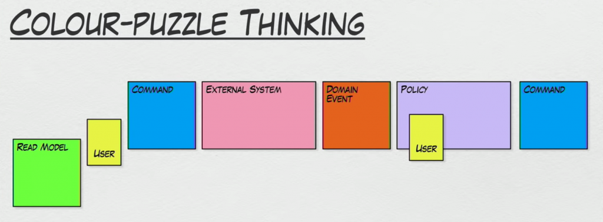
> - 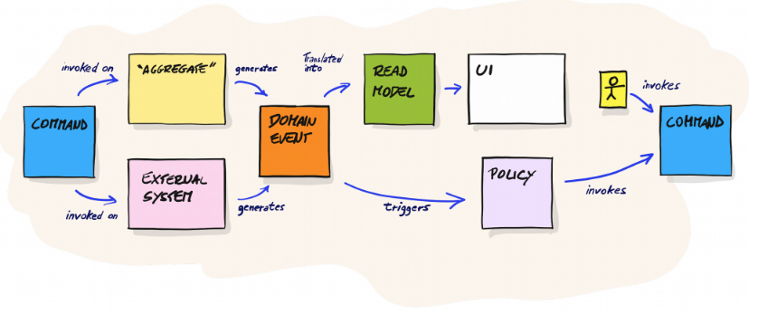

- **事件 (Event):**
    - 代表 **已經發生過的事情**，通常會使用 **過去式** (英文加 -ed ，中文加「已」)，例如: 如訂單已成立、貨物已送出、早餐已買到 等等。
    
    - **領域專家所在乎的事件**，例如: 整合第三方物流時，領域專家可能只在乎送達時間而不在乎中間細節的運輸過程。
    
    - 有 **時間性**，請 **從左到右** 排列。
    
    - 可以加上 **時間概念**。例如: 「凌晨三點帳款已對帳完成」、「午夜十二點馬車已變成南瓜」，甚至是某個時間點，如「本季度已結束」、「已過了一個月」。
    
    - 可以加上 **原因**。例如:「因為密碼輸入錯誤三次，所以帳號已被鎖住」。
    
      > 根據 Alberto Brandolini 本人的敘述，使用 **過去式代表著系統的狀態**。如果你今天使用的是「註冊」這類詞時，你代表的是一個流程。相對的，用「註冊已開始」、「註冊已完成」會有更好的清晰度且顆粒度，避免過度設計。
	- 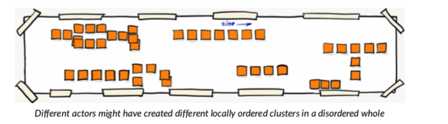
    
- **命令 (Command):** 
    - **是什麼行為觸發** 了事件或事件流
    - 大部分的 Command 與 Event 都像是對稱的存在。例如: 「已經買早餐」Event 前面就會加上一個「買早餐」Command。當然，Command 一定由某個使用者（實際的人、虛擬的系統）所發出，因此可以在小張的黃色 Actor 寫上使用者名稱然後貼在對應的 Command。
    - 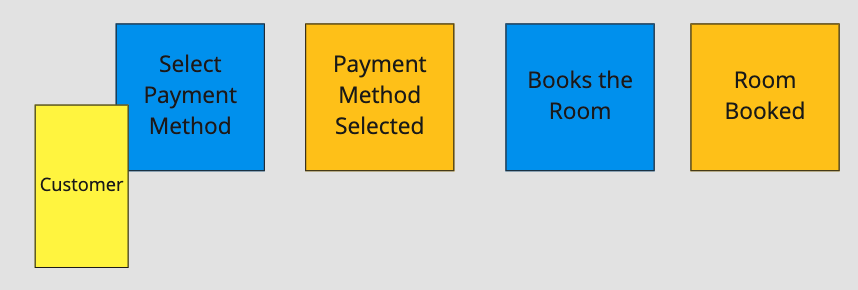

- **政策 (Policy):**
    - 就是我們的 **系統對於特定 Event 如何回應**。
    - 找出規則、潛規則以及自動化 (listener, saga, process modeliing)。
    - 軟體之所以有價值，就是因為他可以將很多 **商業邏輯自動化**。
    - Policy 就像 Event Storming 的偵探一樣，可以 **找出許多尚未發掘的問題或是現有流程矛盾之處。**
    - 語法公式: **「凡是 Event 就 Command」**(Whenever Event Then Command)，所以會接在某個 Event 後面然後觸發一個至多個 Command。甚至可以加上額外的條件如「凡是...但如果...就...」。
      > 以訂單系統為例
      > - 當「訂單已對帳」Event 發出後就會觸發 Policy 「凡訂單已對帳，就寄信通知」
      > - 「凡訂單已對帳，就更改訂單帳款資訊」
    - Fun Fact: Policy 的紫色 (lilac) 代表 Event 與 Command 顏色混合。
	- 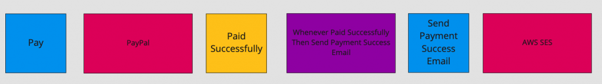
- **角色 (Actor):**
  - 代表 **使用者**，可以是 **真實的人**(e.g. 客戶、管理員、編輯)，或是 **虛擬的系統**。
  - 通常會在 Command 上貼上 Actor 的名稱，表示這個 Command 是由誰發出的。

- **聚合 (Aggregate):**
    - 一旦所有的 Event、Command 都被表示出來，參與者就可以開始考慮 **將相關的概念組織起來**。
    - 聚合會 **接收命令**，並 **產生事件**。
    - 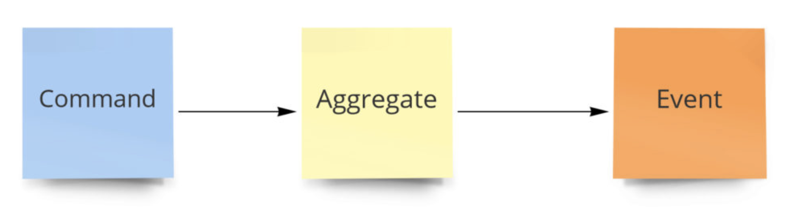

- **外部系統 (External System):**
  - **在系統開發中，難免會需要與外部系統合作完成功能，以擴充模型**。這個外部可能是公司裡的另一個系統、第三方服務、甚至是法條(e.g. GDPR)。
  - System 通常是由 Command 所觸發(e.g. 第三方金流外部服務由「付款」觸發)，然後 System 會再產生新的 Event。
  - 這邊 **領域專家需要注意**，他 **要將屬於外部系統不屬於自己系統關注的 Event 移出**，比如說外部物流系統可能有「買家揀貨」、「超商拒收」、「超商驗貨」、「送貨中」、「商品已到指定超商」等等 Event，但 **事實上你的系統可能只在乎他最後到貨的 Event。**
  - 同時， **System 也會觸發不同分支的 Event** ，就像是 **外部系統總有成功 or 失敗的可能**，此時領域專家與與會者就要一起思考失敗的處理路線是否是系統所關注的。
  - 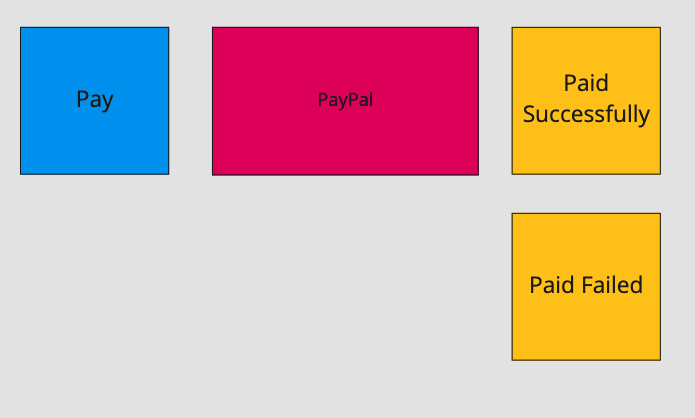

- 熱點 (hotspot):
    - 如果過程中某個節點卡住太久，很有可能是因為領域專家也不太了解這個問題，也有可能是目前資料量不足以做出決定。可以先貼上一張 45 度角旋轉後的紅色的 Hotspot **待日後解決**。
    - 一般來說，Hotspot 一方面代表你的 **系統的重大挑戰**，另一方面 **如果能夠解決它就能為系統帶來巨大的價值**。因此在這一回合，大家可以 **藉此了解系統的核心問題在哪**。

- Problem (問題):
    - 代表你覺得有疑問、成本高、會出錯的地方。我們可以在 Question 寫上簡短的敘述。
    - 常見的問題有:
        - 我看不懂
        - 商業邏輯有問題
        - 與現有專案架構不合
        - 會造成使用者不爽

- Opportunity (機會):
    - 代表你覺得流程中很棒的部分，就像是按讚一樣不用客氣貼上去吧!
    > 標記完後，主持人可以開始讓大家針對一個個 Problem、Opportunity 來討論

- Read Model 資料讀取模型:
    - 是 Domain 內的資料檢視。
    - 有時候，當我們需要做決策的時候，會需要一些資料參考依據。也就是 **Actor 會先查看 Read Model 後，才會執行 Command** 
    - 請記得，Read Model 不只是資料，同時也是做決策的工具

## DDD 基本概念

> **核心精神: Think in context.** (在脈絡中思考)

### DDD 架構的全貌圖
- 團隊與領域專家溝通及合作 **捕捉領域知識** 並且建構 **通用語言** (Ubiquitous Language)。
- 依照所理解的 **問題域 (Problem Space)** 以及 **解決方案域(Solution Space)** 的資訊建立 **領域 (Domain)**。
- 將領域 (Domain)切成若干個 **子領域 (Subdomain)** ，並定義每一個子領域的優先等級。
- 在子領域中遵循通用語言將解決方案域切分出一個個語意的邊界：**限界上下文 (Bounded Context)**。
- 使用 **上下文地圖 (Context Mapping)** 模式定義不同限界上下文之間的互動模式 。

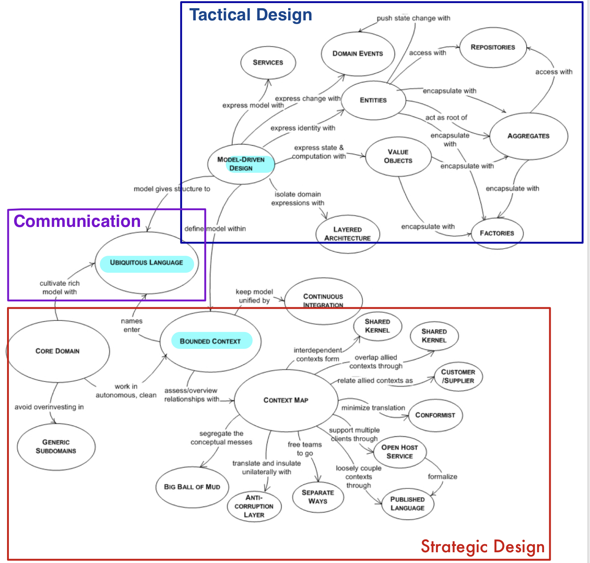

### 戰略設計 (Strategic Design)

### 戰術設計 (Tactical Design)

## DDD 實作範例
### 電商的 Bounded Context
#### 關鍵使用案例
- 購物車結帳時要 **判斷會員等級**，若是 VIP 則會有相應的折扣
- **瀏覽商品** 時，部分商品只能 **被部分等級的客人看到**。比如說大量香菸組合包只能被菁英會員瀏覽
- 購物車結帳時需要從商品目錄 **取得商品資訊** 來計算價錢
- 購物時需要透過 **第三方支付** 來處理金流
- 需要整合 **第三方物流** 讓客人知道物流進度
- **營收分析系統** 需要與購物系統共享資料
#### 以下是可能的 Context Mapping 圖 (設計沒有正確答案)
- 

### 保險公司
#### 題目
- [GitHub: 題目](https://github.com/ContextMapper/context-mapper-examples/tree/master/src/main/cml/insurance-example)

#### 一家保險公司需要以下幾個 Bounded Context
- Customer Management 客戶管理
    - 客戶管理系統要管理所有保險公司客戶的資料。因此，他通常在與其他 Bounded Context 關係中的中心
- Customer Self-Service Management 客戶自助服務
    - 這個 Bounded Context 是一個 Web 應用程式，可以讓客戶登入並修改基本資料如地址
- Policy Management 保單管理
    - 保單管理 Bounded Context 管理客戶所簽的保險契約與保單。他會與 Risk Management 一起合作取得客戶的風險數據來計算費率。此外，他也需要與 Debt Collection 共享內核
- Debt Collection 應收帳款
    - 此 Bounded Context 依據相對應的契約與保單來計算保險公司的財務收入
- Risk Management 風險管理
    - 此 Bounded Context 與 Policy Management 密切合作，且計算出的風險資訊會影響保險契約與保單
- Printing Context 列印功能
    - 代表一個外部系統讓許多內部的 Bounded Context 可以透過 API 來使用。他處理那些需要列印的文件如債務 (Debt)、保單等等

#### 官方圖解
- 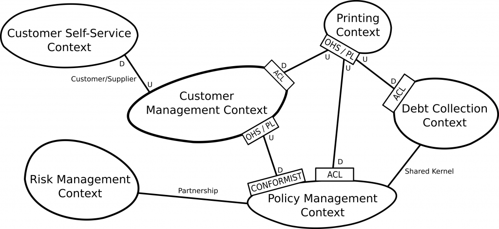

### 電影院
#### 題目
- 需求 (真實世界的情境): 
  - 我希望能夠成立一家電影院，這個電影院必須要有 **售票亭** 可以售票給顧客
  - 售票時，員工要檢查 **顧客的身分證、時間、電影、座位** 等等
  - 然後因應 APP 的風潮，所以我們想要跟 **第三方訂票軟體** 合作，利用線上預約現場售票處取票
  - 當然，電影院一定要有 **放映廳**，要進去放映廳前會有員工 **檢查消費者的票** 是否符合目前播放的電影
  - 再來， 客人在售票處買電影票時也可以添加 **食物套餐**，然後你可以憑票去 **飲食部** 換取你的食物，飲食部需要與售票處獨立出來，因為飲食部還需要 **管理食物的庫存**

#### 初步 Bounded Context 圖解
- Domain
  - Core Domain: Movie(放映廳)
  - Supporting Subdomain: Ticket(售票)、Food(食物)
- 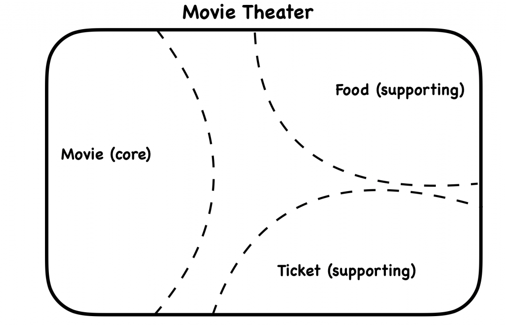

#### 關鍵使用案例
- 售票亭可以售票給客人，客人可以選擇電影、時刻、座位以及是否添加套餐
- 售票亭員工售票前，要檢查客人的身分證以符合電影分級
- 客人可以用 APP 線上預約訂票與餐點，然後到現場售票亭取票
- 客人進入放映廳前，放映廳員工要在門口查票，確認好電影時刻與座位後才能放客人進去
- 客人要到飲食部憑票才能兌換到食物，飲食部員工要依電影票上的餐點品項製作餐點
- 當飲食部任何食物庫存低於 50% 時，要通知庫存管理部補貨。早上通知下午補貨，下午通知隔天早上補貨

#### 詳細 Bounded Context 圖解
- Box Office Context 售票處
- Online Booking 線上訂票
- Concession Stand Context 飲食部
- Inventory Context 庫存管理
- Auditorium Context 放映廳
- 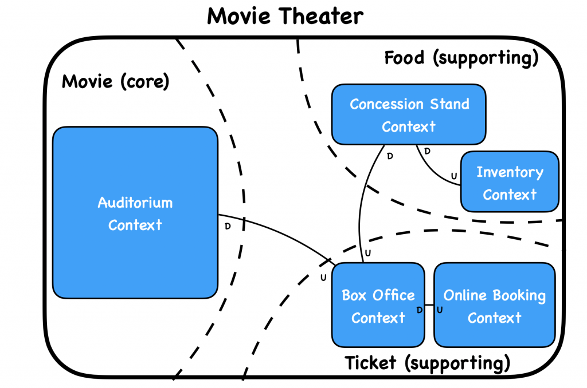

#### 補充
- 接者當你開始在 Bounded Context 中開發 Domain Model 時，可以發現一件有趣的事情:
    - 一個電影票券在不同的 Bounded Context 中有不一樣的行爲 (一個 Ticket 各自表述)
    - 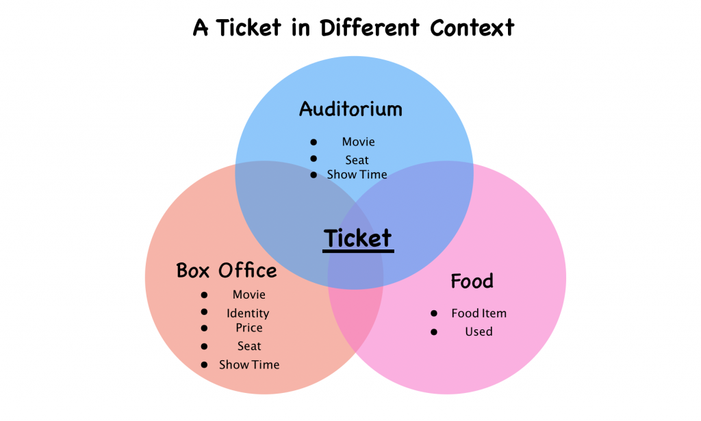

## 事件風暴

## 觀念釐清
### 請說明 Subdomain 與 Bounded Context 間的差別?
- Subdomain 你將商業需求拆解與分類的結果; Bounded Context 代表你實際解決問題的系統拆解與分類
- 有時候這兩者緊緊相關很容易搞混，但他們的確是不同的東西。可以參考 DDD 之父 Eric Evans 在這篇 [youtube video](https://youtu.be/Wbsh1Qw2-Ss) 的簡短回答。裡面提到：
    - 這就像地板與地毯的關係。地板是 Subdomain， Bounded Context 是地毯。當你剛裝修好新家就像剛啟動專案時，地毯設計與地板完全匹配，所以你很難發覺他們的差異。但兩者的確是不同的東西
    - 但有一天你換了一個新地毯，它可能無法百分百與地板匹配，會露出一些地板的原貌，甚至會被一些傢俱 (Legacy System) 給擋住，讓兩者更難貼合，此時兩著的差異才會漸漸浮現
- 補充說明
> 引用 Patterns, Principles, and Practices of Domain-Driven Design (簡稱 3PoDDD) 裡面對於 Subdomain 與 Bounded Context 差別的論述
    - Subdomain 代表著一塊邏輯上的需求域，通常來說反映出企業組織架構的業務能力。他們被用來區別應用程式不同重要程度的部分如 Core Domain 以及稍微不重要的 Supporting Subdomain。Subdomain 是用來提煉出問題空間的精華並解構其中的複雜
    - Domain Model 則是被建立來滿足各個 Subdomain 的使用案例。理想上 Model 與 Subdomain 間會有一比一的對應關係，但是很難實現。Model 會受到組織架構、語言的模糊性、商業流程或是開發模式的影響。因此一個 Subdomain 可能會包含一個至多個 Model ，而一個 Model 也有可能跨越多個 Subdomain。這種事情很常見於 Legacy System 的環境中
    - Models 需要被隔離並在一個明確的(explicit)邊界內被定義，如此才能讓 Model 不受污染且專注。就像前面所說，這就是我們的 Bounded Context。 **不像是 Subdomain，一個 Bounded Context 是一個能保證 Model 間邊界的具體的技術實作。 Bounded Context 存在於 Subdomain 中並在其中明確的表達 Domain Models 的含義。**

### 請說出 Context Mapping 的所有模式以及大致的功能?
- **Shared Kernel**: 共用程式碼
  + 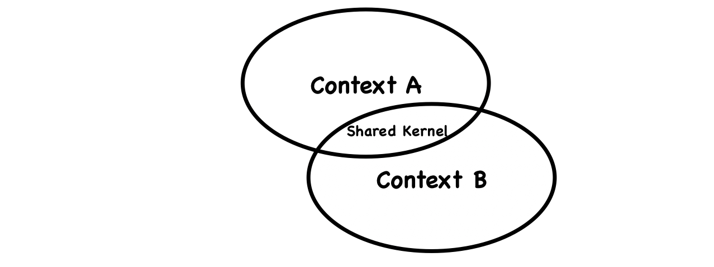
- **Partnership**: 雙方雙向合作
  + 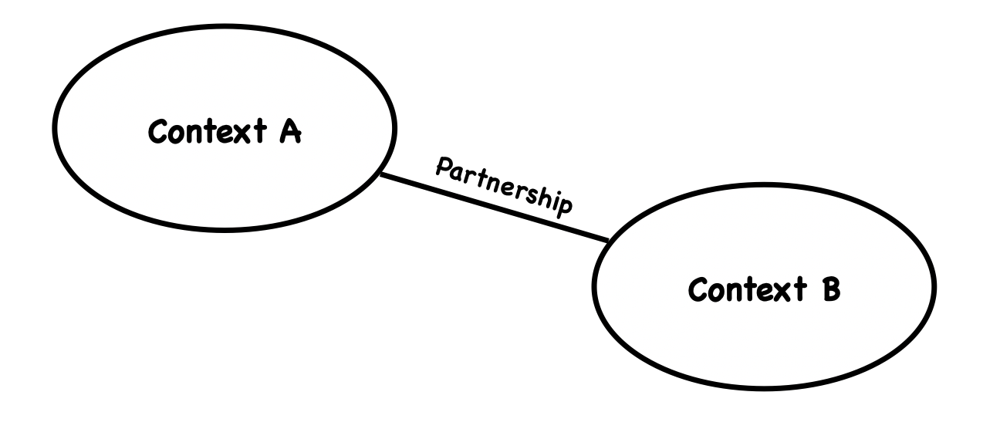
- **Anti-corruption Layer**: 為下游方建立一層資料轉換層以消化來自上游的資料
  + 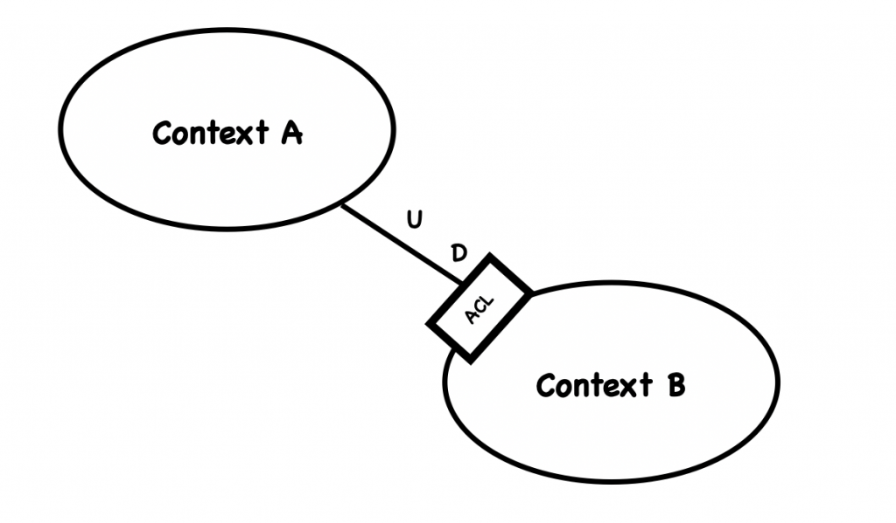
- **Open Host Service/Published Language**: 在上游方建立一個開放的 API 讓想使用的下游方使用
  + 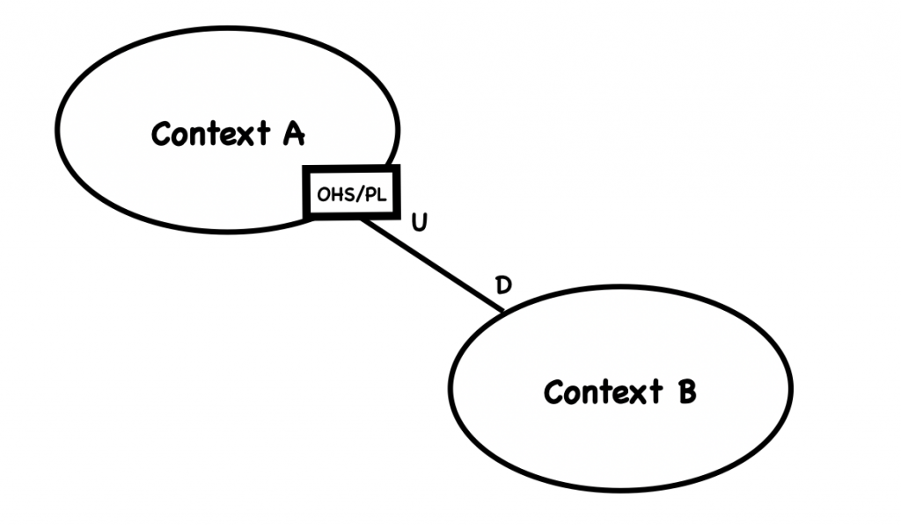
- **Separate Way**: 兩者沒有直接的合作關係
- **Big Ball of Mud**: 將一團混亂的大系統畫下邊界，在邊界內不要躁進改變，在邊界外要做好 ACL 轉換
- **Customer-Supplier**: 有上下游關係但上游方對下游方仍保有一定責任
  + 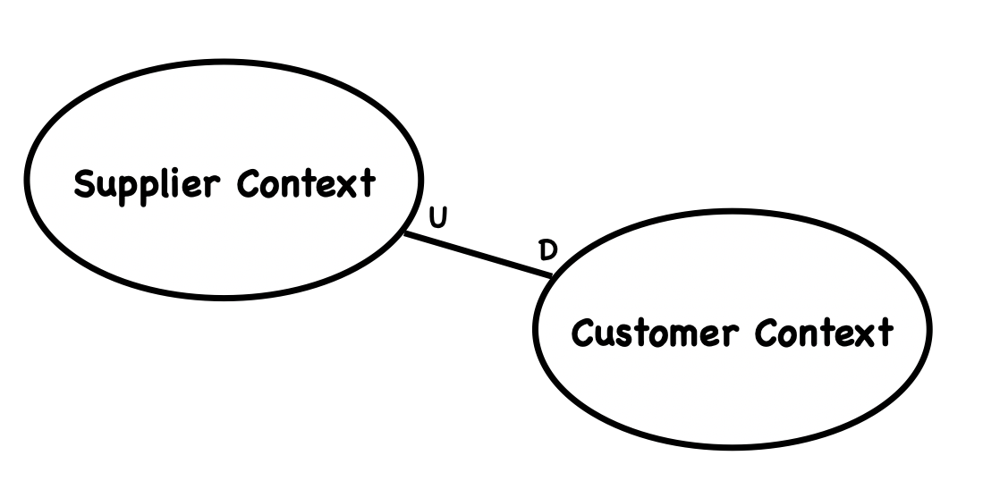
- **Conformist**: 有上下游關係但上游方對於下游方沒有責任
  + 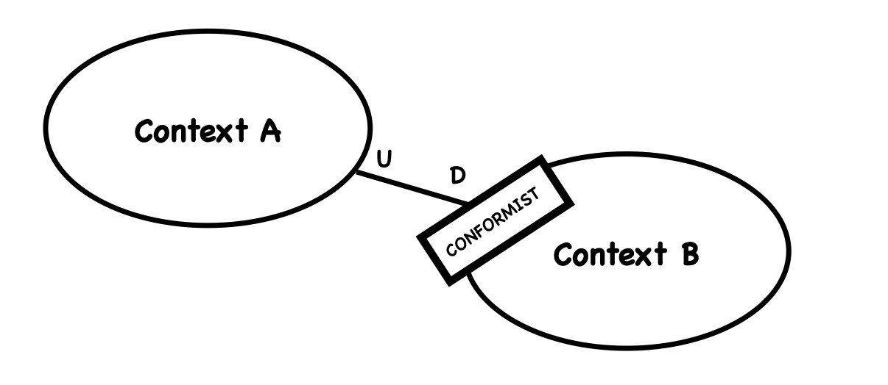

## DDD 學習路徑
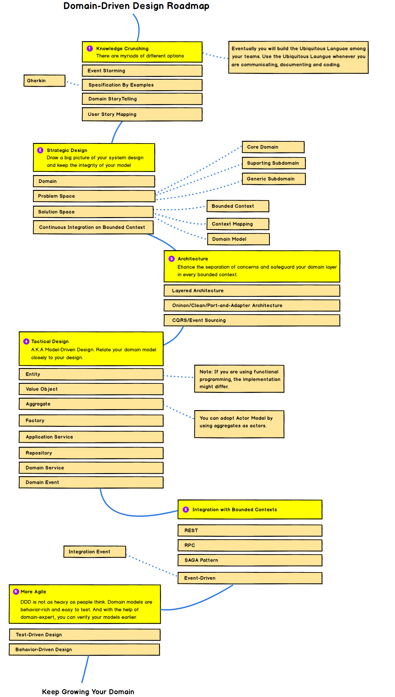

## 參考資料
- [iT 邦幫忙: Think in Domain-Driven Design 系列](https://ithelp.ithome.com.tw/users/20111997/ironman/2730)