# Kubernetes 一 CKA 證照考試

重點整理

[TOC]

## Introduction
- 由 CNCF 與 Linux Foundation 合作的 Kubernetes 證照考試
    - Certified Kubernetes Administrator (**CKA**): 對於 Kubernetes **管理者**
        - Core Concepts
        - HA deployment
        - Kubernetes Scheduler
        - Logging/Monitoring
        - Application Lifecycle
        - Maintenance
        - Security
        - Troubleshooting
    - Certified Kubernetes Application Developer (**CKAD**): 對於 Kubernetes **開發者**
        - Core Concepts
        - Config Maps, Secrets
        - Multi-Container Pods
        - Readiness and Liveness Probes
        - Logging/Monitoring
        - Pod Design
        - Jobs
        - Services & Networking
    - 參考資訊: [Frequently Asked Questions: CKA and CKAD & CKS](https://docs.linuxfoundation.org/tc-docs/certification/faq-cka-ckad-cks)

## Core Concepts
### Cluster Architecture
- Master Node
    - etcd: 儲存叢集資訊
    - kube-scheduler: 負責排程工作節點上的應用程式或 container
    - kube-controller-manager: 負責管理不同控制器的功能，例如: Node Controller, Replication Controller 等
    - kube-apiserver: 負責協調叢集中的所有操作
- Worker Node
    - kubelet: 監聽來自 kube-apiserver 的指令，來管理節點中的 container 
    - kube-proxy: 負責節點之間的網路通訊


	- [圖片來源](https://www.reddit.com/r/kubernetes/comments/k8kqdr/overview_of_kubernetes_architecture/#lightbox)
- Docker vs. Containerd
	- **Docker**: 提供完整的 container 管理功能，適合從開發到生產環境的整個 container 生命周期管理 
	- **Containerd**: 專注於高效管理 container 的執行期間，作為 Docker 引擎的核心元件之一，亦可以獨立使用。
    	- ctr: 管理 container 的 CLI 工具，僅提供基礎的 container 管理功能
    	- nerdctl: 類似於 Docker CLI 工具，提供更完整的功能
		- **runc**: 是一個實現 OCI 規範的底層執行期間工具，負責實際的 container 創建和運行
	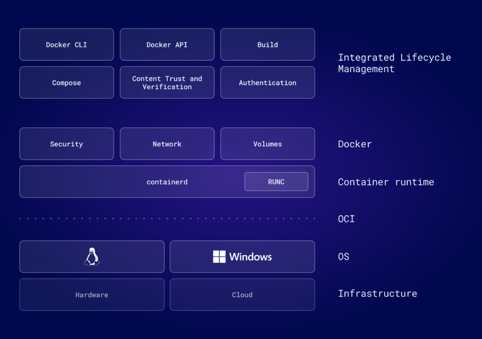
		- [圖片來源](https://www.docker.com/blog/containerd-vs-docker/)
- OCI (Open Container Initiative): 由 Linux Foundation 所提出的開放 container 標準，包含 image-spec、runtime-spec
	- **image-spec**: **規範該如何建立 container image**，以確保在不同執行環境中可以<strong>一致地建立 container </strong>
	- **runtime-spec**: **規範該如何設定 container runtime**，描述如何創建、配置、管理 container ，確保在不同的執行環境中，可以<strong>一致地運行 container </strong>
- K8s CRI (Container Runtime Interface): 提供 CLI 給所有能與 OCI 標準所相容的 container 執行環境 (e.g. Docker, Containerd, CRI-O)
    - **crictl** CLI: 與 docker CLI 指令相似，用來管理 container 執行環境
    - 用途: 檢查、除錯 container 的執行環境; 通常不會用來建立 container 
	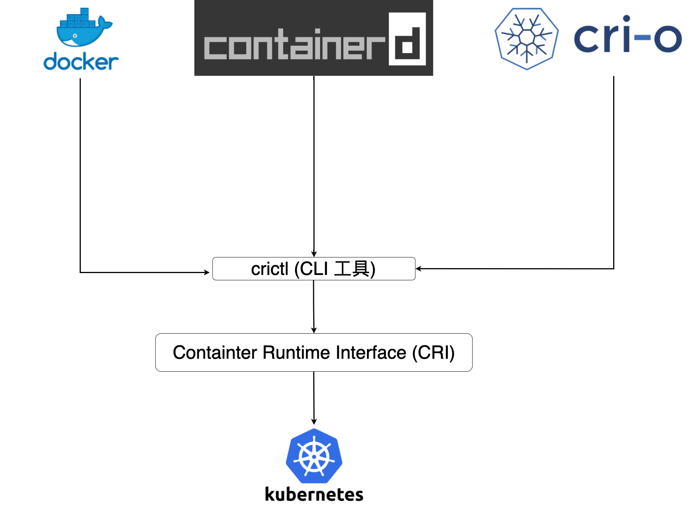

### Master Node
#### etcd
- 用途: 儲存 K8s 叢集的所有資訊 (e.g. nodes, pods, configs, secrets, accounts, roles, bindings 等)
    - 採用 Key-Value 的方式儲存資料
    - `kubectl get xxx` 所取得的資料，都是從 etcd 伺服器中取得
    - 預設使用 2379 port
- etcdctl: 用來管理 etcd 的 CLI 工具
    - `export ETCDCTL_API=3`: 設定 etcdctl 的 API 版本的環境變數 (目前最新為 v3，有些指令會跟 v2 不同)

#### kube-apiserver
- 用途: 提供 K8s API 服務，負責接收來自 Client 的請求，並將請求轉發給其他元件
	- 會先認證使用者的身份，再驗證 API 請求的權限，之後才會執行請求的操作
	- 透過 RESTful API 與工作節點進行交流
	- 預設使用 6443 port
- 功能:
	- 認證使用者
	- 驗證 API 請求
	- 傳遞資料
	- **更新 etcd 資訊**
	- 透過 kubelet 與工作節點進行溝通
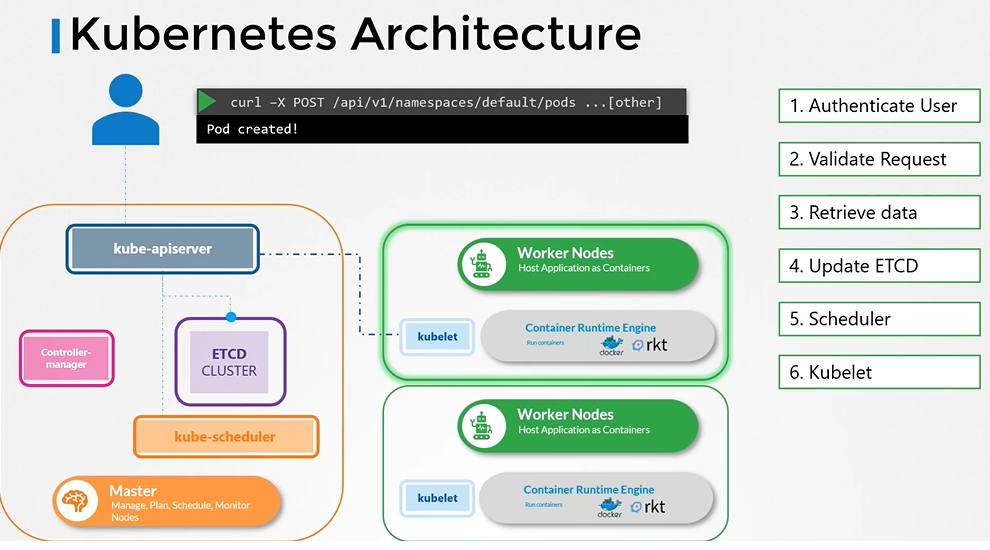

#### kube-controller-manager
- 用途: (是一個 process)，會持續監控叢集中個工作節點的狀態，並盡力使叢集維持在預期的狀態
- 在主節點上，kube-controller-manager 會包含許多個 contoller，每個 controller 負責管理不同的控制器
    - Node Controller: 負責管理節點的狀態，採取必要措施以維持叢集正常運行
    - Replication Controller: 負責監控 replicasets 的狀態，並確保在任何時刻下 pods 的數量都符合 replicasets 的設定
    - 其它 controllers
    

#### kube-scheduler
- 用途: 根據各節點的資源狀態，將 pod 排程到適當的節點上
    - kube-scheduler 僅負責決定 pod 要安排到哪個節點上; 而實際將 pod 放置到節點上的工作，是由 kubelet 完成
- 排程過程
    - 根據每個節點的資源狀態，<strong>過濾出符合當前資源要求的節點們</strong>
    - 透過 priority function，計算每個節點的分數，選擇分數最高的節點，優先將 pod 安排到該節點上
    

### Worker Node
#### kubelet
- 用途: 負責管理、監控工作節點內的 pod，以及 pod 中的 container 狀態，並與主節點進行通訊
    - 會定期向主節點回報節點的狀態
- 流程: kube-scheduler -> kube-apiserver -> kubelet -> Docker
    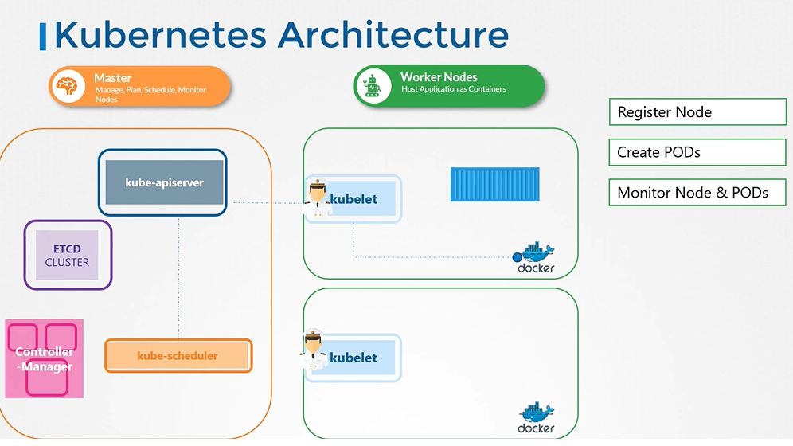
- kubeadm 預設<strong>不會部署 kubelet</strong>，需要手動安裝並部署 kubelet
    - 下載 kubelet:
        ```bash
        wget https://storage.googleapis.com/kubernetes-release/release/v1.13.0/bin/linux/amd64/kubelet
        ```
        
    - 解壓縮:
        ```bash
        tar -xvf kubelet
        ```
    - 執行 kubelet 服務

#### kube-proxy
- 用途: (是一個 process)，會運行在每個工作節點上，負責維護節點之間的網路通訊，並將流量轉發到正確的 pod 上
    - 透過 iptables 規則，將流量轉發到正確的 pod 上
- e.g. web server 的 pod，透過 kube-proxy 連線到 db server 的 pod
    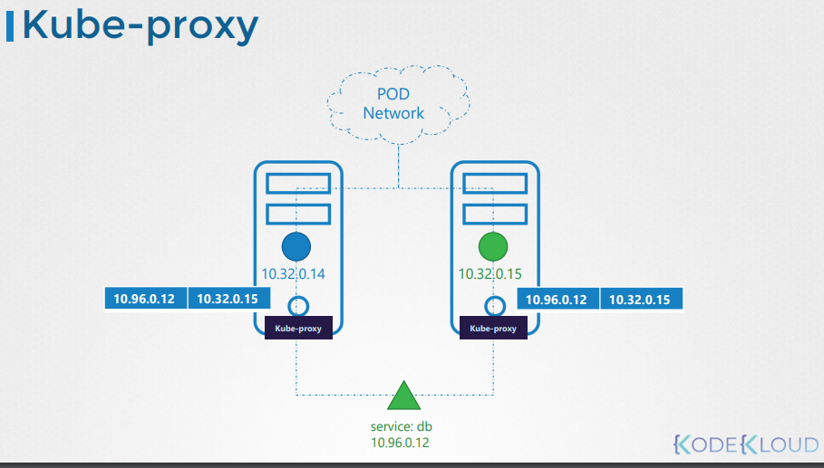

#### Pod
- 用途: 是 K8s 中最小的部署單位，可以包含一個或多個 container  (通常會包含一個 container)
    - Kubernetes 會操作 pod，而不是直接操作 container 
    
- 向上擴展/向下擴展: 增加/減少 pod 的數量
    - Pod <-> Container : 通常是 1:1 的關係
    - 可透過 Deployment 來管理 pod 的數量
    
    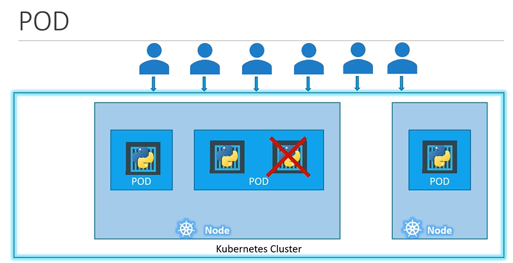
- multi-containers pods
    - 在某些情境下，我們會建立 helper container(= sidecar container)，來協助主要的 container，例如: 收集 log、監控、資料轉換等 <br>
    
    - 一般而言，我們會透過 Docker 分別建立一個個 container、helper container; 然而在 K8s 中，我們可以將這些 container 放在同一個 pod 中，透過 pod 來管理這些 containers
    
- Pod 的 YAML 格式的 manifest 設定檔
    - 必填欄位
        - apiVersion: K8s API 版本
        - kind: 資源類型 (e.g. Pod)
        - metadata: 資源的名稱、標籤等
        - spec: 資源的規格
    ```yaml
    # pod-definition.yaml
    apiVersion: v1 # String 資料型別
    kind: Pod # String 資料型別
    metadata: # Dictionary 資料型別
        name: myapp-pod
        labels:
            app: myapp
            type: front-end

    spec: # Dictionary 資料型別
        containers: # List/Array 資料型別 (因為 Pod 可以包含多個 container)
            - name: nginx-container
              image: nginx
    ```
- Pod 常用指令
    - `kubectl get pods`: 取得所有 pods 的相關資訊
        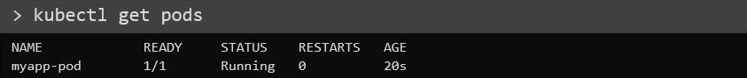
        - `READY`: (在這個 Pod 中)，正在執行的 container 數量/總 container 數量
    - `kubectl describe pod <pod-name>`: 取得指定 pod 的詳細資訊
        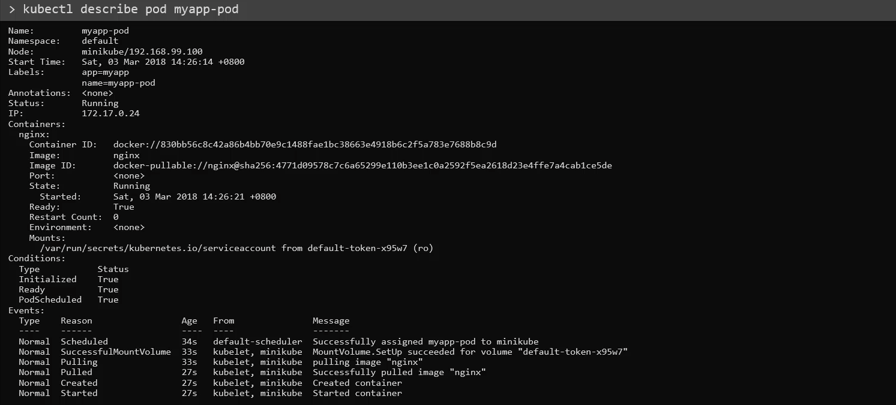
    - `kubetctl create -f <pod-definition.yaml>`: (根據指定的 YAML manifest 設定檔)，建立 pod
    - `kubectl apply -f <pod-definition.yaml>`: (根據指定的 YAML manifest 設定檔)，建立/更新 pod
    - `kubectl delete pod <pod-name>`: 刪除指定的 pod

### ReplicaSet
- 用途: 
    - 為了確保系統的高可用性(high availability)，以避免單一節點故障的問題。當某個 pod 發生故障時，ReplicaSet 會自動重啟 pod，以確保 pod 的數量符合設定的 replicas 數量
        
    - 透過自動擴展機制(scaling)，來調整 pod 的數量，以達到 pods 之間的負載平衡(load balancing)
        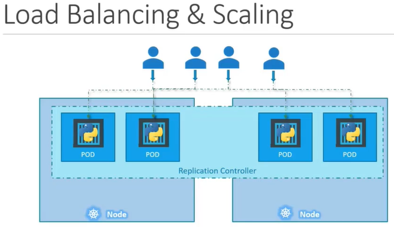
- 運用 template 來定義 pod 的規格
    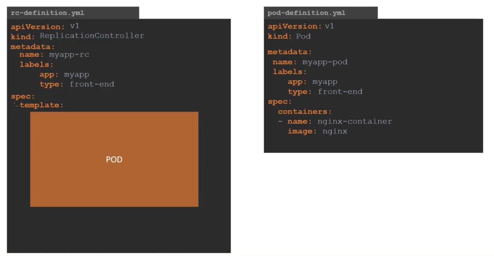
- label & selector
    - **label**: 用來標記 pod 的 metadata，以便於辨識、搜尋、選擇 pod
    - **selector**: 用來選擇要管理的 pod，透過 label 來選擇要管理的 pod
        
- Replication Controller vs. ReplicaSet
    - **Replication Controller**: 舊版的控制器，僅支援基本的 pod 複製功能
        ```yaml
        # rc-definition.yaml
        apiVersion: v1 # Replication Controller 使用 v1 API 版本
        kind: ReplicationController
        metadata:
            name: myapp-rc
            labels:
                app: myapp
                type: front-end

        spec:
            # 透過 template 定義 pod 的規格
            template:
                metadata:
                name: myapp-pod
                labels:
                    app: myapp
                    type: front-end
                spec:
                    containers:
                    -   name: nginx-container
                        image: nginx

            # 設定 pod 的副本數量
            replicas: 3
        ```
        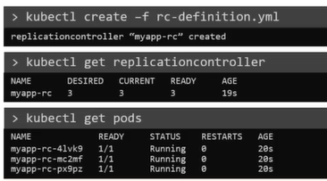
    - **ReplicaSet**: 新版的控制器，支援更多的 pod 複製功能，例如: 擴展、縮小、更新 pod 等
        ```yaml
        # replicaset-definition.yaml
        apiVersion: apps/v1 # ReplicaSet 使用 apps/v1 API 版本
        kind: ReplicaSet
        metadata:
            name: myapp-replicaset
            labels:
            app: myapp
            type: front-end
        spec:
            template:
                metadata:
                    name: myapp-pod
                    labels:
                        app: myapp
                        type: front-end
                spec:
                    containers:
                    -   name: nginx-container
                        image: nginx

            replicas: 3
            # 只有 ReplicaSet 能支援 selector 的設定，透過 label 來選擇要管理的 pod
            selector:
                # 過濾器: 選擇要管理的 pod
                matchLabels:
                    # 指定要管理具有哪些 label 的 pod
                    type: front-end
        ```
        
- ReplicaSet 的擴展機制
    - 法一: 完全替換現有的 ReplicaSet，使用新的設定檔中的所有內容
        - 適用情境: 用於完全替換現有資源，以全面更新資源配置時使用 
        ```bash
        kubectl apply -f replicaset-definition.yaml
        ```
    - 法二: 會設置 ReplicaSet 的副本數量，但不會修改其他屬性
        - 適用情境: 根據 YAML 文件指定的副本數量進行縮放
        ```bash
        kubectl scale --replicas=6 -f replicaset-definition.yaml
        ```
    - 法三: 直接在 CLI 中設置指定 ReplicaSet 的副本數量
        - 適用情境: 快速調整副本數量，適合於 CLI 操作
        ```bash
        kubectl scale --replicas=6 replicaset myapp-replicaset
        ```
    
    - 說明:
        - `kubectl scale` 指令不會改變 YAML 設定檔中的內容，僅會改變 ReplicaSet 的設定，進而影響叢集中 pod 的數量 
        - 上述三種方法在 runtime 都會將 pod 的數量擴展到 6 個; 但是背後的意義不同
            - Tips: 皆是對 ReplicaSet 做設定; 而不是對 YAML 設定檔中的 replicas 值做設定

        | CLI 指令 | 執行後 ReplicaSet 的 `replicas` 數量 | YAML 設定檔中的 `replicas` 值 |
        |---|---|---|
        | `kubectl replace -f replicaset-definition.yaml` | 3 | 3 |
        | `kubectl scale --replicas=6 -f replicaset-definition.yaml` | 6 | 3 |
        | `kubectl scale --replicas=6 replicaset myapp-replicaset` | 6 | 3 |

### Deployment
- 用途: (是一個 K8s 物件)，用來管理 ReplicaSet，並提供了更多的功能，例如: 下載/上傳 container image、滾動更新(rolling update)、回滾(rollback)、暫停 pod、恢復執行 pod 等
    - Deployment 會自動建立 ReplicaSet，並透過 ReplicaSet 來管理 Pod 的數量
    
- Deployment 的 YAML 格式的 manifest 設定檔 (**會自動建立 ReplicaSet**)
    ```yaml
    # deployment-definition.yaml
    apiVersion: apps/v1
    kind: Deployment
    metadata:
        name: myapp-deployment
        labels:
            app: myapp
            type: front-end
    
    spec:
        template:
            metadata:
                name: myapp-pod
                labels:
                    app: myapp
                    type: front-end
        spec:
            containers:
            -   name: nginx-container
                image: nginx
    
    replicas: 3
    selector:
        matchLabels:
            type: front-end
    ```
    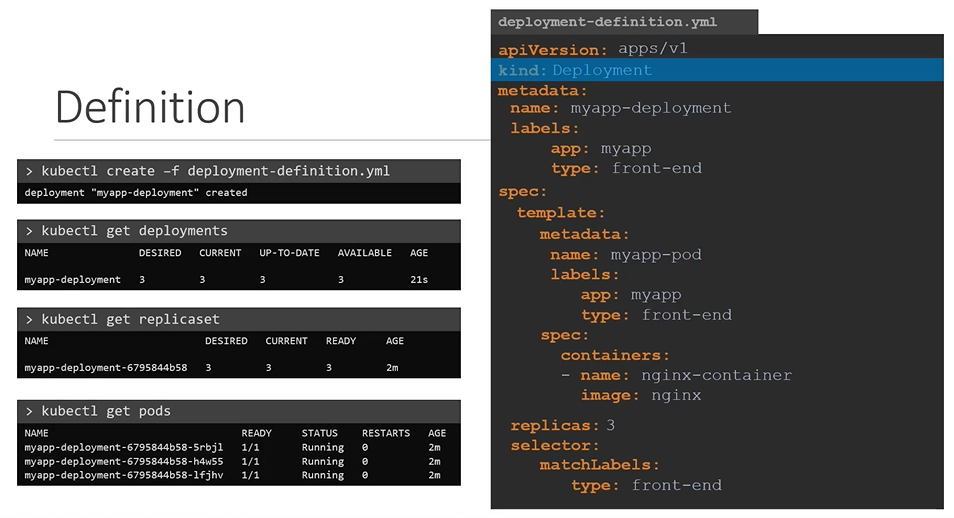
- 檢視當前 K8s 中所有的物件
    ```bash
    kubectl get all
    ```
    

### Service
- 用途: (是一個 K8s 物件)，用來將多個 pods 之間能夠互相通訊，有助於微服務架構(micro service)的鬆耦合特性(loose coupling)
- 概念: (假設有個外部使用者，想要存取 pod 的網頁服務)
    - 若我們想存取私有網域中的 pod 時，必須先透過 SSH 連線進入 K8s 叢集中的該工作節點後，再透過 curl 指令來存取 pod 的內網 IP address
        

    - 但是一般來說，我們會希望只要存取 K8s 叢集中的該工作節點的 IP address，而無需透過 SSH 連線進入工作節點內部，來存取 pod 的服務
        - Solution: 這時候我們就可以透過 Service 作為中間的服務，將外部的 client 透過 Service 來存取 pod 的服務
        - 可以把 Service 想像成一個節點內的虛擬伺服器，會擁有自己的 IP address、port，並將流量導向到對應的 pod 服務上
        

- 在正式環境中，通常會是 multiple pods 的情境
    - 單一節點上有多個 pods
        - 這些 pods 都具有相同的 label，nodePort Service 會透過 label 來選擇要管理的 pods，並將外部流量導向到這些 pods 上
            - algorithm: random (預設會使用隨機演算法，來決定將流量導向到哪個 pod 上)
            - sessionAffinity: true (會將同一個 session 的流量導向到同一個 pod 上)
            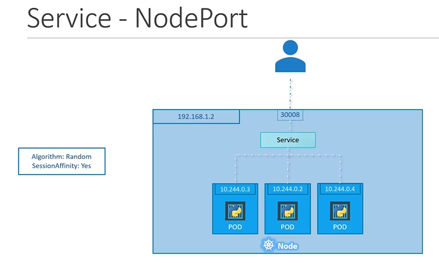

    - 多個節點上分別有一個 pod
        - 外部使用者可透過任何一個節點的 IP address，與相同的 nodePort 來存取 pod 的服務，達到高可用性、負載均衡的目的 <br>
            

- 三種 Service 類型
    
    - **ClusterIP**: 會建立一個虛擬 IP address 以提供內部的 pod 之間通訊，僅能在叢集內部使用
        - ClusterIP Service 物件，能將一群 pods 視為一個群組，對外提供一個統一的介面來存取該群組中的 pod 服務
        - 預設的 Service 類型
        - 常見使用情境: 多個 frontend pods 透過 ClusterIP 來存取 backend pods
        
            - 因為這些 pod 皆有可能隨時被關閉，因此其 IP address 皆不是固定的，故我們不能依賴這些 IP address 來存取 pod 的服務，要使用 Service 來存取 pod 的服務
        ```bash
        # service-definition.yaml
        apiVersion: v1
        kind: Service
        metadata:
            name: back-end
        
        spec:
            types: ClusterIP
            ports:
                -   targetPort: 80
                    port: 80
        selector:
            app: myapp
            type: back-end
        ```
        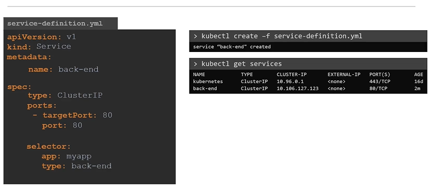

    - **NodePort**: 會在每個節點上開啟一個 port，讓外部的 client 可以透過節點的 IP address 來存取 pod 的服務
        - nodePort 的 port: 預設範圍 30000 ～ 32767
            - 若未指定 port，K8s 會自動分配一個 port
        - port: Service 物件的 port
            - 必填欄位
        - targetPort: pod 服務的 port
            - 若未提供，預設與 Service 物件的 port 相同
        ```bash
        # service-definition.yaml
        apiVersion: v1
        kind: Service
        metadata:
            name: myapp-service
        
        spec:
            types: NodePort # Service 類型
            ports:
            # - 表示為 List/Array 資料型別的第一個元素
            -   targetPort: 80
                port: 80 # 必填欄位
                nodePort: 30008
            # 透過 selector 來選擇要管理的 pod
            selector:
                app: myapp
                type: front-end
        ```
        
        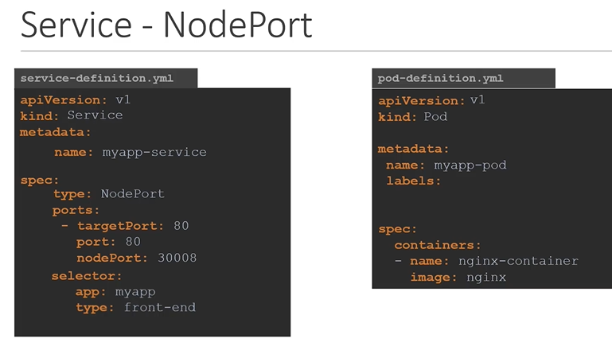
        
        - 建立 Service 物件
            ```bash
            kubectl create -f service-definition.yaml
            ```
        - 列出當前所有的 Service 物件
            ```bash
            kubectl get services
            ```
        - 透過 CLI 存取 pod 服務 (而非使用瀏覽器)
            ```bash
            # 存取的是節點 IP address 的 nodePort
            curl http://192.168.1.2:30008
            ```
        
    - **LoadBalancer**: 透過雲端提供商上建立一個 load balancer，並將流量導向到 Service 上
        - 常見使用情境: 在多個前端 pods 的前面，加上一個 load balancer，來平衡流量
        - 在正式環境中，一般而言，外部使用者會想要直接輸入 url 來存取網站，而不是透過 IP address + port 來存取
            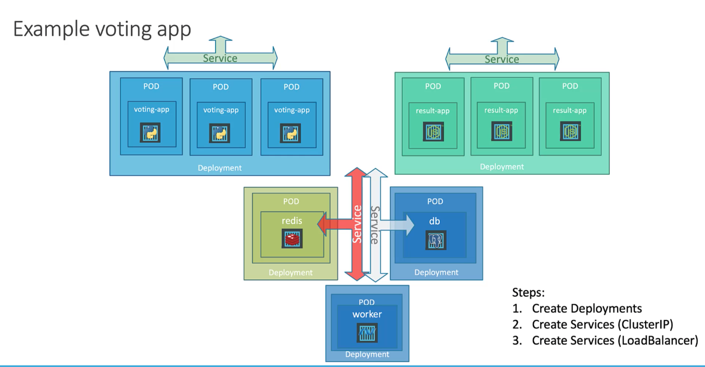
            - 法一: 在 VM 上，手動建立一個 Load Balancer，設定好 port forwarding 規則，後續需要維運
                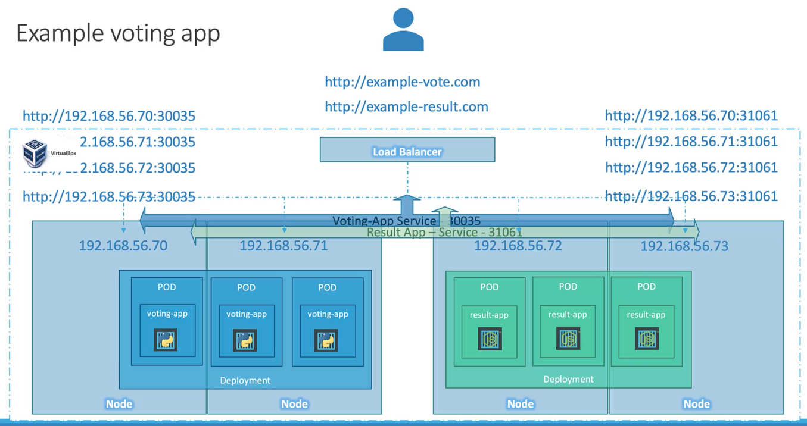
            - 法二 (推薦): 使用雲端提供商的 Load Balancer 服務，透過 Service 物件來建立 Load Balancer (e.g. GCP)
                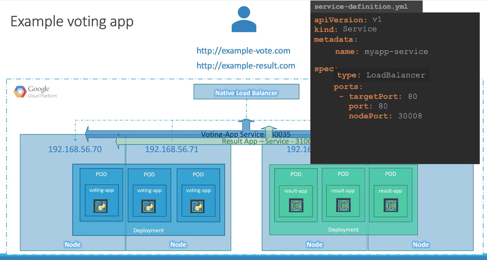

### Namespace
- 用途: 獨立的命名空間可以用來隔離資源 (isolation)，以存放我們平常建立的 Pods, Deployments, Services
- K8s 叢集會預設自動建立以下三個 namespace
    - default: 提供使用者預設使用的命名空間
    - kube-system: 主要是為了維持 K8s 叢集內部運行所需(e.g. networking, DNS service)。也為了避免與使用者建立的物件混淆，同時也能避免使用者誤刪 or 修改這些服務
    - kube-public: 所有使用者皆能使用這個命名空間中的資源
    - 另外，我們也能自己手動建立命名空間，例如: dev, prod
    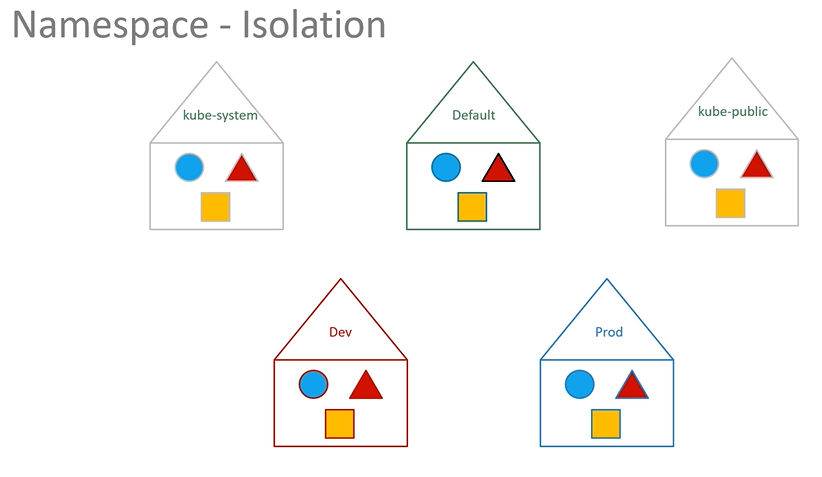
- 建立 namespace
    - 法 1: 使用 YAML manifest 設定檔
        ```yaml
        # namespace-dev.yaml
        apiVersion: v1
        kind: Namespace
        metadata:
            name: dev
        ```

        ```bash
        kubectl create -f namespace-dev.yaml
        ```

    - 法 2: 使用 kubectl 指令
        ```bash
        kubectl create namespace dev
        ```
    

- 設定指定的 namespace 中的資源限制: 
    - 建立 **ResourceQuota** YAML manifest 設定檔
        ```yaml
        apiVersion: v1
        kind: ResourceQuota
        metadata:
            name: compute-quota
            # 指定要套用的 namespace
            namespace: dev

        spec:
            hard:
                pods: "10"
                requests.cpu: "4"
                requests.memory: 5Gi
                limits.cpu: "10"
                limits.memory: 10Gi
        ```
    - 套用 ResourceQuota 設定檔
        ```bash
        kubectl create -f compute-quota.yaml
        ```
    
- 在指定的 namespace 中建立 pod
    - 法 1:
        ```bash
        kubectl create -f pod-definition.yaml --namespace=dev
        ```
    - 法 2:
        ```yaml
        # pod-definition.yaml
        apiVersion: v1
        kind: Pod
        metadata:
            name: myapp-pod
            # 指定要套用的 namespace
            namespace: dev
            labels:
                app: myapp
                type: front-end

        spec:
            containers:
            -   name: nginx-container
                image: nginx
        ```
    
- 切換預設的 namespace (`default` namespace -> `dev` namespace)
    ```bash
    kubectl config set-context $(kubectl config current-context) --namespace=dev
    ```
    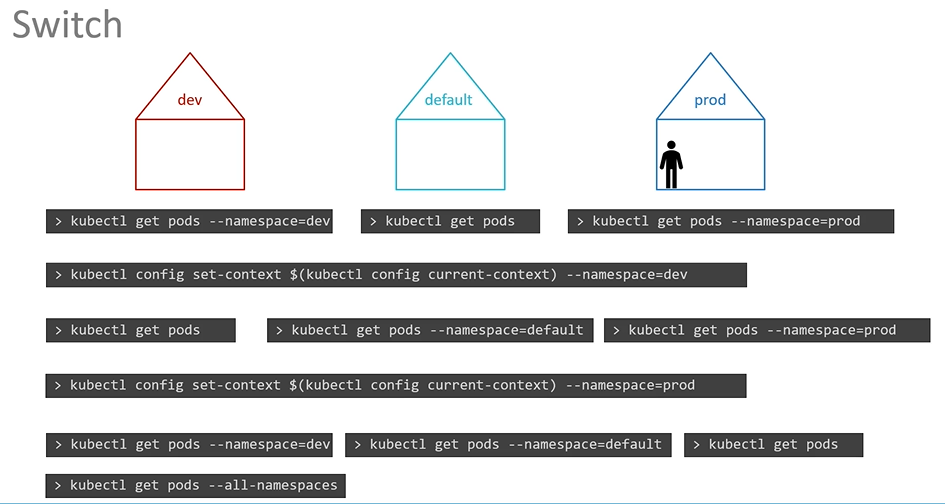
- 檢視預設 namespace 中的所有 pods
    ```bash
    kubectl get pods
    ```
    
- 檢視指定的 namespace 中的所有 pods
    ```bash
    kubectl get pods --namespace=kube-system
    ```
- 檢視所有 namespace 中的所有 pods
    ```bash
    kubectl get pods --all-namespaces
    ```
### Imperative vs. Declarative
> 在現代的程式碼即基礎設設施 (Infrastructure as Code, IaC) 中，有以下兩種主要的程式碼管理方式

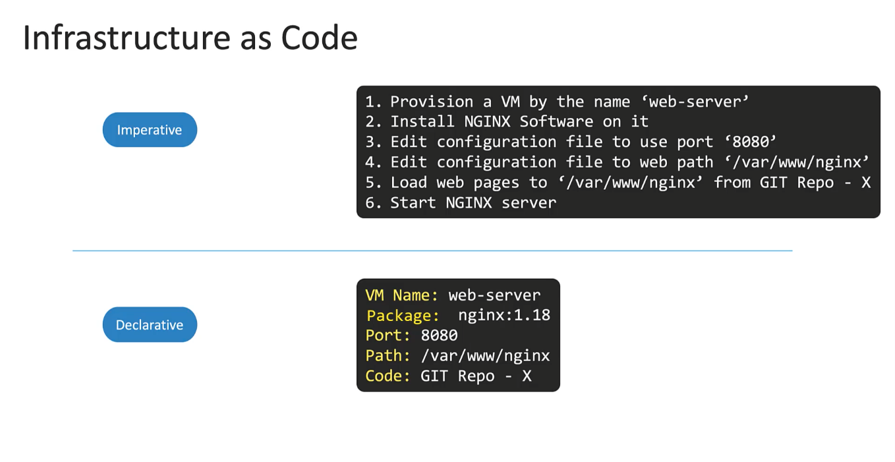

- **宣告式 (Imperative)**: 透過指令，明確地告訴系統要執行的操作
    ```bash
    # 建立物件
    kubectl create -f nginx.yaml
    ```

    ```bash
    # 更新物件 --- 僅對 K8s 叢集中現行物件設定檔 (live object configuration) 做變更
    kubectl edit deployment nginx
    ```

    ```bash
    # 更新物件 --- 對原始設定檔 (object configuration file) 做變更後，再將 "變動的部分" 套用到 K8s 叢集中
    kubectl replace -f nginx.yaml
    ```

    ```bash
    # 更新物件 --- 對原始設定檔 (object configuration file) 做變更，完全刪除原本的物件後，再重新建立新的物件
    kubectl replace --force -f nginx.yaml
    ```

    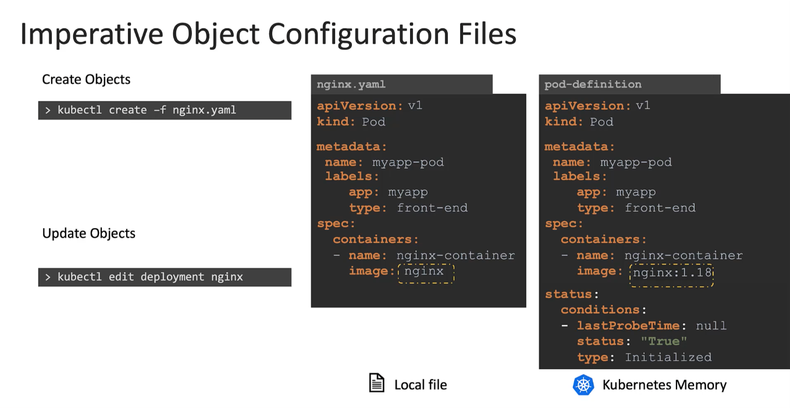
    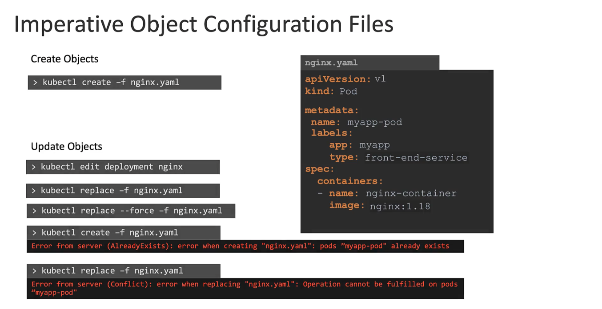

- **命令式 (Declarative)**: 透過 YAML manifest 設定檔來描述系統的期望狀態，系統會根據我們的目標，自動設定系統
    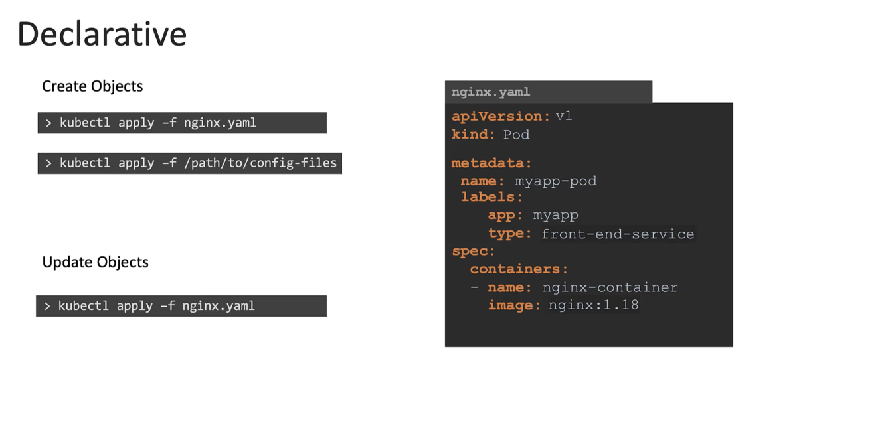

> 思考: 若建立 pod 到一半，發生系統中斷問題時？

> - 宣告式語法: 需透過許多檢查、除錯指令，才能確定當前的 K8s 叢集狀態，以繼續執行 <br>
> - 命令式語法: 能夠自動比對當前的 K8s 叢集狀態，根據 object configuration file, last-applied-configuration, live object configuration 的 YAML manifest 設定檔，自動調整以符合我們的目標狀態 <br>

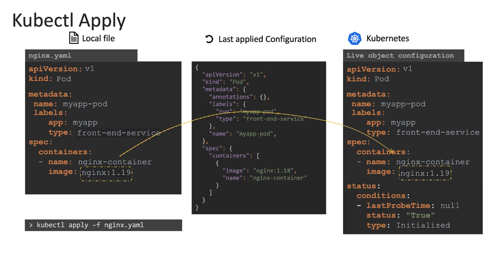

- 原始設定檔 (object configuration file): 儲存在本地端
- 上次應用的設定檔 (last-applied-configuration): 會轉換成 JSON 格式，儲存在 K8s 叢集中，用來追蹤物件的上次應用設定
    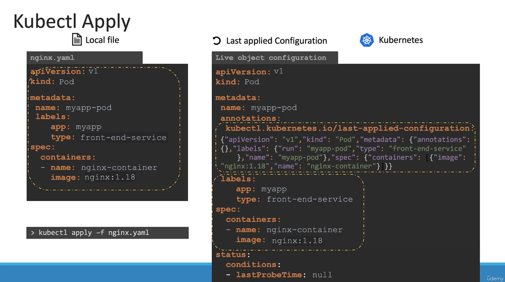
- K8s 叢集中現行物件設定檔 (live object configuration): 儲存在 Kubernetes memory 中，透過 lastProbeTime, status 來追蹤物件的當前狀態

- 參考資料
    - [Kubernetes Object Management](https://kubernetes.io/docs/concepts/overview/working-with-objects/object-management/)
    - [Declarative Management of Kubernetes Objects Using Configuration Files](https://kubernetes.io/docs/tasks/manage-kubernetes-objects/declarative-config/)

## Scheduling
### Manual Scheduling
> 思考: 若我們沒有 kube-scheduler 在我們的 K8s 叢集中，我們該如何將 pod 排程到指定的節點上？

- 設定 nodeName 屬性: 指定 pod 要排程到哪個節點上
    - `nodeName`: 每個 Pod 預設都不會有這個屬性，因為 K8s 叢集的 kube-scheduler 會負責將 pod 排程到適合的節點上
    ```yaml
    # pod-definition.yaml
    apiVersion: v1
    kind: Pod
    metadata:
        name: nginx
        labels:
            name: nginx
    
    spec:
        containers:
        -   name: nginx
            image: nginx
            ports:
            - containerPort: 8080
        # 指定 pod 要排程到哪個節點上
        nodeName: node02
    ```
    
- 假如 <strong>K8s 叢集中沒有 kube-scheduler</strong>，若我們建立一個 Pod 時，卻未設定 nodeName => Pod 會維持在 Pending 狀態
    - **Kubernetes 僅接受建立 Pod 之前，就要先在 YAML manifest 設定檔中指定 nodeName**，而不接受再建立 Pod 後才指定 nodeName
    - 解決方案 1: 建立 Pod 之前，就要先在 YAML manifest 設定檔中指定 nodeName
        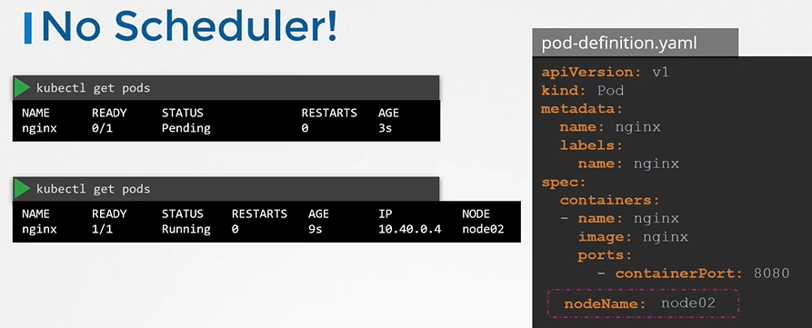
    - 解決方案 2: (若已建立 Pod)，可透過 Binding 物件，將 Pod 排程到指定的節點上
        - 使用 POST 請求，將 request body 以 JSON 格式傳送到 kube-apiserver => 模擬 kube-scheduler 的實際排程 Pod 的行為
            ```yaml
            apiVersion: v1
            kind: Binding
            metadata:
            name: nginx
            target:
            apiVersion: v1
            kind: Node
            name: node02
            ```

            ```yaml
            apiVersion: v1
            kind: Pod
            metadata:
                name: nginx
                labels:
                    name: nginx
            spec:
                containers:
                -   name: nginx
                    image: nginx
                    ports:
                    -   containerPort: 8080
            ```

        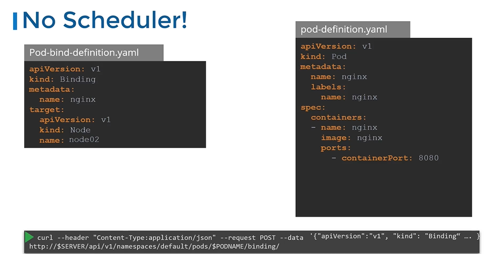

- 在 K8s 叢集中，我們<strong>不能將一個運行中的 Pod 移動到另一個節點上</strong>，因為 Pod 的 IP address 是固定的，且 Pod 的狀態是不可變的
    - 觀念: **本質上，Pod (container) 算是系統上的一個 process，而 process 是不可移動的**
    - 若我們想要將 Pod 移動到另一個節點上，我們必須先刪除 Pod，再重新建立 Pod，並指定 nodeName
    - 法 1: 刪除 Pod，再重新建立 Pod
        ```bash
        kubectl delete pod nginx
        kubectl create -f pod-definition.yaml
        ```
    - 法 2: **強制替換 Pod**
        ```bash
        kubectl replace --force -f pod-definition.yaml
        ```

### Labels & Selectors & Annotations
- 在 K8s 叢集中，有許多資源/物件，我們可以透過 labels, selectors 來對過濾、分群這些資源/物件，以進行管理。例如採用以下方式做分類
    - 根據<strong>資源類型</strong>做分類
        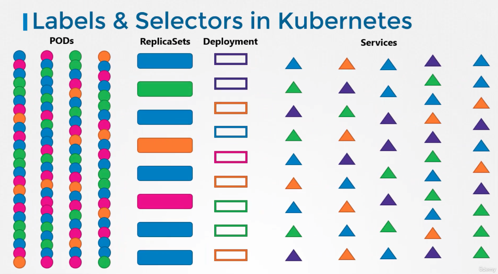
    - 根據<strong>應用程式類型</strong>做分類
        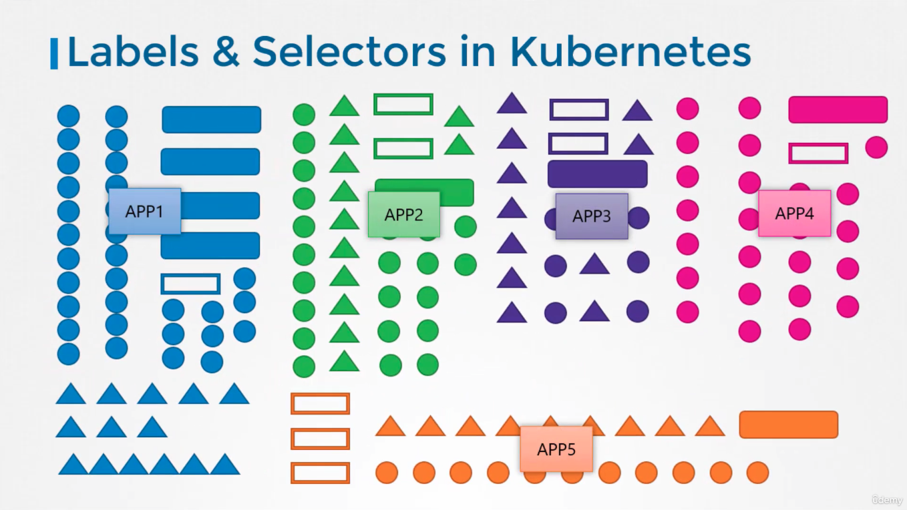
    - 根據<strong>功能</strong>做分類
        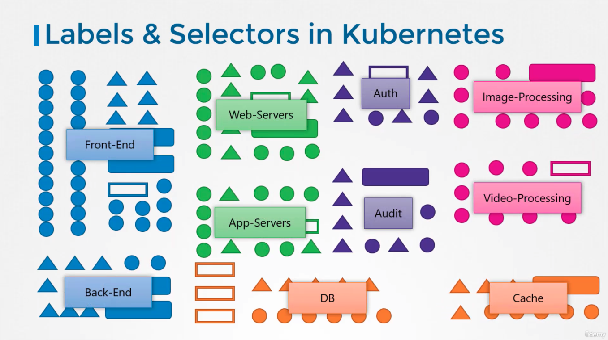
- 標籤 (labels): 會附加在 K8s 資源/物件上的 key-value pair，用來識別、分類
    - 建立 labels
        ```yaml
        apiVersion: v1
        kind: Pod
        metadata:
            name: simple-webapp
            # 建立 labels
            labels:
                app: App1
                function: Front-end

        spec:
            containers:
            -   name: simple-webapp
                image: simple-webapp
                ports:
                - containerPort: 8080
        ```
    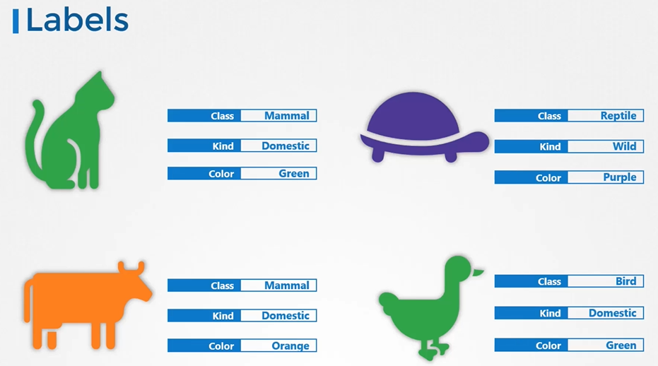
    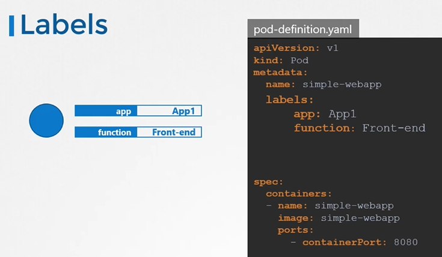
- 選擇器 (selectors): 針對 labels，來選擇要管理的資源/物件
    - 使用 selectors
        ```bash
        kubectl get pods --selector app=App1
        ```
    
- 註解 (annotations): 可附加在 K8s 資源/物件上的 key-value pair，**用來提供/記錄額外的資訊，通常不涉及資源/物件的選擇, 過濾**
    ```yaml
    # replicaset-definition.yaml
    apiVersion: apps/v1
    kind: ReplicaSet
    metadata:
        name: simple-webapp
        labels:
            app: App1
            function: Front-end
        # 建立 annotations
        annotations:
            buildversion: 1.34

    spec:
        replicas: 3
        selector:
            matchLabels:
                app: App1
    template:
        metadata:
            labels:
                app: App1
                function: Front-end
    spec:
        containers:
        -   name: simple-webapp
            image: simple-webapp   
    ```
    
- 對<strong>所有 K8s 叢集中的資源/物件</strong>，使用 labels 做分類
    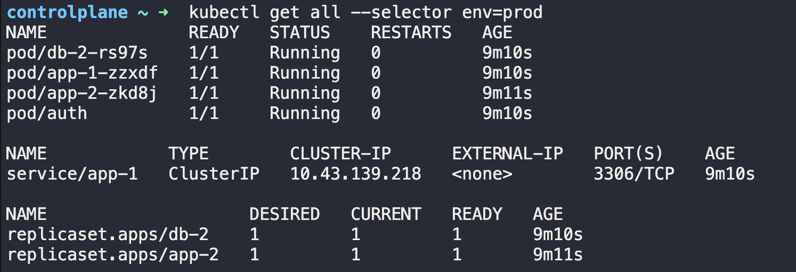
- 對所有 K8s 叢集中的資源/物件，使用<strong>多個 labels 做分類</strong>
    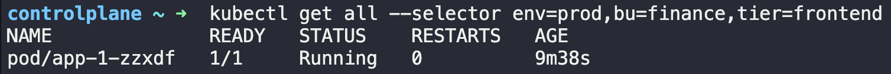
- labels & selectors 應用
    - ReplicaSet
        ```yaml
        apiVersion: apps/v1
        kind: ReplicaSet
        # ReplicaSet 的 metadata
        metadata:
            name: simple-webapp
            # 建立 labels
            labels:
                app: App1
                function: Front-end

        spec:
            replicas: 3
            # 使用 selectors 來選擇要管理的物件
            selector:
                matchLabels:
                    app: App1
            template:
                # Pod 的 metadata (較重要)
                metadata:
                        app: App1
                    labels:
                        function: Front-end
            spec:
                containers:
                -   name: simple-webapp
                    image: simple-webapp
        ```

        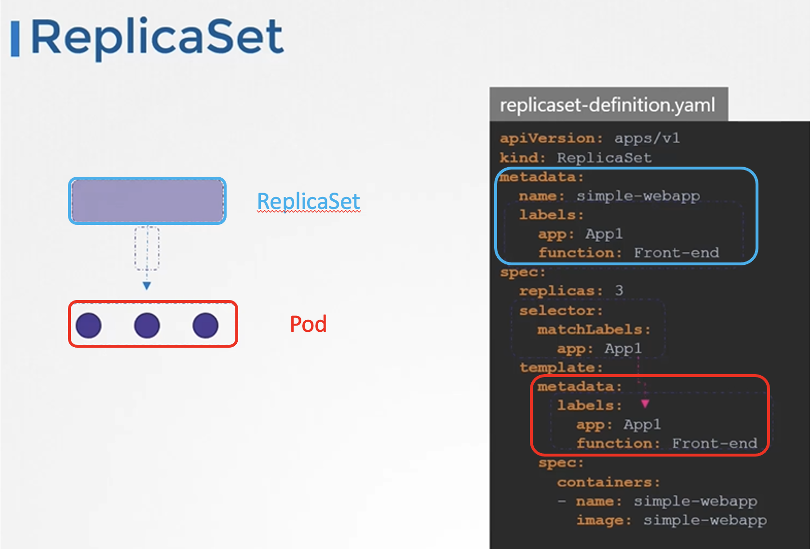

    - Service
        ```yaml
        apiVersion: v1
        kind: Service
        metadata:
            name: my-service

        spec:
            # 使用 selectors 來選擇要管理的物件
        selector:
                app: App1
            ports:
            -   protocol: TCP
                port: 80
                targetPort: 9376 
        ```

        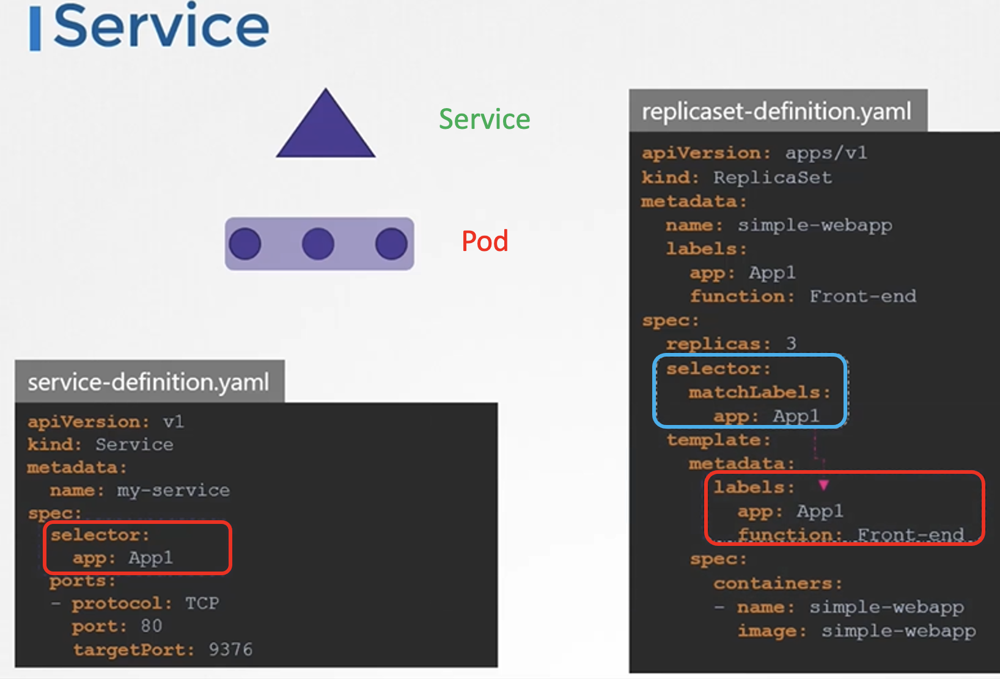

### Taints & Tolerations
- 為了<strong>限制 Node 接受某些 Pod 的排程</strong>，並讓可以 tolerate 特定 taint 的 Pod 被排程到該 Node 上
    - 注意! taints & tolerations 並不會告訴 Pod 去特定的 Node 上，而是<strong>告訴 taint Node 僅能接受具有特定 tolerations 的 Pod</strong>
    - taints & tolerations 與安全性或入侵無關，僅是用來限制 Pod 的排程
    
- taints (污點)
    - 設定於 **Node** 上
    - 功能: 可以設定當不能 tolerate 的 Pod 被排程到該 Node 上時，該如何處理？
        - NoSchedule: 表示新 Pod 不會被排程到這個節點上，除非這些 Pod 有相應的 toleration
            - 用途: 用於<strong>強制性地避免</strong> Pod 被排程到特定節點上
        - PreferNoSchedule: 表示 Kubernetes 會盡量避免將 Pod 排程到這個節點上，但這<strong>不是強制的</strong>。若沒有其他合適的節點，Pod 仍然可能會被排程到這個節點上
            - 用途: 用於軟性地避免 Pod 排程到特定節點上，但在資源不足或其他情況下允許例外
        - NoExecute: 表示不僅新 Pod 無法被排程到這個節點上，**已經在這個節點上的 Pod 也會被驅逐 (除非這些 Pod 有相應的 toleration)**
            - 用途: 用於在節點狀態改變或需要進行維護時，驅逐不符合條件的 Pod
    - 設定 taints
        ```bash
        kubectl taint nodes node1 app=blue:NoSchedule
        ```

    

    - 去除 taints
        ```bash
        kubectl taint nodes node1 app=blue:NoSchedule-
        ```

- tolerations (容忍)
    - 預設所有 Pod 都不會有 tolerations
    - 功能: 設定於 **Pod** 上，概念上如同 taints，只是要寫在 Pod 的 YAML manifest 設定檔中
    - 設定 tolerations
        ```yaml
        # pod-definition.yaml
        apiVersion: v1
        kind: Pod
        metadata:
            name: myapp-pod
        
        spec:
            containers:
            -   name: nginx-container
                image: nginx

            # 設定 tolerations，以 key-value pair 表示，其中 value 需加上雙引號 " "
            tolerations:
            -   key: "app"
                operator: "Equal"
                value: "blue"
                effect: "NoSchedule"
        ```

    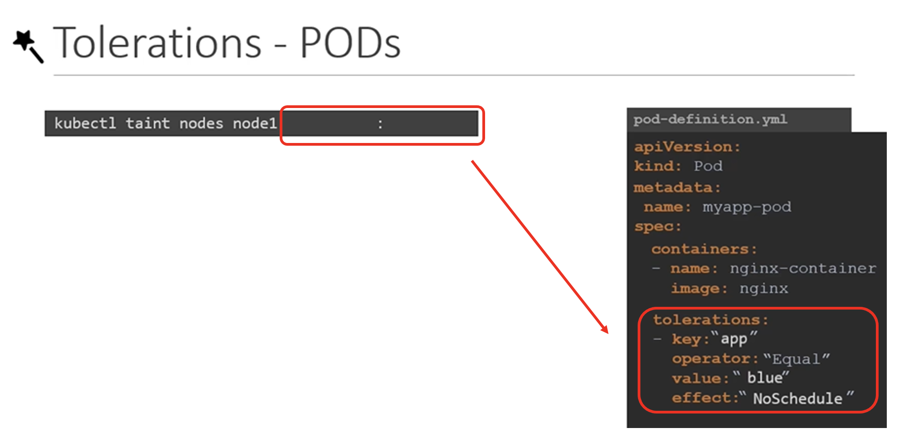

- 為什麼 K8s 叢集的 master node 不會被排程 Pod？
    - 因為在 K8s 叢集初始化時，**master node 會自動被設定 taints (預設為 NoSchedule)**，且 Pod 未設定 tolerations
        ```bash
        kubectl describe node kubemaster | grep Taint
        ```

        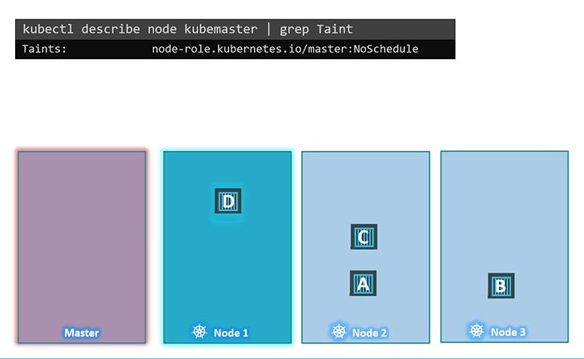

### Node Selectors
- 用途: 用來限制 Pod 被排程到指定的 Node 上

> 情境: 假設有三個 Node (node-1, node-2, node-3)，根據其資源配置分別為 large, medium, small，並分別為其設定 labels

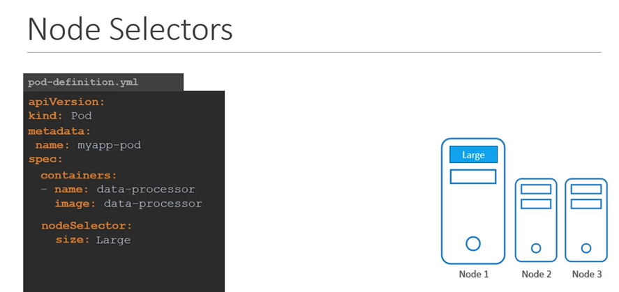

- 步驟 1: 分別為 Pod 設定 labels
    ```bash
    kubectl label nodes node-1 size=large
    kubectl label nodes node-2 size=medium
    kubectl label nodes node-3 size=small
    ```
    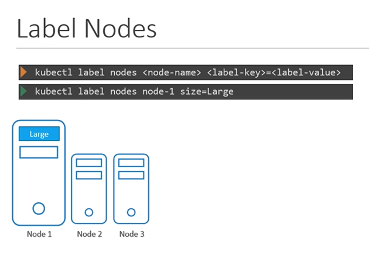
- 步驟 2: 建立 Pod 的 YAML manifest 設定檔，並設定 nodeSelector
    ```yaml
    # pod-definition.yaml
    apiVersion: v1
    kind: Pod
    metadata:
        name: myapp-pod

    spec:
        containers:
        -   name: data-processor
            image: data-processor
        # 根據指定的 label，設定 nodeSelector，以限制 Pod 被排程到指定的 Node 上
        nodeSelector:
            size: Large
    ```
    
- 步驟 3: 建立 Pod
    ```bash
    kubectl create -f pod-definition.yaml
    ```
- nodeSelector 的限制
    - 僅能使用等於 (Equal) 運算子
    - 若遇到更複雜的需求，就必須使用 Node Affinity 來解決 => e.g. Large or Medium, NOT Small
    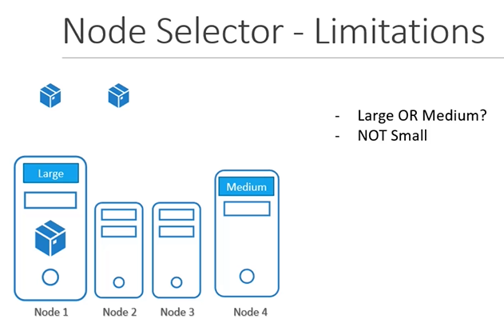


### Node Affinity
- 用途: 確保 Pod 能被排程到指定的 Node 上，以符合特定的需求
- 設定 nodeAffinity
    ```yaml
    # pod-definition.yaml
    apiVersion: v1
    kind: Pod
    metadata:
        name: myapp-pod
    
    spec:
        containers:
        -   name: data-processor
            image: data-processor
        # 設定 nodeAffinity
        affinity:
            nodeAffinity:
                requiredDuringSchedulingIgnoredDuringExecution:
                    nodeSelectorTerms:
                    # 可支援更複雜的需求 (表達式)
                    -   matchExpressions:
                        -   key: size
                            # 運算子需使用 Pascal Case
                            operator: In
                            values: 
                            -   Large
                            -   Medium
    ```

    ```yaml
    apiVersion: v1
    kind: Pod
    metadata:
        name: myapp-pod
    
    spec:
        containers:
        -   name: data-processor
            image: data-processor
        # 設定 nodeAffinity
        affinity:
            nodeAffinity:
                requiredDuringSchedulingIgnoredDuringExecution:
                    nodeSelectorTerms:
                    # 可支援更複雜的需求 (表達式)
                    -   matchExpressions:
                        -   key: size
                            # 運算子需使用 Pascal Case
                            operator: NotIn
                            values: 
                            -   Small
    ```

    ```yaml
    apiVersion: v1
    kind: Pod
    metadata:
    name: myapp-pod
    
    spec:
        containers:
        -   name: data-processor
            image: data-processor
    
        # 設定 nodeAffinity
        affinity:
            nodeAffinity:
                requiredDuringSchedulingIgnoredDuringExecution:
                    nodeSelectorTerms:
                        # 可支援更複雜的需求 (表達式)
                        -   matchExpressions:
                            -   key: size
                                # 可使用 Exists 運算子
                                operator: Exists
    ```

- nodeAffinity 的類型
    - 目前已可用的
        - Type 1 `requiredDuringSchedulingIgnoredDuringExecution`: 這是強制性的 Node Affinity。<strong>kube-scheduler 只會將 Pod 排程到滿足所有指定 Node Affinity 條件的節點上</strong>。若沒有滿足條件的節點，Pod 就無法被排程
        - Type 2 `preferredDuringSchedulingIgnoredDuringExecution`: 這是有彈性的 Node Affinity。<strong>kube-scheduler 會盡量將 Pod 排程到滿足條件的節點上</strong>。但如果沒有符合條件的節點，Pod 仍然可以被排程到其他節點
        

    - 未來正在規劃中的
        - Type 3 `requiredDuringSchedulingRequiredDuringExecution`: 這是一個計劃中的功能，目前尚未實現。kube-scheduler <strong>只會</strong>將 Pod 排程到符合條件的節點上。<strong>而在 Pod 運行期間，若節點不再符合條件，Pod 會被驅逐</strong>
        - Type 4 `preferredDuringSchedulingRequiredDuringExecution`: 這是一個計劃中的功能，目前尚未實現。kube-scheduler 會<strong>盡量</strong>將 Pod 排程到符合條件的節點上。<strong>而在 Pod 運行期間，如果節點不再符合條件，Pod 會被驅逐</strong>
        

- 參考資料
    - [Schedule a Pod using required node affinity](https://kubernetes.io/docs/tasks/configure-pod-container/assign-pods-nodes-using-node-affinity/#schedule-a-pod-using-required-node-affinity) 
    - [Node affinity](https://kubernetes.io/docs/concepts/scheduling-eviction/assign-pod-node/#node-affinity)

### combine Taints & Tolerations & Node Affinity
> 情境: 假設有五個 Node (Blue, Red, Green, Gray, Gray)，並且有五個 Pods (blue, red, green, gray, gray)。<br>
> 我們希望將 blue Pod 排程到 Blue Node 上，red Pod 排程到 Red Node 上，green Pod 排程到 Green Node 上，gray Pod 排程到 Gray Node 上。<br>
> 也就是說，在每個顏色的 Node 上，僅能排程對應顏色的 Pod。<br>

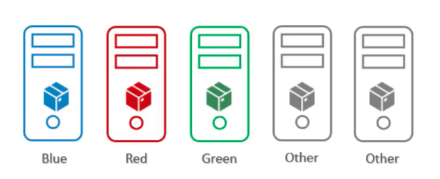

- Taints & Tolerations: **無法確保 Pod 僅會被排程到指定的 Node 上**，僅能限制不具備指定 tolerations 的 Pod 不會被排程到指定 taints 的 Node 上 (因此仍然可能會發生非預期的錯誤結果)
    - 設定 Node 的 taints
        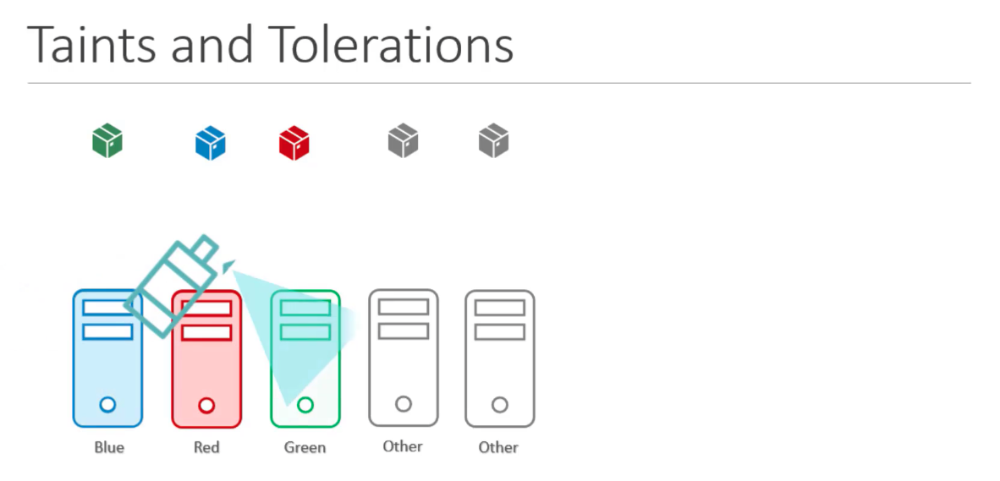
    - 設定 Pod 的 tolerations
        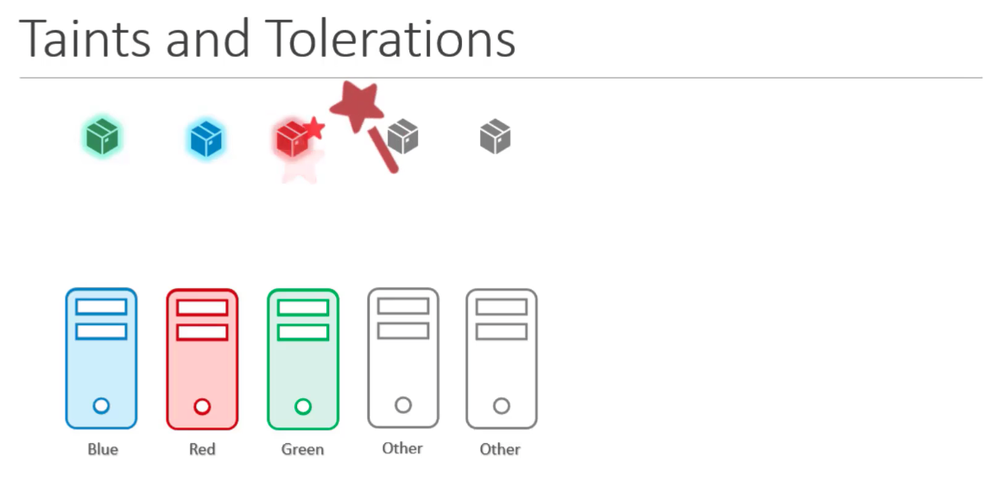
    - 結果 (仍然可能會發生 Pod 排程到錯誤的 Node 上 => 非預期結果)
        
- Node Selectors: 僅能限制指定的 Pod 會被排程到指定的 Node 上，但無法限制其他 Pod 也被排程到指定的 Node 上
    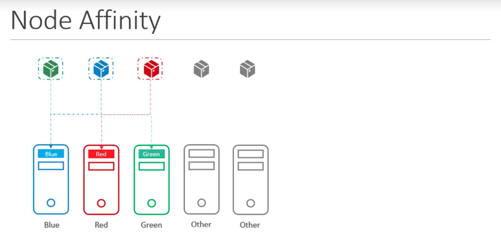
    - 結果 (仍然可能會發生 Pod 排程到錯誤的 Node 上 => 非預期結果)
        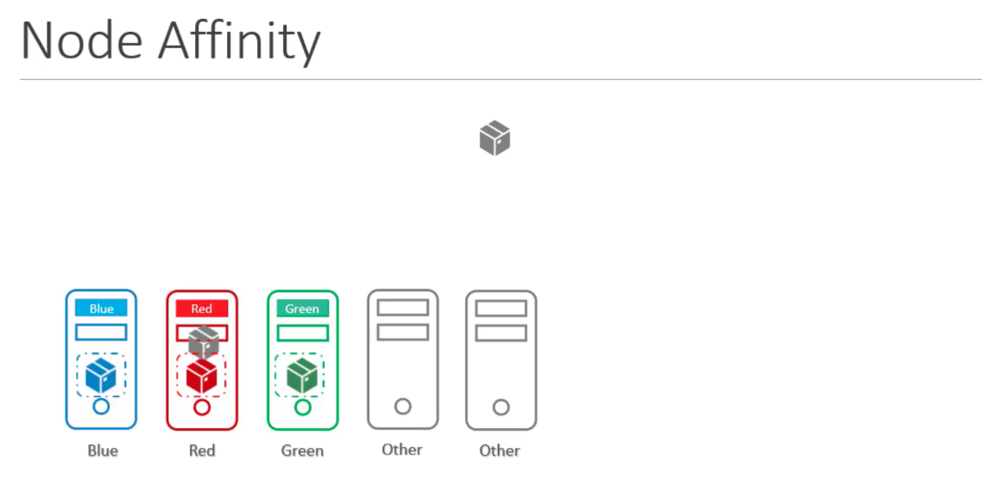
- 正確解法: 使用 Taints & Tolerations 防止其它 Pod 放到錯誤的 Node 上。再使用 Node Affinity 防止 Pod 放到錯誤的 Node 上
    - 結果 (Pod 會被正確地排程到指定的 Node 上)
        

### Resource requests & limits
- 用途: 用來限制 Pod 使用的 CPU 和 memory 資源
    - 資源類型
        - CPU: 以 CPU 單位 (**vCPU**) 來表示
            - 最佳實踐: 設定 CPU requests 就好
            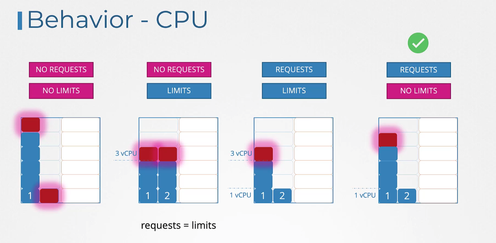
        - Memory: 以 memory 單位 (**MiB**) 來表示
    - 資源請求與限制
        - **requests**: 代表容器正常運行時，**所需的最低資源下限**
            - K8s 預設每個 Pod 的 resource requests: CPU = 0.5 vCPU, memory = 256 MiB
            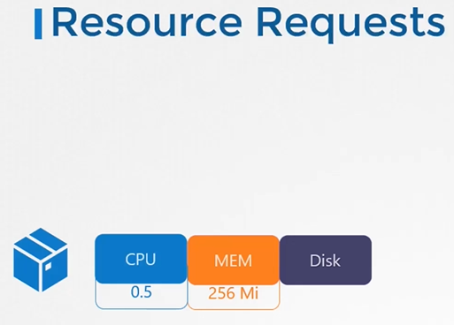
        - **limits**: 代表容器運行過程中，**能使用的最多資源上限**
            - K8s 預設每個 Pod 的 resource limits: CPU = 1 vCPU, memory = 512 MiB
            

        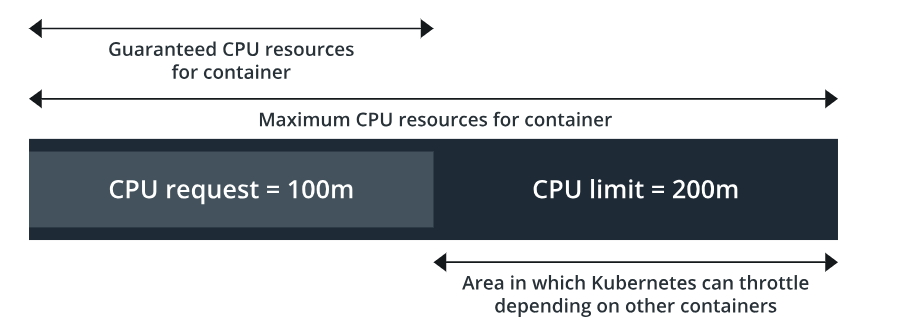 <br>
        [圖片出處](https://www.densify.com/kubernetes-autoscaling/kubernetes-resource-quota/)

        ```yaml
        # pod-definition.yaml
        apiVersion: v1
        kind: Pod
        metadata:
            name: simple-webapp-color
            labels:
                name: simple-webapp-color
        
        spec:
            containers:
            -   name: simple-webapp-color
                image: simple-webapp-color
                
                ports:
                -   containerPort:  8080

                # 設定 resource requests & limits
                resources:
                    requests:
                        memory: "1Gi"
                        cpu: "1"
                    limits:
                        memory: "2Gi"
                        cpu: "2"
        ```

- 設定 Resource LimitRange: 幫助我們<strong>定義每個 Pod 的預設資源請求與限制</strong>
    - 會套用在未來建立的 Pod 上，但不會套用於正在執行中的 Pod 上

    ```yaml
    # limit-range-cpu.yaml
    apiVersion: v1
    kind: LimitRange
    metadata:
        name: cpu-resource-constraint

    spec:
        limits:
        -  default: # limit
                cpu: 500m # 0.5 vCPU
            defaultRequest: # request
                cpu: 500m # 0.5 vCPU
            max: # limit
                cpu: 1 # 1 vCPU
            min: # request
                cpu: 100m # 0.1 vCPU
            type: Container
    ```

    ```yaml
    # limit-range-memory.yaml
    apiVersion: v1
    kind: LimitRange
    metadata:
        name: memory-resource-constraint
    
    spec:
        limits:
        -   default: # limit
                memory: 1Gi # 1 GiB
            defaultRequest: # request
                memory: 1Gi # 1 GiB
            max: # limit
                memory: 1Gi # 1 GiB
            min: # request
                memory: 500Mi # 500 MiB
            type: Container
    ```

- 設定 Resource Quota: 用來<strong>設定整個 Namespace 的資源請求與限制</strong>
    ```yaml
    # resource-quota.yaml
    apiVersion: v1
    kind: ResourceQuota
    metadata:
        name: my-resource-quota
    
    spec:
        hard:
            pods: "10"
            requests.cpu: "4"
            requests.memory: 4Gi
            limits.cpu: "10"
            limits.memory: 10Gi
    ```

    
    

- 當超過 resource limits 的限制時
    - **CPU**: 會被限制在指定的 CPU 數量上，**超過的部分會被暫停 (throttle)**
        - Pod 會顯示處於 Pending 狀態，因為 kube-scheduler 找不到具有足夠 CPU 來排程
        
    - **Memory**: 會被限制在指定的 memory 上，**超過的部分會被刪除 (terminate)**
        - 因為我們無法節流 (throttle) memory，因此當超過 memory limits 時，僅能透過刪除 Pod 來釋放 memory
        - 會拋出 **OOM 錯誤 (Out Of Memory)**
        

### DaemonSet
- 用途: 類似 ReplicaSet，能幫助我們在各個 Node 上部署多個相同的 Pod 副本。但是 DaemonSet 僅會在各個 Node 上運行一個 Pod 副本
    - 當有新的 Node 加入 K8s 叢集時，DaemonSet 會自動在新的 Node 上部署一個 Pod 副本
    - 當有 Node 從 K8s 叢集中移除時，DaemonSet 會自動刪除該 Node 上的 Pod 副本
    
- 常見應用情境: **Monitoring solution, Logs viewer**, kube-proxy, Networking solution
    
    
    
- 建立 DaemonSet
    - 類似於 ReplicaSet 的 YAML manifest 設定檔，但是 kind 要改成 DaemonSet
    ```yaml
    # daemonset-definition.yaml
    apiVersion: apps/v1
    kind: DaemonSet
    metadata:
        name: monitoring-daemon
        labels:
            app: nginx
    
    spec:
        selector:
            matchLabels:
                app: monitoring-agent
        template:
            metadata:
                labels:
                    app: monitoring-agent
        spec:
            containers:
            -   name: monitoring-agent
                image: monitoring-agent
    ```

    ```bash
    kubectl create -f daemonset-definition.yaml
    ```

- 檢視在所有的 Namespace 中，目前所有的 DaemonSet
    ```bash
    kubectl get daemonsets -A
    ```
- 詳細檢視指定 DaemonSet 的資訊
    ```bash
    kubectl describe daemonsets monitoring-daemon
    ```

    

- DaemonSet 是如何將 Pod 分別排程到各個 Node 上的？
    - 在 K8s v1.12 之前: 使用 nodeSelector
    - 在 K8s v1.12 之後: 使用 Node Affinity, default kube-scheduler
    

### Static Pods
- Static Pod: 在 K8s 叢集中，由 kubelet 直接管理的 Pod，而不是透過 kube-apiserver 來建立、管理
    - kubelet 會自動監控、啟動這些 Static Pod
    - 不會被記錄在 etcd 中，因此不能透過 `kubectl` 指令來管理
- 假設沒有 K8s 叢集，也沒有 Master Node，也沒有 kube-apiserver。那麼 Worker Node 會如何運作？
    - Ans: kubelet 會透過預設在 `/etc/kubernetes/manifests` 目錄下的 YAML manifest 設定檔，來建立 Static Pods
        - 法 1: 透過 CLI 的 `--pod-manifest-path` 選項，通知 kubelet 建立 Static Pods
            
        - 法 2: 編輯 kubeconfig.yaml 設定檔，加入 `staticPodPath: /etc/kubernetes/manifests` 設定，通知 kubelet 建立 Static Pods
            
    - 這時候，若要檢視當前有哪些 Static Pods，因為我們沒有一個完整的 K8s 叢集，因此只能透過 Docker 指令來查看
        ```bash
        docker ps
        ```

        

- kubelet 可以透過以下兩種方式，建立 Pod (兩種 Pods 都可以經由 `kubectl get pods` 查看)
    - 由 **kube-apiserver** 運用 HTTP request，通知 kubelet 建立 **Pod**
    - kubelet 根據 `/etc/kubernetes/manifests` 目錄下的 YAML manifest 設定檔，建立 **Static Pods**
        - 其實，當建立 Static Pod 時，也會在 kube-apiserver 建立一個 read-only mirror object。因此，如果要編輯這個 Static Pod，還是必須到 Worker Node 的 `/etc/kubernetes/manifests` 目錄下編輯 YAML manifest 設定檔
        

- Static Pod 的應用情境
    - kubeadm 設定 K8s 叢集的方式: 因為 Static Pod 不需要依賴 K8s 叢集的特性，因此可在各節點上，透過 kubelet 建立 Static Pod，來運行各種系統服務 (e.g. controller-manager, apiserver, etcd, scheduler)。並且 kubelet 會自動管理這些系統服務，確保其持續運行
    
    

- 檢視所有 Namespace 中有幾個 Static Pods
    - 查看 **Pod name 的後綴，會帶有 Node name** 的就是 Static Pods
        
    - 檢視 Static Pods 的詳細資訊: **ownerReferences.kind = Node**
        
- Static Pod 的 YAML manifest 設定檔會存放在哪？
    - 步驟 1: 檢視 kubelet 的 `/var/lib/kubelet/config.yaml` 設定檔內容，確認 **staticPodPath: /etc/kubernetes/manifests** 的路徑位置
        - 預設會放在 Node 上的 `/etc/kubernetes/manifests` 目錄下
    - 步驟 2: 到 staticPodPath 確認當前 kubelet 有哪些關於 Static Pod 的設定檔
        
- Static Pods vs. DaemonSets
    

### Multiple Schedulers
- 用途: 可以在 K8s 叢集中，同時部署多個 scheduler
    
- 手動建立一個自定義的 scheduler
    - 法 1: 透過 scheduler 的 binary 檔，建立 scheduler
        - 下載 scheduler 的 binary 檔
            ```bash
            wget https://storage.googleapis.com/kubernetes-release/release/v1.12.0/bin/linux/amd64/kube-scheduler
            ```
        - 指定 scheduler 名稱，以及 scheduler 的 YAML manifest 設定檔
            
    - 法 2: 將 scheduler 視為一個 Pod，先建立 scheduler-config 檔後，再宣告 `--config` 選項來指定 scheduler 的 YAML manifest 設定檔的路徑
        - `leaderElect`: true 表示這個 scheduler 會選舉一個 leader，並且只有 leader 才會執行任務 (因為在 K8s 叢集中，一次只能有一個 scheduler 處於 active 狀態，以避免排程演算法的決策衝突問題)
            
        - 建立 scheduler Pod
            ```bash
            kubectl create -f my-custom-scheduler.yaml
            ```
- 檢視指定 Namespace 中的所有 Scheduler Pods
    ```bash
    kubectl get pods -n kube-system
    ```
- 運用剛剛建立的 scheduler，建立一個 Pod: 設定 `schedulerName` 參數值
    ```yaml
    apiVersion: v1
    kind: Pod
    metadata:
        name: nginx
    
    spec:
        containers:
        -   image: nginx
            name: nginx
        # 指定使用自定義的 scheduler
        schedulerName: my-custom-scheduler
    ```

    

- 如何查詢哪個 scheduler 負責排程哪些 Pods？
    ```bash
    kubectl get events -o=wide
    ```

    

- 如何查詢 scheduler 的排程記錄 log？
    ```bash
    kubectl logs my-custom-scheduler -n=kube-system
    ```

    

### Configuring Scheduler Profiles
- 每個 scheduler 都會具備以下幾個擴展點 (extension points)，能透過加入插件 (plugin) 的方式，來擴展 scheduler 的功能
    - 擴展點 (extension points): 表示<strong>排程過程中的特定階段</strong>，這些階段能允許使用者插入自定義插件邏輯，以修改 or 擴展 scheduler 的行為
    - 插件 (plugins): 附加在<strong>scheduler 的擴展點上，用來自定義 or 擴展 scheduler 的行為</strong>
    
    
- 從 K8s v.1.18 以後，能透過 **KubeSchedulerConfiguration** 物件，在同一份 scheduler 設定檔中，設定多個 scheduler profiles
    - `profiles`: 能指定多個 schedulerName，以設定多個 scheduler profiles
        - `plugins`: 可分別設定各個 scheduler 的 plugins 內容
    

## Logging & Monitoring
### Logging
- Docker: 執行一個模擬產生 log 的程式，並實時查看 log 資訊
    

    `-f` 參數: 表示 follow，用來實時追蹤 log 輸出資訊，類似於 Linux 中的 tail -f 命令
    

- Kubernetes: 建立並執行一個模擬產生 log 的 Pod，並實時查看 log 資訊
    ```yaml
    # pod-definition.yaml
    apiVersion: v1
    kind: Pod
    metadata:
        name: event-simulator-pod
    
    spec:
        containers:
        -   name: event-simulator
            image: kodekloud/event-simulator
    ```

    ```bash
    kubectl logs -f event-simulator-pod
    ```

    

- 若在一個 Pod 中，有多個 container，則需指定 container name
    ```bash
    # kubectl logs -f <pod-name> -c <container-name>
    kubectl logs -f even-simulator-pod -c event-simulator
    ```

    

### Monitoring
- 截至目前(2024)，K8s 官方並無內建的<strong>全功能監控工具</strong>，因此需要透過第三方開源工具來監控 K8s 叢集
    
- Heapster 曾經是 K8s 官方的監控工具，但在 K8s v1.11 之後，已經被淘汰。**現已由 Metrics Server 取代**
    
- Metrics Server
    - 僅提供基本的監控功能 (e.g. CPU, Memory 使用率)，並不提供進階的監控功能 (log 收集、進階分析、視覺化顯示)
    - 僅會將各個 Node 上的 metrics 資料，儲存在 **in-memory** 中，而不會儲存在硬碟中，因此我們無法透過 Metrics Server 查詢歷史監控資料
    
- 每個 Node 是如何收集監控指標的資料呢？
    - 透過 kubelet 的 cAdvisor 來收集 Pod 的監控指標資料，並定期向 Metrics Server 回報
    
- 啟動 Metrics Server
    - 法 1 (minikube):
        ```bash
        minikube addons enable metrics-server
        ```
    - 法 2 (其它情況):
        ```bash
        git clone https://github.com/kubernetes-incubator/metrics-server.git
        ```

        ```bash
        kubectl create -f metric-server/deploy/1.8+/
        ```

    

- 監控 Node-level 的指標
    - 正在運行中的節點數量
    - CPU 使用率
    - Memory 使用率
    - Disk 使用率
    - Network 使用率

    ```bash
    kubectl top node
    ```

- 監控 Pod-level 的指標
    - 正在運行中的 Pod 數量
    - CPU 使用率
    - Memory 使用率
    - Disk 使用率
    - Network 使用率

    ```bash
    kubectl top pod
    ```

    

## Application Lifecycle Management
### Rolling Updates and Rollbacks in Deployments
- 當我們第一次建立 Deployment，會觸發一個 Rollout，產生一個 Revision。而之後的每次更新，都會觸發一個新的 Rollout，產生一個新的 Revision
    

#### Deployment-Rollout Strategy
- 建立 Deployment
    ```bash
    kubectl create deployment nginx --image=nginx
    ```
- 查看當前 Deployment 的滾動更新狀態，告訴我們新的 Pod 是否已經就緒
    ```bash
    kubectl rollout status deployment/myapp-deployment
    ```
- 查看 Deployment 的歷史記錄，包含每次變更的修訂版本、變更原因
    ```bash
    kubectl rollout history deployment/myapp-deployment
    ```

    
    

- Deployment 的兩種 Rollout 策略
    - Recreate: 先刪除舊的 Pod，再建立新的 Pod
    - **RollingUpdate** (預設): 滾動更新，逐步刪除舊的 Pod，並建立新的 Pod
        - `maxUnavailable`: 一次最多刪除多少個 Pod
        - `maxSurge`: 一次最多新增多少個 Pod
        

- 更新 Deployment 的 Rollout 策略
    - 法 1: 透過 `kubectl edit` 指令，編輯 Deployment 的 YAML manifest 設定檔
        ```bash
        kubectl edit deployment-definition.yaml
        ```

        ```yaml
        # deployment-definition.yaml
        apiVersion: apps/v1
        kind: Deployment
        metadata:
            name: myapp-deployment
            labels:
                app: nginx
        spec:
            template:
                metadata:
                    name: myap-pod
                    labels:
                        app: myapp
                        type: front-end
                spec:
                    containers:
                    -   name: nginx-container
                        image: nginx:1.7.1
            
            replicas: 3
            selector:
                matchLabels:
                    type: front-end
        ```

        ```bash
        kubectl apply -f deployment-definition.yaml
        ```
    - 法 2: 透過 `kubectl set` 指令，設定 Deployment 的 Rollout 策略
        ```bash
        kubectl set image deployment/myapp-deployment nginx=nginx:1.9.1
        ```

        

- 升級 Deployment 的版本: K8s 叢集會建立一個新的 ReplicaSet 來建立新的 Pods
    

- 回滾 Deployment 的版本: 運用 `kubectl rollout undo` 指令，K8s 叢集會將新的 ReplicaSet 中的 Pods 刪除，並重新建立舊的 ReplicaSet 中的 Pods
    ```bash
    kubectl rollout undo deployment/myapp-deployment
    ```

    

- 統整: 關於 Deployment 的常見 kubectl 指令
    ```bash
    kubectl create -f deployment-definition.yaml
    kubectl get deployments
    kubectl apply -f deployment-definition.yaml
    kubectl set image deployment/myapp-deployment nginx=nginx:1.9.1
    kubectl rollout status deployment/myapp-deployment
    kubectl rollout history deployment/myapp-deployment
    kubectl rollout undo deployment/myapp-deployment
    ```

    

### Configure Applications
- 設定應用程式的 Command & Arguments
    - container 不是用來託管作業系統（operating system）的，而是用來執行特定任務 or 進程（process），例如: 網頁伺服器、應用程式伺服器、資料庫伺服器...等
        - 當任務完成後，container 會自動結束（亦即，containter 僅在其內部的 process 處於 active 狀態時，才會存在）
        - 預設情況下，Docker 在執行時，不會將 terminal 附加到 container 上
    
- 如何指定不同的指令，來啟動 container 呢？
    - 法 1 (臨時作法): 當 Docker 執行時，在 CLI 加上指定的執行選項
        ```bash
        docker run ubuntu sleep 5
        ```
    - 法 2 (永久作法): 可透過設定 Dockerfile 的 `ENTRYPOINT`、`CMD` 指令
        - `ENTRYPOINT`: 定義 container 啟動時，一定要先執行的指令
        - `CMD`: 定義 container 啟動時，要執行的指令
            - Tips: 必須用陣列 `[ ]` 來表示，且其中的元素都必須用雙括弧 `" "` 來表示，陣列元素之間需用逗號 `,` 做分隔
            
            
        - 建立 Dockerfile
            ```dockerfile
            FROM ubuntu
            CMD ["sleep", "5"]
            ```
        - 建立 Docker image
            ```bash
            docker build -t ubuntu-sleeper .
            ```
        - 執行 Docker container
            ```bash
            docker run ubuntu-sleeper
            ```
- Dockerfile `CMD` vs. `ENTRYPOINT` 的應用
    - 情況 1: 僅宣告 `CMD`。當 Docker 執行容器時，可透過 CLI 傳遞指令、參數，來覆寫 `CMD` 指令
    - 情況 2: 僅宣告 `ENTRYPOINT`。當 Docker 執行容器時，只要傳遞參數即可
    - 情況 3: 僅宣告 `ENTRYPOINT`，但 Docker 執行容器時，未傳遞參數 => 會報錯（missing operand）
    

    - 情況 4: 同時宣告 `ENTRYPOINT` 與 `CMD`。當 Docker 執行容器時，`CMD` 指令會作為參數，傳遞給 `ENTRYPOINT` 指令
    - 情況 5: 同時宣告 `ENTRYPOINT` 與 `CMD`，且當 Docker 執行容器時，透過 CLI 傳遞參數，會覆寫原本的 `CMD` 指令
    - 情況 6: 同時宣告 `ENTRYPOINT` 與 `CMD`，且當 Docker 執行容器時，透過 CLI 傳遞參數，會覆寫原本的 `ENTRYPOINT` 指令
    

- Dockerfile vs. Kubernetes Pod YAML manifest 設定檔
    - Dockerfile
        ```dockerfile
        FROM ubuntu
        ENTRYPOINT ["sleep"]
        CMD ["5"]
        ```
    - K8s Pod 的 YAML manifest 設定檔
        ```yaml
        apiVersion: v1
        kind: Pod
        metadata:
            name: ubuntu-sleeper-pod
        
        spec:
            containers:
            -   name: ubuntu-sleeper
                image: ubuntu-sleeper
                command: ["sleep2.0"]
                args: ["10"]
        ```
    - **注意! Dockerfile 中的 `ENTRYPOINT` 指令，會對應到 K8s Pod YAML manifest 設定檔中的 `command` 欄位; 而 `CMD` 指令，則會對應到 `args` 欄位**
        
        

- 設定環境變數
    - 法 1: 運用單純的 key-value 鍵值對，設定環境變數
    - 法 2: 運用 K8s ConfigMap，設定環境變數。需用陣列 `[ ]` 表示，以及使用 `valueFrom.configMapKeyRef` 來給定 ConfigMap
    - 法 3: 運用 K8s Secrets，設定環境變數。需用陣列 `[ ]` 表示，以及使用 `valueFrom.secretKeyRef` 來給定 Secrets
    

#### ConfigMap
- 用途: 儲存應用程式的設定資料
- 建立 ConfigMap
    - 命令式 (Imperative): 
        ```bash
        # 在 CLI 上，直接給定 key-value 對，來建立 ConfigMap
        kubectl create configmap app-config --from-literal=APP_COLOR=blue --from-literal=APP_MODE=prod
        ```

        ```bash
        # 透過檔案來建立 ConfigMap
        kubectl create configmap app-config --from-file=app_config.properties
        ```

        

    - 宣告式 (Declarative):
        ```yaml
        # configmap-definition.yaml
        apiVersion: v1
        kind: ConfigMap
            metadata:
                name: app-config
            data:
                APP_COLOR: blue
                APP_MODE: prod
        ```

        ```bash
        kubectl create -f configmap-definition.yaml
        ```

        
        

- 注入 ConfigMap 到 Pod 中
    - `envFrom.configMapRef`: 適用於需要將所有 ConfigMap 的 key-value 對，都作為環境變數的情況
        ```yaml
        # pod-definition.yaml
        apiVersion: v1
        kind: Pod
        metadata:
            name: simple-webapp-color
        spec:
            containers:
            -   name: simple-webapp-color
                image: simple-webapp-color
                ports:
                - containerPort: 8080

                # 注入 ConfigMap 到 Pod 中 (`envFrom` 採用陣列表示)
                envFrom:
                - configMapRef:
                    name: app-config
        ```

        ```yaml
        # configmap-definition.yaml
        apiVersion: v1
        kind: ConfigMap
        metadata:
            name: app-config
        data:
            APP_COLOR: blue
            APP_MODE: prod
        ```

        ```bash
        kubectl create -f pod-definition.yaml
        ```

        

    - 其它方式
        - `env.valueFrom.configMapKeyRef`: 適用於只需要特定 ConfigMap 的 key-value 對，作為環境變數的情況
        - `volumes.configMap`: 適用於應用程式，需要 volume 形式的設定資料，作為環境變數的情況
        

- 查詢目前有哪些 ConfigMaps
    ```bash
    kubectl get configmaps 
    # (or)
    # kubectl get cm
    ```

    

- 詳細檢視指定的 ConfigMap
    ```bash
    kubectl describe configmap app-config -o=yaml
    ```

#### Secrets
- 用途: 儲存系統的機敏資料
- 注意! **K8s 的 Secrets 只是用 base64 編碼 (encode) 過的資料而已，這並不算是真正的加密 (encrypt)**。任何人只要知道 base64 編碼的解碼 (decode) 方法，就能解碼 Secrets
    - 安全性概念: 儘管 **K8s 官方文件將 Secrets 視為存儲敏感數據的 "更安全選擇 (safer option)"**，這主要是因為它們比純文字 (plain text) 較安全，可以降低意外洩漏密碼、其他機敏資料的風險。**真正的安全性來自於如何使用和管理這些 Secrets，而不是 Secrets 本身的安全性**
    

    - 可參考 [K8s 官方文件: Encrypting Confidential Data at Rest](https://kubernetes.io/docs/tasks/administer-cluster/encrypt-data/)
- 建立 Secret
    - 命令式 (Imperative): 
        ```bash
        # 在 CLI 上，直接給定 key-value 對，來建立 Secret
        kubectl create secret generic app-secret --from-literal=DB_Host=mysql --from-literal=DB_User=root --from-literal=DB_Password=paswrd
        ```

        ```bash
        # 透過檔案來建立 Secret
        kubectl create secret generic app-secret --from-file=app_secret.properties
        ```

        

    - 宣告式 (Declarative):
        -  將原始機敏資料，運用 base64 編碼 (非加密)
            ```bash
            echo -n "mysql" | base64
            echo -n "root" | base64
            echo -n "paswrd"| base64
            ```
            
            

        - 建立 Secret 的 YAML manifest 設定檔
            ```yaml
            # secret-data.yaml
            apiVersion: v1
            kind: Secret
            metadata:
                name: app-secret
            data:
                DB_Host: bX1zcWw=
                DB_User: cm9vdA==
                DB_Password: cGFzd3Jk
            ```
        - 建立 Secret
            ```bash
            $ kubectl create -f secret-data.yaml
            ```

        

- 注入 Secret 到 Pod 中
    - `envFrom.secretRef`: 適用於需要使用所有 Secret 的 key-value 對
        ```yaml
        # secret-definition.yaml
        apiVersion: v1
        kind: Secret
        metadata:
            name: app-secret
        data:
            DB_Host: bX1zcWw=
            DB_User: cm9vdA==
            DB_Password: cGFzd3Jk
        ```

        ```yaml
        # pod-definition.yaml
        apiVersion: v1
        kind: Pod
        metadata:
            name: simple-webapp-color
        
        spec:
            containers:
            -   name: simple-webapp-color
                image: simple-webapp-color
                ports:
                -   containerPort: 8080
                
                # 注入 Secret 到 Pod 中 (`envFrom` 採用陣列表示)
                envFrom:
                -   secretRef:
                    name: app-secret
        ```

        ```bash
        kubectl create -f pod-definition.yaml
        ```

        

    - 其它方式
        - `env.valueFrom.secretKeyRef`: 適用於只需要使用特定 Secret 的 key-value 對
        - `volumes.secret`: 適用於應用程式，需要使用 volume 形式的設定資料
            - Secret 中的每個屬性，都會被建立為一個檔案，且每個檔案的名稱就是 Secret 的鍵 (key)，檔案的內容就是 Secret 的值 (value)
            
 
        

- base64 解碼 (decode)
    ```bash
    echo -n "bX1zcWw=" | base64 --decode
    echo -n "cm9vdA==" | base64 --decode
    echo -n "cGFzd3Jk" | base64 --decode
    ```

    

- 查詢目前有哪些 Secrets
    ```bash
    kubectl get secrets
    ```

- 詳細檢視指定的 Secret
    ```bash
    kubectl describe secret app-secret -o=yaml
    ```

    

- Secret 的最佳實踐
    

### Scale Applications
#### Multi-Container Pod
- 用途: 有時，我們可能會需要兩種服務一起運作，例如: 網頁伺服器 + log 代理
    - 解決方式: 我們可以在一個 Pod 中包含多個 containers，這樣 containers 之間就能視為同一個本地端 (local)，亦能共享同一個 Networking, Storage 等

    
    

- 建立 Multi-Container Pod
    ```yaml
    # pod-definition.yaml
    apiVersion: v1
    kind: Pod
    metadata:
        name: simple-webapp
        labels:
            name: simple-webapp
    
    spec:
        containers:
        # 第一個 container
        -   name: simple-webapp
            image: simple-webapp
            ports:
            -   ContainerPort: 8080

        # 第二個 container
        - name: log-agent
            image: log-agent
    ```

    
    

- Multi-container Pods 的三大設計模式 (Design Patterns)
    - **Sidecar (邊車模式)**: 主要 container 負責應用程式的主要邏輯，而 **sidecar container 負責支援性的工作**
        - e.g. Logging, Monitoring 等
    - **Adapter (適配器模式)**: 主要 container 負責應用程式的主要邏輯，而 **adapter container 負責轉換主要 container 的輸出**
        - e.g. 把資料從 JSON 轉換為 YAML 格式
    - **Ambassador (大使模式)**: 主要 container 負責應用程式的主要邏輯，而 **ambassador container 負責將主要 container 的輸出轉換成另一種格式**
        - e.g. 代理服務 (Proxy)、負載均衡 (Load Balance)、安全認證
    

- 在 Kubernetes 中，多容器 Pod 中的每個容器都預期會在 Pod 的生命週期內保持運行。例如: 網頁伺服器 + log 代理 都會需要持續運行。若其中任何一個 container 失效，Pod 就會重新啟動
    - 在 Kubernetes 中，**sidecar container** 是<strong>在主要的 container 之前就會啟動，並持續運行</strong>
- Init Container (初始化容器)
    - 特性:
        - **初始化容器總是會執行到成功為止**，若執行失敗，kubelet 會重複執行初始化容器，直到執行成功為止
        - 每個初始化容器<strong>必須完成執行成功後，才能執行下一個初始化容器</strong>
    
    | Feature | Init Containers (初始化容器) | Sidecar Containers (邊車容器) |
    | :---: | :---: | :---: |
    | 運行時間 | 主應用容器啟動前完成 | 與主應用容器同時運行 |
    | 執行順序 | 順序完成，主容器等所有 init 容器完成後才啟動  | 與主容器並行執行 |
    | 支援 Probe 類型 | 不支援 `lifecycle`、`livenessProbe`、`readinessProbe`、`startupProbe` | 支援 `lifecycle`、`livenessProbe`、`readinessProbe`、`startupProbe` |
    | 資源共享 | 共享資源（CPU、記憶體、網路）但不直接互動，可使用 shared volume 來進行資料交換 | 共享資源（CPU、記憶體、網路）並可直接互動 |

    - 範例:
        ```yaml
        # init-container-pod-definition.yaml
        apiVersion: v1
        kind: Pod
        metadata:
            name: myapp-pod
            labels:
                app: myapp
        
        spec:
            # 設定初始化容器
            initContainers:
            -   name: init-myservice
                image: busybox
                command: ['sh', '-c', 'git clone <some-repository-that-will-be-used-by-application> ; done;']

            # 設定主要容器
            containers:
            -   name: myapp-container
                image: busybox:1.28
                command: ['sh', '-c', 'echo The app is running! && sleep 3600'] 
        ```

        ```yaml
        # multi-init-container-pod-definition.yaml
        apiVersion: v1
        kind: Pod
        metadata:
            name: myapp-pod
            labels:
                app: myapp
        
        spec:
            # 設定初始化容器
            initContainers:
                -   name: init-myservice
                    image: busybox:1.28
                    command: ['sh', '-c', 'until nslookup myservice; do echo waiting for myservice; sleep 2; done;']
                -   name: init-mydb
                    image: busybox:1.28
                    command: ['sh', '-c', 'until nslookup mydb; do echo waiting for mydb; sleep 2; done;']

            # 設定主要容器
            containers:
            -   name: myapp-container
                image: busybox:1.28
                command: ['sh', '-c', 'echo The app is running! && sleep 3600']
        ```

### Self-Healing Application
- Kubernetes 透過 ReplicaSets 和 Replication Controllers 支援自我修復的應用程式 (Self-Healing Application)
    - Replication Controller 能確保當 POD 內的應用程式失效時，能夠自動重新建立該 POD，以確保應用程式的副本數量 (replicas) 始終保持在所需的數量
- Kubernetes 亦提供額外的方法，來檢查在 POD 內運行的應用程式 container 的健康狀況，並通過 **Liveness Probes** 和 **Readiness Probes** 來確保應用程式的正常運作
    - **Liveness Probes**: **用於檢查應用程式是否正在運行**，並在應用程式失效時，自動重新啟動該應用程式
    - **Readiness Probes**: **用於檢查應用程式是否已經準備好接收流量**，並在應用程式尚未準備好接收流量時，將該應用程式從服務中移除
    ```yaml
    # pod-definition.yaml
    apiVersion: v1
    kind: Pod
    metadata:
        name: myapp-pod
        labels:
            app: myapp
    
    spec:
        containers:
        -   name: myapp-container
            image: busybox
            command: ['sh', '-c', 'echo The app is running! && sleep 3600']
            
            # 設定 livenessProbe: 用於檢查應用程式是否正在運行
            livenessProbe:
                exec:
                    command:
                    - cat
                    - /tmp/healthy
                initialDelaySeconds: 5
                periodSeconds: 5
    
            # 設定 readinessProbe: 用於檢查應用程式是否已經準備好接收流量
            readinessProbe:
                exec:
                    command:
                    - cat
                    - /tmp/healthy
                initialDelaySeconds: 5
                periodSeconds: 5
    ```

## Cluster Maintenance
### Cluster Upgrade Process
- 檢視 K8s 叢集的版本
    ```bash
    kubectl get nodes
    ```

    

- 語意化版本管理 (Semantic Versioning)
    - `major.minor.patch`
        - major: 主要版本，當 K8s 叢集有<strong>重大變更 (breaking changes)</strong>時，會增加此版本號
        - minor: 次要版本，當 K8s 叢集有<strong>新功能 (feature)</strong>時，會增加此版本號
        - patch: 修補版本，當 K8s 叢集有<strong>錯誤修正 (bug fix)</strong>時，會增加此版本號
        
    - 在正式發布版本之前，軟體通常會經歷多個開發階段。這些版本被稱為先行版本，標示為 alpha, beta 等
        - alpha: 初始測試版本，通常在功能開發的早期階段釋出。它可能包含一些新功能，但這些功能尚未完全實現 or 尚未通過完整測試
            - e.g. `v1.0.0-alpha`
        - beta: 是在 Alpha 版本之後釋出的，通常表示功能已基本完成，並且已進行了初步測試。beta 版本會提供給更廣泛的使用者進行測試，以收集回饋，並發現潛在問題
            - e.g. `v1.0.0-beta`
        

- K8s 叢集中各物件的版本號
    - K8s 叢集中的各物件，**沒有強制ㄧ定要使用相同的版本號**，但是核心物件 (e.g. Kube-apiserver, Kube-controller-manager, Kube-scheduler, Kubelet, Kube-proxy) 通常會使用相同的版本號
    - K8s 叢集中的各物件，對於當前的 K8s 叢集版本號，分別會有可支援的版本號範圍
        
    - K8s 叢集中的各物件，例如: Pod, Deployment, Service 等，都有自己的版本號。當 K8s 叢集升級時，這些物件的版本號也會隨之升級
        - **etcd cluster, CoreDNS 因為是獨立專案，因此會有其自己的版本號**。因此，當 K8s 叢集升級時，也<strong>需要注意 K8s 叢集與 etcd cluster, CoreDNS 的版本相容性</strong>
        - **kubectl** 因為是 Kubernetes 的 CLI 工具，通常會安裝在使用者的本地端環境中，而不是 K8s 叢集的 Node 上。因此，**kubectl 會需要手動進行升級版本號**
        

- 升級 K8s 叢集的版本號
    - 在任何時間點，K8s 只支援最近的 3 個次要版本 (minor version)
    - 最佳實踐: 建議的方法是一次升級一個次要版本
        
    
    - 常見的升級 K8s 叢集方法:
        - 法 1: 使用<strong>公有雲 (e.g. GCP, AWS, Azure)，可以在 GUI 上進行升級</strong>
        - 法 2: 使用 <strong>kubeadm 工具，透過 CLI 指令進行升級</strong>
        - 法 3: 手動部署 K8s 叢集，就只能透過手動方式進行升級
        

    - 升級 K8s 叢集的三種主要策略
        - Recreate: 先刪除舊的 **Node**，再建立新的 **Node**。這樣的方式，會導致服務中斷
            
        - RollingUpdate (預設): 滾動更新，一次升級一個 Node。亦即，逐步刪除舊的 **Node**，並建立新的 **Node**。這樣的方式，<strong>不會導致服務中斷</strong>
            
        - Add new Node: 新增新的 **Node**，並將舊的 **Node** 逐步刪除。這樣的方式，<strong>不會導致服務中斷</strong>
            

- 檢視當前的作業系統版本
    ```bash
    cat /etc/*release
    ```

    

- 運用 kubeadm，升級 Master Node
    - 檢查並計劃升級。這將確保所有前置條件，都已滿足並告知需要升級的內容
        ```bash
        kubeadm upgrade plan
        ```

        

    - 升級 kubeadm 工具的版本號
        ```bash
        apt-get upgrade -y kubeadm=1.12.0-00
        ```
    - 升級 K8s 叢集
        ```bash
        kubeadm upgrade apply v1.12.0
        ```
    
    - 升級 K8s 叢集成功後，這時候若我們檢視當前的 Node 仍顯示舊的版本號
        

    - 升級 kubelet 物件 (這裡是指 master node 上的)
        ```bash
        apt-get upgrade kubelet=1.12.0-00
        ```

    - 重新啟動 kubelet 物件
        ```bash
        systemctl restart kubelet
        ```

    - 這時候，再檢視當前的 Node，就會正確顯示升級後的新版本號
        ```bash
        kubectl get nodes
        ```

        

- 運用 kubeadm，升級 Worker Node
    - 要先連線到 worker node 中，才可以開始進行升級 (可以用 Node name 或 Internal IP 來連線)
        ```bash
        ssh node01
        ```

        ```bash
        ssh 10.244.0.4
        ```

    - 先將當前 worker node 上，所有 Pod 工作負載 (workload) 都排出 (drain)
        ```bash
        kubectl drain node01 --ignore-daemonsets
        ```

    - 升級 kubeadm、kubelet packages 的版本號
        ```bash
        apt-get upgrade -y kubeadm=1.12.0-00
        apt-get upgrade -y kubelet=1.12.0-00
        ```

    - 更新 Worker Node 的設定檔，以符合新的版本號
        ```bash
        kubeadm upgrade node config --kubelet-version v1.12.0
        ```

    - 重新啟動 kubelet 服務
        ```bash
        systemctl restart kubelet
        ```

    - 將升級後的 Node 標記為可排程 (schedulable)
        ```bash
        kubectl uncordon node-1
        ```

        

    - 接下來，**需逐一升級每一個 Worker Node，直到所有 Worker Node 都完成升級**
        

- 參考資料:
    - [K8s 官方文件: release note](https://github.com/kubernetes/kubernetes/releases)
    - [K8s 官方文件: Upgrading kubeadm clusters](https://v1-29.docs.kubernetes.io/docs/tasks/administer-cluster/kubeadm/kubeadm-upgrade/)
        - 步驟 1: Changing the package repository
        - 步驟 2: Determine which version to upgrade to
        - 步驟 3: Upgrading control plane nodes
        - 步驟 4: Upgrade worker nodes
        - 步驟 5: Verify the status of the cluster

### Operating System Upgrades
- 在預設情況下，若一個 Node 在 5 分鐘內沒有恢復正常狀態，K8s 叢集將會開始驅逐該 Node 上的 Pod
    ```bash
    kube-controller-manager --pod-eviction-timeout=5m0s
    ```

    

- **Drain Node (排出)**: 將 Node 上的所有 Pod 驅逐（預設除了 DaemonSet 管理的 Pod 外），並<strong>將 Node 標記為不可排程 (unschedulable) 的狀態</strong>
    - 目的: 將 Node 上的所有 Pod 安全地遷移到其他 Node 上，以便進行 Node 維護, 升級, 移除
    - 使用情境: 進行 Node 維護, 升級
        ```bash
        kubectl drain node-1 --ignore-daemonsets
        ```

        

    - 注意! 若 Pod 不是由 Deployment, ReplicaSet, StatefulSet 等控制器管理，則在執行 `kubectl drain` 指令時，會出現錯誤訊息，因為 K8s 叢集為了防範我們誤刪 Pod，而無法復原
        - 此時，我們可以透過 `--force` 選項，強制執行 `kubectl drain` 指令
        ```bash
        kubectl drain node-1 --ignore-daemonsets --force
        ```

        

- **Cordon/Uncordon Node (警戒/解除警戒)**
    - **Cordon**: 用於標記 Node 為不可排程 (unschedulable)，即不再接受新的 Pod。**但現有 Pod 不會受到影響**
        - 使用情境: 在需要進行 Node 維護時，防止新的 Pod 被排程到該節點上
    - **Uncordon**: 用於標記 Node 為可排程 (schedulable)，即可以接受新的 Pod
        - 使用情境:  Node 維護, 升級完成後，重新允許該 Node 接收新的 Pod
    
    ```bash
    kubectl cordon node-1
    kubectl uncordon node-1
    ```

    

### Backup and Restore Methodologies
- 若我們要備份 K8s 叢集時，會需要備份以下三種資源
    - **Resource Configuration**: 包含所有 Kubernetes 叢集中的所有資源的設定，能確保在需要時能夠快速恢復 K8s 叢集狀態
    - **etcd Cluster**: 儲存 K8s 叢集中所有狀態的資料，包括所有設定、資源設定、資料，是 K8s 叢集運行的核心
    - **Persistent Volume**: 儲存應用程式的持久化資料，對於有狀態的應用程式 (e.g. 資料庫、重要文件) 非常重要，這些資料需要被可靠地備份，以防遺失
    

- **Backup-Resource Configuration**
    - 最佳實踐: 將所有資源設定儲存到 Git Repository 中，以便能夠快速恢復 K8s 叢集狀態
        
            
    - 快速導出多種 K8s 叢集中核心資源的設定檔，並儲存到指定的 YAML manifest 設定檔中
        - <strong>僅支援</strong>匯出以下資源的設定檔: <strong>Pod, Service, Deployment, ReplicaSet, StatefulSet, DaemonSet, Job, CronJob</strong>
            ```bash
            # (only for few resource groups)
            kubectl get all --all-namespaces -o yaml > all-deploy-services.yaml
            ```
        - <strong>不支援</strong>匯出以下資源的設定檔: <strong>ConfigMap, Secret, PersistentVolume</strong>, PersistentVolumeClaim, <strong>Ingress</strong>, Custom Resource Definitions（CRD）及其實例
            ```bash
            kubectl get configmap --all-namespaces -o yaml >> all-deploy-services.yaml
            kubectl get secret --all-namespaces -o yaml >> all-deploy-services.yaml
            kubectl get pv --all-namespaces -o yaml >> all-deploy-services.yaml
            kubectl get pvc --all-namespaces -o yaml >> all-deploy-services.yaml
            kubectl get ingress --all-namespaces -o yaml >> all-deploy-services.yaml
            kubectl get crd --all-namespaces -o yaml >> all-deploy-services.yaml
            ```
        
        - Velero: 是一個強大的開源工具，用於備份、恢復、遷移 K8s 叢集中的資源 & PersistentVolume。它支持定期備份、基於策略的備份管理

        


- **Backup-etcd Cluster**
    - 實務上，我們會備份 etcd cluster 的資料，而不是對於每個 K8s 叢集中的資源逐一備份
    - 可指定匯出的 etcd cluster 備份檔案要儲存在什麼路徑位置
        
    
    - **etcdctl**: 用於與 etcd cluster 進行互動的 CLI 指令工具，包括備份、還原、查詢等操作
        - 備份 (backup)
            - **需先指定 etcdctl 的 API 版本號** (必要)
                ```bash
                export ETCDCTL_API=3
                ```
            
            - 建立 etcd cluster 的快照備份 (snapshot)
                ```bash
                etcdctl snapshot save snapshot.db
                ```

            - 查詢 etcd cluster 的快照狀態
                ```bash
                etcdctl snapshot status snapshot.db
                ```

            

        - 還原 (restore)
            - 先暫停 kube-apiserver 服務，以透過 etcd cluster 還原 K8s 叢集
                ```bash
                service kube-apiserver stop
                ```

            - 復原 etcd cluster 的快照備份
                ```bash
                etcdctl snapshot restore
                ```

            - 更新 etcd 服務的設定檔內容
                - 預設路徑: `/etc/kubernetes/manifests/etcd.yaml` 中的 `spec.containers.command` 欄位
            
            - 重新載入系統設定檔
                ```bash
                systemctl daemon-reload
                ```

            - 重啟 etcd 服務
                ```bash
                service etcd restart
                ```

            - 重啟 kube-apiserver
                ```bash
                service kube-apiserver start
                ```

            

-  Tips: <strong>每個 etcdctl 指令，都必須指定 endpoint, cacert, cert,key 四個選項值，用來驗證權限</strong>
    - `--endpoints`: 指定 etcd 伺服器的 IP address, port
    - `--cacert`: 指定 CA (證書授權機構) 的證書，用來驗證 etcd 伺服器的證書是否由受信任的 CA 所簽發
    - `--cert`: 指定客戶端 (etcdctl) 證書，用來證明 etcdctl 的身份，讓 etcd 伺服器可以驗證它是否為受信任的實體
    - `--key`: 指定客戶端 (etcdctl) 私鑰，用來解密 etcdctl 證書的內容，以便在 TLS handshake 過程中能證明 etcdctl 的身份
    
    ```bash
    etcdctl \
    snapshot save /tmp/snapshot.db \
    --endpoints=https://127.0.0.1:2379 \
    --cacert=/etc/kubernetes/pki/etcd/ca.crt \
    --cert=/etc/kubernetes/pki/etcd/etcd-server.crt \
    --key=/etc/kubernetes/pki/etcd/etcd-server.key
    ```

    

- 參考資料: [K8s 官方文件: Operating etcd clusters for Kubernetes](https://kubernetes.io/docs/tasks/administer-cluster/configure-upgrade-etcd/)

## Security
### Kubernetes Security Primitives
- 通常會對 kube-apiserver 設定 Secure Host
    - 禁用純密碼存取，並啟用 SSH key 認證
        

    - 認證 (Authentication): 決定誰能存取？
        - 使用者帳戶/密碼
        - 使用者名稱/token
        - Certificate
        - 外部認證提供者 (e.g. LDAP)
        - 服務帳戶 (Service Account)
    - 授權 (Authorization): 決定誰能做什麼？
        - 基於角色存取控制機制 (Role-Based Access Control, RBAC): 基於角色來控制存取權限
        - 基於屬性存取控制機制 (Attribute-Based Access Control, ABAC): 基於使用者的屬性來控制存取權限
        - Node Authorization: 決定 Node 是否能加入 K8s 叢集
        - Webhook Mode: 透過 Webhook 服務來授權
    

- TLS 證書: 用於加密通訊
    - 在 K8s 叢集中的各物件之間，都會使用 TLS 證書來加密通訊
        

- Networking: 讓 K8s 叢集中的 Pods 能夠互相通訊
    - 預設，K8s 叢集中的 Pods 能夠互相通訊
    - 可使用 Network Policies 來控制流量
        

### Authentication
- K8s 叢集中會有存在以下使用者帳號:
    - 管理者
    - 開發者
    - 終端使用者 (由應用程式內部作管理，故暫不討論)
    - 第三方應用程式 (Bots)
    

- 上述的四種使用者帳戶，可以大致劃分成以下兩類:
    - 人類: 管理者、開發者
    - 機器: 其他需要存取 K8s 叢集的 process/service/application
- K8s 叢集無法建立/查詢使用者帳號，只能透過外部認證提供者 (e.g. LDAP) 來建立/查詢使用者帳號
    

- 所有使用者的存取權限都是由 kube-apiserver 進行管理，並且所有的 API 請求都會經過 kube-apiserver 來處理
    

- kube-apiserver 會透過以下 4 種方法來認證使用者
    

    - 基本的使用者名稱/密碼 (已於 K8s v1.19 版本後停用)
        - 法一: 在 CLI 上，執行時透過選項設定
            
        
        - 法二: 使用 kubeadm，在 kube-apiserver YAML manifest 設定檔中，設定使用者名稱/密碼
            

- 透過 CLI 指令的選項，認證使用者
    ```bash
    curl -v -k http://master-node-ip:6443/api/v1/pods -u "user1:password123"
    ```

    

- 透過 token 認證使用者
    
    

### TLS certificates for cluster components
- 非對稱加密法 (Asymmetric Encryption)
    - 可透過公鑰 (Public Key) 加密，私鑰 (Private Key) 解密
- 建立公私鑰對
    ```bash
    ssh-keygen -t rsa -b 2048 -f mykey
    ```

- 檢視公鑰
    ```bash
    cat ~/.ssh/id_rsa.pub
    ```

- 指定私鑰的本地端路徑，登入遠端系統
    ```bash
    ssh -i /path/to/id_rsa user1@server1
    ```

- 同一個使用者，可以使用私鑰，對多個遠端系統的公鑰進行認證，來登入系統
    

- 也可以使用 OpenSSL 工具，產生公私鑰對
    ```bash
    openssl genrsa -out my-bank.key 1024
    openssl rsa -in my-bank.key -pubout > mybank.pem
    ```

- 憑證機構 (Certificate Authority, CA)
    - e.g. Symantec, DigiCert, Comodo, GlobalSign 等
    
    
    - 需要用私鑰來產生 CSR 文件
    - CSR (Certificate Signing Request) 是一個發送給 CA 的文件，用於請求頒發憑證。CSR 會包含一些關鍵訊息，例如: 組織名稱、域名、公鑰、其他識別信息。

    - 簽署 SSL/TLS 證書的流程
        - Certificate Signing Request (CSR)：產生一個包含申請者訊息的 CSR 文件
            ```bash
            openssl req -new -key my-bank.key -out my-bank.csr -subj "/C=US/ST=CA/O=MyOrg, Inc./CN=my-bank.com"
            ```

            

        - Validate Information：憑證機構（CA）會驗證申請者提供的訊息
            

        - Sign and Send Certificate：CA 簽名，並發送正式的證書給申請者
            

- 公共鍵值基礎建設 (Public Key Infrastructure, PKI)
    - 用於建立、管理、儲存、分發、撤銷數位證書
    - 用於確保數位證書的安全性
    

- 公私鑰的慣用命名風格
    - 公鑰: `.crt`, `.cert`, `.pem` 結尾
    - 私鑰: 含有 `.key`
    

- 在 K8s 叢集中，關於 TLS 加密傳輸通常會有以下兩個要求
    - 伺服器端證書 (Server Certificates): 需要使用伺服器證書來驗證它們的身份
        - kube-apiserver server: **用於證明自己是合法的 kube-apiserver**，讓其他客戶端如 kubectl、kubelet 可以信任並與其安全通訊
        - etcd server: **用於證明自己是合法的 etcd 伺服器**，讓 kube-apiserver 和其他客戶端可以信任並與其安全通訊
        - kubelet server: **用於證明自己是合法的 kubelet 伺服器**，讓 kube-apiserver 和其他客戶端可以信任並與其安全通訊
        
        
    - 客戶端證書 (Client Certificates): 需要使用客戶端證書來證明它們的身份
        - admin
        - kube-scheduler
        - kube-controller-manager
        - kube-proxy
        - kube-apiserver client: 當 kube-apiserver 需要與 etcd 等其他服務通訊時，**用於證明自己的身份**
        - etcd client: 當 etcd 需要與其他服務通信時，如 K8s 叢集內的其他 etcd 節點，**用於證明自己的身份**
        - kubelet client: 當 kubelet 需要與 kube-apiserver 或其他服務通訊時，**用於證明自己的身份**
        

    - 統整概念:
        
        
        

- 建立 TLS 證書
    - CA (憑證機構本身)
        - Step 1: 產生公私鑰對
            ```bash
            openssl genrsa -out ca.key 2048
            ```

        - Step 2: 產生 CSR 文件
            ```
            openssl req -new -key ca.key -subj "/CN=KUBERNETES-CA" -out ca.csr
            ```

        - Step 3: 簽署證書
            ```
            openssl x509 -req -in ca.csr -signkey ca.key -out ca.crt
            ```

        

    - Server Certificates
        - kube-apiserver server:
            
            

        - etcd server
            
            

        - kubelet server:
            

    - Client Certificates
        - admin 
            - Step 1: 產生公私鑰對
                ```bash
                openssl genrsa -out admin.key 2048
                ```

            - Step 2: 產生 CSR 文件
                ```bash
                openssl req -new -key admin.key -subj "/CN=kube-admin" -out admin.csr
                ```

            - Step 3: 簽署證書
                ```bash
                openssl x509 -req -in admin.csr -CA ca.crt -CAkey ca.key -out admin.crt
                ```
            
            - Step 4: 授權給 admin 使用
                ```bash
                openssl req -new -key admin.key -subj "/CN=kube-admin/O=system:masters" -out admin.csr
                ```

            

        - kube-scheduler
            
            
        - kube-controller-manager
            
            
        - kube-proxy
            

        - kubelet client:
            
            
        - 統整:
            

- 設定 TLS 證書給 K8s 叢集中的各元件
    - 手動設定 --- 不推薦，較複雜
    - 透過 **kubeadm** 工具設定 --- **推薦作法**
    

- 可透過 kube-apiserver 的 YAML manifest 設定檔，來檢視 kube-apiserver 的證書
    ```bash
    cat /etc/kubernetes/manifests/kube-apiserver.yaml
    ```

    

- 檢視 TLS 證書的內容
    ```bash
    openssl x509 -in /etc/kubernetes/pki/apiserver.crt -text -noout
    ```

    

- 檢視 K8s 叢集中各元件的 TLS 證書內容: 檢查 TLS 證書是否皆由正確的 CA 簽發，且是否在有效期限內
    

- 檢視 K8s 叢集的啟動狀態
    - 法一: 假設使用 kubeadm 建立 K8s 叢集，可查看 etcd 的 log
        ```bash
        kubectl logs etcd-master
        ```

        
        
    - 法二: 若 K8s 叢集未正確啟動 (e.g. kube-apiserver || etcd 服務未正常啟動)，導致 kubectl 指令無法使用時，可檢視 container 的 log
        ```bash
        docker ps -a
        ```

        ```
        docker logs <container-id>
        ```

        

#### K8s Certificate API
- K8s Certificate API
    - K8s 叢集會由 kube-controller-manager 擔任 CA 的角色，負責簽署 K8s 叢集內部各元件的 TLS 證書
        
        

    - 簽署 TLS 證書的流程: 將 CSR 文件，透過 K8s Certificate API 送至 kube-controller-manager，由其簽署證書
        

        - Step 1: 使用者建立新的私鑰
            ```bash
            openssl genrsa -out jane.key 2048
            ```

        - Step 2: 產生一個 CSR 文件
            ```bash
            openssl req -new -key jane.key -subj "/CN=jane" -out jane.csr 
            ```
        
        - Step 3: 使用者將 CSR 文件發送給 admin，由 admin 將 CSR 文件轉換成 CSR 物件，並將其運用 base64 編碼後儲存
            ```yaml
            apiVersion: certificates.k8s.io/v1beta1
            kind: CertificateSigningRequest
            metadata:
                name: jane
            
            spec:
                groups:
                -   system:authenticated
                usages:
                -   digital signature
                -   key encipherment
                -   server auth
            request:
                <certificate-goes-here>
            ```

            - 檢視 CSR 文件的內容
                ```bash
                cat jane.csr | base64
                ```

            - 建立 CertificateSigningRequest 物件
                ```bash
                kubectl create -f jane.yaml
                ```

            

        - Step 4: 列出目前所有的 CSR 文件
            ```bash
            kubectl get csr
            ```

        - Step 5: 允許簽署 CSR 文件
            ```bash
            kubectl certificate approve jane
            ```

            - 也可以拒絕簽署 CSR 文件
                ```bash
                kubectl certificate deny jane
                ```

            - 也可以刪除 CSR 文件
                ```bash
                kubectl delete csr jane
                ```

        - Step 6: 檢視 TLS 證書的內容
            ```bash
            kubectl get csr jane -o=yaml
            ```

            - 檢視 TLS 證書的內容
                ```bash
                echo "<certificate>" | base64 --decode
                ```

            

#### kubeconfig
- kubeconfig
    - 當我們要存取 K8s 叢集的資源時，需提供相關認證資訊。但如果每次都這麼做，會有點麻煩。因此，我們可以設定 kubeconfig 檔案，來存放這些認證資訊
        

        ```bash
        kubectl get pods --kubeconfig <config-file-name>
        ```

    - kubeconfig 檔案會包含以下三個部分
        - Cluster: 關於 K8s 叢集的資訊
        - Context: 關於使用者如何存取 K8s 叢集的資訊 (將 Cluster & User 結合在一起)
        - User: 關於使用者的資訊
        
        

    - 檢視當前 K8s 叢集正在使用的 kubeconfig 設定檔內容
        ```bash
        kubectl config view
        ```

        

    - 檢視指定路徑下的 kubeconfig 設定檔內容
        ```bash
        kubectl config veiw --kubeconfig=my-custom-config
        ```

        

    - 更新當前使用的 kubeconfig context 設定
        ```bash
        kubectl config use-context <context-name>
        kubectl config use-context prod-user@production
        ```

        

    - 設定 kubeconfig 中 context 的 namespace
        

    - 設定 kubeconfig 中 context 的 TLS 證書
        - 法一: 可指定 TLS 證書的路徑位置
            

        - 法二: 可指定 TLS 證書的 base64 編碼內容
            
            

### Authorization
#### K8s API groups
- 檢視當前 K8s 叢集的版本號
    ```bash
    curl https://kube-master:6443/version
    ```

- 檢視當前 K8s 叢集有哪些 Pods
    ```bash
    curl https://kube-master:6443/api/v1/pods
    ```

    

- K8s 叢集的 APIs 會根據用途劃分為以下的群組:
    - `/metrics`: 提供系統性能、資源使用的指標數據，常用於監控
    - `/healthz`: 提供應用程序的健康狀態檢查，用於確認應用程式是否正常運行
    - `/version`: 顯示 kube-apiserver 的版本資訊
    - `/api`: 核心 API 的入口，處理基本的 K8s 資源
        

    - `/apis`: 擴展 API 的入口，處理更專門的 K8s 資源
        
        
    - `/logs`: 提供 log 數據，通常用於除錯、監控
    

- 列出所有的 API groups
    ```bash
    curl http://localhost:6443 -k
    ```

    ```bash
    curl http://localhost:6443/apis -k | grep "name"
    ```

    - `-k`: 用於告訴 curl 忽略 SSL 證書的驗證，通常用於本地端 or 測試環境
    

- 存取 kube-apiserver 的方法
    - 法一: curl 指令 + TLS 證書 (較複雜)
        

    - 法二: kubectl-proxy 作為代理伺服器，來存取 kube-apiserver
        

        - 注意! **kube-proxy 不等於 kubectl-proxy**
            

#### Authorization Mechanisms
- K8s 叢集支援以下幾種授權機制，來控制 K8s API 的存取權限
    - Node Authorization: 決定 Node 是否能加入 K8s 叢集
        

    - ABAC (Attribute-Based Access Control): 基於使用者的屬性來控制存取權限
        

    - RBAC (Role-Based Access Control): 基於角色來控制存取權限
        

    - Webhook Mode: 透過 Webhook 服務，由 K8s 叢集外部的服務進行授權決策
        

    - AlwaysAllow: 無論任何情況，都允許存取
        - 這是 **K8s 叢集的預設授權機制**
        

    - AlwaysDeny: 無論任何情況，都拒絕存取

- 若同時使用多種授權機制，K8s 叢集會按照所列出的順序，進行授權決策
    - 若前一個授權機制拒絕請求的話，就由下一個授權機制進行授權決策，依此類推
    - 一旦某個授權機制允許請求，就不會再繼續往下進行授權決策
    

#### RBAC authorization
- 每個 Role 會包含三個區塊
    - apiGroups: 指定使用 API 群組
        - `""`: 表示 core API 群組
        - `apps`: 表示 named API 群組
    - resources: 指定可存取的 K8s 物件有哪些
    - verbs: 指定對資源可執行的操作有哪些
- 建立 Role
    ```yaml
    # developer-role.yaml
    apiVersion: rbac.authorization.k8s.io/v1
    kind: Role
    metadata:
        name: developer
    
    # 指定授權的規則
    rules:
    -   apiGroups: [""]        # "" indicates the core API group
        resources: ["pods"]
        verbs: ["get", "list", "update", "delete", "create"]
    
    -   apiGroups: [""]
        resources: ["ConfigMap"]
        verbs: ["create"]
    ```

    ```bash
    kubectl create -f developer-role.yaml
    ```

- 根據 Role，建立 RoleBinding
    ```yaml
    # developer-role-binding.yaml
    apiVersion: rbac.authorization.k8s.io/v1
    kind: RoleBinding
    metadata:
        name: devuser-developer-binding
    
    # 指定要授權的使用者
    subjects:
    -   kind: User
        name: dev-user # "name" is case sensitive
        apiGroup: rbac.authorization.k8s.io
    
    # 指定要授予的 Role
    roleRef:
        kind: Role
        name: developer
        apiGroup: rbac.authorization.k8s.io
    ```

    ```bash
    kubectl create -f devuser-developer-binding.yaml
    ```

    

- 列出當前所有 RBAC 的 Role
    ```bash
    kubectl get roles
    ```

- 詳細檢視指定 Role 的資訊
    ```bash
    kubectl describe role developer
    ```

- 列出當前所有 RBAC 的 RoleBinding
    ```bash
    kubectl get rolebindings
    ```

    

- 詳細檢視指定 RoleBinding 的資訊
    ```bash
    kubectl describe rolebinding devuser-developer-binding
    ```

    

#### Check Access Control
- 檢視當前使用者的<strong>對於某個操作的存取權限</strong>
    ```bash
    kubectl auth can-i create deployments
    ```

    ```bash
    kubectl auth can-i delete nodes
    ```

- <strong>以指定使用者的身份</strong>，檢視其對於某個操作的存取權限
    ```bash
    kubectl auth can-i create deployments --as=dev-user
    ```

    ```bash
    kubectl auth can-i create pods --as=dev-user
    ```

- 在指定的 namespace 中，以指定的使用者身份，檢視其對於某個操作的存取權限
    ```bash
    kubectl auth can-i create pods --as dev-user --namespace=test
    ```


#### Resource Names
- 指定哪些 K8s 資源可以被存取
    - e.g. Pods

    ```yaml
    apiVersion: rbac.authorization.k8s.io/v1
    kind: Role
    metadata:
        name: developer
    
    # 指定授權的規則
    rules:
    -   apiGroups: [""]      # "" indicates the core API group
        # 指定可以存取的 K8s 資源
        resources: ["pods"] 
        verbs: ["get", "update", "create"]
        resourceNames: ["blue", "orange"]
    ```

    

#### Cluster Roles
- 一般的 Role 是針對某個 namespace 來進行授權
    

- 而 **Cluster Role 是針對整個 K8s 叢集來進行授權**
    - e.g. 我們無法對 Node 進行資源隔離，因為 Node 是屬於整個 K8s 叢集的，而不是隸屬於某個 namespace 的
    

- 因此，K8s 叢集中的所有資源可分為以下兩種
    - Namespaced Resources: 只能在特定的 namespace 中存取
        ```bash
        kubectl api-resources --namespaced=true
        ```

    - Cluster-scoped Resources: 可在整個 K8s 叢集中存取
        ```bash
        kubectl api-resources --namespaced=false
        ```

    

- 建立 Cluster Role
    ```yaml
    # cluster-role.yaml
    apiVersion: rbac.authorization.k8s.io/v1
    kind: ClusterRole
    metadata:
        name: cluster-administrator
    
    # 指定授權的規則
    rules:
    -   apiGroups: [""] # "" indicates the core API group
        resources: ["nodes"]
        verbs: ["get", "list", "delete", "create"]
    ```

    ```bash
    kubectl create -f cluster-admin-role.yaml
    ```

- 建立 Cluster RoleBinding
    ```yaml
    # cluster-admin-role-binding.yaml
    apiVersion: rbac.authorization.k8s.io/v1
    kind: ClusterRoleBinding
    metadata:
        name: cluster-admin-role-binding
    
    # 指定要授權的使用者
    subjects:
    -   kind: User
        name: cluster-admin
        apiGroup: rbac.authorization.k8s.io
    
    # 指定要授予的 Cluster Role
    roleRef:
        kind: ClusterRole
        name: cluster-administrator
        apiGroup: rbac.authorization.k8s.io
    ```

    ```bash
    kubectl create -f cluster-admin-role-binding.yaml
    ```

    

#### Service Account
- 一般的 User Account 供人類使用; 而 Service Account: 供應用程式使用
    

- 在 K8s v1.24 版之後的更新
    - 建立 Service Account 時，不會再自動建立 token，而是<strong>需要透過 TokenRequest API，建立 Service Account 的 token</strong>
        ```bash
        # 建立 Service Account
        kubectl create serviceaccount dashboard-sa
        ```

        ```bash
        # 透過 TokenRequest API，建立 Service Account 的 token
        kubectl create token dashboard-sa
        ```

        

    - 解碼 Service Account 的 token
        ```bash
        jq -R 'split(".") | select(length > 0) | .[0], .[1] | @base64d | fromjson' <<< eyJhbGciOiJSUzI...
        ```

    - Service token 具有有效期限
        - `exp`: token 的過期時間
            - 預設: 1 小時

        

    - 若想建立一個永久有效的 token，可建立一個 Secret 物件，並將 token 儲存綁定 Service Account
        ```yaml
        # secret-definition.yaml
        apiVersion: v1
        kind: Secret
        type: kubernetes.io/service-account-token
        metadata:
            name: mysecretname
            namespace: default

            # 綁定 Service Account
            annotations:
                kubernetes.io/service-account.name: dashboard-sa

        # 給定 secret token 值
        stringData:
            token: eyJhbGciOi
        ```

        ```bash
        kubectl create -f secret-definition.yaml
        ```

        

### Images Security
- 檢視 container 所使用的 image
    

- image name 的完整格式
    - username/account: 預設是 library，是 Docker Hub 的預設 public namespace，用來儲存一些知名且常用的官方 image
    

- 若要<strong>使用 Docker</strong> 登入 private registry，並使用 private image
    ```bash
    docker login <private-registry.io>
    ```

    ```bash
    docker run <private-registry.io/apps/internal-app>
    ```

    

- <strong>在 K8s 中，需先建立一個 docker-registry secret 物件</strong>，來存放登入 private registry 的認證資訊
    ```bash
    kubectl create secret docker-registry regcred \
        --docker-server=private-registry.io \ 
        --docker-username=registry-user \
        --docker-password=registry-password \
        --docker-email=registry-user@org.com
    ```

    ```yaml
    apiVersion: v1
    kind: Pod
    metadata:
        name: nginx-pod
    
    spec:
        containers:
        -   name: nginx
            image: private-registry.io/apps/internal-app
        
        # 指定要使用的 docker-registry secret
        imagePullSecrets:
        -   name: regcred
    ```

    

### Security Contexts
- Docker Security 先備知識
    - container 與 host 共享相同的 O.S. kernel，因此不算是完全的資源隔離
        - 在 Linux 中，container 是透過 namespace, cgroup 來實現資源隔離
            - namespace: 用於隔離 process
            - cgroup: 用於分配資源
            > 不同 namespace 的情況下，可以存在相同的 process ID 不會互相干擾

        - container 與 host 使用不同的 namespace
        - 所有在 container 中運行的 process 實際上都是在 host 上執行的，**但是在 container 自己的 namespace 中運行**
        - docker container 位於自己的 namespace 中，並且只能看到自己的 namespace 中的 process
            
        - 對於 host 而言，container 中的 process 就像是 host 上的其他 process 一樣
            

        - Host 預設會使用 root 身份，來執行 container 中的 process
            - 可透過 `--user` 選項，來指定 container 中的 process 使用者身份
                ```bash
                docker run --user=1000 ubuntu sleep 3600
                ```

                

            - 也可透過 Dockerfile 指定使用者身份，未來當 container 執行這個 image 時，就會預設用這個使用者身份
                ```dockerfile
                # my-ubuntu-image.Dockerfile
                FROM ubuntu
                USER 1
                ```

                ```bash
                docker build -t my-ubuntu-image .
                ```

                ```bash
                docker run my-ubuntu-image sleep 3600
                ```

                

            - 透過 Docker 為我們實作的安全機制，**container 中的 root 身份不同於 host 中的 root 身份，能限制其權限**
                - e.g. 在 container 中的 root 身份，無法直接存取 host 中的檔案
                - Docker 實際上運用的是 Linux capability 來實作安全機制的
                

                - 賦予 container 中的 process 某些 Linux capability 權限
                    ```bash
                    docker run --cap-add=NET_ADMIN ubuntu sleep 3600
                    ```

                - 限制 container 中的 process 某些 Linux capability 權限
                    ```bash
                    docker run --cap-drop=NET_ADMIN ubuntu sleep 3600
                    ```

                - 開放 container 中的 process 所有 Linux capability 權限
                    ```bash
                    docker run --privileged ubuntu sleep 3600
                    ```

- K8s Security
    - 可以設定 **Kubernetes Security 於 Pod level 或 container level**
        - Pod Security Context: 設定整個 Pod 的安全性
        - Container Security Context: 設定單一個 container 的安全性
        > **若兩個同時都有設定，則以 Container Security Context 為主**

        

    - Pod Level
        ```yaml
        # pod-security-context.yaml
        apiVersion: v1
        kind: Pod
        metadata:
            name: web-pod

        spec:
            # 設定 Pod level 的 security context
            securityContext:
                runAsUser: 1000
            containers:
            -   name: ubuntu
                image: ubuntu
                command: ["sleep", "3600"]
        ```

        

    - container Level
        ```yaml
        # container-security-context.yaml
        apiVersion: v1
        kind: Pod
        metadata:
            name: web-pod
        
        spec:
            containers:
            -   name: ubuntu
                image: ubuntu
                command: ["sleep", "3600"]
                # 設定 container level 的 security context
                securityContext:
                    runAsUser: 1000
                    # 設定 container 的 linux capability 權限
                    capabilities: 
                        add: ["MAC_ADMIN"]
        ```

        

### Network Policies
- **Network Policies 算是一種 K8s 物件**
- Network Policies 有以下兩種 traffic
    - Ingress (入口): 進入 Pod 的 traffic
    - Egress (出口): 從 Pod 離開的 traffic
    
    

- K8s 預設是允許所有的 traffic 進出 Pod; 若想要限制 traffic，則需設定 Network Policies
- 為了簡化 K8s 的流量管理，一旦某個 Ingress traffic 被允許進入 Pod，相關的 Egress traffic 也會被預設允許，除非有明確的 Network Policies 限制該 Egress traffic

- 無論我們使用哪種 Networking 解決方案，都應該要預設使 K8s 叢集中的各個 Pod 能夠彼此通訊
    - 相當於所有 Pods 都在同一個虛擬私有網路 (VPN) 中，而該虛擬私有網路會橫跨 K8s 叢集中的所有 Nodes
    

- 建立 Network Policies
    - 可以使用 label, podSelector, namespaceSelector 來指定 Network Policies
        
    
    - 可以設定 Ingress, Egress traffic 的規則
        - Ingress: 用 from 陣列開頭，來指定 traffic 來源
        - Egress: 用 to 陣列開頭，來指定 traffic 目的地
        

    - 可以設定 ipBlock 來限制外部服務的 IP address 存取權限
        - 因為外部服務不在 K8s 叢集中，因此無法使用 label, podSelector, namespaceSelector 來設定 Network Policies
        
        

    - Tips: 設定 Ingress, Egress traffic 規則時，需注意 `-` 陣列的表示方式
        - **當一個 `-` 陣列中，包含多個規則時**，表示這些規則是 **AND** 關係，需同時符合
            

        - **當多個 `-` 陣列中，並列表示規則時**，表示這些規則是 **OR** 關係，只要符合其中一個即可
            

    ```yaml
    # network-policy-definition.yaml
    apiVersion: networking.k8s.io/v1
    kind: NetworkPolicy
    metadata:
        name: db-policy
    
    spec:
        podSelector:
            matchLabels:
            role: db
        
        # 設定要限制的 traffic 類型
        policyTypes:
        -   Ingress
        -   Egress
        
        # 設定 Ingress traffic 規則
        ingress:
        - from:
            # 多個 `-` 陣列中，並列表示規則，表示這些規則是 OR 關係，只要符合其中一個即可
            - ipBlock:
                cidr: 172.17.0.0/16
                except:
                - 172.17.1.0/24
            - namespaceSelector:
                matchLabels:
                    project: myproject
            - podSelector:
                matchLabels:
                    role: frontend
            
            ports:
            -   protocol: TCP
                port: 6379
        # 設定 Egress traffic 規則
        egress:
        - to:
            - ipBlock:
                cidr: 10.0.0.0/24
            
            ports:
            -   protocol: TCP
                port: 5978
    ```

    ```bash
    kubectl create -f network-policy-definition.yaml
    ```

- 實務上，我們可能會需要頻繁地切換 cluster, namespace，因此我們可以使用 kubectx, kubens 工具來輔助我們達成目標
    - kubectx: 輔助快速地切換 K8s cluster
    - kubens: 輔助快速地切換 K8s namespace
    - 參考連結: [GitHub: kubectx + kubens: Power tools for kubectl](https://github.com/ahmetb/kubectx)

## Storage
### Introduction of Docker Storage
- **Docker Storage Driver 負責管理 container 檔案系統，可決定 container 如何儲存、讀取資料**，以下是兩種主要的類型
    - Storage Driver: 用於管理 container 的 storage
        - e.g. Overlay2（目前 Docker 預設使用）, AUFS, Btrfs, ZFS, DeviceMapper
    - Volume Driver: 用於管理 container 的 volume
        - e.g. local（預設的 Volume Driver）, nfs, glusterfs, flocker, rexray
        - e.g. (第三方): Azure file storage, DigitalOcean, Google Compute Persistent Disks, VMware vSphere storage
- 當安裝 Docker 後，它會自動建立以下的目錄結構
    - `/var/lib/docker/`: 是 Docker container 預設儲存資料的地方
        - `aufs`: 儲存 AUFS storage driver 的資料
        - `containers`: 儲存 container 的資料
        - `image`: 儲存 container image 的資料
        - `volumes`: 儲存 container volume 的資料

    

- Docker image 的分層架構
    - **Dockerfile 的每一行都會在 Docker image 中建立一個新的層 (layer)**
    - Docker image 是由多個分層組成，**每一層都是唯讀的**
    - **每一層都會基於前一層的基礎上進行修改**，因此這也會反映在 image layer 的檔案大小上
    
    
    - **Docker 建立 image 時，會重複使用快取中的 image layer**，以加速 image 的建立，同時也能節省硬碟使用空間
        - e.g. 以下圖為例，兩個 Dockerfile 內容重複的部分 (Layer 1 ~ Layer 3)，Docker 會從快取中重複使用已經建立過的 image layer
        

- 說明 Docker 透過 image，建立、執行、刪除 container 的過程
    - Step 1: **建立唯讀的(read-only) image layer**
        ```bash
        docker build Dockerfile -t <myimage>
        ```

        

    - Step 2: **執行 image 時，建立一個可寫的(writeable) container layer，用來儲存 container 產生的資料**，例如: 應用程式產生的 log 資料，或是 container 產生的 temp 資料
        ```bash
        docker run <myimage>
        ```

        

        - **copy-on-write 機制**: 若我們想要編輯 image layer 的程式碼，**Docker 會幫我們在 container layer 建立一個副本，讓我們可以進行編輯** (e.g. app.py)
            

    - Step 3: **當 container 被刪除時，container layer 所儲存的資料也會被一併刪除**
        - 注意! **若多個 container 使用相同的 image，則這些 container layer 會共享相同的 image layer**

        ```bash
        docker rm <mycontainer>
        ```

- Docker 建立永久儲存資料的 container
    - 法一 (Volume mounting): 由 Docker 自行管理的掛載點
        - Step 1: 建立 Volume 在 `/var/lib/docker/volumes/` 資料夾中
            ```bash
            docker volume create <data_volume>
            ```
        
        - Step 2: 將 Volume 掛載到 container 中。這樣，當 container 被刪除時，Volume 中的資料可繼續保留
            - 註: `/var/lib/mysql` 是 MySQL container 預設儲存資料的地方

            ```bash
            docker run -v <data_volume>:/var/lib/mysql mysql
            ```

        - 可檢視當前所有的 Volume
            ```bash
            docker volume ls
            ```

    - 法二 (Bind mounting): 直接將宿主機的儲存空間掛載到 container 上，可指定宿主機的儲存空間的完整路徑
        - Step 1: 建立外部資料儲存位置
            ```bash
            mkdir -p /data/mysql
            ```

        - Step 2: 將外部資料儲存位置掛載到 container 中
            ```bash
            docker run --mount type=bind,source=/data/mysql,target=/var/lib/mysql mysql
            ```

        

- Storage Driver 功能
    - **維護 container image 的分層架構**
    - 建立可讀寫的 container layer
    - **支援 copy-on-write 機制**
- 常見的 Storage Driver 類型: AUFS, ZFS, BTRFS, Device Mapper, Overlay, Overlay2
    - Docker 會根據當前 container 所在的底層作業系統(O.S.)，自動地選出最適合的 Storage Driver 來使用

- 當 Docker 運行 container 時，可以指定要使用的 Volume driver，這樣會建立一個 container 並掛載指定的 AWS EBS volume
    ```bash
    docker run -it --name mysql --volume-driver rexray/ebs --mount src=ebs-vol,target=/var/lib/mysql mysql
    ```

    

- Container Interface: 用來定義 Orchestration 系統與 container 之間的溝通方式
    - orchestration 系統: 用來管理 container 的系統，例如: Kubernetes, Docker Swarm, Mesos
    - container runtime: 用來執行 container 的系統，例如: Docker, containerd, CRI-O, rkt
    - CRI (Container Runtime Interface)
    - CNI (Container Network Interface)
    - CSI (Container Storage Interface): 定義了一組 RPC 供 Orchestration 系統來呼叫，並且這些 RPC 必須由 storage driver 實作
    

### Volume
- 在 K8s 的世界中，Pod 的生命週期總是短暫的。因此，我們可以建立 Volume 來儲存 Pod 的資料，以便在 Pod 被刪除後，資料仍然可以被保留
- 我們可以在 Pod 的 YAML manifest 設定檔中，指定 Volume 路徑位置
    ```yaml
    apiVersion: v1
    kind: Pod
    metadata:
        name: random-number-generator

    spec:
        containers:
        -   name: alpine
            image: alpine
            command: ["/bin/sh", "-c"]
            args: ["shuf -i 0-100 -n 1 >> /opt/number.out"]
            # 定義 container 掛載點
            volumeMounts:
            -   mountPath: /opt
                name: data-volume

        # 定義 Pod 所使用的 Volume
        volumes:
        -   name: data-volume
            hostPath:
                path: /data
                type: Directory
    ```

- 舉例來說，我們建立一個可以產生隨機數字的 Pod，並將 Volume 掛載到 container 內的 `/opt` 路徑上。之後，當 container 運行時，所產生的隨機數字會被寫入 Volume 中，而實際是儲存到宿主機的 `/data` 資料夾中
    - 這樣，當 Pod 被刪除時，Volume 中的資料仍然可以被保留
    

- Volume 的 Storage option: 因為 Volume 的 hostPath 是代表宿主機的路徑，因此不適用於 multi-node cluster，這時我們就要使用外部的 Storage 來解決這個問題
    - e.g. NFS, GlusterFS, CephFS
    - e.g. (三大公有雲) AWS EBS, Azure Disk, Google's Persistent Disk
    

    ```yaml
    # volume-storage-option.yaml
    # ...略
    volumes:
    -   name: data-volume
        awsElasticBlockStore:
            volumeID: <volume-id>
            fsType: ext4
    ```

### Persistent Volume
- Persistent Volume (PV): 是 K8s 叢集中的一個物件，用來提供存 cluster 級別的儲存空間公池
    - 使用者可透過 Persistent Volume Claim (PVC) 來存取 PV
    - PV 可有效降低使用者在每次建立 Pod 時，需要手動指定 Volume 的負擔
- 建立 Persistent Volume
    ```yaml
    # pv-definition.yaml
    apiVersion: v1
    kind: PersistentVolume
    metadata:
        name: pv-vol1
    
    spec:
        accessModes: [ "ReadWriteOnce" ]
        capacity:
            storage: 1Gi
        hostPath:
            path: /tmp/data
    ```

    ```bash
    kubectl create -f pv-definition.yaml
    ```

- 檢視 Persistent Volume
    ```bash
    kubectl get pv
    ```

- 刪除 Persistent Volume
    ```bash
    kubectl delete pv pv-vol1
    ```

    

### Persistent Volume Claim
- Persistent Volume Claim (PVC): 是 K8s 叢集中的一個物件，用來存取 Persistent Volume (PV)
- 一旦建立 PVC，K8s 會自動根據 PVC 的需求和屬性，將 PV 綁定到 PVC 上; **若 PVC 的設定要求無法與任何 PV 匹配**，則 PVC 會保持在 **Pending** 狀態
    

- 宣告 PVC, PV 的 YAML manifest 設定檔
    ```yaml
    # pv-definition.yaml
    kind: PersistentVolume
    apiVersion: v1
    metadata:
        name: pv-vol1

    spec:
        accessModes: [ "ReadWriteOnce" ]
        capacity:
            storage: 1Gi
        hostPath:
            path: /tmp/data
    ```

    ```yaml
    # pvc-definition.yaml
    apiVersion: v1
    kind: PersistentVolumeClaim
    metadata:
        name: myclaim

    spec:
        accessModes: [ "ReadWriteOnce" ]
        resources:
            requests:
                storage: 1Gi
    ```

- 建立並檢視 PV
    ```bash
    kubectl create -f pv-definition.yaml
    ```

    ```bash
    kubectl get pv
    ```

    

- 建立並檢視 PVC
    ```bash
    kubectl create -f pvc-definition.yaml
    ```

    ```bash
    kubectl get pvc
    ```

    

- 在 Pod 的 YAML manifest 設定檔中，指定 PVC 的名稱
    ```yaml
    # pod-definition.yaml
    apiVersion: v1
    kind: Pod
    metadata:
        name: mypod
    
    spec:
        containers:
        -   name: myfrontend
            image: nginx
            volumeMounts:
            -   mountPath: "/var/www/html"
                name: mypd
        volumes:
        -   name: mypd
            persistentVolumeClaim:
                claimName: myclaim
    ```

- 刪除 PVC
    ```bash
    kubectl delete pvc myclaim
    ```

- 刪除 PV
    ```bash
    kubectl delete pv pv-vol1
    ```

- PV, PVC, Pod 之間的關係圖
    

### Storage Class
- Storage Class: 是 K8s 叢集中的一個物件，用來定義 Persistent Volume (PV) 的屬性
    - Storage Class 可以定義 PV 的屬性，例如: 儲存類型、儲存大小、儲存位置等
- Static Provisioning: 是指在建立 PV 時，直接指定 PV 的屬性
    - 需在建立 PV 時，都要手動指定 PV 的屬性 => 較麻煩
    

- Dynamic Provisioning: 是指在建立 PVC 時，K8s **會自動根據 PVC 的需求、屬性，來建立 PV**
    - 當我們建立 Storage Class 物件後，PV 會自動建立，我們就不再需要定義 PV => **較方便**
    

- 建立 Storage Class
    ```yaml
    # sc-definition.yaml
    apiVersion: storage.k8s.io/v1
    kind: StorageClass
    metadata:
        name: google-storage
    
    # Storage Class 的 Dynamic Provisioning 設定
    provisioner: kubernetes.io/gce-pd
    ```

    ```bash
    kubectl create -f sc-definition.yaml
    ```

- 檢視 Storage Class
    ```bash
    kubectl get sc
    ```

    

- 建立 Persistent Volume Claim (PVC) 時，指定 Storage Class
    ```yaml
    # pvc-definition.yaml
    apiVersion: v1
    kind: PersistentVolumeClaim
    metadata:
        name: myclaim

    spec:
        accessModes: [ "ReadWriteOnce" ]
        # 指定要使用的 Storage Class 物件
        storageClassName: google-storage       
        resources:
            requests:
                storage: 500Mi
    ```

    ```bash
    kubectl create -f pvc-definition.yaml
    ```

- 建立 Pod
    ```yaml
    # pod-definition.yaml
    apiVersion: v1
    kind: Pod
    metadata:
        name: mypod
    
    spec:
        containers:
        -   name: frontend
            image: nginx
            volumeMounts:
            -   mountPath: "/var/www/html"
                name: web
        
        volumes:
        -   name: web
            # 指定要使用的 PVC
            persistentVolumeClaim:
                claimName: myclaim
    ```

    ```bash
    kubectl create -f pod-definition.yaml
    ```

- Storage Class 的 Provisioner 選項
    - e.g. Portworx, ScaleIO, CephFS
    - e.g. (公有雲) AWS EBS, Azure File, Azure Disk, GCP Persistent Disk
        

    - 而之所以稱為 **Storage Class**，是因為它<strong>可以定義多個不同的 Storage Class，以便滿足不同的需求</strong>
        

## Networking
### Networling Prerequisite
- Switching
    - 用途: 連接區域網路（LAN）中的裝置
        - 兩台設備透過網路介面（interface），連接到交換機（switch）
    - **檢視當前主機的網路介面**
        - eth0: 用來連接到交換機上的網路介面
        ```bash
        ip link
        ```
    
    - **檢視當前主機的 IP address**
        ```bash
        ip addr
        ```

    - **新增 eth0 網路介面的 IP address**
        ```bash
        ip addr add 192.168.1.10/24 dev eth0
        ```

        ```bash
        ip addr add 192.168.1.11/24 dev eth0
        ```

    

- Routing
    - 用途: 連接兩個網路，會分配給每個網路一個 IP address，根據路由表（IP table）將封包轉發給下一個目的地
    - 檢視當前的路由表
        ```bash
        ip route show
        ```

    - 新增 IP address 到路由表 
        ```bash
        ip route add 192.168.1.0/24 via 192.168.2.1
        ```

    - 設定預設路由器的 IP address
        ```bash
        ip route add default via 192.168.2.1
        ```

    

- Gateway
    - 用途: 將區域網路連向外部網際網路（Internet）的通道

- DNS
    - 用途: 將 IP address 轉換成 domain name
    - 檢視靜態 DNS 設定（若這邊已查詢到相對應的 IP address <-> domain name，就不會到 DNS 伺服器查詢了）
        ```bash
        cat /etc/hosts
        ```

        

    - 檢視當前系統所使用的 DNS 伺服器（可得知當前系統是在哪裡查詢 domain name）
        ```bash
        cat /etc/resolv.conf
        ```

        

    - 檢視當前預設的 DNS 解析順序
        ```bash
        cat /etc/nsswitch.conf
        ```

        

    - 在小型系統中，我們或許可以手動設定每個主機的 /etc/hosts 文件; 但若是在大型系統中，需要一個集中設定的地方 => DNS 伺服器
        
        

    - 域名 (Domain name)
        

        - **Top Level Domain (TLD)**: 例如: `.com`, `.org`, `.net`
            

        - 域名階層關係
            

        - 域名解析流程
            

    - DNS 紀錄類別
        - A: 將 domain name 解析成 IPv4 address
        - AAAA: 將 domain name 解析成 IPv6 address
        - CNAME: 將 domain name 解析成另一個 domain name
        

    - DNS 常用指令
        - `nslookup`: 查詢 DNS 記錄
            - 注意! 這個指令只會查詢 DNS 伺服器中的紀錄; 而不會查看 `/etc/hosts` 檔案中的靜態 DNS 記錄
            ```bash
            nslookup www.google.com
            ```

            

        - `dig`: 詳細檢視 DNS 記錄
            ```bash
            dig www.google.com
            ```

            

- Networking Namespace
    - container 僅能看到由它本身運行的 process; 而底層主機可以看到所有的 process
        ```bash
        ps aux
        ```

        

    - 建立 Linux 主機的 network namespace
        ```bash
        ip netns add red
        ```

    - 列出當前所有的 network namespace
        ```bash
        ip netns
        ```

        

    - 在指定的 network namespace 中執行指令
        ```bash
        ip netns exec red ip link
        ```

        

    - Step 1: 建立虛擬乙太網路連線
        ```bash
        ip link add veth-red type veth peer name veth-blue
        ```
    - Step 2: 將虛擬乙太網路設定到指定的 network namespace
        ```bash
        ip link set veth-red netns red
        ```

        ```bash
        ip link set veth-blue netns blue
        ```

    - Step 3: 在指定的 network namespace 中，設定虛擬以太網路的 IP address
        ```bash
        ip -n red addr add 192.168.15.1/24 dev veth-red
        ```

        ```bash
        ip -n blue addr add 192.168.15.2/24 dev veth-blue
        ```

    - Step 4: 在指定的 network namespace 中，啟用虛擬乙太網路連線
        ```bash
        ip -n red link set veth-red up
        ```

        ```bash
        ip -n blue link set veth-blue up
        ```

        

    - 在指定的 network namespace 中，測試虛擬乙太網路的連線
        ```bash
        ip netns exec red ping 192.168.15.2
        ```

        ```bash
        ip netns exec red arp
        ```

        ```bash
        ip netns exec blue arp
        ```

        

    - 刪除虛擬乙太網路連線
        ```bash
        ip -n red link del veth-red
        ```

        ```bash
        ip -n red link del veth-blue
        ```

    - 在生產環境中，通常我們會建立一個虛擬的交換機，來連接不同的 network namespace，而不需要手動一個個建立 veth pair
        - e.g. [Linux Bridge](), [Open vSwitch](https://www.openvswitch.org/)
        

- Docker Networking: Docker 有三種網路模式
    - **None**: 在 None 模式下，容器只有一個 loopback 介面，無其他網路介面
        ```bash
        docker run --network none nginx
        ```

        

    - **Host**: 在 Host 模式下，容器直接使用宿主機的網路堆疊，沒有獨立的網路命名空間
        ```bash
        docker run --network host nginx
        ```

        

    - **Bridge**: **預設的網路模式**，會建立一個 Docker 內部專用網路，用於連接 container 到 Docker 宿主機的網路
        - 容器之間可以透過 IP address 相互通訊

        ```bash
        docker run --network bridge nginx
        ```

        

    - 檢視當前所有的 Docker networking
        ```bash
        docker network ls
        ```

        

    - 檢視當前 Docker container 的網路命名空間
        ```bash
        ip netns
        ```

        

    - 開放 Docker container 的 port，供外部存取使用
        ```bash
        docker run -p 8080:80 nginx
        ```

        

    - Docker 使用 iptables 的原理，來實現 traffic 的 port-forwarding 機制
        ```bash
        iptables \
            -t nat \
            -A DOCKER \
            -j DNAT \
            --dport 8080 \
            --to-destination 172.18.0.6:80
        ```

        

    - 檢視 Docker 當前所有的 iptables 規則
        ```bash
        iptables -nvL -t nat
        ```

        

- Container Network Interface (CNI)
    - 是一個標準，用來規範容器運行時的網路設定
        
        

    - 第三方 Network Plugin 供應商
        - e.g. Weave, Calico, Flannel, Cilium
        - 但是，**Docker 使用 Container Network Model (CNM)** 來處理網路問題，而不是使用 CNI
        

- K8s 叢集必須開放哪些 ports？
    - 一般情況
        

    - 多個 Master Node 之間的 etcd 需要交換資訊，可以開放 port 2380 供 etcd client 使用
        

    - K8s 官方文件要求開放的 ports
        

### Pod Networking
- 可以使用 K8s 官方推薦的第三方插件（plugin），來實現 Pod 的網路連接
    - 每個 Pod 都必須擁有一個 IP address
    - 在同一個 Node 中的所有 Pod 都必須能互相通訊
    - 在不同 Node 中的 Pod 也必須能互相通訊，而不需要透過 NAT
    

- 可以將所有關於設定 Pod 連線的指令，寫成一個 bash script
    

- 實務上，比較好的做法是在設定路由器作為 default Gateway，來連接不同的 Node
    - 如此，我們就會有一個虛擬網路（`10.244.0.0/16`），可以串連所有的 Node
    

- 實務上，我們需要一個標準、自動化的 K8s networking 設定方式 => 採用 CNI 標準
    - 分成 ADD, DEL 兩個主要部份
        - ADD: 在 k8s networking 中，新增 container
        - DEL: 從 k8s networking 中，移除 container
- 運用 CNI 標準，快速設定 container 的網路連接
    - CNI 設定檔的路徑: `/etc/cni/net.d`
    - CNI 指令檔的路徑: `/opt/cni/bin` (e.g. `net-script.sh`)
    - 執行指令: `./net-script.sh add <container-name> <namespace>`
    

- 參考連結: [K8s 官方文件: Installing Addons](https://kubernetes.io/docs/concepts/cluster-administration/addons/)

### CNI in K8s
- 設定 CNI
    - 建立 container runtime: containerd, cri-o
    - 選擇 container network plugin: weaveworks, flannel, cilium, VMware NSC
        - 路徑: `/opt/cni/bin`
    - 參考設定檔: 要使用哪個 plugin？ 該如何使用 plugin？
        - 路徑: `bridge.conflist`, `flannel.conflist`
    
    

### CNI-weaveworks
- Weaveworks 是一個 CNI plugin，用來實現 K8s 叢集的網路連接
    - 功能: 提供網路連接、網路安全、網路監控等功能
    - Weave Net 在 K8s 中會以 DaemonSet 的形式部署。因為 DaemonSet 能確保在 K8s 集群中的每個節點上都有運行一個 Pod，這對於網路插件而言是必要的。網路插件需要在每個節點上運行，以便管理該節點上所有 container 的網路設定
    

- 部署 weavework 插件
    ```bash
    kubectl apply -f "https://cloud.weave.works/k8s/net?k8s-version=$(kubectl version | base64 | tr -d '\n')"
    ```

- 檢視部署好的 weave net
    ```bash
    kubectl get pods –n=kube-system
    ```

- 可透過 log 來檢查部署 weave net 時的錯誤訊息
    ```bash
    kubectl logs weave-net-5gcmb weave –n=kube-system
    ```

    

### IP address management-weaveworks
- 根據 CNI 標準的要求，網路插件必須能管理每個 container 的 IP address
    
    

### DNS in K8s
- Service DNS 紀錄 (FQDN)
- Pod DNS 紀錄 (FQDN)
    

### Ingress
- 前情提要: 關於將外部流量引導到 K8s 叢集中的 Pod 的方法
    - 使用 NodePort Service
        - 域名解析：`www.my-online-store.com` 被解析到一個節點的 IP address <node-ip>
        - NodePort 服務 `wear-service` 開放 port 38080
        - 外部使用者的存取流程: 使用者存取 `http://my-online-store.com:38080` 時，該請求被轉發到 NodePort 服務 wear-service，然後再路由到後端的 Pod
        

    - 使用負載平衡（Load Balancer）
        - 可透過多個 GCP Load Balancer 服務，存取不同的 Service（e.g. `wear-service`, `video-service`）
        

- 用途: 用來管理外部流量進入 K8s 叢集
    - 透過 Ingress Controller 來管理流量
    - Ingress Controller 會根據 Ingress 資源的設定，來將流量導向到指定的 Service
    - K8s 叢集預設並不提供 Ingress Controller，因此我們需要自行部署 Ingress Controller
        - 僅需一次性設定 NodePort Service 或 Load Balancer，使其可以供外部存取 K8s 叢集中的 Service 即可
        
        

- Ingress Controller: 首先，必須在 K8s 叢集中部署一個 Ingress Controller 用來管理 Ingress Resource 的控制器，它負責監聽 Ingress Resource 的變更，並根據 Ingress 規則將流量路由到相應的 Service 上
    - 常見的 Ingress Controller: GCP Cloud Load Balancing, Nginx, HAProxy, Traefik, Contour, Istio
    

- Ingress Resource: 部署好 Ingress Controller 之後，需要設定 Ingress Resource 來定義具體的路由規則。Ingress Resource 會設定如何將外部 HTTP 和 HTTPS 請求路由到 K8s 叢集內的 Service 上
    

- 建立 Ingress Controller 的流程
    - Step 1: 建立 ConfigMap
        ```yaml
        kind: ConfigMap
        apiVersion: v1
        metadata:
            name: nginx-configuration
        ```

    - Step 2: 建立 Deployment
        ```yaml
        apiVersion: apps/v1
        kind: Deployment
        metadata:
            name: ingress-controller
        
        spec:
            replicas: 1
            selector:
                matchLabels:
                    name: nginx-ingress
            template:
                metadata:
                    labels:
                        name: nginx-ingress
                spec:
                    serviceAccountName: ingress-serviceaccount
                    containers:
                        -   name: nginx-ingress-controller
                            image: quay.io/kubernetes-ingress-controller/nginx-ingress-controller:0.21.0
                            # 設定 Nginx Ingress Controller 的參數
                            args:
                            -   /nginx-ingress-controller
                            -   --configmap=$(POD_NAMESPACE)/nginx-configuration
                        env:
                        -   name: POD_NAME
                            valueFrom:
                                fieldRef:
                                    fieldPath: metadata.name
                        -   name: POD_NAMESPACE
                            valueFrom:
                                fieldRef:
                                    fieldPath: metadata.namespace
                    ports:
                        - name: http
                            containerPort: 80
                        - name: https
                            containerPort: 443
        ```

    - Step 3: 建立 Service Account，以設定正確的 Roles, ClusterRoles, RoleBindings 權限
        ```bash
        kubectl create -f ingress-sa.yaml
        ```

        

    - Step 4: 設定 Ingress 的 NodePort Service，供開放外部存取使用
        ```yaml
        # service-Nodeport.yaml

        apiVersion: v1
        kind: Service
        metadata:
            name: ingress
        
        spec:
            type: NodePort
            ports:
            -   port: 80
                targetPort: 80
                protocol: TCP
                name: http
            
            -   port: 443
                targetPort: 443
                protocol: TCP
                name: https

            selector:
                name: nginx-ingress
        ```

        ```bash
        kubectl create -f service-Nodeport.yaml
        ```

        ```bash
        kubectl get services
        ```

- 建立 Ingress Resource 的兩種策略
    
    

    - 策略 1: 2 Rules and 1 Path each
        ```yaml
        # ingress-wear-watch.yaml

        apiVersion: extensions/v1beta1
        kind: Ingress
        metadata:
            name: ingress-wear-watch
        
        spec:
            # 2 Rules
            rules:
            -   host: wear.my-online-store.com
                http:
                    # 1 Path each
                    paths:
                    -   backend:
                            serviceName: wear-service
                            servicePort: 80
            
            -   host: watch.my-online-store.com
                http:
                    # 1 Path each
                    paths:
                    -   backend:
                            serviceName: watch-service
                            servicePort: 80
        ```

        
        
    - 策略 2: 1 Rule and 2 Paths
        ```yaml
        # ingress-wear-watch.yaml
        apiVersion: extensions/v1beta1
        kind: Ingress
        metadata:
            name: ingress-wear-watch
        
        spec:
            # 1 Rule
            rules:
            -   http:
                paths:
                # 2 Paths
                -   path: /wear
                    backend:
                        serviceName: wear-service
                        servicePort: 80

                -   path: /watch
                    backend:
                        serviceName: watch-service
                        servicePort: 80
        ```

        
        

- 總結（Ingress 架構圖）
    

## Design K8s Cluster
- 目標
    - 學習/教育: [Minikube](https://minikube.sigs.k8s.io/docs/start/?arch=%2Fmacos%2Fx86-64%2Fstable%2Fbinary+download), 單一節點的 K8s 叢集（AWS, GCP, Azure）
    - 開發/測試: 一個 master node + 多個 worker node 的多節點 K8s 叢集（AWS, GCP, Azure）, 使用 [Kubeadm](https://kubernetes.io/docs/reference/setup-tools/kubeadm/) 工具來快速建立叢集
        

    - 生產環境: 使用三大公有雲的 K8s 代管服務（AWS, GCP, Azure）
        - **Kops** for AWS
        - **GKE** for GCP
        - **Azure Kubernetes Service(AKS)** for Azure
        

    - 統整
        
        

- 架設 K8s 叢集前的考量
    - 部署考量
        - 本地架設（On premise）
        - 雲端代管服務（Cloud）
    - 節點考量
        - 使用實體機器 or 虛擬機器作為 Node
        - 根據需求，制定 K8s 叢集的最小需求節點數（含 Master Node, Worker Node）
        - Master Node vs Worker Node 分別需要幾個
        - **最佳實踐: Master Node 不會負責處理工作需求**（雖然理論上可以）
    - 資源考量
        - 儲存空間
            - 需要高效能的應用程式: SSD Backed Storag
            - 能處理高併發連線的應用程式: Network based storage
            - 能讓多個 Pods 共享存取的持久性儲存空間: Persistent shared volumes
            - 透過 label，將指定的應用程式，分配到指定的硬碟類型的節點上
            - 透過 Node Selectors 來指定應用程式，佈署到指定的硬碟類型的節點上
    - 網路考量
        - [K8s networking addons](https://kubernetes.io/docs/concepts/cluster-administration/addons/): **Weave Net**, Flannel ...等
- 架設 K8s 叢集
    - kube-apiserver: 設計 active-active 模式，是為了確保 Master Node 與 Worker Node 能持續交流，以避免單點故障
        

    - kube-controller-manager, kube-scheduler: 設計 active-standby 模式，是為了確保 K8s 叢集狀態的一致性，以避免 Master Node 之間的競爭
        

    - etcd: 可選擇採用 **Stacked** 或 External etcd 拓樸架構
        - Stacked 拓樸架構: 較容易設定，但是沒有 HA 機制
            

        - External etcd 拓樸架構: 較複雜設定，但是有 HA 機制
            

            - kube-apiserver 需要設定連線到哪個 etcd 伺服器
                

- etcd 伺服器會採用 RAFT 共識演算法，定期選出 Leader Node，來負責寫入資料; 而其它 Follower Node 則負責讀取資料
    - RAFT 共識演算法: 所有節點同時啟動隨機計時器，由第一個完成的節點向其它節點發出請求，擔任 Leader Node。當獲得多數（majority）的其他節點的贊同時，該節點就會成為 Leader Node
        - 多數（majority）= 法定人數（quorum）: N/2 + 1
        

    - 節點總數是奇數 or 偶數也有差別; 此外，網路分段（network segmentation）也有影響多數（majority）的判定
    - 最佳實踐: K8s 叢集的總節點數，採用奇數，並且使用 3, 5, 7 ... 個節點較好
        

## Create K8s cluster using kubeadm tool
- 本課程的範例 K8s 叢集架構設計圖: 1 Master Node + 2 Worker Node
    
    

- 本課程的範例 K8s 叢集建置流程圖解
    

    - Step 1: 運用 Virtual Box 建立虛擬機器
    - Step 2: 運用 [Vagrant](https://www.vagrantup.com/) 快速自動化建置虛擬機器的環境
    - Step 3: [安裝 container runtime](https://kubernetes.io/docs/setup/production-environment/tools/kubeadm/install-kubeadm/#installing-runtime): containerd, Docker
        - 以選擇 [containerd](https://kubernetes.io/docs/setup/production-environment/container-runtimes/) 為例
            - **在 Master Node, Worker Node 都要** [啟用 IPv4 packet forwarding](https://kubernetes.io/docs/setup/production-environment/container-runtimes/#prerequisite-ipv4-forwarding-optional)
            - [驗證 `net.ipv4.ip_forward` 已設定為 1](https://kubernetes.io/docs/setup/production-environment/container-runtimes/#prerequisite-ipv4-forwarding-optional)
    - Step 4: **在 Master Node, Worker Node 都要** [安裝 kubeadm, kubectl, kubelet 工具](https://kubernetes.io/docs/setup/production-environment/tools/kubeadm/install-kubeadm/#installing-kubeadm-kubelet-and-kubectl)
        - kubeadm: 用來引導建立 K8s 叢集的指令工具
        - kubectl: 用來與 K8s 叢集溝通的 CLI 命令列工具
        - kubelet: 在 K8s 叢集中的所有機器上運行的元件，負責啟動 Pod、容器
    - Step 5: **在 Master Node, Worker Node 都要** [安裝 cgroup driver](https://kubernetes.io/docs/tasks/administer-cluster/kubeadm/configure-cgroup-driver/): kubelet、container runtime 都需要透過 cgroup driver 來管理硬體資源（e.g. CPU, Memory）
        - 以選擇 **systemd** 為例 (K8s v1.22 之後，預設就是使用 systemd，所以不需要做額外設定)
    - Step 6: [初始化 Master Node](https://kubernetes.io/docs/setup/production-environment/tools/kubeadm/create-cluster-kubeadm/#initializing-your-control-plane-node)
        - 設定 Master Node 的共享端點，可以是 DNS 名稱, IP address, 負載平衡器的 IP address (若是要建立 2 個以上的 Master Node 才需要設定，所以是 optional 的步驟)
            ```bash
            kubeadm init --control-plane-endpoint=
            ```

        - **設定 Pod network CIDR**
            ```bash
            kubeadm init --pod-network-cidr=
            ```

        - 設定 kubeadm 要使用的 container runtime (通常 kubeadm 會自動偵測，所以是 optional 的步驟)
            ```bash
            kubeadm init --cri-socket=<containerd>
            ```

        - 設定 kube-apiserver 的靜態 IP address，讓所有的 Worker Node 都能存取 kube-apiserver (通常 kubeadm 預設會使用 default gateway 的 IP address，所以是 optional 的步驟)
            ```bash
            kubeadm init --apiserver-advertise-address=<master-node-ip-address>
            ```

    - Step 7: 建立 kube config 檔案
        ```bash
        mkdir -p $HOME/.kube
        sudo cp -i /etc/kubernetes/admin.conf $HOME/.kube/config
        sudo chown $(id -u):$(id -g) $HOME/.kube/config
        ```

        - 確認 Master Node 是否已成功初始化
            ```bash
            kubectl get nodes
            ```

    - Step 8: **在 Master Node**，設定 K8s 叢集的網路連線 (CNI)
        - 以選擇 [Weave Net](https://kubernetes.io/docs/concepts/cluster-administration/addons/) 為例
            ```bash
            kubectl apply -f https://reweave.azurewebsites.net/k8s/<k8s-version>/net.yaml
            ```

        - [確保網路設定的一致性](https://rajch.github.io/weave/kubernetes/kube-addon#key-points): 若在 Worker Node 的 kube-proxy 中有設定 `--cluster-cidr` 選項 (也就是 `kubeadm init --pod-network-cidr=` 的 IP address) 的話，請確保 Weave Net 這個 DaemonSet 的環境變數 `IPALLOC_RANGE` 的 IP address 一致性
            ```bash
            kubectl edit daemonset weave-net -n=kube-system
            ```

        - 確認 Weave Net 這個 DaemonSet 是否已成功部署在 Master Node 上
            ```bash
            kubectl get pods -n=kube-system
            ```

    - Step 9: [將 Worker Node 都加入到 K8s 叢集中](https://kubernetes.io/docs/setup/production-environment/tools/kubeadm/create-cluster-kubeadm/#join-nodes)
        - 在 **Worker Node** 中執行以下指令
            ```bash
            sudo kubeadm join --token <token> <control-plane-host>:<control-plane-port> --discovery-token-ca-cert-hash sha256:<hash>
            ```

        - 確認 Worker Node 是否已成功加入 K8s 叢集
            ```bash
            kubectl get nodes
            ```

## End to End Tests on K8s Cluster
> 在 2020/09 月之後的 CKA 考試，不會考到 End to End Tests 的部分！ <br>

- 測試 K8s 叢集的方法
    - 手動測試
        - 確認節點正常運行
            ```bash
            kubectl get nodes
            ```

        - 確認 Pod 正常運行
            ```bash
            kubectl get pods
            ```

            

        - 確認 Master Node
            - kube-apiserver 的運行狀態
                ```bash
                service kube-apiserver status
                ```

            - kube-controller-manager 的運行狀態
                ```bash
                service kube-controller-manager status
                ```

            - kube-scheduler 的運行狀態
                ```bash
                service kube-scheduler status
                ```

            

        - 確認 Worker Node
            - kubelet 的運行狀態
                ```bash
                service kubelet status
                ```

            - kube-proxy 的運行狀態
                ```bash
                service kube-proxy status
                ```

            

        - 確認 Deployment 能成功部署
            ```bash
            kubectl run nginx
            ```

            ```bash
            kubectl get pods
            ```

            ```bash
            kubectl scale --replicas=3 deploy/nginx
            ```

            ```bash
            kubectl get pods
            ```

            

        - 確認 Service 能正常運作
            ```bash
            kubectl expose deployment nginx --port=80 --type=NodePort
            ```

            ```bash
            kubectl get service
            ```

            ```bash
            curl http://<worker-node>:<NodePort>
            ```

            


    - 自動化測試工具: [K8s test-infra](https://github.com/kubernetes/test-infra?tab=readme-ov-file)
        - 能確保 K8s 叢集中的 Networking、Service、DNS 解析、Secrets、ConfigMap 均能正常運作
            
            

        - 常用指令
            

        - 範例檢測結果
            
            

    - 參考連結: [KodeKloud YouTube 影片教學: Install Kubernetes from Scratch [19] - End to End Tests](https://www.youtube.com/watch?v=-ovJrIIED88&list=PL2We04F3Y_41jYdadX55fdJplDvgNGENo&index=19)

- 參考連結
    - [K8s 官方文件: 運用 kubeadm 工具，快速建立 K8s 叢集](https://kubernetes.io/docs/setup/production-environment/tools/kubeadm/)
    - [GitHub: KodeKloud 教學如何建立 K8s 叢集](https://github.com/kodekloudhub/certified-kubernetes-administrator-course/blob/master/docs/11-Install-Kubernetes-the-kubeadm-way/03-Provision-VMs-with-Vagrant.md)
        - Kubeadm Clusters
        - Managed Clusters (AWS EKS, Azure AKS, GCP GKE)
    - [GitHub: KodeKloud 從 0 ~ 1 建立 K8s 叢集 (較複雜的方法)](https://github.com/mmumshad/kubernetes-the-hard-way)
        - 可搭配 [YouTube: KodeKloud 影片教學](https://www.youtube.com/watch?v=uUupRagM7m0&list=PL2We04F3Y_41jYdadX55fdJplDvgNGENo&index=2)

## Troubleshooting
### Application Failure
> 情境假設: 我們有一個兩層式架構的 Web Server, DB Server，其系統架構如下圖所示 <br>

{width=300px height=200px}

- 若本身對於故障排除已有經驗的話，可以從系統架構圖中的任一環節開始進行除錯; 但若是一時間找不出頭緒的話，建議可從最源頭的地方開始進行除錯，例如: 從 Web Server 開始進行除錯
    - Step 1: 檢查應用程式的狀態
        ```bash
        curl http://web-service-ip:node-port
        ```
    - Step 2: 檢查 Web Service 的狀態，是否已正確連接到 Web Pod 端點(endpoint)，並檢查 Web Service 所使用的 Selector 是否正確選取相對應 Web Pod 的 label
        ```bash
        kubectl describe service web-service
        ```

        

    - Step 3: 檢查 Web Pod 的狀態，是否正常運行
        ```bash
        # 查看 Pod Status, Restart 次數
        kubectl get pods
        ```

        ```bash
        kubectl describe pod web
        ```

        ```bash
        kubectl logs web
        ```

        ```bash
        # 因為當前正在運行的 Pod 可能不會反應上次 Crash 的原因，因此可以加上 -f --previous 參數，來查看上次 Pod Crash 的 log 訊息
        kubectl logs web -f --previous
        ```

        

    - Step 4: 最後，檢查 DB Service, DB Pod 的狀態
        
        

- 參考連結: [K8s 官方文件: Troubleshooting Applications](https://kubernetes.io/docs/tasks/debug/debug-application/)

### Control Plane Node Failure
- Step 1: 檢查 K8s 叢集中所有節點、Pods 的運行狀態
    ```bash
    kubectl get nodes
    ```

    ```bash
    kubeclt get pods --all-namespaces
    ```

    

- Step 2: (若是使用 kubeadm 工具來建立 K8s 叢集的話)，可以使用 `kubectl` 檢查 Control Plane Node 中，所有 Pods 的運行狀態
    ```bash
    kubectl get pods -n=kube-system
    ```

    

- Step 3: 檢查 Control Plane Node 上，所有 K8s 叢集服務的運行狀態
    - 檢查 kube-apiserver 的運行狀態
        ```bash
        service kube-apiserver status
        ```

    - 檢查 kube-controller-manager 的運行狀態
        ```bash
        service kube-controller-manager status
        ```

    - 檢查 kube-scheduler 的運行狀態
        ```bash
        service kube-scheduler status
        ```

    

- Step 4: 檢查 Worker Node 上的 kubelet, kube-proxy 的運行狀態
    ```bash
    service kubelet status
    ```

    ```bash
    service kube-proxy status
    ```

    

- Step 5: 檢查 Control Plane Node 上，所有運行的物件的 log 訊息
    - (若是使用 `SystemD` Service 來部署 K8s 叢集的 Control Plan 相關物件的話)，可以使用 `kubectl`
        ```bash
        kubectl logs kube-apiserver-master -n=kube-system
        ```

    - (若是使用 `SystemD` Service 來部署 K8s 叢集的 Control Plan 相關物件的話)，可以使用 `journalctl`
        ```bash
        sudo journalctl -u=kube-apiserver
        ```

    

- 參考連結: [K8s 官方文件: Troubleshooting Clusters](https://kubernetes.io/docs/tasks/debug/debug-cluster/)

### Worker Node Failure
- Step 1: 檢查 K8s 叢集中，所有 Worker Nodes 的運行狀態 (Ready || NotReady)
    ```bash
    kubectl get nodes
    ```

    -  若某個 Worker Node 為 **NotReady** 狀態，則可以進一步檢視該 Worker Node 的資源運用狀態 (e.g. disk, memory)
        ```bash
        kubectl describe node worker-1
        ```

        

    - 若某個 Worker Node 為 **Unknown** 狀態，表示該 Worker Node 與 Control Plane Node 已失去連線，可透過 `LastHeartbeatTime` 最後一次的連線時間
        

- Step 2: 可針對指定的 Worker Node，則可以進一步檢視該 Worker Node 的資源運用狀態
    ```bash
    # 動態顯示 Worker Node 的運行狀態，主要用於監控 CPU, Memory 的使用情況
    top
    ```

    ```bash
    # 顯示 Worker Node 的硬碟使用情況，以適合人類閱讀的方式來呈現
    df -h
    ```

    

- Step 3: 檢查 Worker Node 上的 kubelet 運行狀態
    - 檢查 kubelet 是否正常運行中
        ```bash
        serivce kubelet status
        ```

    - 檢視 kubelet 的運行狀態 log 訊息
        ```bash
        sudo journalctl -u kubelet
        ```

        

    - 檢查 kubelet 的 CA 憑證的有效性 (e.g. 在有效期間內、在正確的 group 中、是由正確的 CA 機構所發行)
        ```bash
        openssl x509 -in /var/lib/kubelet/worker-1.crt -text
        ```

    

### Networking Failure
- 安裝網路插件 (CNI)，例如: Weave Net, Flannel
    - [K8s 官方文件: Installing Addons](https://kubernetes.io/docs/concepts/cluster-administration/addons/)
- CoreDNS: K8s 叢集可使用 CoreDNS 作為 DNS 伺服器
    - 可檢視 Corefile plugin，以 ConfigMap 的形式來設定 CoreDNS
        ```yaml
        apiVersion: v1
        kind: ConfigMap
        metadata:
            name: coredns
            namespace: kube-system
        data:
            Corefile: |
                .:53 {
                    errors
                    health {
                        lameduck 5s
                    }
                    ready
                    kubernetes cluster.local in-addr.arpa ip6.arpa {
                        pods insecure
                        fallthrough in-addr.arpa ip6.arpa
                        ttl 30
                    }
                    prometheus :9153
                    forward . /etc/resolv.conf
                    cache 30
                    loop
                    reload
                    loadbalance
                }
        ```

    - 將 K8s 叢集外的域名，直接轉發到正確的權威 DNS 伺服器
        ```bash
        proxy . /etc/resolv.conf
        ```

    - CoreDNS 故障排除
        - 若 Pod 處於 pending 狀態: 檢查是否安裝了網路插件 (CNI)
        - 若發生 CrashLoopBackOff 或錯誤狀態: 可能是 SELinux 的問題

            > 在 K8s 中，SELinux（Security-Enhanced Linux）是一種安全模組，用於控制訪問權限
            
            > 當 Kubernetes 節點上運行的 CoreDNS Pod 遇到 SELinux 問題時，可能會導致 Pod 無法啟動，出現 `CrashLoopBackOff` 或 `Error` 狀態。這些問題通常是由於舊版 Docker 與 SELinux 的不兼容性或錯誤設定所引起的 

            - 法 1: 升級 Docker (將 Docker 升級到最新版本，以確保與 SELinux 的兼容性)
                ```bash
                sudo yum update docker
                
                sudo systemctl restart docker
                ```

            - 法 2: 禁用 SELinux
                - 臨時禁用 SELinux 來測試問題是否解決
                    ```bash
                    sudo setenforce 0
                    ```

                - 若問題解決，可以考慮永久禁用 SELinux
                    ```bash
                    sudo sed -i 's/^SELINUX=enforcing/SELINUX=disabled/' /etc/selinux/config

                    sudo reboot
                    ```

            - 法 3: 修改部署設定檔 `allowPrivilegeEscalation` 為 true，允許提升權限
                ```bash
                kubectl -n kube-system get deployment coredns -o yaml | \
                    sed 's/allowPrivilegeEscalation: false/allowPrivilegeEscalation: true/g' | \
                
                kubectl apply -f -
                ```

    - 參考連結: 
        - [K8s 官方文件: Customizing DNS Service](https://kubernetes.io/docs/tasks/administer-cluster/dns-custom-nameservers/)
        - [K8s 官方文件: Debugging DNS Resolution](https://kubernetes.io/docs/tasks/administer-cluster/dns-debugging-resolution/)
        - [K8s 官方文件: Debug Services](https://kubernetes.io/docs/tasks/debug/debug-application/debug-service/)

- kube-proxy
    - 概述
        - 角色: 運行在每個節點上的網路代理，維護節點上的網路規則，允許 Pod 之間的網路通訊
        - 部署: 若是透過 kubeadm 工具所建立的 K8s 叢集，kube-proxy 是作為 DaemonSet 運行在每個工作節點上
        - 責任: 監視服務和端點，將流量路由到實際的 Pod
    - 設定檔的路徑位置
        - `/var/lib/kube-proxy/config.conf`: kube-proxy 的設定檔
        - 可設定 clusterCIDR, kubeproxy mode, ipvs, iptables, bindaddress, kube-config 等
    - kube-proxy 故障排除
        - 確認 kube-proxy pod 在 kube-system 命名空間中是正常運行的
        - 檢查 kube-proxy 的 log 訊息
        - 驗證 configmap 與其設定檔內容的正確性、一致性
        - 確認 kube-config 有在 configmap 中定義
        - 確認 kube-proxy 在容器內是正常運行的
            ```bash
            netstat -plan | grep kube-proxy
            ```

## Exam Information
- 考試內容
    - 
- 考試時間: 2 小時
- 考試類型: 遠端監考
- 考試期間: 可以查看 K8s 官方文件的指令
- 價格: 395 美金
    - 20% 折扣碼: `20KODE`
- 一年內可以免費重考一次
- 證照有效期限: 3 年
- 考試前需先通過 [PSI Online Proctoring System Check](https://syscheck.bridge.psiexams.com/) 檢驗，確認線上考試環境已符合考試需求
- 參考資料
	- [CNCF-CKA 報名考試](https://www.cncf.io/training/certification/cka/)
	- [CNCF-CKA 考試要求](https://docs.linuxfoundation.org/tc-docs/certification/tips-cka-and-ckad)

## Exam Tips
- 設定常用指令的別名
    ```bash
    alias k=kubectl
    ```

- 設定 kubectl 的自動補全功能 (auto complete)
    ```bash
    source <(kubectl completion bash)
    ```

- 檢視 K8s 叢集中各項資源的縮寫名稱 (shortnames, 是否屬於 Namespaced 的物件)
    ```bash
    kubectl api-resources
    ```

    

- 根據 CLI 上的指令與選項，快速建立 YAML 範本: 
    - `--image`: 指定 container image
    - `--dry-run=client`: 告訴 kubectl 執行命令，但不會實際建立 Pod，只是模擬執行
    - `-o=yaml`: 指定輸出格式為 YAML
    - `> filename.yaml`: 將執行結果輸出 & 儲存到指定檔案，以便後續使用
    ```bash
    kubectl run nginx --image=nginx --dry-run=client -o=yaml > nginx-pod.yaml
    ```
    - 參考資料: [kubectl Usage Conventions](https://kubernetes.io/docs/reference/kubectl/conventions/)
- 考試時，建議使用宣告式語法來操作 K8s 物件
    
- `--watch`: 實時監控 K8s 叢集狀態
    ```bash
    kubectl get pods --watch
    ```
- `wc -l`: 計算指定檔案中的行數
    - wc = word count

    ```bash
    kubectl get pods --selector env=dev --no-headers | wc -l
    ```

    

- `--command`: 用於指定容器的指令
    - Tips: `--command` 後面接的是對於容器的指令，因此習慣上我們會把 `--command` 放在最後面才宣告
        ```bash
        kubectl run static-busybox --image=busybox --dry-run=client -o=yaml --command -- sleep 1000
        ```

- 在 CKA 考試期間，我們不會知道自己下指令的結果是否正確？ 因此，我們必須自己驗證結果。舉例說明如下
    - Q: 題目要求我們根據指定的 container image 建立一個 Pod
        - A: 我們可以透過 `kubectl describe pod <pod-name>` 來檢視 Pod 的詳細資訊，以確認 Pod 是否正確建立

## Reference
- [Kubernetes 官方文件](https://kubernetes.io/docs/home/)
- [GitHub: KodeKloud CKA learning notes](https://github.com/kodekloudhub/certified-kubernetes-administrator-course?tab=readme-ov-file)
- [KodeKloud 線上模擬練習環境](https://uklabs.kodekloud.com/courses/labs-certified-kubernetes-administrator-with-practice-tests/)
