# Kubernetes 一 CKA 證照考試

重點整理

[TOC]

## 簡介
- 由 CNCF 與 Linux Foundation 合作的 Kubernetes 證照考試
    - Certified Kubernetes Administrator (**CKA**): 對於 Kubernetes **管理者**
        - Core Concepts
        - HA deployment
        - Kubernetes Scheduler
        - Logging/Monitoring
        - Application Lifecycle
        - Maintenance
        - Security
        - Troubleshooting
    - Certified Kubernetes Application Developer (**CKAD**): 對於 Kubernetes **開發者**
        - Core Concepts
        - Config Maps, Secrets
        - Multi-Container Pods
        - Readiness and Liveness Probes
        - Logging/Monitoring
        - Pod Design
        - Jobs
        - Services & Networking
    - 參考資訊: [Frequently Asked Questions: CKA and CKAD & CKS](https://docs.linuxfoundation.org/tc-docs/certification/faq-cka-ckad-cks)

## 核心觀念
### Cluster Architecture
- Master Node
    - etcd: 儲存叢集資訊
    - kube-scheduler: 負責調度工作節點上的應用程式或 container
    - kube-controller-manager: 負責管理不同控制器的功能，例如: Node Controller, Replication Controller 等
    - kube-apiserver: 負責協調叢集中的所有操作
- Worker Node
    - kubelet: 監聽來自 kube-apiserver 的指令，來管理節點中的 container 
    - kube-proxy: 負責節點之間的網路通訊


	- [圖片來源](https://www.reddit.com/r/kubernetes/comments/k8kqdr/overview_of_kubernetes_architecture/#lightbox)
- Docker vs. Containerd
	- **Docker**: 提供完整的 container 管理功能，適合從開發到生產環境的整個 container 生命周期管理 
	- **Containerd**: 專注於高效管理 container 的執行期間，作為 Docker 引擎的核心元件之一，亦可以獨立使用。
    	- ctr: 管理 container 的 CLI 工具，僅提供基礎的 container 管理功能
    	- nerdctl: 類似於 Docker CLI 工具，提供更完整的功能
		- **runc**: 是一個實現 OCI 規範的底層執行期間工具，負責實際的 container 創建和運行
	
		- [圖片來源](https://www.docker.com/blog/containerd-vs-docker/)
- OCI (Open Container Initiative): 由 Linux Foundation 所提出的開放 container 標準，包含 image-spec、runtime-spec
	- **image-spec**: **規範該如何建立 container image**，以確保在不同執行環境中可以<strong>一致地建立 container </strong>
	- **runtime-spec**: **規範該如何設定 container runtime**，描述如何創建、配置、管理 container ，確保在不同的執行環境中，可以<strong>一致地運行 container </strong>
- K8s CRI (Container Runtime Interface): 提供 CLI 給所有能與 OCI 標準所相容的 container 執行環境 (e.g. Docker, Containerd, CRI-O)
    - **crictl** CLI: 與 docker CLI 指令相似，用來管理 container 執行環境
    - 用途: 檢查、除錯 container 的執行環境; 通常不會用來建立 container 
	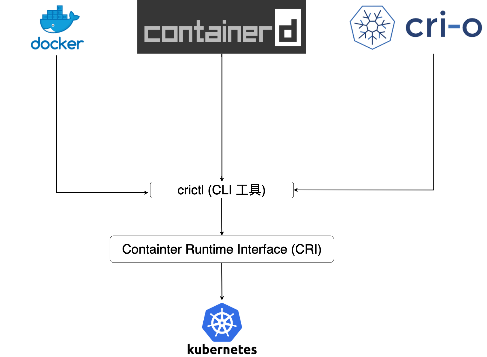

### Master Node
#### etcd
- 用途: 儲存 K8s 叢集的所有資訊 (e.g. nodes, pods, configs, secrets, accounts, roles, bindings 等)
    - 採用 Key-Value 的方式儲存資料
    - `kubectl get xxx` 所取得的資料，都是從 etcd 伺服器中取得
    - 預設使用 2379 port
- etcdctl: 用來管理 etcd 的 CLI 工具
    - `export ETCDCTL_API=3`: 設定 etcdctl 的 API 版本的環境變數 (目前最新為 v3，有些指令會跟 v2 不同)

#### kube-apiserver
- 用途: 提供 K8s API 服務，負責接收來自 Client 的請求，並將請求轉發給其他元件
	- 會先認證使用者的身份，再驗證 API 請求的權限，之後才會執行請求的操作
	- 透過 RESTful API 與工作節點進行交流
	- 預設使用 6443 port
- 功能:
	- 認證使用者
	- 驗證 API 請求
	- 傳遞資料
	- **更新 etcd 資訊**
	- 透過 kubelet 與工作節點進行溝通


#### kube-controller-manager
- 用途: (是一個 process)，會持續監控叢集中個工作節點的狀態，並盡力使叢集維持在預期的狀態
- 在主節點上，kube-controller-manager 會包含許多個 contoller，每個 controller 負責管理不同的控制器
    - Node Controller: 負責管理節點的狀態，採取必要措施以維持叢集正常運行
    - Replication Controller: 負責監控 replicasets 的狀態，並確保在任何時刻下 pods 的數量都符合 replicasets 的設定
    - 其它 controllers
    

#### kube-scheduler
- 用途: 根據各節點的資源狀態，將 pod 排程到適當的節點上
    - kube-scheduler 僅負責決定 pod 要安排到哪個節點上; 而實際將 pod 放置到節點上的工作，是由 kubelet 完成
- 排程過程
    - 根據每個節點的資源狀態，<strong>過濾出符合當前資源要求的節點們</strong>
    - 透過 priority function，計算每個節點的分數，選擇分數最高的節點，優先將 pod 安排到該節點上
    

### Worker Node
#### kubelet
- 用途: 負責管理、監控工作節點內的 pod，以及 pod 中的 container 狀態，並與主節點進行通訊
    - 會定期向主節點回報節點的狀態
- 流程: kube-scheduler -> kube-apiserver -> kubelet -> Docker
    
- kubeadm 預設<strong>不會部署 kubelet</strong>，需要手動安裝並部署 kubelet
    - 下載 kubelet:
        ```bash
        wget https://storage.googleapis.com/kubernetes-release/release/v1.13.0/bin/linux/amd64/kubelet
        ```
        
    - 解壓縮:
        ```bash
        tar -xvf kubelet
        ```
    - 執行 kubelet 服務

#### kube-proxy
- 用途: (是一個 process)，會運行在每個工作節點上，負責維護節點之間的網路通訊，並將流量轉發到正確的 pod 上
    - 透過 iptables 規則，將流量轉發到正確的 pod 上
- e.g. web server 的 pod，透過 kube-proxy 連線到 db server 的 pod
    

#### Pod
- 用途: 是 K8s 中最小的部署單位，可以包含一個或多個 container  (通常會包含一個 container)
    - Kubernetes 會操作 pod，而不是直接操作 container 
    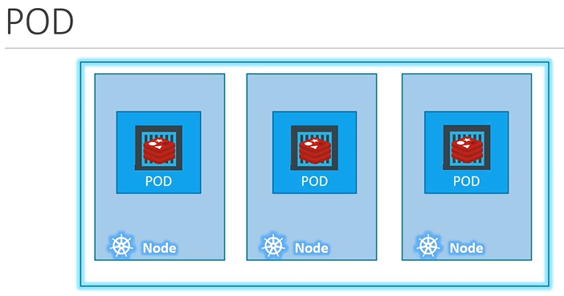
- 向上擴展/向下擴展: 增加/減少 pod 的數量
    - Pod <-> Container : 通常是 1:1 的關係
    - 可透過 Deployment 來管理 pod 的數量
    
    
- multi-containers pods
    - 在某些情境下，我們會建立 helper container(= sidecar container)，來協助主要的 container，例如: 收集 log、監控、資料轉換等 <br>
    
    - 一般而言，我們會透過 Docker 分別建立一個個 container、helper container; 然而在 K8s 中，我們可以將這些 container 放在同一個 pod 中，透過 pod 來管理這些 containers
    
- Pod 的 YAML 格式的 manifest 設定檔
    - 必填欄位
        - apiVersion: K8s API 版本
        - kind: 資源類型 (e.g. Pod)
        - metadata: 資源的名稱、標籤等
        - spec: 資源的規格
    ```yaml
    # pod-definition.yaml
    apiVersion: v1 # String 資料型別
    kind: Pod # String 資料型別
    metadata: # Dictionary 資料型別
        name: myapp-pod
        labels:
            app: myapp
            type: front-end

    spec: # Dictionary 資料型別
        containers: # List/Array 資料型別 (因為 Pod 可以包含多個 container)
            - name: nginx-container
              image: nginx
    ```
- Pod 常用指令
    - `kubectl get pods`: 取得所有 pods 的相關資訊
        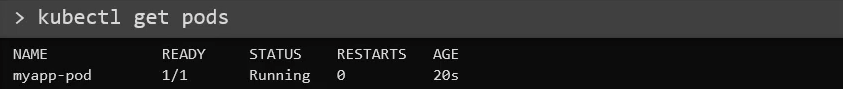
        - `READY`: (在這個 Pod 中)，正在執行的 container 數量/總 container 數量
    - `kubectl describe pod <pod-name>`: 取得指定 pod 的詳細資訊
        
    - `kubetctl create -f <pod-definition.yaml>`: (根據指定的 YAML manifest 設定檔)，建立 pod
    - `kubectl apply -f <pod-definition.yaml>`: (根據指定的 YAML manifest 設定檔)，建立/更新 pod
    - `kubectl delete pod <pod-name>`: 刪除指定的 pod

### ReplicaSet
- 用途: 
    - 為了確保系統的高可用性(high availability)，以避免單一節點故障的問題。當某個 pod 發生故障時，ReplicaSet 會自動重啟 pod，以確保 pod 的數量符合設定的 replicas 數量
        
    - 透過自動擴展機制(scaling)，來調整 pod 的數量，以達到 pods 之間的負載平衡(load balancing)
        
- 運用 template 來定義 pod 的規格
    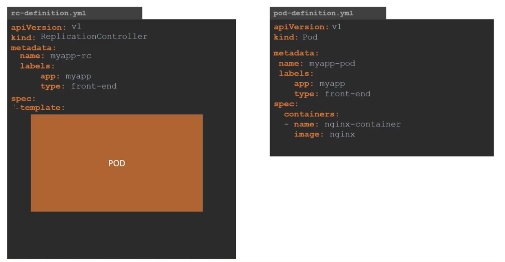
- label & selector
    - **label**: 用來標記 pod 的 metadata，以便於辨識、搜尋、選擇 pod
    - **selector**: 用來選擇要管理的 pod，透過 label 來選擇要管理的 pod
        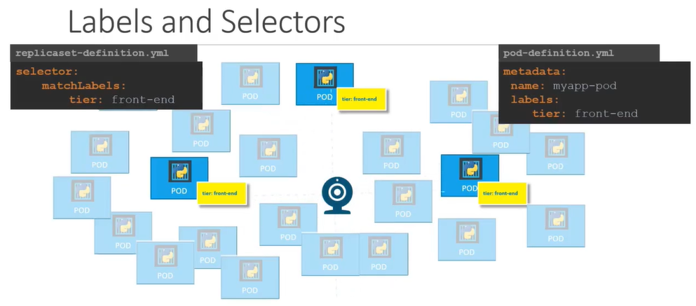
- Replication Controller vs. ReplicaSet
    - **Replication Controller**: 舊版的控制器，僅支援基本的 pod 複製功能
        ```yaml
        # rc-definition.yaml
        apiVersion: v1 # Replication Controller 使用 v1 API 版本
        kind: ReplicationController
        metadata:
            name: myapp-rc
            labels:
                app: myapp
                type: front-end

        spec:
            # 透過 template 定義 pod 的規格
            template:
                metadata:
                name: myapp-pod
                labels:
                    app: myapp
                    type: front-end
                spec:
                    containers:
                    -   name: nginx-container
                        image: nginx

            # 設定 pod 的副本數量
            replicas: 3
        ```
        
    - **ReplicaSet**: 新版的控制器，支援更多的 pod 複製功能，例如: 擴展、縮小、更新 pod 等
        ```yaml
        # replicaset-definition.yaml
        apiVersion: apps/v1 # ReplicaSet 使用 apps/v1 API 版本
        kind: ReplicaSet
        metadata:
            name: myapp-replicaset
            labels:
            app: myapp
            type: front-end
        spec:
            template:
                metadata:
                    name: myapp-pod
                    labels:
                        app: myapp
                        type: front-end
                spec:
                    containers:
                    -   name: nginx-container
                        image: nginx

            replicas: 3
            # 只有 ReplicaSet 能支援 selector 的設定，透過 label 來選擇要管理的 pod
            selector:
                # 過濾器: 選擇要管理的 pod
                matchLabels:
                    # 指定要管理具有哪些 label 的 pod
                    type: front-end
        ```
        
- ReplicaSet 的擴展機制
    - 法一: 完全替換現有的 ReplicaSet，使用新的設定檔中的所有內容
        - 適用情境: 用於完全替換現有資源，以全面更新資源配置時使用 
        ```bash
        kubectl apply -f replicaset-definition.yaml
        ```
    - 法二: 會設置 ReplicaSet 的副本數量，但不會修改其他屬性
        - 適用情境: 根據 YAML 文件指定的副本數量進行縮放
        ```bash
        kubectl scale --replicas=6 -f replicaset-definition.yaml
        ```
    - 法三: 直接在 CLI 中設置指定 ReplicaSet 的副本數量
        - 適用情境: 快速調整副本數量，適合於 CLI 操作
        ```bash
        kubectl scale --replicas=6 replicaset myapp-replicaset
        ```
    
    - 說明:
        - `kubectl scale` 指令不會改變 YAML 設定檔中的內容，僅會改變 ReplicaSet 的設定，進而影響叢集中 pod 的數量 
        - 上述三種方法在 runtime 都會將 pod 的數量擴展到 6 個; 但是背後的意義不同
            - Tips: 皆是對 ReplicaSet 做設定; 而不是對 YAML 設定檔中的 replicas 值做設定

        | CLI 指令 | 執行後 ReplicaSet 的 `replicas` 數量 | YAML 設定檔中的 `replicas` 值 |
        |---|---|---|
        | `kubectl replace -f replicaset-definition.yaml` | 3 | 3 |
        | `kubectl scale --replicas=6 -f replicaset-definition.yaml` | 6 | 3 |
        | `kubectl scale --replicas=6 replicaset myapp-replicaset` | 6 | 3 |

### Deployment
- 用途: (是一個 K8s 物件)，用來管理 ReplicaSet，並提供了更多的功能，例如: 下載/上傳 container image、滾動更新(rolling update)、回滾(rollback)、暫停 pod、恢復執行 pod 等
    - Deployment 會自動建立 ReplicaSet，並透過 ReplicaSet 來管理 Pod 的數量
    
- Deployment 的 YAML 格式的 manifest 設定檔 (**會自動建立 ReplicaSet**)
    ```yaml
    # deployment-definition.yaml
    apiVersion: apps/v1
    kind: Deployment
    metadata:
        name: myapp-deployment
        labels:
            app: myapp
            type: front-end
    
    spec:
        template:
            metadata:
                name: myapp-pod
                labels:
                    app: myapp
                    type: front-end
        spec:
            containers:
            -   name: nginx-container
                image: nginx
    
    replicas: 3
    selector:
        matchLabels:
            type: front-end
    ```
    
- 檢視當前 K8s 中所有的物件
    ```bash
    kubectl get all
    ```
    

### Service
- 用途: (是一個 K8s 物件)，用來將多個 pods 之間能夠互相通訊，有助於微服務架構(micro service)的鬆耦合特性(loose coupling)
- 概念: (假設有個外部使用者，想要存取 pod 的網頁服務)
    - 若我們想存取私有網域中的 pod 時，必須先透過 SSH 連線進入 K8s 叢集中的該工作節點後，再透過 curl 指令來存取 pod 的內網 IP address
        
    - 但是一般來說，我們會希望只要存取 K8s 叢集中的該工作節點的 IP address，而無需透過 SSH 連線進入工作節點內部，來存取 pod 的服務
        - Solution: 這時候我們就可以透過 Service 作為中間的服務，將外部的 client 透過 Service 來存取 pod 的服務
        - 可以把 Service 想像成一個節點內的虛擬伺服器，會擁有自己的 IP address、port，並將流量導向到對應的 pod 服務上
        
- 在正式環境中，通常會是 multiple pods 的情境
    - 單一節點上有多個 pods
        - 這些 pods 都具有相同的 label，nodePort Service 會透過 label 來選擇要管理的 pods，並將外部流量導向到這些 pods 上
            - algorithm: random (預設會使用隨機演算法，來決定將流量導向到哪個 pod 上)
            - sessionAffinity: true (會將同一個 session 的流量導向到同一個 pod 上)
            
    - 多個節點上分別有一個 pod
        - 外部使用者可透過任何一個節點的 IP address，與相同的 nodePort 來存取 pod 的服務，達到高可用性、負載均衡的目的 <br>
            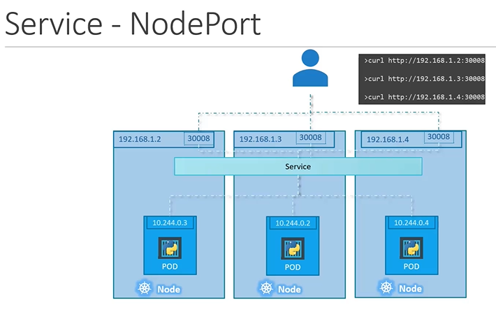
- 三種 Service 類型
    
    - **ClusterIP**: 會建立一個虛擬 IP address 以提供內部的 pod 之間通訊，僅能在叢集內部使用
        - ClusterIP Service 物件，能將一群 pods 視為一個群組，對外提供一個統一的介面來存取該群組中的 pod 服務
        - 預設的 Service 類型
        - 常見使用情境: 多個 frontend pods 透過 ClusterIP 來存取 backend pods
        
            - 因為這些 pod 皆有可能隨時被關閉，因此其 IP address 皆不是固定的，故我們不能依賴這些 IP address 來存取 pod 的服務，要使用 Service 來存取 pod 的服務
        ```bash
        # service-definition.yaml
        apiVersion: v1
        kind: Service
        metadata:
            name: back-end
        
        spec:
            types: ClusterIP
            ports:
                -   targetPort: 80
                    port: 80
        selector:
            app: myapp
            type: back-end
        ```
        
    - **NodePort**: 會在每個節點上開啟一個 port，讓外部的 client 可以透過節點的 IP address 來存取 pod 的服務
        - nodePort 的 port: 預設範圍 30000 ～ 32767
            - 若未指定 port，K8s 會自動分配一個 port
        - port: Service 物件的 port
            - 必填欄位
        - targetPort: pod 服務的 port
            - 若未提供，預設與 Service 物件的 port 相同
        ```bash
        # service-definition.yaml
        apiVersion: v1
        kind: Service
        metadata:
            name: myapp-service
        
        spec:
            types: NodePort # Service 類型
            ports:
            # - 表示為 List/Array 資料型別的第一個元素
            -   targetPort: 80
                port: 80 # 必填欄位
                nodePort: 30008
            # 透過 selector 來選擇要管理的 pod
            selector:
                app: myapp
                type: front-end
        ```
        
        
        - 建立 Service 物件
            ```bash
            kubectl create -f service-definition.yaml
            ```
        - 列出當前所有的 Service 物件
            ```bash
            kubectl get services
            ```
        - 透過 CLI 存取 pod 服務 (而非使用瀏覽器)
            ```bash
            # 存取的是節點 IP address 的 nodePort
            curl http://192.168.1.2:30008
            ```
        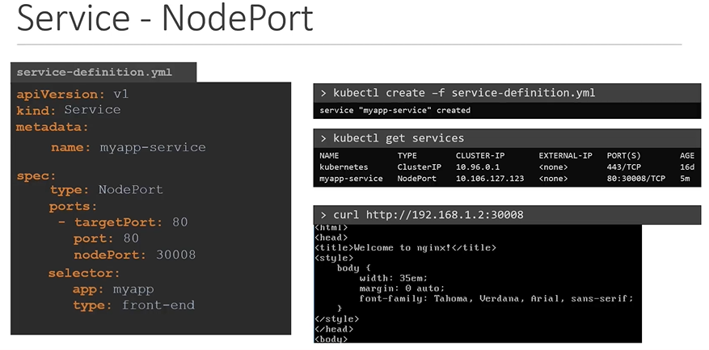
    - **LoadBalancer**: 透過雲端提供商上建立一個 load balancer，並將流量導向到 Service 上
        - 常見使用情境: 在多個前端 pods 的前面，加上一個 load balancer，來平衡流量
        - 在正式環境中，一般而言，外部使用者會想要直接輸入 url 來存取網站，而不是透過 IP address + port 來存取
            
            - 法一: 在 VM 上，手動建立一個 Load Balancer，設定好 port forwarding 規則，後續需要維運
                
            - 法二 (推薦): 使用雲端提供商的 Load Balancer 服務，透過 Service 物件來建立 Load Balancer (e.g. GCP)
                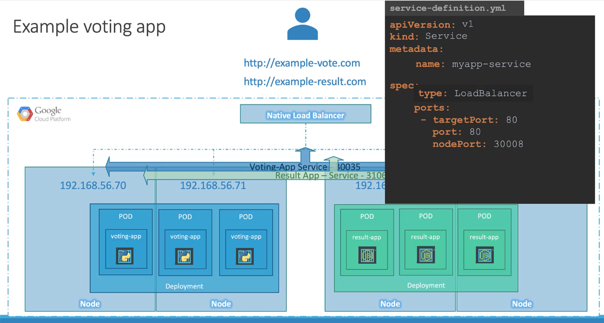

### Namespace
- 用途: 獨立的命名空間可以用來隔離資源 (isolation)，以存放我們平常建立的 Pods, Deployments, Services
- K8s 叢集會預設自動建立以下三個 namespace
    - default: 提供使用者預設使用的命名空間
    - kube-system: 主要是為了維持 K8s 叢集內部運行所需(e.g. networking, DNS service)。也為了避免與使用者建立的物件混淆，同時也能避免使用者誤刪 or 修改這些服務
    - kube-public: 所有使用者皆能使用這個命名空間中的資源
    - 另外，我們也能自己手動建立命名空間，例如: dev, prod
    
- 建立 namespace
    - 法 1: 使用 YAML manifest 設定檔
        ```yaml
        # namespace-dev.yaml
        apiVersion: v1
        kind: Namespace
        metadata:
            name: dev
        ```

        ```bash
        kubectl create -f namespace-dev.yaml
        ```
    - 法 2: 使用 kubectl 指令
        ```bash
        kubectl create namespace dev
        ```
    

- 設定指定的 namespace 中的資源限制: 
    - 建立 **ResourceQuota** YAML manifest 設定檔
        ```yaml
        apiVersion: v1
        kind: ResourceQuota
        metadata:
            name: compute-quota
            # 指定要套用的 namespace
            namespace: dev

        spec:
            hard:
                pods: "10"
                requests.cpu: "4"
                requests.memory: 5Gi
                limits.cpu: "10"
                limits.memory: 10Gi
        ```
    - 套用 ResourceQuota 設定檔
        ```bash
        kubectl create -f compute-quota.yaml
        ```
    
- 在指定的 namespace 中建立 pod
    - 法 1:
        ```bash
        kubectl create -f pod-definition.yaml --namespace=dev
        ```
    - 法 2:
        ```yaml
        # pod-definition.yaml
        apiVersion: v1
        kind: Pod
        metadata:
            name: myapp-pod
            # 指定要套用的 namespace
            namespace: dev
            labels:
                app: myapp
                type: front-end

        spec:
            containers:
            -   name: nginx-container
                image: nginx
        ```
    
- 切換預設的 namespace (`default` namespace -> `dev` namespace)
    ```bash
    kubectl config set-context $(kubectl config current-context) --namespace=dev
    ```
    
- 檢視預設 namespace 中的所有 pods
    ```bash
    kubectl get pods
    ```
    
- 檢視指定的 namespace 中的所有 pods
    ```bash
    kubectl get pods --namespace=kube-system
    ```
- 檢視所有 namespace 中的所有 pods
    ```bash
    kubectl get pods --all-namespaces
    ```
### 宣告式 vs. 命令式
> 在現代的程式碼即基礎設設施 (Infrastructure as Code, IaC) 中，有以下兩種主要的程式碼管理方式

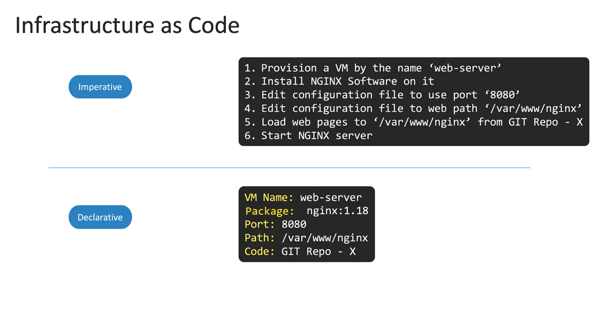

- **宣告式 (Imperative)**: 透過指令，明確地告訴系統要執行的操作
    ```bash
    # 建立物件
    kubectl create -f nginx.yaml
    ```

    ```bash
    # 更新物件 --- 僅對 K8s 叢集中現行物件設定檔 (live object configuration) 做變更
    kubectl edit deployment nginx
    ```

    ```bash
    # 更新物件 --- 對原始設定檔 (object configuration file) 做變更後，再將 "變動的部分" 套用到 K8s 叢集中
    kubectl replace -f nginx.yaml
    ```

    ```bash
    # 更新物件 --- 對原始設定檔 (object configuration file) 做變更，完全刪除原本的物件後，再重新建立新的物件
    kubectl replace --force -f nginx.yaml
    ```

    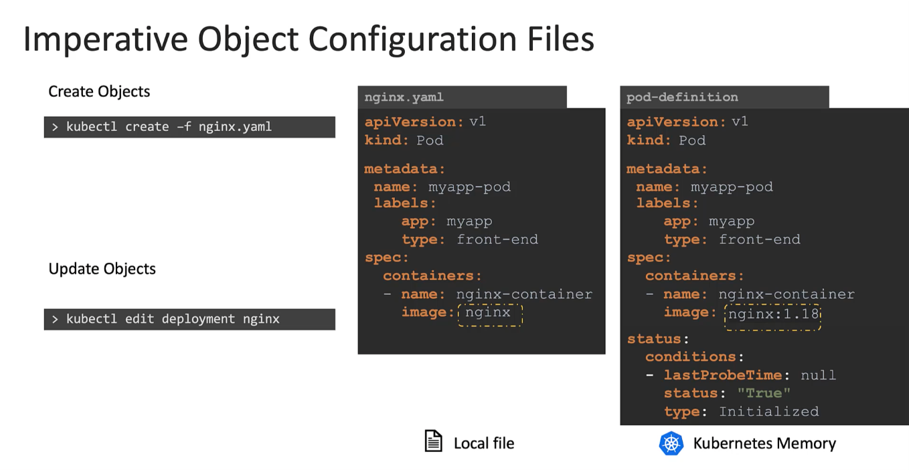
    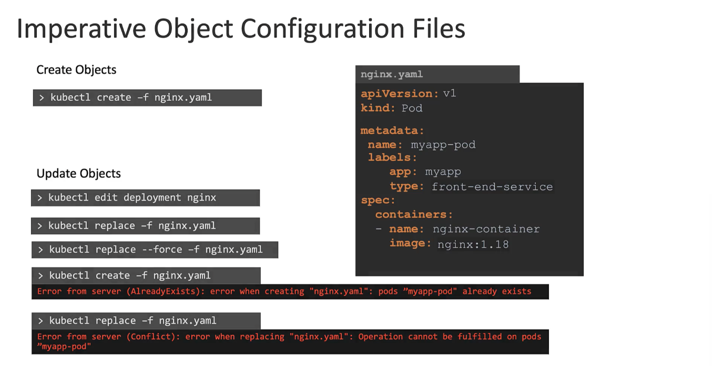

- **命令式 (Declarative)**: 透過 YAML manifest 設定檔來描述系統的期望狀態，系統會根據我們的目標，自動設定系統
    

> 思考: 若建立 pod 到一半，發生系統中斷問題時？

> - 宣告式語法: 需透過許多檢查、除錯指令，才能確定當前的 K8s 叢集狀態，以繼續執行 <br>
> - 命令式語法: 能夠自動比對當前的 K8s 叢集狀態，根據 object configuration file, last-applied-configuration, live object configuration 的 YAML manifest 設定檔，自動調整以符合我們的目標狀態 <br>


- 原始設定檔 (object configuration file): 儲存在本地端
- 上次應用的設定檔 (last-applied-configuration): 會轉換成 JSON 格式，儲存在 K8s 叢集中，用來追蹤物件的上次應用設定
    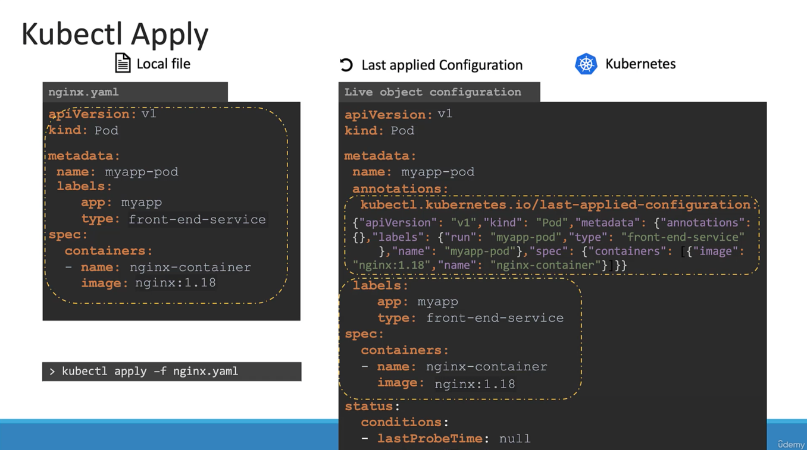
- K8s 叢集中現行物件設定檔 (live object configuration): 儲存在 Kubernetes memory 中，透過 lastProbeTime, status 來追蹤物件的當前狀態

- 參考資料
    - [Kubernetes Object Management](https://kubernetes.io/docs/concepts/overview/working-with-objects/object-management/)
    - [Declarative Management of Kubernetes Objects Using Configuration Files](https://kubernetes.io/docs/tasks/manage-kubernetes-objects/declarative-config/)

## Scheduling
### Manual Scheduling
> 思考: 若我們沒有 kube-scheduler 在我們的 K8s 叢集中，我們該如何將 pod 排程到指定的節點上？

- 設定 nodeName 屬性: 指定 pod 要排程到哪個節點上
    - `nodeName`: 每個 Pod 預設都不會有這個屬性，因為 K8s 叢集的 kube-scheduler 會負責將 pod 排程到適合的節點上
    ```yaml
    # pod-definition.yaml
    apiVersion: v1
    kind: Pod
    metadata:
        name: nginx
        labels:
            name: nginx
    
    spec:
        containers:
        -   name: nginx
            image: nginx
            ports:
            - containerPort: 8080
        # 指定 pod 要排程到哪個節點上
        nodeName: node02
    ```
    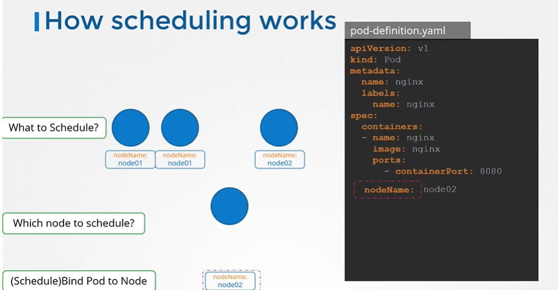
- 假如 <strong>K8s 叢集中沒有 kube-scheduler</strong>，若我們建立一個 Pod 時，卻未設定 nodeName => Pod 會維持在 Pending 狀態
    - **Kubernetes 僅接受建立 Pod 之前，就要先在 YAML manifest 設定檔中指定 nodeName**，而不接受再建立 Pod 後才指定 nodeName
    - 解決方案 1: 建立 Pod 之前，就要先在 YAML manifest 設定檔中指定 nodeName
        
    - 解決方案 2: (若已建立 Pod)，可透過 Binding 物件，將 Pod 排程到指定的節點上
        - 使用 POST 請求，將 request body 以 JSON 格式傳送到 kube-apiserver => 模擬 kube-scheduler 的實際排程 Pod 的行為
            ```yaml
            apiVersion: v1
            kind: Binding
            metadata:
            name: nginx
            target:
            apiVersion: v1
            kind: Node
            name: node02
            ```

            ```yaml
            apiVersion: v1
            kind: Pod
            metadata:
                name: nginx
                labels:
                    name: nginx
            spec:
                containers:
                -   name: nginx
                    image: nginx
                    ports:
                    -   containerPort: 8080
            ```

        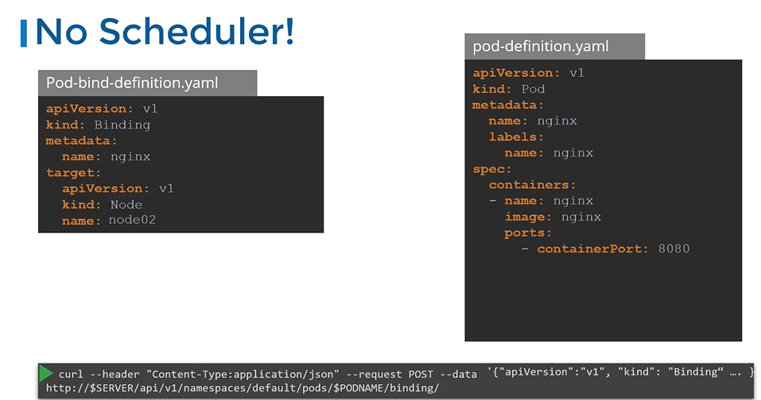

- 在 K8s 叢集中，我們<strong>不能將一個運行中的 Pod 移動到另一個節點上</strong>，因為 Pod 的 IP address 是固定的，且 Pod 的狀態是不可變的
    - 觀念: **本質上，Pod (container) 算是系統上的一個 process，而 process 是不可移動的**
    - 若我們想要將 Pod 移動到另一個節點上，我們必須先刪除 Pod，再重新建立 Pod，並指定 nodeName
    - 法 1: 刪除 Pod，再重新建立 Pod
        ```bash
        kubectl delete pod nginx
        kubectl create -f pod-definition.yaml
        ```
    - 法 2: **強制替換 Pod**
        ```bash
        kubectl replace --force -f pod-definition.yaml
        ```

### Labels & Selectors & Annotations
- 在 K8s 叢集中，有許多資源/物件，我們可以透過 labels, selectors 來對過濾、分群這些資源/物件，以進行管理。例如採用以下方式做分類
    - 根據<strong>資源類型</strong>做分類
        
    - 根據<strong>應用程式類型</strong>做分類
        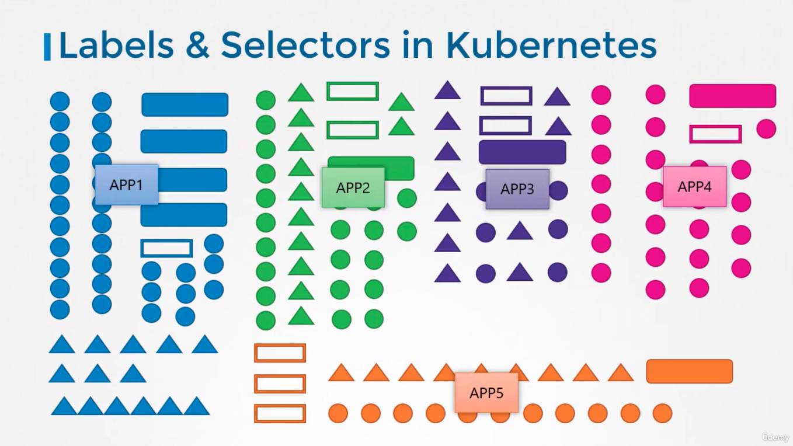
    - 根據<strong>功能</strong>做分類
        
- 標籤 (labels): 會附加在 K8s 資源/物件上的 key-value pair，用來識別、分類
    - 建立 labels
        ```yaml
        apiVersion: v1
        kind: Pod
        metadata:
            name: simple-webapp
            # 建立 labels
            labels:
                app: App1
                function: Front-end

        spec:
            containers:
            -   name: simple-webapp
                image: simple-webapp
                ports:
                - containerPort: 8080
        ```
    
    
- 選擇器 (selectors): 針對 labels，來選擇要管理的資源/物件
    - 使用 selectors
        ```bash
        kubectl get pods --selector app=App1
        ```
    
- 註解 (annotations): 可附加在 K8s 資源/物件上的 key-value pair，**用來提供/記錄額外的資訊，通常不涉及資源/物件的選擇, 過濾**
    ```yaml
    # replicaset-definition.yaml
    apiVersion: apps/v1
    kind: ReplicaSet
    metadata:
        name: simple-webapp
        labels:
            app: App1
            function: Front-end
        # 建立 annotations
        annotations:
            buildversion: 1.34

    spec:
        replicas: 3
        selector:
            matchLabels:
                app: App1
    template:
        metadata:
            labels:
                app: App1
                function: Front-end
    spec:
        containers:
        -   name: simple-webapp
            image: simple-webapp   
    ```
    
- 對<strong>所有 K8s 叢集中的資源/物件</strong>，使用 labels 做分類
    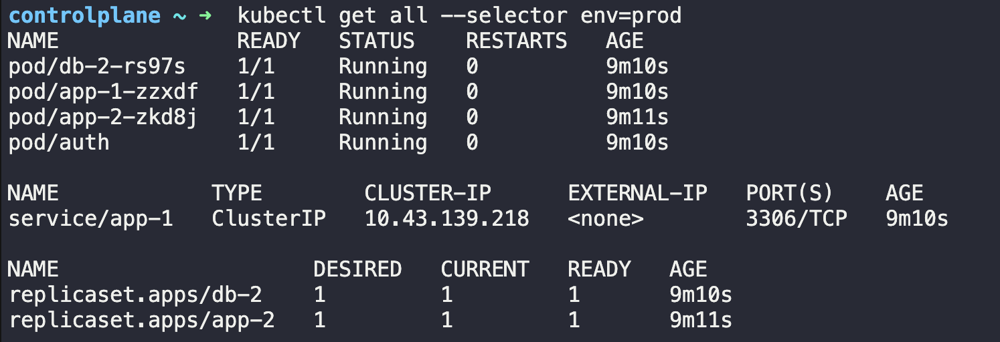
- 對所有 K8s 叢集中的資源/物件，使用<strong>多個 labels 做分類</strong>
    
- labels & selectors 應用
    - ReplicaSet
        ```yaml
        apiVersion: apps/v1
        kind: ReplicaSet
        # ReplicaSet 的 metadata
        metadata:
            name: simple-webapp
            # 建立 labels
            labels:
                app: App1
                function: Front-end

        spec:
            replicas: 3
            # 使用 selectors 來選擇要管理的物件
            selector:
                matchLabels:
                    app: App1
            template:
                # Pod 的 metadata (較重要)
                metadata:
                        app: App1
                    labels:
                        function: Front-end
            spec:
                containers:
                -   name: simple-webapp
                    image: simple-webapp
        ```

        
    - Service
        ```yaml
        apiVersion: v1
        kind: Service
        metadata:
            name: my-service

        spec:
            # 使用 selectors 來選擇要管理的物件
        selector:
                app: App1
            ports:
            -   protocol: TCP
                port: 80
                targetPort: 9376 
        ```

        

### Taints & Tolerations
- 為了<strong>限制 Node 接受某些 Pod 的排程</strong>，並讓可以 tolerate 特定 taint 的 Pod 被排程到該 Node 上
    - 注意! taints & tolerations 並不會告訴 Pod 去特定的 Node 上，而是<strong>告訴 taint Node 僅能接受具有特定 tolerations 的 Pod</strong>
    - taints & tolerations 與安全性或入侵無關，僅是用來限制 Pod 的排程
    
- taints (污點)
    - 設定於 **Node** 上
    - 功能: 可以設定當不能 tolerate 的 Pod 被排程到該 Node 上時，該如何處理？
        - NoSchedule: 表示新 Pod 不會被排程到這個節點上，除非這些 Pod 有相應的 toleration
            - 用途: 用於<strong>強制性地避免</strong> Pod 被排程到特定節點上
        - PreferNoSchedule: 表示 Kubernetes 會盡量避免將 Pod 排程到這個節點上，但這<strong>不是強制的</strong>。若沒有其他合適的節點，Pod 仍然可能會被排程到這個節點上
            - 用途: 用於軟性地避免 Pod 調度到特定節點上，但在資源不足或其他情況下允許例外
        - NoExecute: 表示不僅新 Pod 無法被調度到這個節點上，**已經在這個節點上的 Pod 也會被驅逐 (除非這些 Pod 有相應的 toleration)**
            - 用途: 用於在節點狀態改變或需要進行維護時，驅逐不符合條件的 Pod
    - 設定 taints
        ```bash
        kubectl taint nodes node1 app=blue:NoSchedule
        ```

    

    - 去除 taints
        ```bash
        kubectl taint nodes node1 app=blue:NoSchedule-
        ```

- tolerations (容忍)
    - 預設所有 Pod 都不會有 tolerations
    - 功能: 設定於 **Pod** 上，概念上如同 taints，只是要寫在 Pod 的 YAML manifest 設定檔中
    - 設定 tolerations
        ```yaml
        # pod-definition.yaml
        apiVersion: v1
        kind: Pod
        metadata:
            name: myapp-pod
        
        spec:
            containers:
            -   name: nginx-container
                image: nginx

            # 設定 tolerations，以 key-value pair 表示，其中 value 需加上雙引號 " "
            tolerations:
            -   key: "app"
                operator: "Equal"
                value: "blue"
                effect: "NoSchedule"
        ```

    

- 為什麼 K8s 叢集的 master node 不會被排程 Pod？
    - 因為在 K8s 叢集初始化時，**master node 會自動被設定 taints (預設為 NoSchedule)**，且 Pod 未設定 tolerations
        ```bash
        kubectl describe node kubemaster | grep Taint
        ```

        

### Node Selectors
- 用途: 用來限制 Pod 被排程到指定的 Node 上

> 情境: 假設有三個 Node (node-1, node-2, node-3)，根據其資源配置分別為 large, medium, small，並分別為其設定 labels


- 步驟 1: 分別為 Pod 設定 labels
    ```bash
    kubectl label nodes node-1 size=large
    kubectl label nodes node-2 size=medium
    kubectl label nodes node-3 size=small
    ```
    
- 步驟 2: 建立 Pod 的 YAML manifest 設定檔，並設定 nodeSelector
    ```yaml
    # pod-definition.yaml
    apiVersion: v1
    kind: Pod
    metadata:
        name: myapp-pod

    spec:
        containers:
        -   name: data-processor
            image: data-processor
        # 根據指定的 label，設定 nodeSelector，以限制 Pod 被排程到指定的 Node 上
        nodeSelector:
            size: Large
    ```
    
- 步驟 3: 建立 Pod
    ```bash
    kubectl create -f pod-definition.yaml
    ```
- nodeSelector 的限制
    - 僅能使用等於 (Equal) 運算子
    - 若遇到更複雜的需求，就必須使用 Node Affinity 來解決 => e.g. Large or Medium, NOT Small
    


### Node Affinity
- 用途: 確保 Pod 能被排程到指定的 Node 上，以符合特定的需求
- 設定 nodeAffinity
    ```yaml
    # pod-definition.yaml
    apiVersion: v1
    kind: Pod
    metadata:
        name: myapp-pod
    
    spec:
        containers:
        -   name: data-processor
            image: data-processor
        # 設定 nodeAffinity
        affinity:
            nodeAffinity:
                requiredDuringSchedulingIgnoredDuringExecution:
                    nodeSelectorTerms:
                    # 可支援更複雜的需求 (表達式)
                    -   matchExpressions:
                        -   key: size
                            # 運算子需使用 Pascal Case
                            operator: In
                            values: 
                            -   Large
                            -   Medium
    ```

    ```yaml
    apiVersion: v1
    kind: Pod
    metadata:
        name: myapp-pod
    
    spec:
        containers:
        -   name: data-processor
            image: data-processor
        # 設定 nodeAffinity
        affinity:
            nodeAffinity:
                requiredDuringSchedulingIgnoredDuringExecution:
                    nodeSelectorTerms:
                    # 可支援更複雜的需求 (表達式)
                    -   matchExpressions:
                        -   key: size
                            # 運算子需使用 Pascal Case
                            operator: NotIn
                            values: 
                            -   Small
    ```

    ```yaml
    apiVersion: v1
    kind: Pod
    metadata:
    name: myapp-pod
    
    spec:
        containers:
        -   name: data-processor
            image: data-processor
    
        # 設定 nodeAffinity
        affinity:
            nodeAffinity:
                requiredDuringSchedulingIgnoredDuringExecution:
                    nodeSelectorTerms:
                        # 可支援更複雜的需求 (表達式)
                        -   matchExpressions:
                            -   key: size
                                # 可使用 Exists 運算子
                                operator: Exists
    ```

- nodeAffinity 的類型
    - 目前已可用的
        - Type 1 `requiredDuringSchedulingIgnoredDuringExecution`: 這是強制性的 Node Affinity。<strong>kube-scheduler 只會將 Pod 排程到滿足所有指定 Node Affinity 條件的節點上</strong>。若沒有滿足條件的節點，Pod 就無法被排程
        - Type 2 `preferredDuringSchedulingIgnoredDuringExecution`: 這是有彈性的 Node Affinity。<strong>kube-scheduler 會盡量將 Pod 排程到滿足條件的節點上</strong>。但如果沒有符合條件的節點，Pod 仍然可以被排程到其他節點
        

    - 未來正在規劃中的
        - Type 3 `requiredDuringSchedulingRequiredDuringExecution`: 這是一個計劃中的功能，目前尚未實現。kube-scheduler <strong>只會</strong>將 Pod 排程到符合條件的節點上。<strong>而在 Pod 運行期間，若節點不再符合條件，Pod 會被驅逐</strong>
        - Type 4 `preferredDuringSchedulingRequiredDuringExecution`: 這是一個計劃中的功能，目前尚未實現。kube-scheduler 會<strong>盡量</strong>將 Pod 排程到符合條件的節點上。<strong>而在 Pod 運行期間，如果節點不再符合條件，Pod 會被驅逐</strong>
        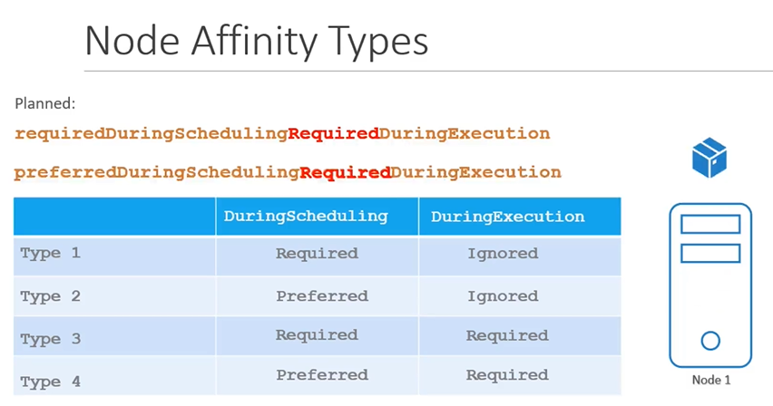

- 參考資料
    - [Schedule a Pod using required node affinity](https://kubernetes.io/docs/tasks/configure-pod-container/assign-pods-nodes-using-node-affinity/#schedule-a-pod-using-required-node-affinity) 
    - [Node affinity](https://kubernetes.io/docs/concepts/scheduling-eviction/assign-pod-node/#node-affinity)

### 結合 Taints & Tolerations & Node Affinity
> 情境: 假設有五個 Node (Blue, Red, Green, Gray, Gray)，並且有五個 Pods (blue, red, green, gray, gray)。<br>
> 我們希望將 blue Pod 排程到 Blue Node 上，red Pod 排程到 Red Node 上，green Pod 排程到 Green Node 上，gray Pod 排程到 Gray Node 上。<br>
> 也就是說，在每個顏色的 Node 上，僅能排程對應顏色的 Pod。<br>


- Taints & Tolerations: **無法確保 Pod 僅會被排程到指定的 Node 上**，僅能限制不具備指定 tolerations 的 Pod 不會被排程到指定 taints 的 Node 上 (因此仍然可能會發生非預期的錯誤結果)
    - 設定 Node 的 taints
        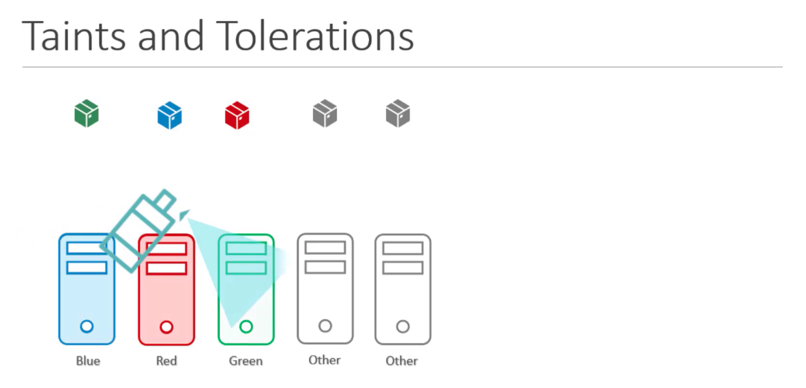
    - 設定 Pod 的 tolerations
        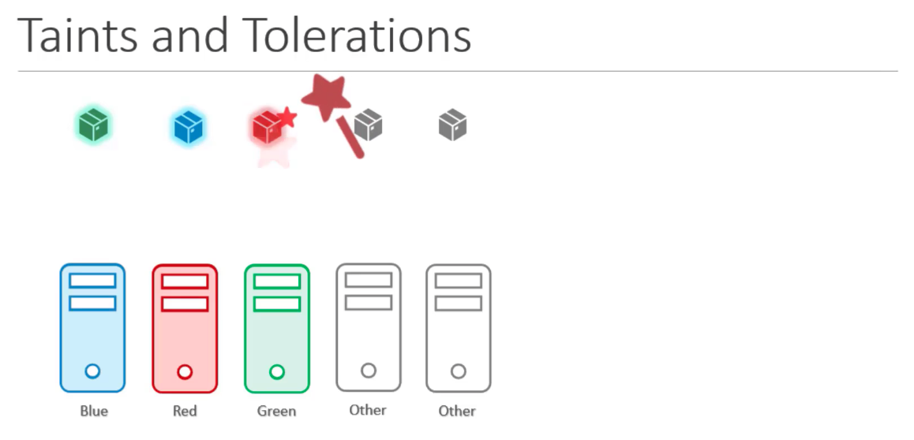
    - 結果 (仍然可能會發生 Pod 排程到錯誤的 Node 上 => 非預期結果)
        
- Node Selectors: 僅能限制指定的 Pod 會被排程到指定的 Node 上，但無法限制其他 Pod 也被排程到指定的 Node 上
    
    - 結果 (仍然可能會發生 Pod 排程到錯誤的 Node 上 => 非預期結果)
        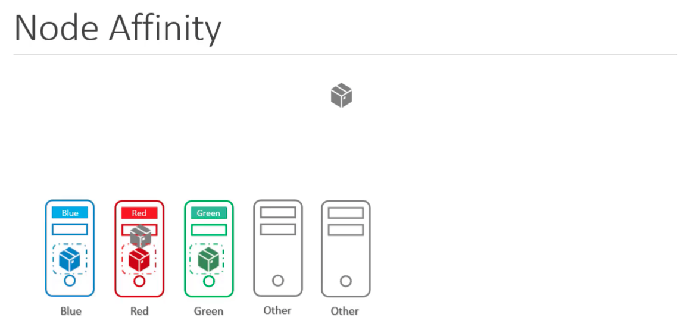
- 正確解法: 使用 Taints & Tolerations 防止其它 Pod 放到錯誤的 Node 上。再使用 Node Affinity 防止 Pod 放到錯誤的 Node 上
    - 結果 (Pod 會被正確地排程到指定的 Node 上)
        

### Resource requests & limits
- 用途: 用來限制 Pod 使用的 CPU 和 memory 資源
    - 資源類型
        - CPU: 以 CPU 單位 (**vCPU**) 來表示
            - 最佳實踐: 設定 CPU requests 就好
            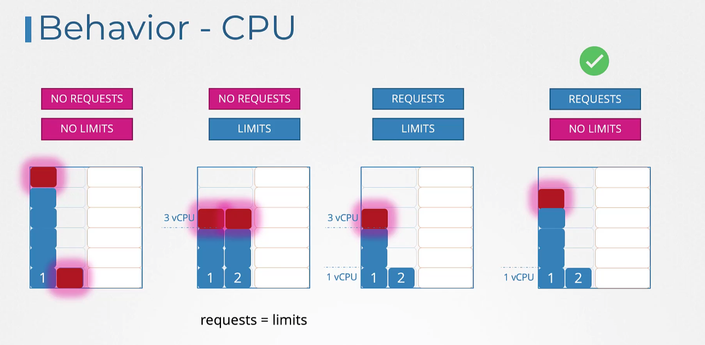
        - Memory: 以 memory 單位 (**MiB**) 來表示
    - 資源請求與限制
        - **requests**: 代表容器正常運行時，**所需的最低資源下限**
            - K8s 預設每個 Pod 的 resource requests: CPU = 0.5 vCPU, memory = 256 MiB
            
        - **limits**: 代表容器運行過程中，**能使用的最多資源上限**
            - K8s 預設每個 Pod 的 resource limits: CPU = 1 vCPU, memory = 512 MiB
            

         <br>
        [圖片出處](https://www.densify.com/kubernetes-autoscaling/kubernetes-resource-quota/)

        ```yaml
        # pod-definition.yaml
        apiVersion: v1
        kind: Pod
        metadata:
            name: simple-webapp-color
            labels:
                name: simple-webapp-color
        
        spec:
            containers:
            -   name: simple-webapp-color
                image: simple-webapp-color
                
                ports:
                -   containerPort:  8080

                # 設定 resource requests & limits
                resources:
                    requests:
                        memory: "1Gi"
                        cpu: "1"
                    limits:
                        memory: "2Gi"
                        cpu: "2"
        ```

- 設定 Resource LimitRange: 幫助我們<strong>定義每個 Pod 的預設資源請求與限制</strong>
    - 會套用在未來建立的 Pod 上，但不會套用於正在執行中的 Pod 上

    ```yaml
    # limit-range-cpu.yaml
    apiVersion: v1
    kind: LimitRange
    metadata:
        name: cpu-resource-constraint

    spec:
        limits:
        -  default: # limit
                cpu: 500m # 0.5 vCPU
            defaultRequest: # request
                cpu: 500m # 0.5 vCPU
            max: # limit
                cpu: 1 # 1 vCPU
            min: # request
                cpu: 100m # 0.1 vCPU
            type: Container
    ```

    ```yaml
    # limit-range-memory.yaml
    apiVersion: v1
    kind: LimitRange
    metadata:
        name: memory-resource-constraint
    
    spec:
        limits:
        -   default: # limit
                memory: 1Gi # 1 GiB
            defaultRequest: # request
                memory: 1Gi # 1 GiB
            max: # limit
                memory: 1Gi # 1 GiB
            min: # request
                memory: 500Mi # 500 MiB
            type: Container
    ```

- 設定 Resource Quota: 用來<strong>設定整個 Namespace 的資源請求與限制</strong>
    ```yaml
    # resource-quota.yaml
    apiVersion: v1
    kind: ResourceQuota
    metadata:
        name: my-resource-quota
    
    spec:
        hard:
            pods: "10"
            requests.cpu: "4"
            requests.memory: 4Gi
            limits.cpu: "10"
            limits.memory: 10Gi
    ```

    
    

- 當超過 resource limits 的限制時
    - **CPU**: 會被限制在指定的 CPU 數量上，**超過的部分會被暫停 (throttle)**
        - Pod 會顯示處於 Pending 狀態，因為 kube-scheduler 找不到具有足夠 CPU 來排程
        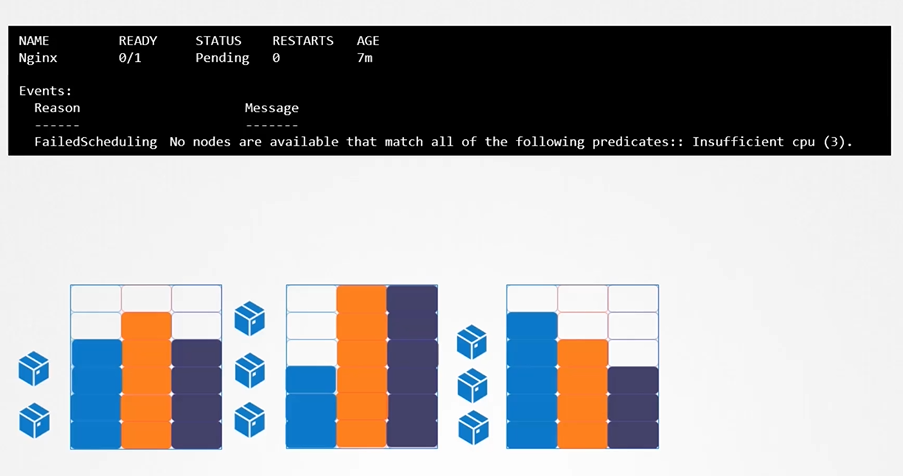
    - **Memory**: 會被限制在指定的 memory 上，**超過的部分會被刪除 (terminate)**
        - 因為我們無法節流 (throttle) memory，因此當超過 memory limits 時，僅能透過刪除 Pod 來釋放 memory
        - 會拋出 **OOM 錯誤 (Out Of Memory)**
        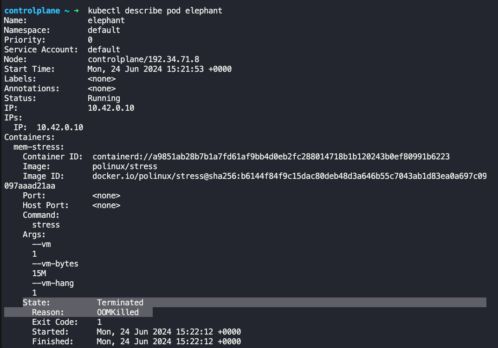

### DaemonSet
- 用途: 類似 ReplicaSet，能幫助我們在各個 Node 上部署多個相同的 Pod 副本。但是 DaemonSet 僅會在各個 Node 上運行一個 Pod 副本
    - 當有新的 Node 加入 K8s 叢集時，DaemonSet 會自動在新的 Node 上部署一個 Pod 副本
    - 當有 Node 從 K8s 叢集中移除時，DaemonSet 會自動刪除該 Node 上的 Pod 副本
    
- 常見應用情境: **Monitoring solution, Logs viewer**, kube-proxy, Networking solution
    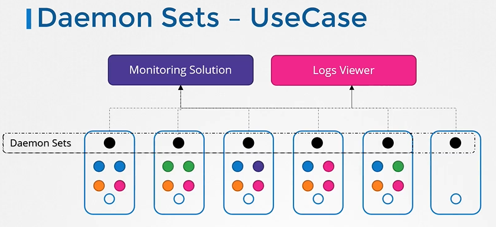
    
    
- 建立 DaemonSet
    - 類似於 ReplicaSet 的 YAML manifest 設定檔，但是 kind 要改成 DaemonSet
    ```yaml
    # daemonset-definition.yaml
    apiVersion: apps/v1
    kind: DaemonSet
    metadata:
        name: monitoring-daemon
        labels:
            app: nginx
    
    spec:
        selector:
            matchLabels:
                app: monitoring-agent
        template:
            metadata:
                labels:
                    app: monitoring-agent
        spec:
            containers:
            -   name: monitoring-agent
                image: monitoring-agent
    ```

    ```bash
    kubectl create -f daemonset-definition.yaml
    ```

- 檢視在所有的 Namespace 中，目前所有的 DaemonSet
    ```bash
    kubectl get daemonsets -A
    ```
- 詳細檢視指定 DaemonSet 的資訊
    ```bash
    kubectl describe daemonsets monitoring-daemon
    ```

    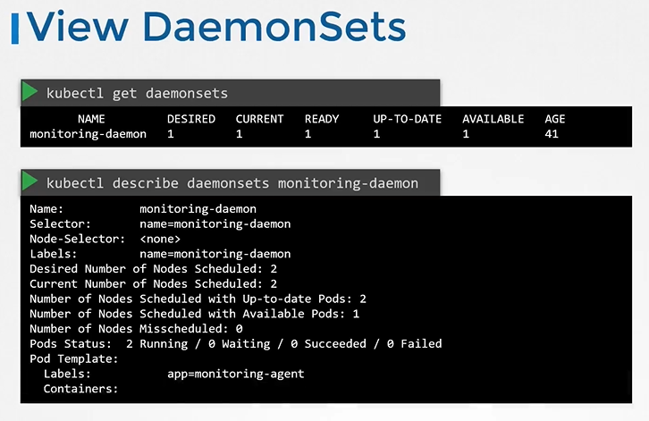

- DaemonSet 是如何將 Pod 分別排程到各個 Node 上的？
    - 在 K8s v1.12 之前: 使用 nodeSelector
    - 在 K8s v1.12 之後: 使用 Node Affinity, default kube-scheduler
    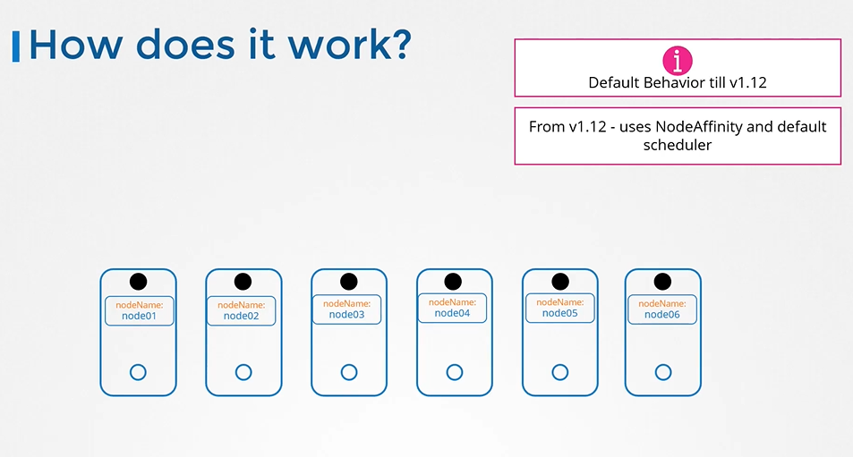

### Static Pods
- 假設沒有 K8s 叢集，也沒有 Master Node，也沒有 kube-apiserver。那麼 Worker Node 會如何運作？
    - Ans: kubelet 會透過預設在 `/etc/kubernetes/manifests` 目錄下的 YAML manifest 設定檔，來建立 Static Pods
        - 法 1: 透過 CLI 的 `--pod-manifest-path` 選項，通知 kubelet 建立 Static Pods
            
        - 法 2: 編輯 kubeconfig.yaml 設定檔，加入 `staticPodPath: /etc/kubernetes/manifests` 設定，通知 kubelet 建立 Static Pods
            
    - 這時候，若要檢視當前有哪些 Static Pods，因為我們沒有一個完整的 K8s 叢集，因此只能透過 Docker 指令來查看
        ```bash
        docker ps
        ```

        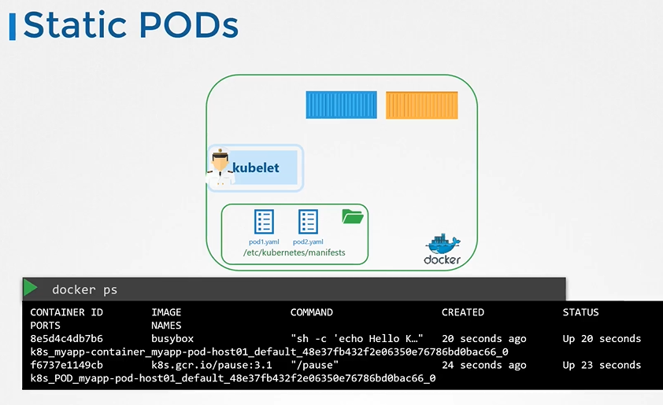

- kubelet 可以透過以下兩種方式，建立 Pod (兩種 Pods 都可以經由 `kubectl get pods` 查看)
    - 由 **kube-apiserver** 運用 HTTP request，通知 kubelet 建立 **Pod**
    - kubelet 根據 `/etc/kubernetes/manifests` 目錄下的 YAML manifest 設定檔，建立 **Static Pods**
        - 其實，當建立 Static Pod 時，也會在 kube-apiserver 建立一個 read-only mirror object。因此，如果要編輯這個 Static Pod，還是必須到 Worker Node 的 `/etc/kubernetes/manifests` 目錄下編輯 YAML manifest 設定檔
        

- Static Pod 的應用情境
    - kubeadm 設定 K8s 叢集的方式: 因為 Static Pod 不需要依賴 K8s 叢集的特性，因此可在各節點上，透過 kubelet 建立 Static Pod，來運行各種系統服務 (e.g. controller-manager, apiserver, etcd, scheduler)。並且 kubelet 會自動管理這些系統服務，確保其持續運行
    
    

- 檢視所有 Namespace 中有幾個 Static Pods
    - 查看 **Pod name 的後綴，會帶有 Node name** 的就是 Static Pods
        
    - 檢視 Static Pods 的詳細資訊: **ownerReferences.kind = Node**
        
- Static Pod 的 YAML manifest 設定檔會存放在哪？
    - 步驟 1: 檢視 kubelet 的 `/var/lib/kubelet/config.yaml` 設定檔內容，確認 **staticPodPath: /etc/kubernetes/manifests** 的路徑位置
        - 預設會放在 Node 上的 `/etc/kubernetes/manifests` 目錄下
    - 步驟 2: 到 staticPodPath 確認當前 kubelet 有哪些關於 Static Pod 的設定檔
        
- Static Pods vs. DaemonSets
    

### Multiple Schedulers
- 用途: 可以在 K8s 叢集中，同時部署多個 scheduler
    
- 手動建立一個自定義的 scheduler
    - 法 1: 透過 scheduler 的 binary 檔，建立 scheduler
        - 下載 scheduler 的 binary 檔
            ```bash
            wget https://storage.googleapis.com/kubernetes-release/release/v1.12.0/bin/linux/amd64/kube-scheduler
            ```
        - 指定 scheduler 名稱，以及 scheduler 的 YAML manifest 設定檔
            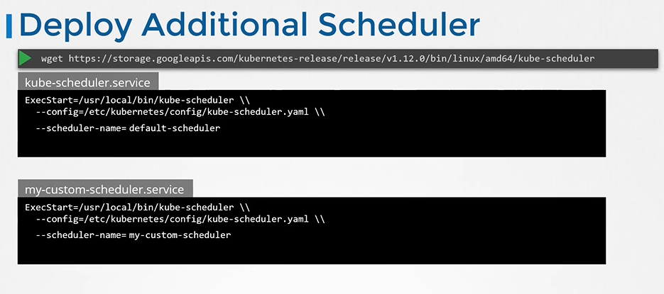
    - 法 2: 將 scheduler 視為一個 Pod，先建立 scheduler-config 檔後，再宣告 `--config` 選項來指定 scheduler 的 YAML manifest 設定檔的路徑
        - `leaderElect`: true 表示這個 scheduler 會選舉一個 leader，並且只有 leader 才會執行任務 (因為在 K8s 叢集中，一次只能有一個 scheduler 處於 active 狀態，以避免排程演算法的決策衝突問題)
            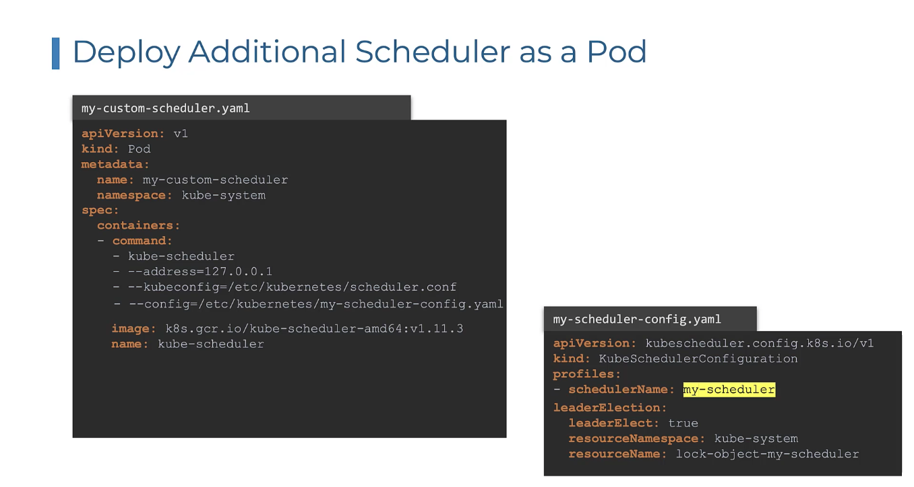
        - 建立 scheduler Pod
            ```bash
            kubectl create -f my-custom-scheduler.yaml
            ```
- 檢視指定 Namespace 中的所有 Scheduler Pods
    ```bash
    kubectl get pods -n kube-system
    ```
- 運用剛剛建立的 scheduler，建立一個 Pod: 設定 `schedulerName` 參數值
    ```yaml
    apiVersion: v1
    kind: Pod
    metadata:
        name: nginx
    
    spec:
        containers:
        -   image: nginx
            name: nginx
        # 指定使用自定義的 scheduler
        schedulerName: my-custom-scheduler
    ```

    

- 如何查詢哪個 scheduler 負責排程哪些 Pods？
    ```bash
    kubectl get events -o=wide
    ```

    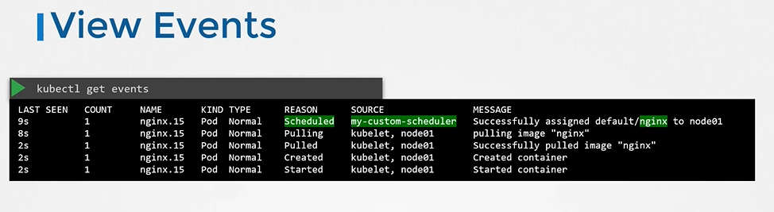

- 如何查詢 scheduler 的排程記錄 log？
    ```bash
    kubectl logs my-custom-scheduler -n=kube-system
    ```

    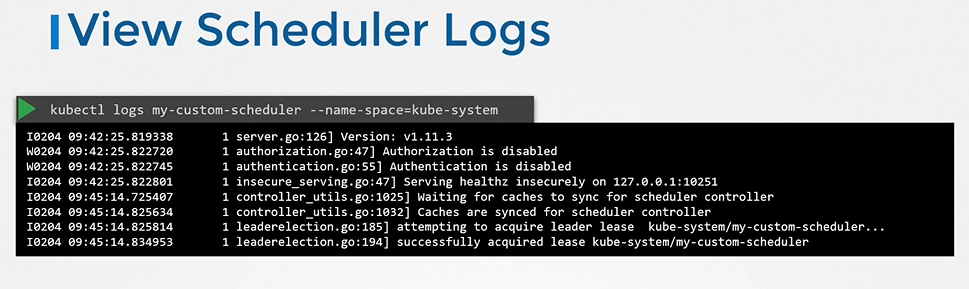

### Configuring Scheduler Profiles
- 每個 scheduler 都會具備以下幾個擴展點 (extension points)，能透過加入插件 (plugin) 的方式，來擴展 scheduler 的功能
    - 擴展點 (extension points): 表示<strong>排程過程中的特定階段</strong>，這些階段能允許使用者插入自定義插件邏輯，以修改 or 擴展 scheduler 的行為
    - 插件 (plugins): 附加在<strong>scheduler 的擴展點上，用來自定義 or 擴展 scheduler 的行為</strong>
    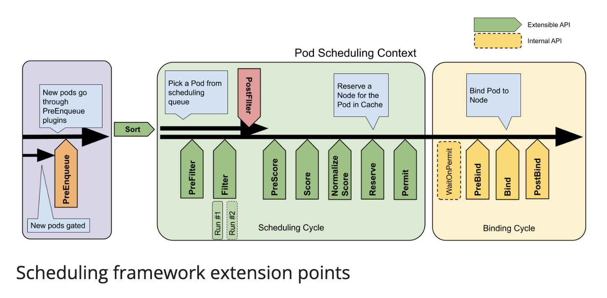
    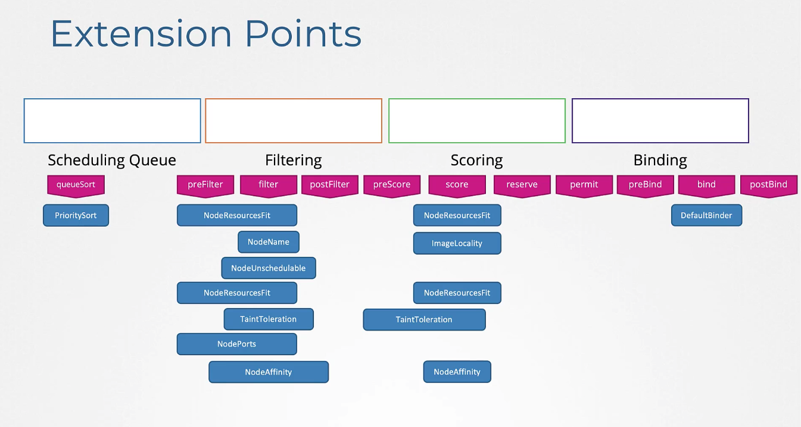
- 從 K8s v.1.18 以後，能透過 **KubeSchedulerConfiguration** 物件，在同一份 scheduler 設定檔中，設定多個 scheduler profiles
    - `profiles`: 能指定多個 schedulerName，以設定多個 scheduler profiles
        - `plugins`: 可分別設定各個 scheduler 的 plugins 內容
    


## 考試資訊
- 考試內容
    - 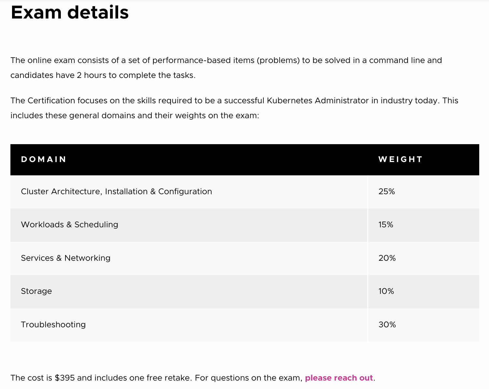
- 考試時間: 2 小時
- 考試類型: 遠端監考
- 考試期間: 可以查看 K8s 官方文件的指令
- 價格: 395 美金
    - 20% 折扣碼: `20KODE`
- 一年內可以免費重考一次
- 證照有效期限: 3 年
- 考試前需先通過 [PSI Online Proctoring System Check](https://syscheck.bridge.psiexams.com/) 檢驗，確認線上考試環境已符合考試需求
- 參考資料
	- [CNCF-CKA 報名考試](https://www.cncf.io/training/certification/cka/)
	- [CNCF-CKA 考試要求](https://docs.linuxfoundation.org/tc-docs/certification/tips-cka-and-ckad)

## 考試技巧
- 根據 CLI 上的指令與選項，快速建立 YAML 範本: 
    - `--image`: 指定 container image
    - `--dry-run=client`: 告訴 kubectl 執行命令，但不會實際建立 Pod，只是模擬執行
    - `-o=yaml`: 指定輸出格式為 YAML
    - `> filename.yaml`: 將執行結果輸出 & 儲存到指定檔案，以便後續使用
    ```bash
    kubectl run nginx --image=nginx --dry-run=client -o=yaml > nginx-pod.yaml
    ```
    - 參考資料: [kubectl Usage Conventions](https://kubernetes.io/docs/reference/kubectl/conventions/)
- 考試時，建議使用宣告式語法來操作 K8s 物件
    
- `--watch`: 實時監控 K8s 叢集狀態
    ```bash
    kubectl get pods --watch
    ```
- `wc -l`: 計算指定檔案中的行數
    - wc = word count

    ```bash
    kubectl get pods --selector env=dev --no-headers | wc -l
    ```

    
-- `--command`: 用於指定容器的指令
    - Tips: `--command` 後面接的是對於容器的指令，因此習慣上我們會把 `--command` 放在最後面才宣告
    ```bash
    kubectl run static-busybox --image=busybox --dry-run=client -o=yaml --command -- sleep 1000
    ```


## 學習資源
- [Kubernetes 官方文件](https://kubernetes.io/docs/home/)
- [GitHub: KodeKloud CKA learning notes](https://github.com/kodekloudhub/certified-kubernetes-administrator-course?tab=readme-ov-file)
- [KodeKloud 線上模擬練習環境](https://uklabs.kodekloud.com/courses/labs-certified-kubernetes-administrator-with-practice-tests/)
