# 資料結構 & 演算法
- 本篇是參考 Geeks for Geeks 網站的 DSA Tutorial 所整理的學習筆記
- 以 Java 程式語言為主

[TOC]
## 總覽


- 學習 DSA 的五個步驟
    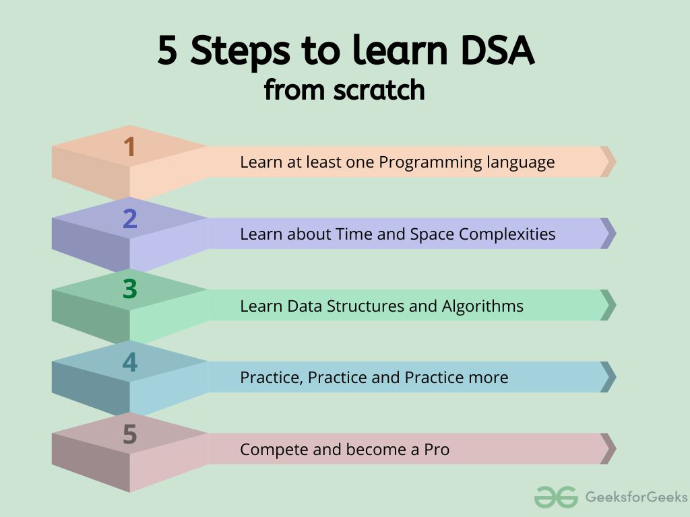

## 術語表
### 專業術語定義
- 宣告 (declaration): 告訴編譯器，存在該變數 or 物件
- 初始化 (initialization): 為變數賦予初始值
    - 原生型別: 賦予初始值
    - 物件: 透過建構子，賦予初始值，並分配記憶體空間

### 基本操作的術語
- 存取 (access): 取得資料結構中的元素
- 遍歷 (traversal): 訪問資料結構中的每個元素

## 資料結構
- 定義: 幫助在電腦記憶體中有效組織和儲存資料
- 功能: 提供了一種有效管理和操作資料的方法，以實現更快的存取、插入、刪除操作
- 目的: 設計高效演算法和最佳化軟體效能的基礎

### 陣列(Array) & ArrayList
- Array vs. ArrayList

| Features\資料型別               |        Array        |                  ArrayList                  |
| ------------------------------- | :-----------------: | :-----------------------------------------: |
| 長度                            |        固定         |                    變動                     |
| 記憶體分配                      |        連續         |                   不連續                    |
| 元素的資料型別                  | 原生資料型別 & 物件 |                    物件                     |
| 操作元素                        |   使用 `[ ]` 運算子   | 使用 `add()`, `set()`, `remove()` ...等方法 |
| 執行速度                        |        較快         |                    較慢                     |
| 資料型别安全<br />(thread-safe) |        不是         |                     是                      |
| 維度                           |     一維 ～ 多維     |                   一維                     |

#### Array
- 基本概念
    - 在記憶體中連續儲存 (store a collection of elements sequentially)
    - 使用 index 來隨機存取元素 (randomly access)

    

    - 可儲存原生型別 or 物件型別，但各元素需為相同型別

    - 一旦宣告後，為固定大小 (fixed-size)

    - Array 類別 **繼承 Object 類別**

    - Array 類別 **實作 Cloneable & java.io.Serializable 介面**

- 常見應用情境
    - 儲存資料，以便後續處理
    - 實作其它資料結構 (e.g. Stack, Queue, Tree, Graph)
    - 資料格式的表示方法: 表格、矩陣

- 宣告 & 初始化

    - 宣告 (有 2 種寫法)

    	- 原生型別

    		- ```java
    			int[] arr; // 推薦這個寫法，較直覺
    			```
    		- ```java
    			int arr[];
    			```

    	- 參考型別

    		- ```java
    			Student[] arr = new Student[5]; // student is a user-defined class
    			```

    	- 多維陣列 (e.g. 2D Array)

    		```java
    		int[][] arr = new int[3][3];
    		```

    - 初始化 (分配記憶體給該 Array)

    	```java
    	arr = new int[5];
    	```

    - 同時宣告 + 初始化

    	```java
    	int[] arr = new int[5];
    	```

- 基本操作

    - 取得陣列容量(capacity)

    	- `arr.length` 屬性

		```java
		int[] arr = new int[5]; // 宣告一個含有 5 格容量(capacity)的 Array
		System.out.println(arr.length); // 5
		
		String[] strArr = { "GEEKS", "FOR", "GEEKS" };
		System.out.println(strArr.length); // 3
		```

- 存取元素

	- 視情況可用 for loop, for-each loop 來存取 Array 元素

		- for loop 的 Array index 從 0 (首個元素) ~ -1 (最末項元素)

	- 若存取合法 index 範圍外的元素 => JVM 會拋出 **ArrayIndexOutOfBoundsException**

- 複製陣列

	- 1D Array

		- 採用 deep copy: 另外複製一個含有相同元素們的陣列

			

		- 基本範例

			```java
			int arr[] = { 1, 2, 3 };
			int cloneArr[] = arr.clone();
			System.out.println(intArr == arr); // false
			```

	- Multi-D Array

		- 採用 shallow copy: 僅複製原始物件的最外層結構(外殼)，裡面的元素仍是指向原資料的記憶體位置

			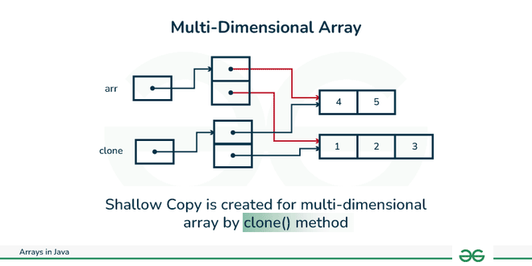

		- 基本範例

			```java
			int intArray[][] = {{ 1, 2, 3 }, { 4, 5 }};
			int cloneArr[] = arr.clone();
			
			System.out.println(intArray == cloneArray); // false
			System.out.println(intArray[0] == cloneArray[0]); // true (sub-arrays are shared)
			System.out.println(intArray[1] == cloneArray[1]); // true (sub-arrays are shared)
			```

- 參考資料

    - [GeeksForGeeks-Arrays in Java](https://www.geeksforgeeks.org/arrays-in-java/?ref=lbp)

#### ArrayList

- 基本概念

    - ArrayList 類別 **繼承 Collection 類別**，且屬於 java.util package 的其中一個類別

    	- ArrayList 類別 **實作 List 介面**
    	- 類似 C++ 的 vector

    	

    - 使用 index 來隨機存取元素 (randomly access)
    	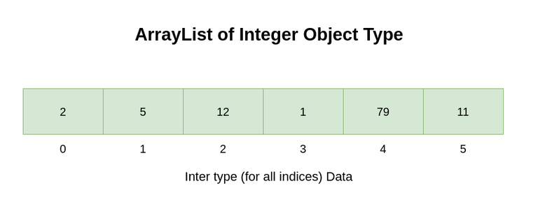

    - 可變大小 (dynamic size): 表示新增, 刪除元素會自動調整 `ArrayList.size()`

    - ArrayList 僅能裝 wrapper class，而不能裝原生型別

    - 非 Synchronized: 當 Multi-thread 同時修改同一個 ArrayList 時，無法保證 thread-safe (數據一致性)

- 宣告 & 初始化

    - 基本範例

    	```java
    	ArrayList<Integer> arrL = new ArrayList<Integer>(2);
    	```

    - 基本操作

        - 取得 ArrayList 的元素數

        	- `ArrayList.size()` 方法

            ```java
            int sz = arrL.size();  // 4
            ```

- 新增元素

  	- 若 ArrayList 的 size 滿了，預設會自動 doubled size 來儲存更多的元素
	- ArrayList 可以接受 null, 重複值

	```java
	ArrayList<String> arrL = new ArrayList<>();
	// 法 1: 正常加入元素
	arrL.add("Alice");
	arrL.add("Bob");
	// 法 2: 指定 index，插入元素
	arrL.add(1, "and")
	System.out.println(al); // [Alice, and, Bob]
	```

- 設定/更新元素值

	```java
	arrL.set(2, "John");
	System.out.println(arrL); // [Alice, and, John]
	```

- 刪除元素

	```java
	// 法 1: 刪除指定元素 (若 ArrayList 中存在相同的物件，則刪除第一個出現的物件)
	arrL.remove("John");
	// 法 2: 刪除指定 index 上的元素
	arrL.remove(0);
	System.out.println(arrL); [and]
	```

- 迭代元素

	```java
	ArrayList<String> arrL = new ArrayList<>();
	// 初始化時，賦值多個元素值 (Java 9+)
	ArrayList<String> arrL = new ArrayList<>(List.of("Alice", "and", "Bob"));

	// 法 1: 使用 for loop
	for (int i = 0; i < arrL.size(); i++) {
		System.out.print(al.get(i) + ", "); // Alice, and, Bob
	}
	// 法 2: 使用 for-each loop
	for (String str: arrL) {
		System.out.print(str + ", "); // Alice, and, Bob
	}
	```

- 排列元素

	```java
	ArrayList<Integer> arrL = new ArrayList();
	list.add(2);
	list.add(4);
	list.add(3);
	list.add(1);

	System.out.println("Before sorting list:");
	System.out.println(arrL);
	// 運用 Collection 類別的 sort() 方法
	Collections.sort(arrL); // [2, 4, 3, 1]

	System.out.println("after sorting list:");
	System.out.println(arrL); // [1, 2, 3, 4]
	```

- 取得元素

	```java
	Integer n = list.get(1); // and
	```

- 參考資料

    - [GeeksForGeeks-ArrayList in Java](https://www.geeksforgeeks.org/arraylist-in-java/)
    - [GeeksForGeeks-Array vs. ArrayList in Java](https://www.geeksforgeeks.org/array-vs-arraylist-in-java/)
    - [GeeksForGeeks-How to find length or size of an Array in Java?](https://www.geeksforgeeks.org/how-to-find-length-or-size-of-an-array-in-java/)

### 矩陣(Matrix) / 網格(Grid)
- 基本概念
    - 定義: 矩陣資料結構是由行、列組成的二維陣列。它是由水平條目、垂直條目所排列而成
        - 陣列 = [][] 陣列的陣列，且矩陣中每格的數 index 具有相同的大小
        - 水平條目 = 行 (row)
        - 垂直條目 = 列 (column)
    - 矩陣維度 = 行數 x 列數
    - 矩陣 index 表示方式: (row, column) 或 `arr[row][column]`
        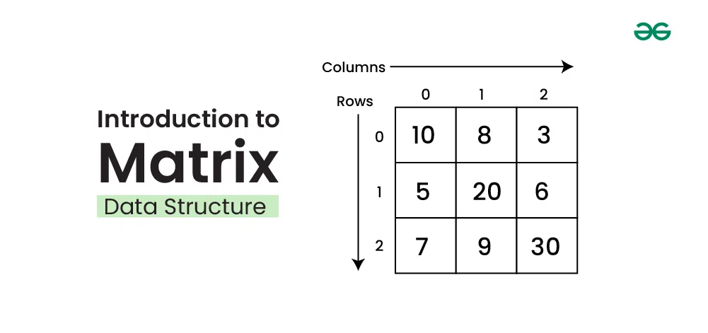
        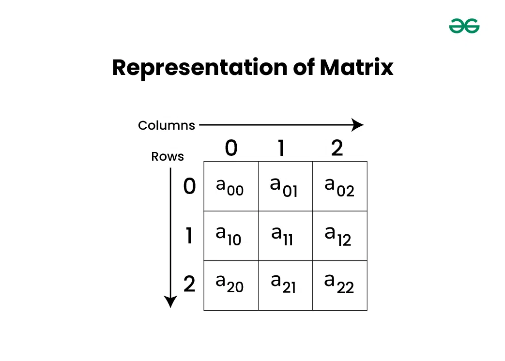
- 特性
    - 優點
        - 有助於 **二維可視化**
        - 允許 **隨機存取** 每一格元素
        - 可以儲存任何形式的 **固定大小** 的資料
    - 缺點
        - 當矩陣中儲存 **很少** 的元素時，空間使用效率很低
        - 需事先宣告矩陣大小
        - **調整矩陣大小，相當耗時**
        - **插入、刪除元素，需要位移其他元素**，故移動成本高
- 常見應用情境
    - **動態規劃演算法**: 矩陣經常用於基於<u>DP的問題來儲存已計算狀態的答案</u>
    - **影像處理**: 影像可以表示為<u>像素矩陣</u>，其中每個像素對應於矩陣中的一個元素。這有助於對影像執行不同的操作
    - 機器人技術: 在機器人技術中，矩陣用於<u>表示機器人及其末端執行器的位置、方向</u>。它們用於計算機器手臂的運動學和動力學，並規劃其軌跡
    - 交通運輸和物流: 交通運輸、物流中，使用矩陣來表示運輸網路，並<u>解決運輸問題、分配問題...等最佳化問題</u>
    - 金融: 矩陣在金融中用來表示<u>資產組合</u>，計算投資的風險和回報，並執行資產配置、最佳化等操作
    - 線性代數: 矩陣廣泛應用於線性代數，線性代數是處理線性方程式、向量空間、線性變換的數學分支。矩陣用於表示<u>線性方程式並求解線性方程組</u>
- 宣告 & 初始化
    - 若矩陣僅宣告，但尚未初始化，根據不同資料型別，每格元素會有不同的預設值
        - 整數(int, short, long, byte): 0
        - 浮點數(float, double): 0.0
        - 布林值(boolean): false
        - 字元(char): `\u0000`(= null 字元)
    ```java
    // 宣告
    int number_of_rows = 3, number_of_columns = 3;
    int[][] arr1 = new int[number_of_rows][number_of_columns];
    // 初始化
    arr1[0][1] = 2;
    // 同時宣告 + 初始化
    int arr2[][] = { { 1, 2, 3 }, { 4, 5, 6 }, { 7, 8, 9 } };
    ```
- 常見操作
    - 存取矩陣的元素
        ```java
        int[][] arr = { { 1, 2, 3 }, { 4, 5, 6 }, { 7, 8, 9 } };
        System.out.println(arr[1][2]); // 6
        ```
    - 遍歷矩陣元素
        ```java
        int[][] arr = { { 1, 2, 3, 4 }, { 5, 6, 7, 8 }, { 9, 10, 11, 12 } };
        // 先遍歷 rows
        for (int i = 0; i < 3; i++) {
            // 再遍歷 columns
            for (int j = 0; j < 4; j++) {
                System.out.print(arr[i][j] + ", ");
            }
            System.out.println();
        }
        ```
        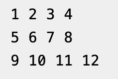
    - 在矩陣中搜尋
        ```java
        public class MyClass {
            public static void main(String[] args) {
                int target = 8;
                int[][] arr = {
                    {0, 6, 8, 9, 11},
                    {20, 22, 28, 29, 31},
                    {36, 38, 50, 61, 63},
                    {64, 66, 100, 122, 128}
                };

                if (searchInMatrix(arr, target)) {
                    System.out.println("found");
                } else {
                    System.out.println("not found");
                }
            }

            public static boolean searchInMatrix(int[][] arr, int target) {
                int row = arr.length;
                int col = arr[0].length;

                for (int i = 0; i < row; i++) {
                    for (int j = 0; j < col; j++) {
                        if (arr[i][j] == target) {
                            return true;
                        }
                    }
                }
                return false;
            }
        }
        ```
    - 轉置矩陣 (transpose)
        - 轉置: 行 <-> 列 (row <-> column)
            
        - 法 1: 通用情況
            ```java
            // 將 A 轉置為 B 矩陣
            static void transpose(int A[][], int B[][]) 
            { 
                int Arows = A.length;    // A 矩陣的行數
                int Acols = A[0].length; // A 矩陣的列數

                // Tips: 先遍歷 A 矩陣的列 (因為是要將 A 矩陣的列，轉成 B 矩陣的行)
                for (int i = 0; i < Acols; i++) {
                    // Tips: 再遍歷 A 矩陣的行
                    for (int j = 0; j < Arows; j++) {
                        B[i][j] = A[j][i];
                    }
                }
            }

            public static void main(String[] args) 
            { 
                // 長方形矩陣 (4*3)
                int A[][] = { { 1, 1, 1 }, 
                            { 2, 2, 2 }, 
                            { 3, 3, 3 }, 
                            { 4, 4, 4 } }; 
                // 初始化 B 矩陣 = A[列數][行數]
                int B[][] = new int[A[0].length][A.length]; 
                transpose(A, B); 

                System.out.println("轉置後的矩陣");
                // 印出 B 矩陣中的每一格元素
                // 先遍歷 row，因為 B[][] 是 2 維陣列，故 B.length = 行數 (row)
                for (int i = 0; i < B.length; i++) {
                    // 再遍歷該 row 的每一格 column 的元素
                    for (int j = 0; j < B[i].length; j++) {
                        System.out.print(B[i][j] + ", ");
                    }
                    System.out.println(""); 
                }
            }
            ```
            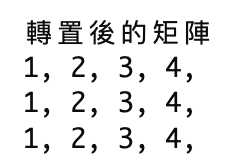 <br>
        - 法 2: 矩陣為正方形(n x n)，行數與列數相同
            - 採原地排序演算法 (in-place)
                - Time complexity: O($n^{2}$)
                - Space complexity: O(1)
            ```java
            // 正方形矩陣的邊長(元素個數)
            static final int N = 4; 

            // 採原地排序演算法，轉置矩陣 (因為採原地排序，故參數只需要一個矩陣 A[][])
            static void transpose(int A[][]) 
            {
                for (int i = 0; i < N; i++) 
                    for (int j = i + 1; j < N; j++) { 
                        int temp = A[i][j]; 
                        A[i][j] = A[j][i]; 
                        A[j][i] = temp; 
                    } 
            } 

            public static void main(String[] args) 
            { 
                int A[][] = { { 1, 1, 1, 1 }, 
                            { 2, 2, 2, 2 }, 
                            { 3, 3, 3, 3 }, 
                            { 4, 4, 4, 4 } }; 
                transpose(A);

                System.out.println("轉置後的矩陣"); 
                for (int i = 0; i < N; i++) { 
                    for (int j = 0; j < N; j++) {
                        System.out.print(A[i][j] + ", "); 
                    }
                    System.out.println("");
                } 
            }
            ```
            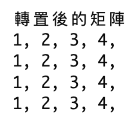 <br>
    - 對矩陣的行 or 列元素，進行排序
        - 行排序 (row)
            - 法 1: 使用 `Arrays.sort()`
            ```java
            import java.io.*;
            import java.util.Arrays;  // 記得引用 Arrays package

            public class MyClass {
            public static void sortRowWise(int arr[][])
            {
                for (int i = 0; i < arr.length; i++) {
                    Arrays.sort(arr[i]);
                }

                for (int i = 0; i < arr.length; i++) {
                    for (int j = 0; j < arr[i].length; j++) {
                        System.out.print(arr[i][j] + ", ");
                    }
                    System.out.println();
                }
            }

            public static void main(String args[])
            {
                int arr[][] = { { 9, 8, 7, 1 },
                            { 7, 3, 0, 2 },
                            { 9, 5, 3, 2 },
                            { 6, 3, 1, 2 } };
                            
                sortRowWise(arr);
            }
            }
            ```
            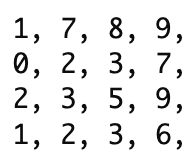
        - 列排序 (column)
            - 步驟 1: 將 A 轉置為 B 矩陣
            - 步驟 2: 排序 B 矩陣的行元素 (row)
            - 步驟 3: 再將 B 矩陣轉置為新的 C 矩陣
            ```java
            public static void main(String[] args)
            {
                int[][] A = { { 1, 6, 10 },
                            { 8, 5, 9 },
                            { 9, 4, 15 },
                            { 7, 3, 60 } };
            
                int Arows = A.length;
                int Acols = A[0].length;
                // 步驟 1: 將 A 轉置為 B 矩陣
                int[][] B = transpose(A, Arows, Acols);
                int Brows = B.length;
                int Bcols = B[0].length;
            
                // 步驟 2: 排序 B 矩陣的行元素 (row)
                RowWiseSort(B);
            
                // 步驟 3: 再將 B 矩陣轉置為新的 C 矩陣
                int[][] C = transpose(B, Brows, Bcols);
                int Crows = C.length;
                int Ccols = C[0].length;
            
                // 印出結果
                System.out.println("轉置後的矩陣");
                for(int i = 0; i < Crows; i++) 
                {
                    for(int j = 0; j < Ccols; j++) 
                    {
                        System.out.print(C[i][j] + ", ");
                    }
                    System.out.println("");
                }
            }
            
            // 轉置矩陣
            static int[][] transpose(int[][] A, int Arows, int Acols) {
                // 初始化 B 矩陣 = A[列數][行數]
                int[][] B = new int[Acols][Arows];
            
                // 遍歷 row
                for(int i = 0; i < Arows; i++) {
                    // 遍歷 column
                    for(int j = 0; j < Acols; j++) {
                        // 轉置矩陣中的每一格元素
                        B[j][i] = A[i][j];
                    }
                }
                
                return B;
            }
            
            // 排序行元素 (row)
            static void RowWiseSort(int[][] B)
            {
                // 遍歷 row
                for(int i = 0; i < B.length; i++) {
                    Arrays.sort(B[i]);
                }
            }
            ```
            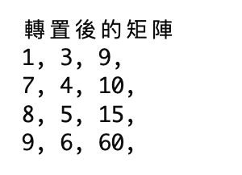
- 參考資料
    - [GeeksForGeeks-Matrix Data Structure](https://www.geeksforgeeks.org/matrix/)
    - [GeeksForGeeks-Introduction to Matrix or Grid Data Structure – Two Dimensional Array](https://www.geeksforgeeks.org/introduction-to-matrix-or-grid-data-structure-and-algorithms-tutorial/)

### 樹(Tree)
- 基本概念
    - 階層式資料結構: 由節點(node)、邊(edge)組成，以邊連結節點，節點之間有階層關係
    - 易於搜尋元素
    
    [圖片出處](https://www.geeksforgeeks.org/introduction-to-tree-data-structure-and-algorithm-tutorials/)
- 術語表
    - 子樹 (subtree): 包含所有子節點的樹
    - 根節點 (root node): 樹的最上層節點
    - 父節點 (parent node): 某節點的 **先繼** 節點
    - 子節點 (child node): 某節點的 **直接後繼** 節點
    - 葉節點 (leaf node/external node): 沒有子節點的節點
    - 內部節點 (internal node): 至少有一個子節點的節點
    - 祖先 (ancestor): 從根到該節點的路徑上的任何先繼節點，都稱為該節點的祖先
        - e.g. { A, B } 是節點 { E } 的祖先節點
    - 後代 (descendant): 從該節點到任何葉節點的路徑上的所有後繼節點，都稱為該節點的後代
        - e.g. 節點 { E } 是 { A, B } 的後代節點
    - 兄弟 (sibling): 具有相同父節點的節點們
    - 鄰居 (neighbor): 該節點的父節點 or 子節點
- Tree 的屬性
    - 層級 (level): 從根節點 ～ 該節點的路徑上的邊數
        - e.g. **root level 可為 0 或 1**
    - 分叉度 (degree): 每個節點的子節點數
        - e.g. **葉節點的 degree = 0**
    - 樹的邊數 (edges): 兩個節點之間的連接，從樹的每個節點到任何其他節點只有一條路徑
        - e.g. **若一棵樹有 N 個節點，那麼它將有 N-1 條邊**
    - 節點深度 (depth): 用於描述 **節點在樹中的層次** (從根節點 ～ 當前節點，所經過的邊數)
    - 節點高度 (height): 用於描述 **從節點 ～ 其後代中最遠葉節點的距離** (從當前節點 ～ 最遠葉節點，所經過的邊數)

        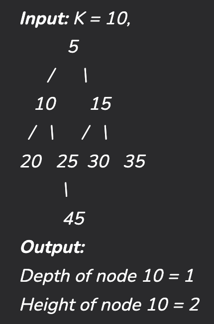
        [圖片出處](https://www.geeksforgeeks.org/height-and-depth-of-a-node-in-a-binary-tree/)

- Tree 的分類
    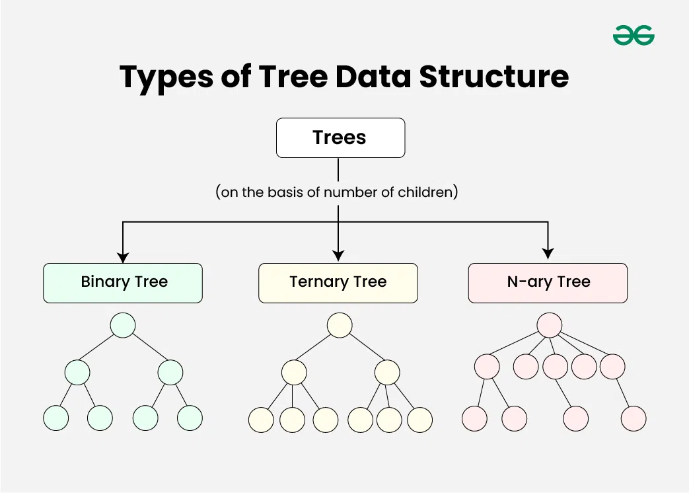
    [圖片出處](https://www.geeksforgeeks.org/introduction-to-tree-data-structure-and-algorithm-tutorials/)
- Tree 走訪 (traversal)
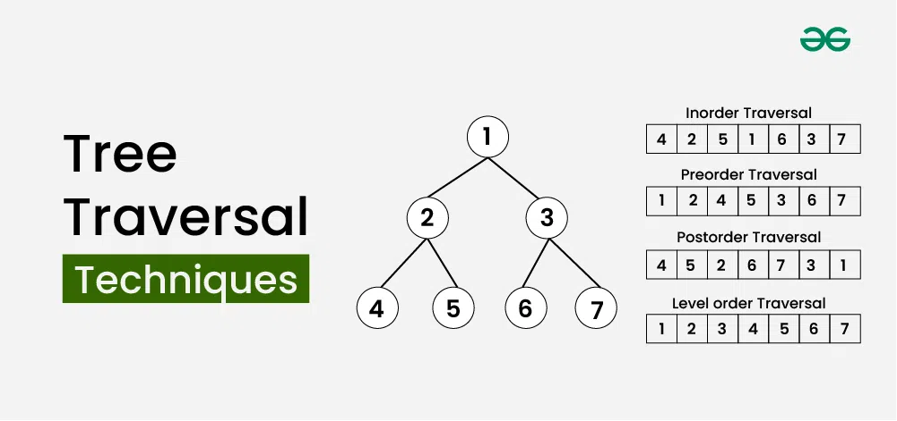
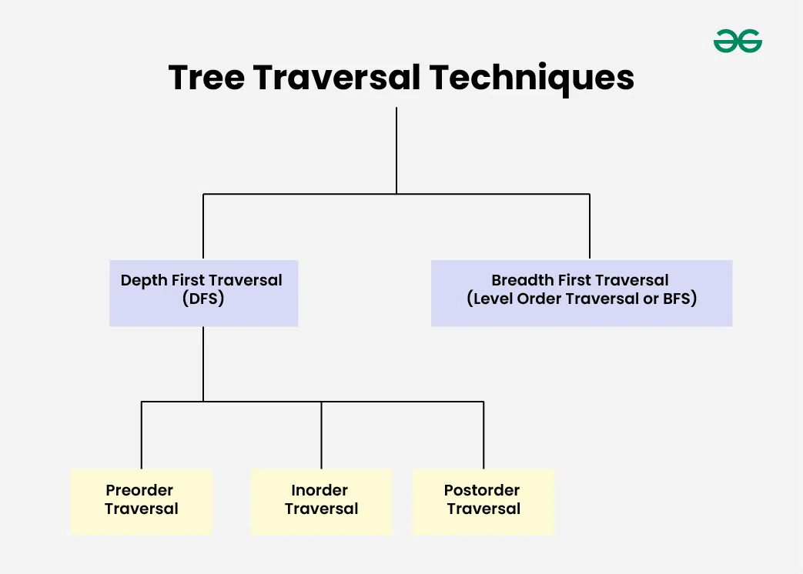
[圖片出處](https://www.geeksforgeeks.org/tree-traversals-inorder-preorder-and-postorder/)
    - 前序走訪 (Preorder)
        - 根 -> 左 -> 右
        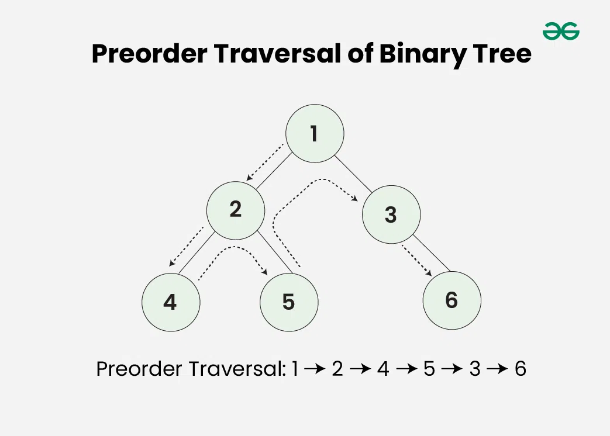
        [圖片出處](https://www.geeksforgeeks.org/tree-traversals-inorder-preorder-and-postorder/)
    - 中序走訪 (Inorder)
        - 左 -> 根 -> 右
        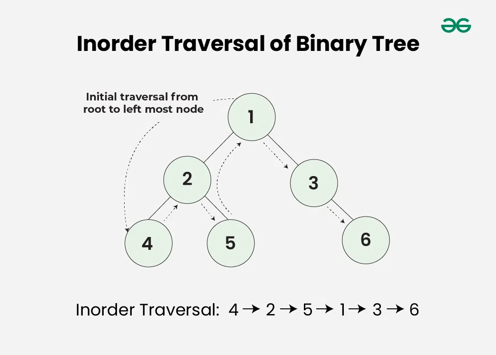
        [圖片出處](https://www.geeksforgeeks.org/tree-traversals-inorder-preorder-and-postorder/)
    - 後序走訪 (Postorder)
        - 左 -> 右 -> 根
        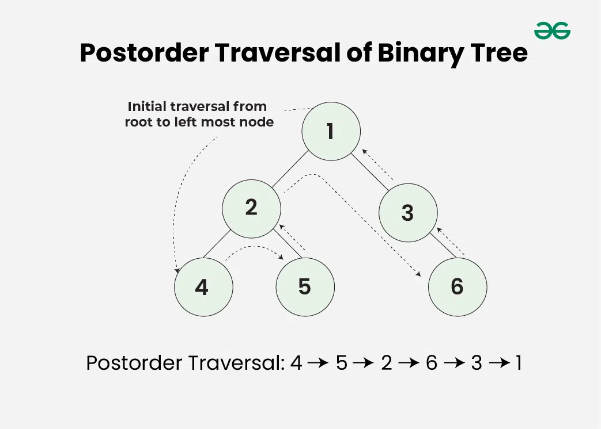
        [圖片出處](https://www.geeksforgeeks.org/tree-traversals-inorder-preorder-and-postorder/)
    - 層序走訪 (Level Order)
        - 由上至下，由左至右
        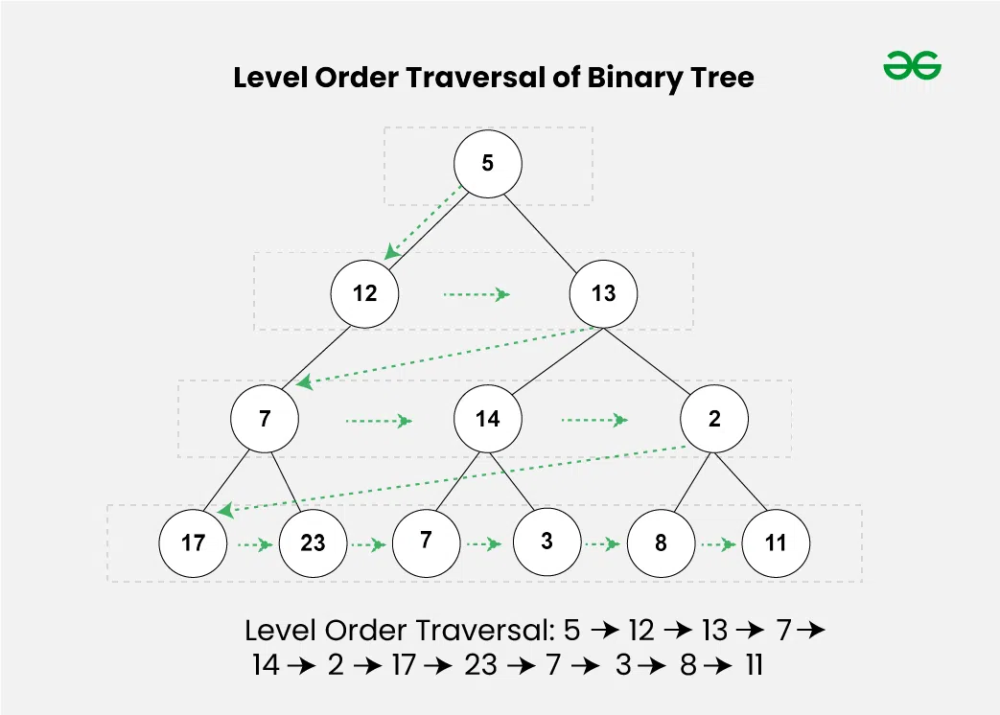
        [圖片出處](https://www.geeksforgeeks.org/tree-traversals-inorder-preorder-and-postorder/)
- 特性
    - 優點
        - 高效搜尋: 根據樹的類型，平衡樹如 AVL 樹的平均搜尋時間為 O(logN)
        - 層次結構表示: 使得組織, 尋找大量信息變得更容易
        - 天然遞迴特性: 易於使用遞迴算法，進行遍歷、操作
    - 缺點
        - 不平衡樹: 樹的高度偏向一側，可能導致搜尋時間效率變差
        - 內存需求: 相比於其它資料結構，如: Array, Linked List，Tree 會需要用到更多的記憶體空間，尤其是在樹非常大的情況下
        - 實現複雜: 樹的實現, 操作較複雜，並且需要對演算法有良好的理解
- 常見應用情境
    - 檔案系統
    - 資料庫索引: B-tree, B+ tree
    - XML 文件
    - 人工智慧
    - 資料壓縮: Huffman tree
- 參考資料
    - [GeeksForGeeks-Tree Data Structure](https://www.geeksforgeeks.org/tree-data-structure/)
    - [GeeksForGeeks-Introduction to Tree – Data Structure and Algorithm Tutorials](https://www.geeksforgeeks.org/introduction-to-tree-data-structure-and-algorithm-tutorials/)


## 演算法


## 參考資料
- [Learn Data Structures and Algorithms | DSA Tutorial](https://www.geeksforgeeks.org/learn-data-structures-and-algorithms-dsa-tutorial/?ref=ghm)