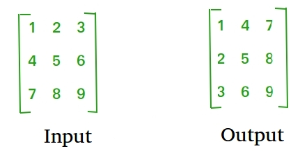

# 資料結構 & 演算法
- 本篇是參考 Geeks for Geeks 網站的 DSA Tutorial 所整理的學習筆記
- 以 Java 程式語言為主

[TOC]
## 總覽


- 學習 DSA 的五個步驟
    

## 術語表
### 專業術語定義
- 宣告 (declaration): 告訴編譯器，存在該變數 or 物件
- 初始化 (initialization): 為變數賦予初始值
    - 原生型別: 賦予初始值
    - 物件: 透過建構子，賦予初始值，並分配記憶體空間

### 基本操作的術語
- 存取 (access): 取得資料結構中的元素
- 遍歷 (traversal): 訪問資料結構中的每個元素

## 資料結構
- 定義: 幫助在電腦記憶體中有效組織和儲存資料
- 功能: 提供了一種有效管理和操作資料的方法，以實現更快的存取、插入、刪除操作
- 目的: 設計高效演算法和最佳化軟體效能的基礎

### 矩陣(Matrix) / 網格(Grid)
- 基本概念
    - 定義: 矩陣資料結構是由行、列組成的二維陣列。它是由水平條目、垂直條目所排列而成
        - 陣列 = [][] 陣列的陣列，且矩陣中每格的數 index 具有相同的大小
        - 水平條目 = 行 (row)
        - 垂直條目 = 列 (column)
    - 矩陣的大小 = 行數 x 列數
    - 矩陣 index 表示方式: (row, column) 或 `arr[row][column]`
        
        
- 特性
    - 優點
        - 有助於 **二維可視化**
        - 允許 **隨機存取** 每一格元素
        - 可以儲存任何形式的 **固定大小** 的資料
    - 缺點
        - 當矩陣中儲存 **很少** 的元素時，空間使用效率很低
        - 需事先宣告矩陣大小
        - **調整矩陣大小，相當耗時**
        - **插入、刪除元素，需要位移其他元素**，故移動成本高
- 常見應用情境
    - **動態規劃演算法**: 矩陣經常用於基於<u>DP的問題來儲存已計算狀態的答案</u>
    - **影像處理**: 影像可以表示為<u>像素矩陣</u>，其中每個像素對應於矩陣中的一個元素。這有助於對影像執行不同的操作
    - 機器人技術: 在機器人技術中，矩陣用於<u>表示機器人及其末端執行器的位置、方向</u>。它們用於計算機器手臂的運動學和動力學，並規劃其軌跡
    - 交通運輸和物流: 交通運輸、物流中，使用矩陣來表示運輸網路，並<u>解決運輸問題、分配問題...等最佳化問題</u>
    - 金融: 矩陣在金融中用來表示<u>資產組合</u>，計算投資的風險和回報，並執行資產配置、最佳化等操作
    - 線性代數: 矩陣廣泛應用於線性代數，線性代數是處理線性方程式、向量空間、線性變換的數學分支。矩陣用於表示<u>線性方程式並求解線性方程組</u>
- 宣告 & 初始化
    - 若矩陣僅宣告，但尚未初始化，根據不同資料型別，每格元素會有不同的預設值
        - 整數(int, short, long, byte): 0
        - 浮點數(float, double): 0.0
        - 布林值(boolean): false
        - 字元(char): `\u0000`(= null 字元)
    ```java
    // 宣告
    int number_of_rows = 3, number_of_columns = 3;
    int[][] arr1 = new int[number_of_rows][number_of_columns];
    // 初始化
    arr1[0][1] = 2;
    // 同時宣告 + 初始化
    int arr2[][] = { { 1, 2, 3 }, { 4, 5, 6 }, { 7, 8, 9 } };
    ```
- 常見操作
    - 存取矩陣的元素
        ```java
        int[][] arr = { { 1, 2, 3 }, { 4, 5, 6 }, { 7, 8, 9 } };
        System.out.println(arr[1][2]); // 6
        ```
    - 遍歷矩陣元素
        ```java
        int[][] arr = { { 1, 2, 3, 4 }, { 5, 6, 7, 8 }, { 9, 10, 11, 12 } };
        // 先遍歷 rows
        for (int i = 0; i < 3; i++) {
            // 再遍歷 columns
            for (int j = 0; j < 4; j++) {
                System.out.print(arr[i][j] + ", ");
            }
            System.out.println();
        }
        ```
        
    - 在矩陣中搜尋
        ```java
        public class MyClass {
            public static void main(String[] args) {
                int target = 8;
                int[][] arr = {
                    {0, 6, 8, 9, 11},
                    {20, 22, 28, 29, 31},
                    {36, 38, 50, 61, 63},
                    {64, 66, 100, 122, 128}
                };

                if (searchInMatrix(arr, target)) {
                    System.out.println("found");
                } else {
                    System.out.println("not found");
                }
            }

            public static boolean searchInMatrix(int[][] arr, int target) {
                int row = arr.length;
                int col = arr[0].length;

                for (int i = 0; i < row; i++) {
                    for (int j = 0; j < col; j++) {
                        if (arr[i][j] == target) {
                            return true;
                        }
                    }
                }
                return false;
            }
        }
        ```
    - 轉置矩陣 (transpose)
        - 轉置: 行 <-> 列 (row <-> column)
            
        - 法 1: 通用情況
            ```java
            // 將 A 轉置為 B 矩陣
            static void transpose(int A[][], int B[][]) 
            { 
                int Arows = A.length;    // A 矩陣的行數
                int Acols = A[0].length; // A 矩陣的列數

                // Tips: 先遍歷 A 矩陣的列 (因為是要將 A 矩陣的列，轉成 B 矩陣的行)
                for (int i = 0; i < Acols; i++) {
                    // Tips: 再遍歷 A 矩陣的行
                    for (int j = 0; j < Arows; j++) {
                        B[i][j] = A[j][i];
                    }
                }
            }

            public static void main(String[] args) 
            { 
                // 長方形矩陣 (4*3)
                int A[][] = { { 1, 1, 1 }, 
                            { 2, 2, 2 }, 
                            { 3, 3, 3 }, 
                            { 4, 4, 4 } }; 
                // 初始化 B 矩陣 = A[列數][行數]
                int B[][] = new int[A[0].length][A.length]; 
                transpose(A, B); 

                System.out.println("轉置後的矩陣");
                // 印出 B 矩陣中的每一格元素
                // 先遍歷 row，因為 B[][] 是 2 維陣列，故 B.length = 行數 (row)
                for (int i = 0; i < B.length; i++) {
                    // 再遍歷該 row 的每一格 column 的元素
                    for (int j = 0; j < B[i].length; j++) {
                        System.out.print(B[i][j] + ", ");
                    }
                    System.out.println(""); 
                }
            }
            ```
             <br>
        - 法 2: 矩陣為正方形(n x n)，行數與列數相同
            - 採原地排序演算法 (in-place)
                - Time complexity: O($n^{2}$)
                - Space complexity: O(1)
            ```java
            // 正方形矩陣的邊長(元素個數)
            static final int N = 4; 

            // 採原地排序演算法，轉置矩陣 (因為採原地排序，故參數只需要一個矩陣 A[][])
            static void transpose(int A[][]) 
            {
                for (int i = 0; i < N; i++) 
                    for (int j = i + 1; j < N; j++) { 
                        int temp = A[i][j]; 
                        A[i][j] = A[j][i]; 
                        A[j][i] = temp; 
                    } 
            } 

            public static void main(String[] args) 
            { 
                int A[][] = { { 1, 1, 1, 1 }, 
                            { 2, 2, 2, 2 }, 
                            { 3, 3, 3, 3 }, 
                            { 4, 4, 4, 4 } }; 
                transpose(A);

                System.out.println("轉置後的矩陣"); 
                for (int i = 0; i < N; i++) { 
                    for (int j = 0; j < N; j++) {
                        System.out.print(A[i][j] + ", "); 
                    }
                    System.out.println("");
                } 
            }
            ```
             <br>
    - 對矩陣的行 or 列元素，進行排序
        - 行排序 (row)
            - 法 1: 使用 `Arrays.sort()`
            ```java
            import java.io.*;
            import java.util.Arrays;  // 記得引用 Arrays package

            public class MyClass {
            public static void sortRowWise(int arr[][])
            {
                for (int i = 0; i < arr.length; i++) {
                    Arrays.sort(arr[i]);
                }

                for (int i = 0; i < arr.length; i++) {
                    for (int j = 0; j < arr[i].length; j++) {
                        System.out.print(arr[i][j] + ", ");
                    }
                    System.out.println();
                }
            }

            public static void main(String args[])
            {
                int arr[][] = { { 9, 8, 7, 1 },
                            { 7, 3, 0, 2 },
                            { 9, 5, 3, 2 },
                            { 6, 3, 1, 2 } };
                            
                sortRowWise(arr);
            }
            }
            ```
            
        - 列排序 (column)
            - 步驟 1: 將 A 轉置為 B 矩陣
            - 步驟 2: 排序 B 矩陣的行元素 (row)
            - 步驟 3: 再將 B 矩陣轉置為新的 C 矩陣
            ```java
            public static void main(String[] args)
            {
                int[][] A = { { 1, 6, 10 },
                            { 8, 5, 9 },
                            { 9, 4, 15 },
                            { 7, 3, 60 } };
            
                int Arows = A.length;
                int Acols = A[0].length;
                // 步驟 1: 將 A 轉置為 B 矩陣
                int[][] B = transpose(A, Arows, Acols);
                int Brows = B.length;
                int Bcols = B[0].length;
            
                // 步驟 2: 排序 B 矩陣的行元素 (row)
                RowWiseSort(B);
            
                // 步驟 3: 再將 B 矩陣轉置為新的 C 矩陣
                int[][] C = transpose(B, Brows, Bcols);
                int Crows = C.length;
                int Ccols = C[0].length;
            
                // 印出結果
                System.out.println("轉置後的矩陣");
                for(int i = 0; i < Crows; i++) 
                {
                    for(int j = 0; j < Ccols; j++) 
                    {
                        System.out.print(C[i][j] + ", ");
                    }
                    System.out.println("");
                }
            }
            
            // 轉置矩陣
            static int[][] transpose(int[][] A, int Arows, int Acols) {
                // 初始化 B 矩陣 = A[列數][行數]
                int[][] B = new int[Acols][Arows];
            
                // 遍歷 row
                for(int i = 0; i < Arows; i++) {
                    // 遍歷 column
                    for(int j = 0; j < Acols; j++) {
                        // 轉置矩陣中的每一格元素
                        B[j][i] = A[i][j];
                    }
                }
                
                return B;
            }
            
            // 排序行元素 (row)
            static void RowWiseSort(int[][] B)
            {
                // 遍歷 row
                for(int i = 0; i < B.length; i++) {
                    Arrays.sort(B[i]);
                }
            }
            ```
            
- 參考資料
    - [GeeksForGeeks-Matrix Data Structure](https://www.geeksforgeeks.org/matrix/)
    - [GeeksForGeeks-Introduction to Matrix or Grid Data Structure – Two Dimensional Array](https://www.geeksforgeeks.org/introduction-to-matrix-or-grid-data-structure-and-algorithms-tutorial/)

## 演算法


## 參考資料
- [Learn Data Structures and Algorithms | DSA Tutorial](https://www.geeksforgeeks.org/learn-data-structures-and-algorithms-dsa-tutorial/?ref=ghm)