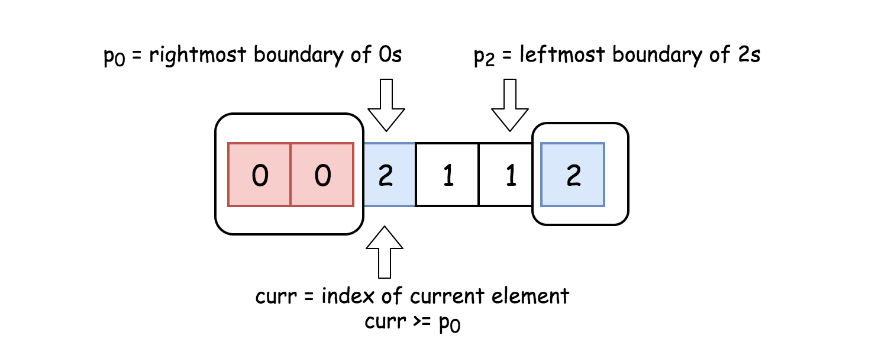
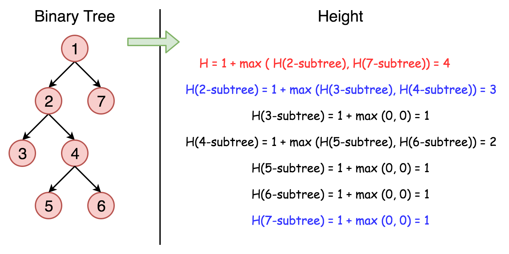
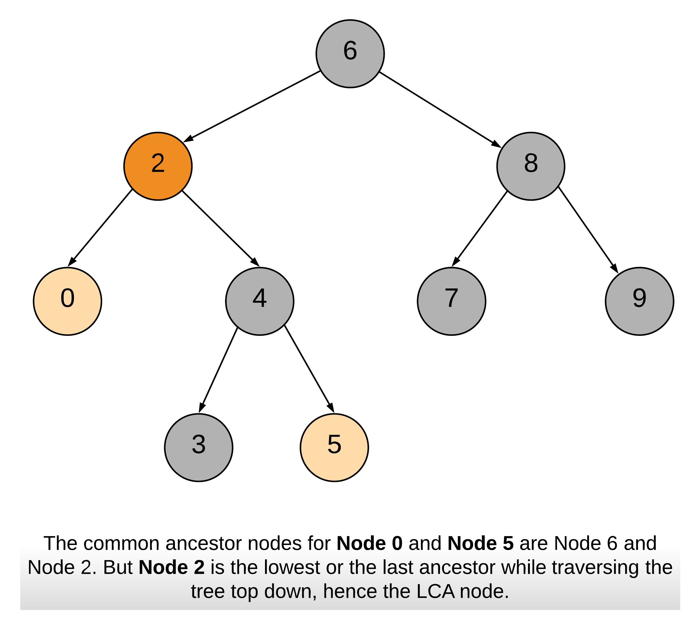

Coding Interview Preparation
===
- 由 Blind 75 作者所整理 coding interview 的常考 75 題
- 本篇採 Java 作為主要使用的程式語言

[TOC]

## Array
### 專有名詞
- **Subarray**: 在原陣列中的一段 **連續元素**
    ```java
    int[] arr = [2, 3, 6, 1, 5, 4];
    // Subarray: [3, 6, 1]
    // 不是 Subarray: [3, 1, 5]
    ```
- **Subsequence**: 可以透過刪除/不刪除元素，而 **不影響剩餘元素的順序**
    ```java
    int[] arr = [2, 3, 6, 1, 5, 4];
    // Subsequence: [3, 1, 5];
    // 不是 Subsequence: [3, 5, 1]
    ```
- non-decreasing order: 陣列中的元素值是 **非遞減** 的，即元素值 **可以相等 or 遞增** (e.g. [1, 2, 2, 3, 4])
- non-increasing order: 陣列中的元素值是 **非遞增** 的，即元素值 **可以相等 or 遞減** (e.g. [4, 3, 2, 2, 1])

### 注意事項
- Array 中有重複值嗎? 會影響答案嗎? 使問題變得更簡單還是更困難?
- 當使用 index 遍歷 Array 元素時，請注意不要越界
- Array 切片或連接時，通常需要 O(n) 時間，盡可能使用 start 和 結束索引來劃分 subarry 或 array range
    - Array 切片
        ```java
        // 普通做法: 使用 Arrays.copyOfRange(來源, 起始索引, 結束索引)
        // 時間: O(n)
        // 空間: O(n)
        int[] array = { 1, 2, 3, 4, 5, 6, 7, 8, 9, 10 };
        int[] subarray = Arrays.copyOfRange(array, start, end);
        ```
        ```java
        // 較佳作法: 使用 index 遍歷
        // 時間: O(1)
        // 空間: O(1)
        int[] array = { 1, 2, 3, 4, 5, 6, 7, 8, 9, 10 };
        int start = 2;
        int end = 5;

        // 處理範圍內的元素
        for (int i = start1; i < end1; i++) {
            System.out.println(array[i]);
        }
        ```

    - Array 連接
        ```java
        // 普通作法: 使用 System.arraycopy(來源, 起始索引, 目的, 起始索引, 要複製的元素數量)
        // 時間: O(n)
        // 空間: O(n)
        int[] subarray1 = { 1, 2, 3 };
        int[] subarray2 = { 4, 5, 6 };
        int[] concatenatedArray = new int[subarray1.length + subarray2.length];
        System.arraycopy(subarray1, 0, concatenatedArray, 0, subarray1.length);
        System.arraycopy(subarray2, 0, concatenatedArray, subarray1.length, subarray2.length);
        ```

        ```java
        // 較佳作法: 使用 index 遍歷
        // 時間: O(1)
        // 空間: O(1)
        public static void main(String[] args) {
            int[] array = {1, 2, 3, 4, 5, 6, 7, 8, 9, 10};
            int start1 = 2;
            int end1 = 5; // [2, 5) => 元素 3, 4, 5
            int start2 = 5;
            int end2 = 8; // [5, 8) => 元素 6, 7, 8

            // 使用索引訪問子陣列範圍
            System.out.println("Subarray 1 elements:");
            printSubarray(array, start1, end1);

            System.out.println("Subarray 2 elements:");
            printSubarray(array, start2, end2);
        }

        public static void printSubarray(int[] array, int start, int end) {
            for (int i = start; i < end; i++) {
                System.out.print(array[i] + " ");
            }
            System.out.println();
        }
        ```

- 極端情況 (corner case)
    - **空** 陣列
    - **僅有一個元素** 的陣列
    - 有 **重複元素** 的陣列
    - 陣列中的 **重複值**

### 解題技巧
#### 滑動視窗 (Sliding Window)
- 說明: 兩個指針通常會朝同一方向移動，永遠不會超越對方。這確保每個值最多只被訪問兩次
    - 時間複雜度: O(n)
- 應用情境: 子陣列, 子字串問題


- LC 3. (M): 最長不重複子字串
    - [Longest Substring Without Repeating Characters](https://leetcode.com/problems/longest-substring-without-repeating-characters/)
    - 思路
        - 使用滑動窗口技巧，用 left, right 指標來標記窗口的左右邊界
        - 使用一個 **HashMap** 來記錄每個字元 **最後出現的位置**
        - 當發現重複字元時，直接將 left 指針移動到重複字元的下一個位置，以跳過重複字元
        - 每次移動 right 指針以擴大窗口，並更新結果 (最長的無重複字元子串的長度)

    ```java
    // 時間: O(n)，其中 n 是字串的長度
    // 空間: O(min(m, n))，其中 n 是字串的長度，m 是字元集的大小
    class Solution {
        public int lengthOfLongestSubstring(String s) {
            int res = 0;
            Map<Character, Integer> map = new HashMap<>();

            for (int left = 0, right = 0; right < s.length(); right++) {
                if (map.containsKey(s.charAt(right))) {
                    // 比較 (當前的 left 指標所指向的索引位置, 當前 right 指標於 HashMap 中所對應之索引位置)
                    // 取其大者，並更新 left 指標的位置
                    left = Math.max(left, map.get(s.charAt(right)));
                }
                res = Math.max(res, right - left + 1);
                map.put(s.charAt(right), right + 1);
            }

            return res;
        }
    }
    ```

- LC 209. (M): 最小子陣列總和
    - [Minimum Size Subarray Sum](https://leetcode.com/problems/minimum-size-subarray-sum/description/)
    - 思路
        - 使用滑動窗口技巧，用 left, right 指標來標記窗口的左右邊界
        - 當滑動窗口內的 Subarray 總和 >= 目標值時，縮小窗口
        - 每次調整窗口後，更新最短長度的 Subarray

    ```java
    // 時間: O(n)，其中 n 是陣列的長度
    // 空間: O(1)
    class Solution {
        public int minSubArrayLen(int target, int[] nums) {
            // 計算當前窗口內的子陣列和
            int sum = 0;
            // 記錄最短子陣列的長度
            int res = Integer.MAX_VALUE;
            for (int left = 0, right = 0; right < nums.length; right++) {
                sum = sum + nums[right];
                while (sum >= target) {
                    res = Math.min(res, right - left + 1);
                    sum = sum - nums[left];
                    left++;
                }
            }

            return (res != Integer.MAX_VALUE) ? res : 0;
        }
    }
    ```

- LC 76. (H): 最小滑動視窗子字串
    - [Minimum Window Substring](https://leetcode.com/problems/minimum-window-substring/description/)
    - 思路
        - 初始化
            - 建立兩個 HashMap: 
                - `tFreq`: 記錄目標字串 `t` 中每個字元的出現次數
                - `windowFreq`: 記錄滑動窗口中每個字元的出現次數
            - 初始化變數
                - `required`: 目標字串 `t` 中唯一字元的個數
                - `formed`: 當前窗口中符合要求的字元個數
                - `left`, `right`: 滑動窗口的左右指針
                - `minLen`, `minLeft`: 記錄最小窗口的長度、起始位置
        - 擴展窗口
            - 使用 `right` 指針從左到右遍歷字串 `s`，將字元加入窗口，更新 `windowFreq`
            - 如果當前窗口中的字元頻率符合 `tFreq` 中的頻率，增加 `formed` 的計數
        - 收縮窗口
            - 當 `formed` == `required` 時，嘗試收縮窗口
                - 更新最小窗口長度 `minLen` 和起始位置 `minLeft`
                - 移動 `left` 指針，將字元移出窗口，更新 `windowFreq`
                - 如果某個字元的頻率不再符合 `tFreq`，減少 `formed` 的計數

    ```java
    // 時間: O(|s| + |t|)
    // 空間: O(|s| + |t|)
    class Solution {
        public String minWindow(String s, String t) {
            if (s.length() == 0 || t.length() == 0) {
                return "";
            }

            // 記錄目標字串 t 中每個字元的出現次數
            Map<Character, Integer> tFreq = new HashMap<>();
            for (char c: t.toCharArray()) {
                tFreq.put(c, tFreq.getOrDefault(c, 0) + 1);
            }

            // 記錄滑動窗口中每個字元的出現次數
            Map<Character, Integer> windowFreq = new HashMap<>();
            // 目標字串 `t` 中唯一字元的個數
            int required = tFreq.size();
            // 當前窗口中符合要求的字元個數
            int formed = 0;
            int left = 0, right = 0;
            int minLen = Integer.MAX_VALUE;
            int minLeft = 0;

        // 開始滑動窗口
        while (right < s.length()) {
            char c = s.charAt(right);
            windowFreq.put(c, windowFreq.getOrDefault(c, 0) + 1);

            // 當前字符在 t 中出現且其出現次數符合要求時，更新 formed
            if (tFreq.containsKey(c) && windowFreq.get(c).intValue() == tFreq.get(c).intValue()) {
                formed++;
            }

            // 當前窗口包含所有目標字符
            while (left <= right && formed == required) {
                c = s.charAt(left);

                // 更新最小窗口
                if (right - left + 1 < minLen) {
                    minLen = right - left + 1;
                    minLeft = left;
                }

                // 移出窗口的左端字符，更新頻率和 formed
                windowFreq.put(c, windowFreq.get(c) - 1);
                if (tFreq.containsKey(c) && windowFreq.get(c).intValue() < tFreq.get(c).intValue()) {
                    formed--;
                }

                left++; // 繼續收縮窗口
            }

            right++; // 繼續擴展窗口
        }

        // 返回最小窗口子字符串，若未找到符合條件的窗口，返回空字符串
        return minLen == Integer.MAX_VALUE ? "" : s.substring(minLeft, minLeft + minLen);
        }
    }
    ```

#### 雙指標(Two pointers)
- 說明: 雙指標算是滑動視窗的更通用版本，其中指標 **可以相互交叉** 並且 **可以位於不同的陣列上**
- 應用情境: 合併兩個已排序的陣列
- LC 75. (M): 排列顏色
    - [Sort Colors](https://leetcode.com/problems/sort-colors/description/)
    - 這題算是經典的 [Dutch national flag](https://en.wikipedia.org/wiki/Dutch_national_flag_problem) 問題的類似題目
        
        [圖片出處](https://leetcode.com/problems/sort-colors/editorial/)
    - 思路
        - 使用三個指標
            - `p0`: 指向 0 的最右邊邊界，從陣列的最左邊開始
            - `p2`: 指向 2 的最左邊邊界，從陣列的最右邊開始
            - `curr`: 當前掃描位置，從陣列的最左邊開始
        - 遍歷陣列並排序 (移動 `curr` 指標來遍歷陣列)
            - 當 `curr` 遇到 0 時，將其與 `p0` 指針位置的元素交換，並移動 `p0` 和 `curr` 指針
            - 當 `curr` 遇到 2 時，將其與 `p2` 指針位置的元素交換，並移動 `p2` 指針 (注意: 此時 `curr` 不移動，因為交換後需要重新檢查)
            - 當 `curr` 遇到 1 時，只需移動 `curr` 指針
        
        [圖片出處](https://leetcode.com/problems/sort-colors/editorial/)

    ```java
    // 時間: O(n)，其中 n 是陣列的長度
    // 空間: O(1)
    public class Solution {
        private void swap(int[] nums, int i, int j) {
                int temp = nums[i];
                nums[i] = nums[j];
                nums[j] = temp;
            }

        public void sortColors(int[] nums) {
            int p0 = 0, curr = 0, p2 = nums.length - 1;

            while (curr <= p2) {
                if (nums[curr] == 0) {
                    swap(nums, curr, p0);
                    p0++;
                    curr++;
                } else if (nums[curr] == 2) {
                    swap(nums, curr, p2);
                    p2--;
                } else {
                    // 當 nums[curr] 為 1 時，只需移動 curr 指標
                    curr++;
                }
            }
        }
    }
    ```

- LC 647. (M): 回文子字串
    - [Palindromic Substrings](https://leetcode.com/problems/palindromic-substrings/description/)
    - 思路: 使用 **中心擴展法** (Expand Around Center)，以每個字元及每對相鄰字元作為中心，向兩邊擴展來檢查是否構成回文子字串

    ```java
    // 時間: O(n^2)
    // 空間: O(1)
    class Solution {
        private int expandAroundCenter(String s, int left, int right) {
            int count = 0;
            while (left >= 0 && right < s.length() && s.charAt(left) == s.charAt(right)) {
                count++;
                // 向左, 右兩邊擴展
                left--;
                right++;
            }

            return count;
        }

        public int countSubstrings(String s) {
            int totalCount = 0;

            for (int i = 0; i < s.length(); i++) {
                // 情況 1: 回文中心是單個字元 (e.g. "aba")
                totalCount = totalCount + expandAroundCenter(s, i, i);
                // 情況 2: 回文中心是兩個字元 (e.g. "abba")
                totalCount = totalCount + expandAroundCenter(s, i, i + 1);
            }

            return totalCount;
        }
    }
    ```

- LC 88. (E): 合併已排序的陣列
    - [Merge Sorted Array](https://leetcode.com/problems/merge-sorted-array/description/)
    - 思路: 使用雙指標，從右邊開始遍歷兩個陣列，將兩個陣列中的元素進行比較，並將較大的元素放入 nums1 陣列的最後一個位置

    ```java
    // 時間: O(m+n)，其中 m 和 n 分別是 nums1 和 nums2 的陣列長度
    // 空間: O(1)
    class Solution {
        public void merge(int[] nums1, int m, int[] nums2, int n) {
            // 建立 p1 指針 (指向 nums1 陣列的最後一個有效索引位置)
            int p1 = m - 1;
            // 建立 p2 指針 (指向 nums2 陣列的最後一個有效索引位置)
            int p2 = n - 1;

            // 建立 curr 指針，從 nums1 陣列的最後一個索引位置，往前遍歷覆蓋元素值
            for (int curr = m + n - 1; curr >= 0; curr--) {
                // 若 p2 < 0，表示 nums2 陣列已經遍歷完畢
                if (p2 < 0) {
                    break;
                }
                // 表示
                if (p1 >= 0 && nums1[p1] > nums2[p2]) {
                    nums1[curr] = nums1[p1];
                    p1--;
                } else {
                    nums1[curr] = nums2[p2];
                    p2--;
                }
            }
        }
    }
    ```

#### 從右邊開始遍歷 (Traversing from the right)
- 說明: 有時，我們可以 **從右邊開始遍歷陣列**
- LC 739. (M): 每日溫度
    - [Daily Temperatures](https://leetcode.com/problems/daily-temperatures/description/)
    - 思路: 使用 `hottest` 變數來記錄當前遍歷過程中的最高溫度，**從右向左遍歷** 陣列。對於每一天，找到下一個比當前溫度高的天數。如果當前溫度已經是最高溫度，則更新 `hottest` 並繼續。如果不是最高溫度，則使用結果陣列中的資訊來優化搜索過程，避免逐天檢查

    ```java
    // 時間: O(n)，其中 n 是溫度陣列的長度
    // 空間: O(1)
    class Solution {
        public int[] dailyTemperatures(int[] temperatures) {
            int n = temperatures.length;
            // 當前最高溫度
            int hottest = 0;
            int answer[] = new int[n];
            
            // 從右向左遍歷溫度陣列
            for (int currDay = n - 1; currDay >= 0; currDay--) {
                int currentTemp = temperatures[currDay];
                if (currentTemp >= hottest) {
                    // 更新最高溫度
                    hottest = currentTemp;
                    continue;
                }
                
                // "天數差"
                int days = 1;
                while (temperatures[currDay + days] <= currentTemp) {
                    // 增加天數差，跳過中間不需要比較的天數
                    days += answer[currDay + days];
                }
                // 記錄當前天數差
                answer[currDay] = days;
            }
            
            return answer; // 返回結果數組
        }

        public static void main(String[] args) {
            Solution solution = new Solution();
            int[] temperatures = {73, 74, 75, 71, 69, 72, 76, 73};
            int[] result = solution.dailyTemperatures(temperatures);
            for (int temp : result) {
                System.out.print(temp + " ");
            }
            // Output: 1 1 4 2 1 1 0 0
        }
    }
    ```

- LC 1944. (H): 隊伍中的可見人數
    - [Number of Visible People in a Queue](https://leetcode.com/problems/number-of-visible-people-in-a-queue/description/)
    
    [圖片出處](https://leetcode.com/problems/number-of-visible-people-in-a-queue/description/)
    - 思路: 使用 Stack 來記錄每個人的高度，並從右向左遍歷陣列。對於每個人，將其高度與 Stack 中的高度進行比較，計算可見人數

    ```java
    class Solution {
        public int[] canSeePersonsCount(int[] heights) {
            int n = heights.length;
            int[] res = new int[n];
            Stack<Integer> stack = new Stack<>();

            for (int i = n-1; i >= 0; i--) {
                // 計算可見人數
                int count = 0;
                // 計算所有比當前高度 heights[i] 矮的人數 (= 往右可看到的人數)
                while (!stack.isEmpty() && heights[i] > heights[stack.peek()]) {
                    stack.pop();
                    count++;
                }
                // 比當前人 heights[i] 高或等高的人），如果有，就將這些人也計算在可見人數內 (= 往右邊能看到的最遠範圍)
                if (!stack.isEmpty()) {
                    count++;
                }

                res[i] = count;
                stack.push(i);
            }

            return res;
        }
    }
    ```

#### 排序陣列 (Sorting the array)
- 說明: 
    - 如果陣列是完全排序 or 部分排序的，那麼可以使用某種形式的 **binary search** 來解題。這通常意味著面試官在尋求一種比 O(n) 更快的解法。
    - 能夠排序陣列嗎? **有時，先排序陣列可以大大簡化問題**。然而，如果需要保持陣列元素的順序，這種方法就不適用了
- 應用情境:
    - 當題目要求在一個完全排序 or 部分排序的陣列中，搜尋某個元素時
    - 當排序後可以使用 **binary search**，或其他高效搜尋方法來加速解題流程
- LeetCode 56.(M): 合併區間
    - [Merge Intervals](https://leetcode.com/problems/merge-intervals/description/)
    
    [圖片出處](https://leetcode.com/problems/merge-intervals/editorial/)
    - 思路:
        - **排序** 區間: 根據每個區間的起始值，對各區間進行排序，以確保在遍歷時，每個區間只需與它直接相鄰的區間進行比較
        - **合併** 區間: 遍歷排序後的區間，將重疊的區間合併

    ```java
    /**
     * 時間: O(nlogn)，其中 n 是 intervals 二維陣列的長度
     * 空間: O(n)
     */
    class Solution {
        public int[][] merge(int[][] intervals) {
            // 根據每個區間的起始值進行排序
            Arrays.sort(intervals, (front, rear) -> Integer.compare(front[0], rear[0]));

            List<int[]> mergedList = new ArrayList<>();
            // 初始化當前處理的區間為排序後的第一個區間
            int[] currentInterval = intervals[0];
            mergedList.add(currentInterval);

            for (int[] interval: intervals) {
                // 當前區間的結束位置
                int currentEnd = currentInterval[1];
                // 下一個區間的起始位置
                int nextStart = interval[0];
                // 下一個區間的結束位置
                int nextEnd = interval[1];

                // 若當前區間的結束位置 >= 下一個區間的起始位置，則合併
                if (currentEnd >= nextStart) {
                    // 更新當前區間的結束位置
                    currentInterval[1] = Math.max(currentEnd, nextEnd);
                } else {
                    // 若不重疊，則更新當前區間 = 新的區間
                    currentInterval = interval;
                    mergedList.add(currentInterval);
                }
            }

            return mergedList.toArray(new int[mergedList.size()][]);
        }
    }
    ```

- LeetCode 435. (M): 非重疊區間
    - [Non-overlapping Intervals](https://leetcode.com/problems/non-overlapping-intervals/description/)
    - 思路: 
        - **排序** 區間: 根據每個區間的結束時間進行排序
        - **遍歷** 區間: 追蹤當前非重疊區間的結束時間，遍歷排序後的區間二維陣列，檢查每個區間是否與前一個非重疊區間重疊，並計算需要移除的區間數量

    ```java
    /**
     * 時間: O(nlogn)，其中 n 是 intervals 二維陣列的長度
     * 空間: O(1)
     */
    class Solution {
        public int eraseOverlapIntervals(int[][] intervals) {
            // 排序區間: 根據每個區間的結束時間進行排序
            Arrays.sort(intervals, (front, rear) -> Integer.compare(front[1], rear[1]));

            // 計數非重疊區間
            // 至少有一個區間是非重疊的
            int nonOverlapCount = 1;
            // 當前非重疊區間的結束值
            int end = intervals[0][1];

            // 遍歷區間: 檢查每個區間是否與當前非重疊區間重疊，如果不重疊，更新非重疊區間計數，且更新 end
            for (int i = 1; i < intervals.length; i++) {
                // 下一格區間的起始值 >= 當前非重疊區間的結束值 (表示不重疊)
                if (intervals[i][0] >= end) {
                    nonOverlapCount++;
                    end = intervals[i][1];
                }
            }

            // 計算需要移除的區間數
            return intervals.length - nonOverlapCount;
        }
    }
    ```

#### 預先計算 (Precomputation)
- 說明 & 應用情境: 對於 Subarray 求總和 or 乘法問題，可透過使用 hashing 快速查詢已經計算過的結果，以避免重複計算。亦能使用前綴/後綴和 (prefix/suffix sum) 或前綴/後綴乘積(prefix/suffix product) 來提升演算法的效率
- LeetCode 238. (M): 連乘積陣列 (除了自己以外的所有數字)
    - [Product of Array Except Self](https://leetcode.com/problems/product-of-array-except-self/description/)
    
    [圖片出處](https://leetcode.com/problems/product-of-array-except-self/editorial/)
    - 思路: 首先計算每個位置的前綴乘積，再計算每個位置的後綴乘積，最後將兩者相乘即可得到結果
  
    ```java
    /**
     * 時間: O(n)，其中 n 是陣列的長度
     * 空間: O(1)
     */
    class Solution {
        public int[] productExceptSelf(int[] nums) {
            int n = nums.length;
            int[] res = new int[nums.length];

            // 初始化第一個元素的前綴乘積為 1，因為左邊沒有元素
            res[0] = 1;
            // 從左到右遍歷陣列，計算前綴乘積
            for (int i = 1; i < n; i++) {
                res[i] = res[i-1] * nums[i-1];
            }

            // 因為陣列的最後一個元素，它右邊沒有其他元素，因此後綴乘積初始化應該為 1
            int suffixProduct = 1;
            // 從右到左遍歷陣列，計算後綴乘積
            for (int i = n-1; i >= 0; i--) {
                // 當前元素的前綴乘積 * 後綴乘積
                res[i] *= suffixProduct;
                // 更新後綴乘積 (乘以當前元素的值)
                suffixProduct *= nums[i];
            }

            return res;
        }
    }
    ```

#### 將陣列索引作為 HashMap 的 key 使用 (Index as a hash key)
- 說明: 假設陣列中的值 1 ~ `n`，其中 `n` 是陣列長度，可用 index-1 <-> 值作為對映關係
- 應用情境: 給予一個陣列，且面試官要求空間複雜度 O(1)，可能使用陣列本身作為 Hash table
- LeetCode 41. (H): 找出首個不在陣列中的正整數
    - [First Missing Positive](https://leetcode.com/problems/first-missing-positive/description/)
    - 思路
        - 將數值放在應該在的 index 位置上 (e.g. 數值 1 放在 index 0, 數值 2 放在 index 1 ...依此類推)
        - 遍歷陣列，找出第一個不符合這個條件的 index 位置

    ```java
    // 時間: O(n)，其中 n 是陣列的長度
    // 空間: O(1)
    class Solution {
        public int firstMissingPositive(int[] nums) {
            int n = nums.length;

            // 將每個數字放在它應該在的位置上
            for (int i = 0; i < n; i++) {
                while (nums[i] > 0 && nums[i] <= n && nums[i] != nums[nums[i] - 1]) {
                    int temp = nums[nums[i] - 1];
                    nums[nums[i] - 1] = nums[i];
                    nums[i] = temp;
                }
            }

            // // 找到第一個不符合這個條件的位置，所對應的數值
            for (int i = 0; i < n; i++) {
                if (nums[i] != i+1) {
                    return i+1;
                }
            }

            return n+1;
        }
    }
    ```

#### 多次遍歷陣列 (Traversing the array more than once)
- 說明: 即便遍歷 2 or 3 次 (只要次數少於 n)，**時間複雜度仍然是 O(n)**。有時，多次遍歷陣列可以幫助你在保持時間複雜度為 O(n) 的情況下解決問題
- 應用情境:
    - 當需要在陣列中進行 **多步驟操作** 時，分別在不同的遍歷中完成不同的操作
    - 計算前綴和後綴值
    - 排序操作，例如: bucket sort, counting sort
    - 將數字放在其應該在的 index 位置上

### 參考資料
- [Tech Interview Handbook --- Array cheatsheet for coding interviews](https://www.techinterviewhandbook.org/algorithms/array/)

## Tree
### 二元樹 (Binary Tree, BT)
- 二元樹的種類
    - 二元樹(binary tree): 每個節點 **最多有兩個子節點**
    - 完全二元樹(full binary tree): 每個節點 **都有 0 或 2 個子節點**，最後一層的節點都靠左排列
    - **完整二元樹(complete binary tree)**: 樹的每一層都有 **一組完整的節點**，最後一層是例外
    - 完美二元樹(perfect binary tree): 樹的每一層 (包括最後一層) 都已完成
    - **平衡二元樹(balanced binary tree)**: 所有節點 **左, 右子樹的深度相差不超過 1**
    - 二元搜尋樹(binary search tree): **左子樹中的所有節點 < 每個節點 < 其右子樹中的所有節點**
    
    [圖片出處](https://blog.levelupcoding.com/p/luc-43-userfriendly-guide-binary-trees)

### 二元搜尋樹 (Binary Search Tree, BST)
- 算是 binary tree 的一種特殊形式，**左子樹中的所有節點 < 每個節點 < 其右子樹中的所有節點**
- **中序遍歷(in-order traversal) 二元搜尋樹**，可以得到一個 **排序好的陣列 (由小 ～ 大)**
- 通常，當面試官要求一個 **比 O(n) 更快的解法** 時，可以考慮 **使用二元搜尋樹**
- **BST 各項操作** 的時間複雜度
    - `N`: 節點數量

    | 操作 | 時間複雜度 |
    |:---------:|:----------:|
    | 存取(Access)    | O(logN)  |
    | 搜尋(Search)    | O(logN)  |
    | 插入(Insert)    | O(logN)  |
    | 移除(Remove)    | O(logN)  |

- **BST 走訪** 的空間複雜度
    - `h`: 樹高
    - `n`: 節點數量

    | 二元樹的類型 | 空間複雜度 |
    |:---------:|:----------:|
    | 平衡二元樹(balanced binary tree) | O(h) |
    | 斜曲樹(skewed tree) | O(n) |

### 注意事項 & 極端情況
- 空樹
- 單一節點
- 兩個節點
- 非常斜曲的樹 (如同 Linked List)

### 常見慣例
> 盡量熟悉以下的慣例，因為大多數的二元樹問題，都會使用這些慣例，混合應用來解題

```java
// binary tree node
class TreeNode {
    int val;
    TreeNode left, right;
    TreeNode(int x) { val = x; }
}
```

- 插入值/刪除值
    ```java
    // Insert Value
    class BinaryTree {
        public TreeNode insert(TreeNode root, int value) {
            if (root == null) {
                return new TreeNode(value);
            }
            if (value < root.val) {
                root.left = insert(root.left, value);
            } else {
                root.right = insert(root.right, value);
            }
            return root;
        }
    }
    ```

    ```java
    // Delete Value
    class BinaryTree {
        public TreeNode delete(TreeNode root, int key) {
            if (root == null) return null;
            if (key < root.val) {
                root.left = delete(root.left, key);
            } else if (key > root.val) {
                root.right = delete(root.right, key);
            } else {
                if (root.left == null) return root.right;
                if (root.right == null) return root.left;
                root.val = minValue(root.right);
                root.right = delete(root.right, root.val);
            }
            return root;
        }

        private int minValue(TreeNode root) {
            int minVal = root.val;
            while (root.left != null) {
                root = root.left;
                minVal = root.val;
            }
            return minVal;
        }
    }
    ```

- **搜尋特定值** 是否在樹中
    ```java
    // Whether a Value is in the Tree
    class BinaryTree {
        public boolean contains(TreeNode root, int value) {
            if (root == null) return false;
            if (root.val == value) return true;
            return value < root.val ? contains(root.left, value) : contains(root.right, value);
        }
    }
    ```

- 計算樹中的節點數
    ```java
    class BinaryTree {
        public int countNodes(TreeNode root) {
            if (root == null) return 0;
            return 1 + countNodes(root.left) + countNodes(root.right);
        }
    }
    ```

- 計算樹的高度
    ```java
    // Calculate Height of the Tree
    class BinaryTree {
        public int height(TreeNode root) {
            if (root == null) return 0;
            return 1 + Math.max(height(root.left), height(root.right));
        }
    }
    ```

- **二元搜尋樹** 類型
    - **判斷** 是否為二元搜尋樹
    - 取得 **最大值**
    - 取得 **最小值**

    ```java
    // Determine if it is a Binary Search Tree
    class BinaryTree {
        public boolean validate(TreeNode root) {
            return isBST(root, null, null);
        }

        private boolean isBST(TreeNode node, Integer min, Integer max) {
            if (node == null) return true;
            if ((min != null && node.val <= min) || (max != null && node.val >= max)) return false;
            return isBST(node.left, min, node.val) && isBST(node.right, node.val, max);
        }

        // Get Maximum Value in Binary Search Tree
        public int getMaxValue(TreeNode root) {
            while (root.right != null) {
                root = root.right;
            }
            return root.val;
        }

        // Get Minimum Value in Binary Search Tree
        public int getMinValue(TreeNode root) {
            while (root.left != null) {
                root = root.left;
            }
            return root.val;
        }
    }
    ```

### 解題技巧
- 遞迴法 (Recursion): 是遍歷樹最常見的方法。當發現 **子樹問題可以用來解決整個問題** 時，請 **嘗試使用遞迴法**
    - 請務必記住檢查特殊情況，通常是節點值 = null
    - 有時，遞迴函式可能需要回傳兩個值

    ```java
    // 計算二元樹的節點總數
    class BinaryTree {
        public int countNodes(TreeNode root) {
            if (root == null) return 0; // 基本情況
            return 1 + countNodes(root.left) + countNodes(root.right); // 遞歸計算
        }
    }
    ```

- 使用廣度優先搜尋法(**BFS**)，來達到 **level order traversal**
    ```java
    // 按層次遍歷二元樹
    class BinaryTree {
        public void levelOrderTraversal(TreeNode root) {
            if (root == null) return;
            Queue<TreeNode> queue = new LinkedList<>();
            queue.add(root);
            
            while (!queue.isEmpty()) {
                TreeNode current = queue.poll();
                System.out.print(current.val + " ");
                
                if (current.left != null) queue.add(current.left);
                if (current.right != null) queue.add(current.right);
            }
        }
    }
    ```

- 節點值總和: 若題目涉及求所有節點值的總和，請務必 **檢查節點值可否為負數**
    ```java
    // 計算二元樹所有節點值的總和
    class BinaryTree {
        public int sumOfNodes(TreeNode root) {
            if (root == null) return 0;
            return root.val + sumOfNodes(root.left) + sumOfNodes(root.right);
        }
    }
    ```

### 基本題型
- LeetCode 104. (E): 求二元樹的最大深度
    - [Maximum Depth of Binary Tree](https://leetcode.com/problems/maximum-depth-of-binary-tree/description/)
    - 思路: 
        - 使用遞迴法，分別計算左、右子樹的深度
        - 計算整棵二元樹的深度 = 左子樹深度 + 右子樹深度 + 1 (root 也要算進去)
    
    [圖片出處](https://leetcode.com/problems/maximum-depth-of-binary-tree/editorial/)

    ```java
    import java.lang.*;

    /**
     * 時間: O(n)，其中 n 是二元樹的節點數量
     * 空間: O(n)，若最差情況下，遞迴深度等於二元樹的高度
     */
    class Solution {
        public int maxDepth(TreeNode root) {
            // 若為空樹，深度為 0
            if (root == null) {
                return 0;
            } else {
                // 分別計算左、右子樹的深度
                int leftDepth = maxDepth(root.left);
                int rightDepth = maxDepth(root.right);
                // 整棵二元樹的深度 = 左子樹深度 + 右子樹深度 + 1 (root 也要算進去)
                return Math.max(leftDepth, rightDepth) + 1;
            }
        }
    }
    ```

- LeetCode 226. (E): 反轉二元樹
    - [Invert Binary Tree](https://leetcode.com/problems/invert-binary-tree/description/)
    - 思路: 
        - 使用遞迴法，分別反轉左、右子樹
        - 反轉子樹的所有左、右節點

    
    [圖片出處](https://leetcode.com/problems/invert-binary-tree/description/)

    ```java
    // 時間: O(n)，其中 n 是二元樹的節點數量
    // 空間: O(n)，若最差情況下，遞迴深度等於二元樹的高度
    class Solution {
        public TreeNode invertTree(TreeNode root) {
            // base case: 若為空樹的情況下，不做任何遞迴反轉
            if (root == null) {
                return null;
            } else {
                // 遞迴反轉左、右子樹
                invertTree(root.left);
                invertTree(root.right);

                // 反轉子樹的所有左、右節點
                TreeNode temp = root.left;
                root.left = root.right;
                root.right = temp;
            }

            return root;
        }
    }
    ```

- LeetCode 235. (M): 求二元搜尋樹的最近共同祖先節點
    - [Lowest Common Ancestor of a Binary Search Tree](https://leetcode.com/problems/lowest-common-ancestor-of-a-binary-search-tree/description/)
    - 思路: 採迭代搜尋法，從根節點開始，逐步向下搜尋，直到找到最近共同祖先節點
    
    
    [圖片出處](https://leetcode.com/problems/lowest-common-ancestor-of-a-binary-search-tree/editorial/)

    ```java
    // 時間: O(n)，其中 n 是二元搜尋樹的節點數量
    // 空間: O(1)，因為採用迭代遍歷法，不需像遞迴法一樣需要額外的 stack 空間來儲存 recursive function call 的狀態
    class Solution {
        public TreeNode lowestCommonAncestor(TreeNode root, TreeNode p, TreeNode q) {
            // 迭代往下搜尋，直到找到最近共同祖先節點
            while (root != null) {
                // 表示 p, q 節點都在 root 的左子樹中，則往當前 node 的左子樹繼續搜尋 LCA
                if ((p.val < root.val) && (q.val < root.val)) {
                    return root.left;
                // 表示 p, q 節點都在 root 的右子樹中，則往當前 node 的右子樹繼續搜尋 LCA
                } else if ((p.val > root.val) && (q.val > root.val)) {
                    return right;
                // 表示 p, q 節點分別在 root 的左、右子樹中，則當前 node 即為 LCA
                } else {
                    return root;
                }
            }

            return null;
        }
    }
    ```

### 參考資料
- [Tech Interview Handbook --- Tree cheatsheet for coding interviews](https://www.techinterviewhandbook.org/algorithms/tree/)

## Heap
### Heap 的類型
- 最小堆積(Min Heap): **每個節點值** 在其 **整個子樹中必須是最小的**
- 最大堆積(Max Heap): **每個節點值** 在其 **整個子樹中必須是最大的**

### 實作方式
| 程式語言    | 函式庫                       |
|:----------:|:---------------------------:|
| C++        | `std::priority_queue`       |
| Java       | `java.util.PriorityQueue`   |
| Python     | `heapq`                     |
| JavaScript | N/A                         |

### 各項操作的時間複雜度
| 各項操作 | 時間複雜度         |
|:----------:|:---------------:|
| 找出最大值/最小值 | O(1)    |
| 插入元素    | O(logN)      |
| 刪除元素    | O(logN)      |
| Heapify (使用給定的陣列來建立 heap) | O(N) |

### PriorityQueue 的各項操作
- 建立 & 初始化 PriorityQueue
    ```java
    // 建立最小堆積 (預設)
    PriorityQueue<Integer> minHeap = new PriorityQueue<>();
    // 建立最大堆積
    PriorityQueue<Integer> maxHeap = new PriorityQueue<>(Collections.reverseOrder());
    ```

    ```java
    // 指定初始容量(capacity)，可選填，預設為 11
    PriorityQueue<Map.Entry<Integer, Integer>> minHeap = new PriorityQueue<>(initialCapacity);
    // 指定比較器(Comparator)，可選填
    PriorityQueue<Map.Entry<Integer, Integer>> minHeap = new PriorityQueue<>((a, b) -> a.getValue() - b.getValue());
    ```

- `add(element)`: 向優先級佇列中新增元素
- `offer(element)`: 向優先佇列列中新增元素，**與 `add()` 相似，但在佇列容量已滿時不會拋出異常**
- `peek()`: **檢視但不移除** 佇列頭部的元素; 若佇列為空，回傳 null
- `poll()`: **檢視並移除** 佇列頭部的元素; 若佇列為空，回傳 null
- `isEmpty()`: 檢查佇列是否為空

### 解題技巧
- 找出 **第 k 大/小的元素**，可以使用 **最小堆** 或 **最大堆** 來解決問題，每當 heap 的大小超過 k，就移除最小元素，這樣能確保 heap 中只有 k 個最大元素
- 當我們需要重複地移除最大值/最小值時，可以使用 **heap** 來解決問題

### 基本題型
- LeetCode 347. (M): 出現頻率前 K 高的元素
    - [Top K Frequent Elements](https://leetcode.com/problems/top-k-frequent-elements/description/)
    - 思路
        - 處理極端情況: 若 `k`  == 陣列長度，表示所有元素都是高頻元素，直接返回 `nums` 陣列
        - 計算頻率: 使用 HashMap 計算每個元素的頻率
        - 初始化 **minHeap**: 利用 PriorityQueue 來實現最小堆，**按照頻率排序**
        - 維護 minHeap 的大小: 遍歷 `countMap` 中的所有 key，將其添加到 minHeap 中，並且當 minHeap 大小超過 `k` 時移除堆頂元素
        - 構建結果陣列: 從堆中提取 `k` 個頻率最高的元素，並放入結果陣列中

    ```java
    // 時間: O(NlogK)，其中 `N` 是 nums 陣列的長度; `K` 為返回的前 K 高頻元素
    // 空間: O(N)，用於儲存 countMap O(N) + minHeap O(K)
    class Solution {
        public int[] topKFrequent(int[] nums, int k) {
            // 若 k 等於 nums 的長度，則所有元素都是高頻元素，直接返回 nums
            if (k == nums.length) return nums;

            // 建立一個 hash map，記錄每個數字出現的頻率
            Map<Integer, Integer> countMap = new HashMap<>();
            for (int num: nums) {
                countMap.put(num, countMap.getOrDefault(num, 0)+1);
            }

            // 初始化一個 minHeap，根據頻率來排序 (頻率較小的元素在堆頂)
            PriorityQueue<Integer> minHeap = 
                new PriorityQueue<>((num1, num2) -> countMap.get(num1) - countMap.get(num2));

            // 保持 minHeap 的大小為 k，當堆的大小超過 k 時，移除堆頂元素
            // 時間: O(NlogK)
            for (int key: countMap.keySet()) {
                minHeap.add(key);
                if (minHeap.size() > k) minHeap.poll();
            }

            // 從高頻 ～ 低頻的順序排列
            int[] res = new int[k];
            for (int i = k-1; i >= 0; i--) {
                res[i] = minHeap.poll();
            }

            return res;
        }
    }
    ```

### 參考資料
- [Tech Interview Handbook --- Heap cheatsheet for coding interviews](https://www.techinterviewhandbook.org/algorithms/heap/)

## 參考資料
- [LeetCode: Code templates](https://leetcode.com/explore/interview/card/cheatsheets/720/resources/4723/)
- [LeetCode: Stages of an interview](https://leetcode.com/explore/interview/card/cheatsheets/720/resources/4724/)
- [LeetCode: Cheatsheets](https://leetcode.com/explore/interview/card/cheatsheets/720/resources/4725/)