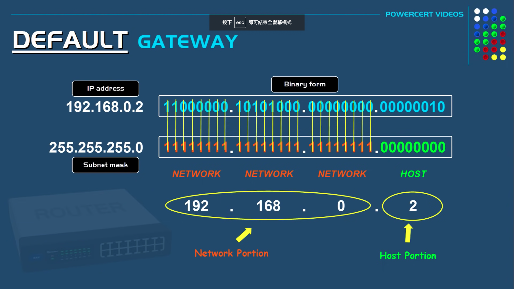

# Networking

重點整理

[TOC]

## Latency/Throughput/Performance
- **延遲 (Latency)**: 將封包從一端傳輸到另一端所需的時間
	
	[圖片連結](https://youtu.be/fPV0-J4DgOE?si=ut34f--Zk4faMAlv)

- **吞吐量 (Throughput)**: 在一段時間內進入/傳出硬碟的資料量
	

- **頻寬 (Bandwidth)**: 在一條邏輯 or 實體通訊路徑中的最大吞吐量
	
	[圖片連結](https://www.oreilly.com/library/view/high-performance-browser/9781449344757/ch01.html)

- **往返時間 (Round-Trip Time, RTT)**: 從發送封包 ～ 接收到回應封包所需的時間
    - 包括 Processing delay, Queuing delay, Transmission delay, Propagation delay
    - 是衡量網路效能的重要指標之一，數值越小表示網路傳輸效率越高
	

### 4 types of packet delay


- **Processing delay**: 處理封包標頭、bit-level 錯誤檢查、決定封包的目的地，所需花費的時間
    - 通常是微秒級 (10^-6^ 秒)
- **Queuing delay**: 封包在 router 的 queue 中等待被處理的時間
	- 取決於 router 的 traffic load
- **Transmission delay**: 封包從 router 的 output port 輸出到 link 上所需花費的時間
	- 取決於封包長度、link 的頻寬
- **Propagation delay**: 封包在 link 上傳播所需花費的時間
	- 取決於 link 的長度、傳播速度
	- Propagation delay 是由傳輸 link 的可用資料速率所決定的，與客戶端, 伺服器之間的距離無關

### Notes
- <strong>網路資料速率</strong>通常以 bits per second (**bps**) 表示; 而<strong>非網路設備的資料速率</strong>通常以 bytes per second (**Bps**) 表示
- 內容交付網路 (CDN): 在全球範圍內分發內容並從附近位置向客戶端提供內容，使我們能夠顯著減少所有資料封包的傳播時間
    - 雖然我們無法使資料封包傳輸得更快，但我們可以透過策略性地<strong>將伺服器放置在更靠近使用者的位置來縮短距離</strong>，從而減少傳播延遲
- 最後一哩延遲 (Last-Mile Latency): 事實上，網路延遲主要發生在 家戶、辦公室 :arrow_right: ISP :arrow_right: 網際網路 這段上，而非跨越海洋 or 大陸的海底電纜傳輸過程上
    - 根據連接類型、路由方法、部署的技術，僅前幾跳（最後一哩延遲）就可能需要數十毫秒
        - 光纖: 10-20 毫秒 (平均性能最佳)
        - 電纜: 15-40 毫秒
        - 數位用戶線路 (Digital Subscriber Line, DSL): 30-65 毫秒
    - 可運用 `traceroute` 指令，來追蹤資料封包傳輸時，每一跳的路徑
		
		[圖片出處](https://www.oreilly.com/library/view/high-performance-browser/9781449344757/ch01.html)
- 對於大多數網站來說，**延遲才是效能能瓶頸**，而不是頻寬！
	
	[圖片出處](https://www.oreilly.com/library/view/high-performance-browser/9781449344757/ch10.html#SPEED_PERFORMANCE_HUMAN_PERCEPTION)
- 實務上，作為一個參考依據，收看一個 HD 串流影片約需 2 ~ 10 Mbps 的頻寬，而 4K 影片則需要 25 Mbps 以上的頻寬，具體取決於影片解析度、編/解碼器
- 參考連結: [O'Reilly: High Performance Browser Networking](https://www.oreilly.com/library/view/high-performance-browser/9781449344757/ch01.html)

## Protocol

[圖片出處](https://www.cloudflare.com/zh-tw/learning/ddos/glossary/open-systems-interconnection-model-osi/)


[圖片出處](https://x.com/bytebytego/status/1609083351700475905/photo/1)

 <br>
[圖片出處](https://blog.bytebytego.com/p/network-protocols-run-the-internet)

### Layer 7: Application Layer
#### DNS (Domain Name System)
- 說明: 是一種能將網域名稱轉換成 IP 位址（domain name :left_right_arrow: IP address）的索引查詢服務。DNS 算是一個集合名詞，為各地、各機構的名稱伺服器（name server）所構成的綜合統稱
- DNS 服務的功能:
    - 轉換 網域名稱 :left_right_arrow: IP 位址
    - 支援 網域名稱的別名服務（alias）
	- 支援網頁伺服器的負載平衡: 讓多個 IP 位址都對應到同一個網域名稱，以實現負載平衡
	

- DNS 的分散式、階層式架構
    - Local DNS Server: 位於 ISP 內部，會先查看其快取內容（cache）中是否有匹配的 DNS entry; 若沒有，就會將查詢導向 Root DNS Server，繼續進一步的查詢
        - Local DNS Server 不隸屬於任何一個 DNS 階層式架構的層級，而是一個獨立的 DNS 伺服器，其功能類似於 `/etc/hosts` 檔案
            - Local DNS Server 的快取是一個<strong>動態的、隨時間更新</strong>的資料庫，用於<strong>加速多次查詢相同域名的過程</strong>
			- `/etc/hosts` 檔案則是一個<strong>靜態的、手動設定</strong>的快取檔案，**優先級高於 DNS 伺服器查詢**

		

	- Root DNS Server: 負責管理全球 DNS 名稱空間的最高層級，並<strong>將查詢導向下一層的 TLD DNS Server</strong>
	- Top Level Domain DNS Server: 負責管理特定頂級域名（TLD）的 DNS 記錄，並將查詢導向下一層的 Authoritative DNS Server
	- Authoritative DNS Server: 負責管理特定網域名稱的 DNS 記錄，並回答 DNS 查詢
	
	

- DNS 查詢的兩種方式
    - Recursive Query: 客戶端會先對 Resolver Server 發送 DNS 查詢請求後，DNS 伺服器會<strong>將查詢導向下一層的 DNS 伺服器，直到找到匹配的 DNS 記錄，並將結果返回給客戶端</strong>
        - **預設採用這個 DNS 查詢方式，因為對客戶端較為簡單，只需等待最終答案即可**
		

    - Iterative Query: 客戶端會先對 Resolver Server 發送 DNS 查詢請求後，DNS 伺服器會將查詢導向下一層的 DNS 伺服器，但<strong>不會等待結果，而是將查詢結果返回給客戶端，讓客戶端自行處理</strong>
        - 減少對 DNS Server 的負擔，但對客戶端較為複雜，因為它必須處理多個查詢請求，直到獲得最終答案，故查詢過程可能較慢
		

- DNS 查詢流程
    - 當客戶端發送 DNS 查詢時，Local DNS Server 會先查看其快取內容中是否有匹配的 DNS entry; 若沒有，就會將查詢導向 Root DNS Server，繼續進一步的查詢
    - Root DNS Server 會將查詢導向下一層的 TLD DNS Server
    - 再將查詢導向下一層的 Authoritative DNS Server，最終回答 DNS 查詢
- DNS 紀錄的類型
	

	- **A (Address) Record**: 將網域名稱 :arrow_right: IPv4 位址
    	- 使用情境: IP 位址查詢，這樣可以讓使用者的裝置連接並載入網站，而<strong>使用者無需記住並輸入實際 IP 位址</strong>
		

	- **AAAA (IPv6 Address) Record**: 將網域名稱 :arrow_right: IPv6 位址
    	- 使用情境: **僅當網域同時擁有 IPv4、IPv6 位址，且相關的用戶端裝置被設定為使用 IPv6 時，才會使用 AAAA 記錄**
      	- 雖然所有網域都有一個或多個 IPv4 位址以及相對應的 A 記錄，但因為<strong>並非所有網域都有 IPv6 位址，也並非所有的使用者裝置都被設定為使用 IPv6</strong>
		

	- **CNAME (Canonical Name) Record**: 將網域名稱 :arrow_right: 另一個網域名稱
    	- 使用情境: 通常，**當網站具有子網域（例如: blog.example.com 或 shop.example.com）時，這些子網域將具有指向根網域 (example.com) 的 CNAME 記錄**。這樣，**如果主機的 IP 發生變更，則僅需要更新根網域的 DNS A 記錄**，這樣所有 CNAME 記錄都會跟隨對根所做的任何變更
		

	- **MX (Mail Exchange) Record**: 將網域名稱 :arrow_right: SMTP 郵件伺服器的 IP 位址

    	> MX 紀錄必須直接指向 A 紀錄 or AAAA 紀錄，而不能指向 CNAME 紀錄

    	- 使用情境: 
        	- 假設在一個大型企業中，有多個 SMTP 郵件伺服器，可提供備援方案。若主郵件伺服器無法存取，電子郵件會自動轉向備用伺服器，這樣可以提高郵件服務的穩定性、可靠性
        	- 假設在一個大型企業中，有多個 SMTP 郵件伺服器，可提供負載平衡。這樣可以分散郵件流量，減少單一伺服器的負載
		
		


	- **NS (Name Server) Record**: 將網域名稱 :arrow_right: DNS 伺服器的 IP 位址

		> **NS 紀錄不能指向 CNAME 紀錄**，因為 CNAME 紀錄是用來指向另一個網域名稱的，而 **NS 紀錄是用來指向 DNS 伺服器的 IP 位址的**

		- **更新 NS 記錄時，可能需要過幾個小時才能將變更複製到整個 DNS 中**，這是因為 DNS 記錄有一個 TTL（Time to Live）值，這個值決定了 DNS 記錄在 DNS 伺服器上保留的時間

    	- 使用情境: <strong>告訴網際網路要去哪一個 Authorative DNS Server 才能找到</strong>欲查詢的網域的 IP 位址。若沒有正確設定的 NS 記錄，使用者將無法載入網站或應用程式
		

	- **PTR (Pointer) Record**: 反向查詢 IP 位址 :arrow_right: 網域名稱
		- 使用情境:
    		- **反垃圾郵件**: 有些電子郵件反垃圾郵件篩選器會使用反向 DNS 查詢來檢查電子郵件地址的網域名稱，並查看其所關聯的 IP 位址是否可能被合法電子郵件伺服器使用
    		- **日誌記錄**: 系統記錄檔通常只會記錄 IP 位址; 而反向 DNS 查詢可以將這些 IP 位址轉換為網域名稱，以取得更易於閱讀的記錄檔

		 <br>
		[圖片出處](https://www.google.com/url?sa=i&url=https%3A%2F%2Fmailtrap.io%2Fblog%2Fptr-records%2F&psig=AOvVaw2KzlX4G-5-pnjQ0tv-L7zu&ust=1723278085915000&source=images&cd=vfe&opi=89978449&ved=0CBEQjRxqFwoTCJj9saa954cDFQAAAAAdAAAAABAK)

	- **SOA (Start of Authority) Record**: 是每個 DNS 區域的核心部分，包含了與該網域或區域相關的重要資訊
		

	- **SRV (Service) Record**: **為特定的服務（例如: VoIP、即時訊息）指定主機、port**。大多數其他 DNS 記錄只指定一個伺服器或一個 IP 位址，但 SRV 記錄還包括該 IP 位址的一個連接埠。**一些網際網路通訊協定需要使用 SRV 記錄才能運作**

		> **SRV 紀錄的伺服器名稱欄位必須指向 A 紀錄 or AAAA 紀錄**，而不能指向 CNAME 紀錄

		

	- **TXT (Text) Record**: 用於存儲任意文本資訊
    	- 使用情境: 
        	- 垃圾郵件防護
            	- SPF（Sender Policy Framework）: TXT 記錄常用於定義 SPF 規則，這些規則<strong>指定哪些郵件伺服器被允許代表你的網域發送電子郵件，這有助於防止垃圾郵件、釣魚攻擊</strong>
					```txt
					v=spf1 include:_spf.example.com ~all
					```

            	- DKIM（DomainKeys Identified Mail）: TXT 記錄也用於<strong>存儲 DKIM 公鑰，這些公鑰用於驗證電子郵件的來源，確保郵件未被篡改</strong>
					```txt
					v=DKIM1; k=rsa; p=公鑰
					```

        	- 網域擁有權驗證
            	- SSL/TLS 證書驗證: 一些憑證頒發機構（CA）會要求你添加一個特定的 TXT 記錄，以<strong>驗證你對網域的控制權，從而頒發 SSL/TLS 證書</strong>

		

- 參考連結:
    - [AWS: Supported DNS record types](https://docs.aws.amazon.com/Route53/latest/DeveloperGuide/ResourceRecordTypes.html)
    - [Microsoft: Recursive and Iterative Queries](https://learn.microsoft.com/en-us/previous-versions/windows/it-pro/windows-2000-server/cc961401(v=technet.10)?redirectedfrom=MSDN)
    - [Cloudflare: 什麼是 DNS 記錄？](https://www.cloudflare.com/zh-tw/learning/dns/dns-records/)

#### HTTP (HyperText Transfer Protocol)
- 說明: 在 WWW 上，Client :left_arrow_right: Server 之間的傳輸通訊協定。採用 Request/Response 機制、連結導向服務的主從式架構
- 特色:
    - HTTP 為<strong>無狀態協定（stateless protocol）</strong> ➞ 亦即，server 不必保留先前的請求 or 連線
	- 支援已存取過的網頁內容 => **快取（caching）** 能力
	- 允許代理伺服器（proxy server）負責處理網路快取
		

- HTTP 協定的版本演進
    - **HTTP/1.0**: 最初在 1989 年所發起制定，採用<strong>單一連線方式，每次只能處理一個請求</strong>
    - **HTTP/1.1: 解決重複 TCP 連線的問題**
        - HTTP/1.1 採用 pipelining 的機制
        - **持久連接 (keep-alive)**
        - 更多的快取緩存策略（`Etag`, `If-Unmodified-Since`, `If-Match`, `If-None-Match`）
        - Host 字段來區分同一台實體主機中的多台虛擬主機
        - 新增更多的 HTTP 方法（`PUT`, `PATCH`, `DELETE`, `CONNECT`, `TRACE`, `OPTIONS`）
    - **HTTP/2: 解決頭部阻塞（head-of-line blocking）問題**
		- **多路複用 (request multiplexing)**: 在同一個 TCP 連線中，同時發送、接受多個請求，並且不用等到前一個請求收到回應，透過這個機制，解決了過往在 HTTP/1.1 的頭部阻塞問題

			> 頭部阻塞問題（head-of-line blocking, HOL）: 如果有任一個請求要操作很久或傳輸包流失，那就會阻塞整個 pipeline 的工作

		- **優先請求順序**: HTTP/2 版本中，每個請求或回應的所有數據包，稱之為一個數據流，並且，每個數據流擁有一個唯一編號 ID (stream ID)。每個數據包在發送的時候就會戴上對應的數據流編號 ID，**客戶端還能指定數據流的優先級，優先級越高服務器也會越快做出回應**
		- **標頭 (header) 訊息壓縮**: HTTP/2 使用 HPACK 壓縮算法，**將 HTTP 標頭壓縮，減少傳輸的大小**
		- **伺服器主動推送**(server push): **HTTP/2 允許伺服器端主動向客戶端推送數據，這能協助減少客戶端的請求次數**
    		- 例如: 瀏覽器在過去要請求 index.html 與 style.css 來渲染完整的畫面；透過 server Push，可以在瀏覽器請求 index.html 時，也由伺服器主動發送 style.css，這樣只需要一輪 HTTP 的請求，就可以拿到所需的所有資源

    - **HTTP/3: 使用 QUIC 協定，並且在 UDP 上運行**，以提升效能
        - QUIC 通訊協定由 Google 於 2012 年開發，QUIC 專為行動密集型網際網路使用而設計，在這種環境中，人們攜帶的智慧型手機會在一天中不斷地從一個網路切換到另一個網路。開發第一個網際網路通訊協定時情況並非如此
        - **採用 QUIC 協定代表 HTTP/3 將依賴於 UDP 協定**，而不是 TCP 協定。**切換到 UDP 將使線上瀏覽時的連線速度、使用者體驗更快**

	 <br>
	[圖片出處](https://www.google.com/url?sa=i&url=https%3A%2F%2Fwww.researchgate.net%2Ffigure%2FComparison-of-HTTP-versions_fig1_312560536&psig=AOvVaw1tjew0NSmcpt1V9hpauvbp&ust=1723305811412000&source=images&cd=vfe&opi=89978449&ved=0CBEQjRxqFwoTCOCgrsek6IcDFQAAAAAdAAAAABAE)


- HTTP 方法
    - 說明:
        - GET: 取得資源
        - HEAD: 與 GET 類似，但只回傳表頭資訊，不回傳實際資源（body）。常用於<strong>檢查資源是否存在，以及獲取資源的 metadata</strong>
        - POST: 新增資源，通常會導致狀態變更，或對伺服器產生副作用。常用於<strong>提交表單 or 上傳文件</strong>
        - PUT: 更新資源，會將 request payload <strong>取代目標資源當前所有的內容。若資源不存在，會建立新的資源</strong>
        - DELETE: 刪除資源
        - CONNECT: 建立客戶端 :left_arrow_right: 伺服器的隧道（tunnel），通常用於<strong>加密通訊，例如: HTTPS</strong>
        - OPTIONS: 用於描述伺服器支援的方法，並回傳相關的 HTTP 表頭資訊。常用於<strong>檢查跨域資源共享（CORS）政策</strong>
        - TRACE: 執行一個 loop-back 測試，用於<strong>追蹤 request 的路徑，主要用於除錯、測試</strong>
        - PATCH: 對資源進行<strong>局部更新，只修改資源的部分內容</strong>，而不是替換整個資源
    - **安全方法**（Safe Methods）: 不會對資源進行修改的方法
        - GET, HEAD, OPTIONS, TRACE
    - **冪等方法**（Idempotent Methods）: 無論對資源進行多少次操作，結果都是一樣的
        - GET, HEAD, **PUT, DELETE**, OPTIONS, TRACE
- HTTP 訊息
    - HTTP 是一個 text-based 的傳輸協定，分成 **request** 和 **response** 兩種訊息
		```text
		<method> <URL> <version>
		<header>
		...
		...
		<header>

		<body> 
		```

		

		```text
		<version> <status code> <status message>
		<header>
		...
		...
		<header>

		<body> 
		```

		

- HTTP 表頭（header）
    - 說明: 用於傳遞關於 **request 或 response 的附加資訊**
    - 格式: **key: value**
	- 常見的 HTTP header
		

		- Conditionals 類別: Client可能在之前已經取得過相關的資源，並且保有一份備份，如果此資源沒有更新時，可以不需要透過網路在傳輸一次，以節省時間及頻寬
            - **ETag**: Response中，對於回傳的資料加的一個 tag，有點像是以資料為輸入的 hash 值，讓 client 可以後續使用，會在 `If-Match`及 `If-None-Match`，以下說明
                - Server 端接收請求，檢查是否與目前表示的 **ETag 值相同**，若相同則表示<strong>資源並未被更動</strong>
            - **If-Match**: Server 只有在 match 時，才會動作，通常在 PUT 操作時用於避免 lost update 的問題，例如: 你想編輯一頁 Wiki 的內容，你先要求了本來的頁面，server 回傳了 `Etag: A`，當你編輯完送出時，帶上 `If-Match: A` 的 header，表示只有當內容還是 A 版本時才會更新成功，如果在你編輯的時候有人已經先更新了頁面內容，則會回傳 412: Precondition Failed，如此一來，避免你的更新會蓋掉別人的更新
            - **If-None-Match**: Server 只會在沒有 match 時，才會回傳資料，因為如果 match 就代表 client 擁有的資料的 copy 還是最新的，就回傳 304: Not Modified，而不會再傳一次資料，這樣可以節省頻寬
            - **Last-Modified**: Response 中使用，用來說明回傳的資料最近修改的時間，好讓 client 可以 cache 起來並搭配`If-Modified_Since` 來更新，詳情見下面
            - **If-Modified-Since**: Request 使用此 header 來決定 cache 有沒有過期了，比如說上次拿取資源時 server response 了Last-Modified: Sun, 05 Sep 2021 01:40:14 GMT，這次再 request 相同資源時，就可以帶上 `If-Modified-Since`: Sun, 05 Sep 2021 01:40:14 GMT，表示若在 2021-09-05 這個時間點之後，資料並沒有更新，則 server 可以回傳 304: Not Modified，client 就能直接使用 cache， 而不需要再透過網路下載資料，反之，資料有更改的話，就回傳新的資料並帶上新的 `Last-Modified`
		- Connection management 類別: 用於管理連線
			- **Connection**: 用來告訴 server 這個連線是要<strong>持續使用 or 一次性的</strong>，如果是 keep-alive，則 server 會保持連線，直到 client 關閉連線，這樣可以節省建立連線的時間，提高效能
			- **Keep-Alive**: 用來告訴 server 這個連線要<strong>保持多久，通常是一個時間，如果超過這個時間，server 會主動關閉連線</strong>，這樣可以避免 server 一直保持連線，浪費資源

- HTTP 狀態碼
    - <strong>HTTP 狀態碼共分為五大類，第一個數字代表伺服器回應的大類</strong>，第二、三個數字再分為中類、小類
        - 1xx (Informational) — 資訊
        - 2xx (Successful) — 成功
        - 3xx (Redirection) — 重新導向
        - 4xx (Client Error) — 客戶端 錯誤
        - 5xx (Server Error) — 伺服端 錯誤
		 <br>
		[圖片出處](https://javaconceptoftheday.com/http-status-codes-cheat-sheet/)

	- 觀念釐清
        - 301 vs. 302

			

        - 401 vs. 403
			

- 參考連結:
    - [HTTP/1、HTTP/1.1 和 HTTP/2 的區別](https://www.explainthis.io/zh-hant/swe/http1.0-http1.1-http2.0-difference)
    - [Cloudflare: 什麽是 HTTP/3？](https://www.cloudflare.com/zh-tw/learning/performance/what-is-http3/)
	- [MDN: HTTP request methods](https://developer.mozilla.org/en-US/docs/Web/HTTP/Methods)
    - [HTTP headers 簡介: 一些常用的 headers](https://homuchen.com/posts/http-headers/)
    - [HTTP 狀態碼 (Status Codes)](https://notfalse.net/48/http-status-codes)

### Layer 3: Network Layer
#### subnet
- 說明: subnet（子網）是網路的一部分，它<strong>由較大網路中的 IP 位址範圍劃分而來</strong>。子網的目的是<strong>將一個大的網路劃分成較小的、更容易管理的部分，從而提高網路的效率、安全性</strong>
- 優點:
    - 提高安全性: 子網劃分<strong>可以將不同的網段隔離開來，限制不同網段之間的通訊，從而提高網路安全性</strong>
    - 提高效率: 子網劃分有助於減少網路擁塞，因為<strong>封包會被限制在子網內部流動，而不會影響到整個大網路</strong>
    - 方便管理: 將<strong>大網路劃分為多個子網，可以更容易管理和分配 IP 地址</strong>，並進行故障排除

	
	

- 子網遮罩 (subnet mask): 用於區分 IP 位址的網路部分（Network bits）、主機部分（Host bits）
	
	
	

- 參考連結: [影片: IP address network and host portion | subnet mask explained](https://www.youtube.com/watch?v=eHV1aOnu7oM&feature=youtu.be)

#### CIDR (Classless Inter-Domain Routing)
- 說明: <strong>可依據實際需求，彈性設定所需的網段 & IP address 數量，使用「斜線表示法」來定義 subnet mask 的長度</strong>; 而不受限於傳統的 A, B, C 類別，例如 Class A 是 /8，Class B 是 /16，Class C 是 /24
- 優點:
    - 減少 IP 位置浪費: 因為 CIDR 可以讓我們更靈活地指派 IP 位址的網路、主機識別符，所以<strong>可使用 CIDR 為特定網路提供所需數量的 IP 位址並減少浪費</strong>。此外，CIDR 減少了路由表項目，簡化了封包路由
    - 建立虛擬私有雲端（VPC）: VPC 是託管在 AWS 雲端中的私有數位空間，其允許我們在隔離且安全的環境中佈建工作負載。**VPC 在連線的裝置之間傳輸封包時使用 CIDR IP 地址**

	
	

- 參考連結: [什麼是 CIDR ?](https://aws.amazon.com/tw/what-is/cidr/)

#### IP (Internet Protocol)
- 用途: 負責將封包從一個裝置傳送到另一個裝置
- 重要觀念:
	- IP 流量可以使用 TCP 或 UDP 傳送。TCP 會先執行三次握手，以確保兩個裝置都準備好接收資料，才會開始傳輸; 而 UDP 則是無連接的協定，不需要握手過程
- IPv4
	- **IPv4 address 的總長度為 32 bits**，並且以 `.` 劃分為 4 個區段
    - **每一區段的 number range = (0 ~ 255)~10~**
    - 每一區段分別為 8 個 bits ➞ **IPv4 中的每個數字代表 8 bits**
    - 總共 **可分配出 2^32^ 個 unique 的 IPv4 address**
    - **採用句號( `.` )來分隔各區段**
    - 示意圖:
      	
        

	- IPv4 datagram 內容
    	- 從上至下，第 1 ～ 5 列（IP datagram header）為必填欄位，第 6 列（Option）為選填欄位
        	- IP datagram header: 20 bytes
      	- IP datagram 分段後，要重組成原本的 IP datagram，需要以下欄位:
          	- Total Length (原本 IP datagram 的大小)
          	- Identification (IP 分段封包才能知道它是來自哪一個原本的 IP)
          	- Flags (知道哪個 IP 分段才是最後一個分段，不然無法確認 IP 分段到底到哪結束)
          	- Fragment Offset (當要重組的時候，才能組成原本的 IP datagram，不然順序會錯亂)
		
		

		- **Version**: 4 bits，表示 IP 協定的版本
		- **Internet Header Length**: 4 bits，表示 IP 標頭的長度，以 32 bits 為單位
		- **Type of Service**: 8 bits，用於指定 IP 封包在傳送過程中要求的服務類型
		- **Total Length**: 16 bits，表示整個 IP 封包的長度，包括 header, data
		- **Identification**: 16 bits，用於識別 IP 封包的分段（fragmentation）、重組（reassembly）所使用
		- **Flags**: 3 bits，用於控制 IP 封包是否需要分段
		- **Fragment Offset**: 13 bits，指定分段封包的偏移量。用於辨識分段封包的順序，以及將分段封包重組成原始封包
		- **Time to Live (TTL)**: 8 bits，表示 IP 封包在網路上的生命週期，每經過一個 router，TTL 就會減少 1
		- **Protocol**: 8 bits，表示 IP 封包中的資料是使用哪種協定傳送的
		- **Header Checksum**: 16 bits，這個數值主要用來檢錯用的，確保封包被正確無誤地接收到
		- **Source IP Address**: 32 bits，表示封包的發送者 IP 位址
		- **Destination IP Address**: 32 bits，表示封包的接收者 IP 位址

- IPv6
    - 為下一代的 IP address 規範，採 **16 進制**(hexadecimal)表示
	- **IPv6 address 的總長度為 128 bits**
	- **IPv6 中的每個字元(可能是數字 or 字母)代表 4 bits**
	- 總共 **可分配出 2^128^ 個 unique 的 IPv6 address**
	- **採用分號( `:` )來分隔各區段**
	- 當 IPv6 address 中有<strong>許多個 0 時，可以改用 `::` 代替，但是一段 IPv6 address 中只能使用一次 `::`</strong>
	- 優點:
		- **IPv6 提供更寬廣的 IP 定址空間**
		- **IPv6 提供傳輸流量等級(Traffic Class)的分類**
		- **IPv6 簡化封包標頭**
		- IPv6 datagram 增加了 **Flow Label**, **Priority** 兩個欄位，用來支援像視訊、語音這類即時服務的需求，以<strong>提高 QoS 的品質</strong>
		- IPv6 **預設使用 IPsec，來提升安全性**
- IPv4 vs. IPv6
	- datagram header 比較
		 <br>
		[圖片來源](https://www.google.com/url?sa=i&url=https%3A%2F%2Fwww.researchgate.net%2Ffigure%2FComparison-of-IPv4-and-IPv6-headers-structures-15_fig1_269810379&psig=AOvVaw19Bebw4_mkqgbscgtst2cQ&ust=1723268287134000&source=images&cd=vfe&opi=89978449&ved=0CBEQjRxqFwoTCOiX9OKY54cDFQAAAAAdAAAAABAJ)

    | 特色\IP 協定版本 | IPv4 | IPv6 |
    | -------- | -------- | -------- |
    | IP address 長度 | **32 bits** | **128 bits** |
	| 間隔方式 | 句號( `.` ) | 分號( `:` ) |
	| IP address 可使用數量 | **2^32^ 個** | **2^128^ 個** |
	| 流量標籤 | 無 | Flow label |
	| 廣播 address | Host number 全為 1 | **以多播、任播來取代廣播** |
	| 自動網路組態設定 | 透過 DHCP Server | 靠 Neighbor Discovery 協定，從鄰近的 router 之資訊取得 |
	| 安全性 | 未強制需使用 IPsec，安全性較低 ↓ | **預設使用 IPsec，安全性較高 ↑** |
	| QoS 機制 | 表頭欄位不支援 | **表頭欄位支援** |
	| 舉例 | `210.59.230.150` | `1079:3:6ED4::44:72BE` |

    > 註: **IPv4 ↔ IPv6 之間可以互相轉換 <br>**

- 參考資料:
    - [IPv4 Addressing and Subnetting](http://www.routeralley.com/guides/ipv4.pdf)
    - [iT Home --- IPv4](https://ithelp.ithome.com.tw/articles/10207980)
	- [iT Home --- 認識 IPv4 與 IPv6 的差異](https://www.ithome.com.tw/tech/92046)
	- [影片: IP Address - IPv4 vs IPv6 Tutorial](https://www.youtube.com/watch?v=ThdO9beHhpA)

#### ICMP (Internet Control Message Protocol)
- 用途: ICMP 是網路層的協定，用於主機、路由器之間傳遞網絡層資訊。其主要功能包括：
	- **錯誤報告**: 當主機, 網路, port, 協定無法送達時，回報錯誤
	- **回應請求**: 使用 Echo Request, Echo Reply 來測試網路連通性 (e.g `ping`)
- 重要觀念:
    - ICMP 與傳輸層通訊協定（TCP 或 UDP）沒有關聯，因此，**ICMP 成為無連線的通訊協定，在傳送 ICMP 訊息之前，一個裝置不需要開啟與另一個裝置的連線**
    - ICMP 通訊協定也不允許綁定裝置上的特定 port
- ICMP 封包
	- ICMP 封包是使用 ICMP 通訊協定的封包。 ICMP 封包含一般 IP 標頭之後的 ICMP 標頭。當路由器 or 伺服器需要傳送錯誤訊息時，ICMP 封包主體或資料區段一律會包含造成錯誤之封包 IP 標頭的副本
    	- ICMP packet = IP header + ICMP message(ICMP header + ICMP data)
		 <br>
		[圖片出處](https://www.google.com/url?sa=i&url=https%3A%2F%2Fwww.astorinonetworks.com%2F2012%2F02%2F13%2Fasa-icmp-error-inspection%2F&psig=AOvVaw2w7nR8du7_lO-fC3yinIRB&ust=1723018168772000&source=images&cd=vfe&opi=89978449&ved=0CBEQjRxqFwoTCPiLwoH134cDFQAAAAAdAAAAABAK)

		- 常見的 ICMP error message
    		- 類型 (Type): 表示 ICMP 訊息的類型，定義了<strong>訊息的總類</strong>
        		- 0: Echo Reply
        		- 3: Destination Unreachable
        		- 8: Echo Request
        		- 11: Time Exceeded
    		- 錯誤代碼 (Code): 用於<strong>進一步細分 Type 的具體情況</strong>。例如: Type 3 (Destination Unreachable) 中
        		- Code 0: Network Unreachable
        		- Code 1: Host Unreachable
        		- Code 3: Port Unreachable
			

- 常用的終端機公用程式就是使用 ICMP 來測試網路通訊的可用性
    - `ping`: 是 traceroute 的簡化版本。**ping 將測試兩個裝置之間的連線速度**，並準確報告封包到達其目的地並返回寄件者裝置所需的時間
        - 可用於衡量網路延遲的指標
    - `traceroute`: 可用來<strong>顯示兩個網際網路裝置之間的路由路徑</strong>。路由路徑是連接路由器的實際物理路徑，請求在到達目的地之前必須通過該路由器
        - 一個路由器與另一個路由器之間的旅程稱為「躍點」 (hop)，而 traceroute 也會報告每個躍點所需的時間，這對於<strong>確定網路延遲的來源</strong>很有用
- 常見的網路攻擊: ICMP 回應要求和回應回覆訊息通常用於執行 ping。不幸的是，網路攻擊可以利用這個過程，製造破壞手段，例如: **ICMP 洪水攻擊、死亡之 ping 攻擊**
    - ICMP 洪水攻擊: 是指<strong>攻擊者嘗試使用 ICMP 回應請求封包壓垮目標裝置</strong>。目標不得不處理和回應每個封包，消耗其運算資源，直到合法使用者無法接收服務
		

    - 死亡之 Ping 攻擊: 是指<strong>攻擊者將大於封包允許大小的 ping 傳送至目標電腦</strong>，造成機器宕機或崩潰。封包在到達其目標的途中被分段，但<strong>當目標將封包重新組裝成其超出最大值的原始大小時，封包的大小會導致緩衝區溢位。</strong>
		- **如今，死亡之 Ping 攻擊基本上已成過去**。但是，較舊的網路裝置仍然可能受到它的影響
- 參考連結:
    - [Cloudflare: 什麼是網際網路控制訊息通訊協定 (ICMP)？](https://www.cloudflare.com/zh-tw/learning/ddos/glossary/internet-control-message-protocol-icmp/)
    - [informIT: ICMP 訊息類型](https://www.informit.com/articles/article.aspx?p=26557&seqNum=5)

## Tools
### netcat (nc)
- 說明: `netcat` 是 Linux 系統中一個多功能的工具程式，雖然它只是一個小程式，但是能夠做的事情很多，就像瑞士刀一樣，**幾乎任何使用 TCP 或 UDP 封包的動作都可以用它來達成，是許多系統管理者常用的網路診斷工具之一**
- 主要功能包括
    - 伺服器 :left_right_arrow: 客戶端模式: 可指定伺服器端監聽指定的 port，或是讓客戶端連接到指定 port，以<strong>實現 client-server socket communication</strong>
		```bash
		# Server 監聽 2389 port 的訊息
		nc localhost 2389
		```

		```bash
		# Client
		nc localhost 2389
		
		# 在終端機畫面上，隨意輸入一段文字
		Hi, server
		```

    - 檔案傳輸: 可以將檔案從一個裝置傳送到另一個裝置

		> 假設在伺服器端有一個檔案叫作 `test`，且在客戶端上有一個檔案叫作 `testfile`

		```bash
		# Server: 監聽 2389 port，並將其內容寫入 test 檔案中
		nc -l 2389 > test
		```

		```bash
		# Client: 將 testfile 檔案內容傳送到伺服器端
		cat testfile | nc localhost 2389
		```

	- 設定連線超時限制: 在某些情況下，我們不希望連線永遠是開放狀態，因此可以透過 `w` 選項來設定連線的超時限制
		```bash
		# Server: 監聽 2389 port
		nc -l 2389
		```

		```bash
		# Client: 連接到 2389 port，並設定連線超時限制為 10 秒
		nc -w 10 localhost 2389
		```

		- 這麼做後，連線將會在 10 秒後自動關閉
		> 請勿在伺服器端使用將 `-w`, `-l` 參數一起使用，因為這樣 `-w` 參數會被視為無效，連線將會一直保持開放狀態，這樣會有風險！

	- `nc` 可支援 IPv4, IPv6 位址，使用 `-4`, `-6` 選項來指定
    	- IPv4
			```bash
			# Server
			nc -4 -l 2389
			```

			```bash
			# Client
			nc -4 localhost 2389
			```

			```bash
			netstat | grep 2389
			```

			```console
			tcp        0      0 localhost:2389          localhost:50851         ESTABLISHED
			tcp        0      0 localhost:50851         localhost:2389          ESTABLISHED
			```

		- IPv6
			```bash
			# Server
			nc -4 -l 2389
			```

			```bash
			# Client
			nc -4 localhost 2389
			```

			```bash
			netstat | grep 2389
			```

			```console
			# 會看到類似以下的結果，這是一個完整的雙向連接，表明本地主機上的這兩個 port 之間的連接狀態為 ESTABLISHED，表示連接已成功建立並正在進行通訊
			tcp        0      0 localhost:2389          localhost:50851         ESTABLISHED
			tcp        0      0 localhost:50851         localhost:2389          ESTABLISHED
			```

	- 禁用讀取 STDIN: 有時候我們不希望 `netcat` 從 STDIN 讀取資料，我們可以在客戶端使用 `-d` 參數來禁用 STDIN
		```bash
		# Server
		nc -l 2389
		```

		```bash
		# Client
		nc -d localhost 2389
		
		# 從鍵盤輸入 "Hi" (即 STDIN)
		Hi
		```

		- 使用 `-d` 選項，從 STDIN 讀取的內容將被禁用，因此 "Hi" 文字不會被傳送到伺服器端
    - 保持伺服器持續運行: 有時候當客戶端斷開連接，我們仍希望伺服器持續運行，可使用 `-k` 選項讓伺服器持續運行
		```bash
		# Server
		nc -k -l 2389
		```
		
		```bash
		# Client
		nc localhost 2389
		
		# 在鍵盤上按下 Ctrl + C 來結束連接
		^C
		```

	- 可設定當客戶端接收到 EOF (End of File) 後，仍保持連線一段時間。通常情況下，`nc` 客戶端在接收到 EOF 字符後會立即終止，但可以使用 `-q` 選項來宣告要在接收到 EOF 後等待多少秒，再終止連接
		```bash
		# Client: 當客戶端接收到 EOF 字符後，將會等待 5 秒後再終止連接
		nc  -q 5  localhost 2389
		```

    - 可使用 UDP 協定: 預設情況下，`nc` 使用 TCP 協定，但是我們可以使用 `-u` 選項來指定要使用 UDP 協定
		```bash
		# Server
		nc -4 -u -l 2389
		```

		```bash
		# Client
		nc -4 -u localhost 2389
		```

		```bash
		netstat | grep 2389
		```

		```console
		# 會看到類似以下的結果，表示當前的連線是採用 UDP 協定
		udp        0      0 localhost:42634         localhost:2389          ESTABLISHED
		```

	- 參考連結: [8 Practical Linux Netcat NC Command Examples](https://www.thegeekstuff.com/2012/04/nc-command-examples/)

### ping
- 說明: `ping` 工具會透過發送 ICMP 協定的 Echo Request 封包給目的地設備，來測試網路連接的問題
- 主要功能: 能提供以下兩種資訊
    - 回傳的回應數量
    - 花費多久時間來回應
- 常見的 `ping` 指令的選項
    - `-a`: 若能解析，就會將目的地的 IP 位址，解析為 hostname
	- `-f`: 防止 ICMP Echo Request 訊息被路由器分段
    - `-i <TTL>`：設置 Time To Live（TTL）值，範圍為 1 ~ 255
    - `-s <size>`: 指定要傳送的封包大小，預設為 32 bytes
    - `-c <count>`: 指定要傳送的封包數量，預設為 4 個
    - `-i <TTL>`: 設定 Time To Live（TTL）值，範圍為 1 到 255
- 常見用法
	- 透過 `ping` 指令，向 `www.google.com` 發送 5 個封包，每個封包大小為 1500 bytes
		```bash
		sudo ping -c 5 -l 1500 www.google.com
		```

		
		- 說明: 0% packet loss 表示發送到 `www.google.com` 的每個 ICMP Echo Request 封包都已回傳成功，代表網路連接正常

	- 透過 `ping` 指令，向 localhost IP 位址(loopback address)發送封包，檢測<strong>作業系統的網路功能是否正常</strong>
		```bash
		ping 127.0.0.1
		```

	- 透過 `ping` 指令，查詢目標 IP 位址的 hostname，有助於診斷網路問題 (例如: 確認某個 IP 地址是否正確對應到預期的主機)
		```bash
		ping -a 192.168.1.22
		```

	- 透過 `ping` 指令，測試本機與路由器之間的連線狀況

		> 在內網中，路由器(router)的預設 IP 位址通常是 `192.168.2.1`

		```bash
		ping 192.168.2.1
		```

- 參考連結: [How to Use the Ping Command for Testing in Windows](https://www.lifewire.com/ping-command-2618099)

### traceroute
- 說明: `traceroute` 是一個常用的網絡診斷工具，用於追蹤封包從 來源主機 :arrow_right: 目標主機 所經過的路徑
- 安裝方法:
    - Ubuntu
		```bash
		sudo apt-get install traceroute
		```

    - CentOS
		```bash
		sudo yum install traceroute
		```

- 基本用法
	- 查詢封包到達目標 IP address 所經過的路由器、其 IP 地址、回應時間
    	- 在 `traceroute` 工具中，<strong>只有目標 IP 位址是必填的參數</strong>
		```bash
		traceroute www.google.com
		```

		

- 常用參數
    - `-w`: 設定等待每個回應的時間，預設為 5 秒
    - `-q`: 設定要發送的封包數量，預設為 3 個
    - `m`: 設定最大 TTL（Time To Live）值，也就是跳躍數(hop)，預設為 30 次跳躍
    - `f`: 設定起始 TTL 值，預設為 1
    - `-s`: 使用指定的來源 IP 位址作為封包發送的起點
    - `-n`: 禁止將 IP 位址解析為 hostname
    - `-F`: 禁止將探測封包（ICMP Echo Request）分段傳送，確保封包不會被路由器分段，以更準確地測試網路連線的狀況
- `ping` vs. `traceroute`
	- `ping`: 
    	- 是一個核心的網路連線除錯工具，它使用 Echo Request、Echo Reply 的 ICMP 封包來判斷某個 IP 位址是否可以正確抵達並且有回應
		- `ping` 還會提供 來源地址、目標地址 之間的往返時間 (Round-Trip Time, RTT)，通常以毫秒為單位測量
    - `traceroute`:
        - 用於確定封包到達其目的地所經過的路由路徑
        - `traceroute` 不僅會識別封包經過的每個路由器，還會測量每個路由節點 (hop) 所經歷的延遲時間
    - 統整: 這兩個工具在網路連接除錯中都很常使用
        - `ping` 用來<strong>快速測試目標是否可到達，並檢測網路連接的延遲</strong>
        - `traceroute` 則用來<strong>追蹤封包的路徑，幫助識別網路路由上的問題</strong>
- 參考連結: [Linux manual page: traceroute](https://linux.die.net/man/8/traceroute)

### mtr
> `ping`, `traceroute`, `mtr` 這三個都是用來測試網路連線的工具，但是 `mtr` 是 `ping` 和 `traceroute` 的結合體，它可以提供更多的資訊，並且可以持續監控網路連線的狀況

> `ping`: 透過發送 ICMP Echo Request 封包並計算往返時間來測試網路連線的狀況

> `traceroute` 和 `mtr`: 使用 TTL 來追蹤封包從 來源主機 :arrow_right: 目標主機 的路由狀況

- 說明: `mtr` 是一個網路診斷工具，它結合了 `ping` 和 `traceroute` 的功能，可以提供更完整的資訊，並且可以持續監控網路連線的狀況
- 安裝方法:
	- Ubuntu
		```bash
		apt update && apt upgrade
		apt install mtr-tiny
		```

	- CentOS
		```bash
		yum update
		yum install mtr
		```

- 產生 `mtr` 報告
	```
	sudo mtr -rw www.google.com
	```

  	- `r`: 產生報告 (若沒有加上 `-r` 選項，則會在互動式環境下，持續監控)
  	- `w`: 顯示每個躍點的完整主機名稱

- 閱讀 `mtr` 報告
	

	- `mtr` 報告中的每個編號行代表一個躍點(hop)
    	- 躍點是封包到達目的地所經過的網路節點
    - `Loss%`: 表示每經過一個躍點，所發生的封包遺失百分率
    - `Snt`: 表示發送的封包數量 (預設為 10 個封包)
    - 衡量延遲的指標 (以毫秒為單位)
		- `Last`: 表示最後一個封包的往返時間
        - `Avg`: 表示<strong>所有封包的平均往返時間</strong>
        - `Best`: 表示所有封包的最低往返時間 = (最佳)
        - `Wrst`: 表示所有封包的最高往返時間 = (最差)
        - `StDev`: 提供了每個主機的延遲的標準差。當標準差越高，延遲測量之間的差異就越大
    - 通常，`mtr` 報告可分為三個部分
        - 前 2 ~ 3 躍點: 通常代表 來源主機的 ISP
        - 中間的躍點: 通常代表 傳輸過程中所經過的路由器
            - 不幸的是，如果是中間躍點出現問題，兩個 ISP 解決此問題的能力都有限
        - 最後 2 ~ 3 躍點: 通常代表 目的地主機的 ISP

- 分析 `mtr` 報告
  
	> 在分析 `mtr` 報告時，我們最需要關注的兩件事: **封包遺失率** 和 **延遲**

	 <br>
	[圖片出處](https://www.linode.com/docs/guides/diagnosing-network-issues-with-mtr/#analyze-mtr-reports)

	- 根據上圖，若在任一躍點上，看到 `Loss` 值異常，則可能是該躍點的路由器出現問題
    	- 然而，因為部分 ISP 會對 `mtr` 工具所使用的 ICMP 協定進行流量限制，因此要觀察後續的躍點才能確定問題所在。若後續躍點的 `Loss` 值為 0%，則表示 ICMP 封包受到 ISP 流量限制

	 <br>
	[圖片出處](https://www.linode.com/docs/guides/diagnosing-network-issues-with-mtr/)

	- 根據上圖，若在躍點 2 ～ 躍點 3、躍點 3 ～ 躍點 4 發生 60 % 的封包遺失率，但是後續的躍點卻沒有繼續遺失封包，則表示 ICMP 封包受到 ISP 流量限制，因為後續的幾個躍點僅發生 40 % 的封包遺失率 :arrow_right: **當 `mtr` 報告中出現不同的封包遺失率時，請總是相信較後面的躍點**
	- 有時候，封包遺失的情況會發生在封包回傳的過程，因為封包可以成功地傳送到目標主機上，但卻不容易回傳到來源主機上 :arrow_right: 因此，建議最好<strong>雙向收集 `mtr` 報告，才能較為準確地判斷問題所在</strong>
	- 實務上，封包在傳輸的過程中可能會遇到一些不可避免的問題 (例如: 網際網路可能存在網路退化問題、路由器負載限制、網路維護問題等) :arrow_right: **因此，`Loss` 值在 10 % 左右的少量封包遺失率，都是可接受的範圍**

	 <br>
	[圖片出處](https://www.linode.com/docs/guides/diagnosing-network-issues-with-mtr/)

	- 根據上圖，在躍點 3 ～ 躍點 4 發生明顯的網路延遲，並且在後續的躍點中，網路延遲秒數無明顯增加，則可以合理地假設第四個路由器可能有問題

	 <br>
	[圖片出處](https://www.linode.com/docs/guides/diagnosing-network-issues-with-mtr/)

	- 根據上圖，乍看之下雖然躍點 4 ～ 躍點 5 之間的網路延遲秒數較高，但是在後續的躍點中，網路延遲秒數急劇下降，則表示第五個路由器有 ICMP 流量限制 :arrow_right: **在評估 `mtr` 報告中，關於網路延遲的問題時，請先看最後一個躍點的 `Loss` 值**
- 在 `mtr` 報告中所發生的常見問題
    - 情況 1: 目標主機的網路連線設定異常
		 <br>
		[圖片出處](https://www.linode.com/docs/guides/diagnosing-network-issues-with-mtr/)

		- 根據上圖，躍點 8 發生了 100 % 的封包遺失率，並且這是最後一個躍點
    		- 表示雖然流量確實傳送到目標主機了，但因為目標主機未發送回應，這可能是由於網路 or 防火牆 (iptables) 規則設定不當，導致主機丟棄 ICMP 封包
	- 情況 2: 家用 or 商用路由器的 ICMP 流量限制
		 <br>
		[圖片出處](https://www.linode.com/docs/guides/diagnosing-network-issues-with-mtr/)

		- 根據上圖，躍點 2 雖然發生了 100 % 的封包遺失率，但是在後續的躍點中，封包遺失率為 0%，這表示躍點 2 的路由器可能對 ICMP 流量進行了限制
    - 情況 3: ISP 的路由器設定異常
		

		- 當 `mtr` 報告中出現 **???** 時，可能表示路由器的路由設定不正確，導致封包無法傳送到目標主機

		 <br>
		[圖片出處](https://www.linode.com/docs/guides/diagnosing-network-issues-with-mtr/)

		- 根據上圖，躍點 4 的路由器設定異常，導致封包在路由器之間循環傳送，需通知網路管理員來解決此問題
    - 情況 4: 受到 ICMP 封包的速率限制，導致封包遺失
		 <br>
		[圖片出處](https://www.linode.com/docs/guides/diagnosing-network-issues-with-mtr/)

		- 根據上圖，躍點 5 發生 60 % 的封包遺失率，但是在後續的躍點中，封包遺失率為 0%，這表示躍點 5 的路由器可能對 ICMP 流量進行了限制
    - 情況 5: 超時問題 (timeout)
		 <br>
		[圖片出處](https://www.linode.com/docs/guides/diagnosing-network-issues-with-mtr/)

		- 根據上圖，有很多種原因可能會導致發生<strong>超時問題</strong>，例如: **路由器丟棄 ICMP 封包, 封包返回路由異常** 等
    		- 超時問題，並<strong>不一定會導致封包遺失，但是可能會導致延遲增加，封包仍能正確送達目標主機</strong>
    		- 超時問題可能發生在路由器基於服務品質（QoS），而丟棄 ICMP 封包; 或是封包返回路由異常
- 參考連結: [Diagnosing Network Issues with MTR](https://www.linode.com/docs/guides/diagnosing-network-issues-with-mtr/)

### tcpdump/wireshark
#### tcpdump
- 說明: `tcpdump` 是一個網路封包分析工具，可以在 <strong>CLI 介面上</strong>捕獲並分析網路上的封包，常用於網路管理、過濾流量、安全監控、故障排除。`wireshark` 是 `tcpdump` 的 GUI 版本，提供了更多的功能、更直觀的操作介面
- 基本用法
    - 查看網路介面上的封包
		```bash
		# 查看所有網路介面上的封包
		sudo tcpdump -i any
		```

		```bash
		# 查看 eth0 網路介面上的封包
		sudo tcpdump -i eth0
		```

	- 查看 HTTPS 協定的封包: 捕獲所有關於 port 443 的封包
		```bash
		sudo tcpdump -nnSX port 443
		```

		- `nn`: 直接顯示 port 號，而不是將 port 號解析為服務名稱
		- `-S`: 顯示每個 TCP 封包的絕對序列號
		- `-X`: 以十六進位和 ASCII 碼的形式顯示封包內容
	- 查看 tcpdump 原始完整的輸出內容
		```bash
		sudo tcpdump -ttnnvvS
		```

		- `tt`: 顯示原始的時間戳記
		- `nn`: 直接顯示 port 號，而不是將 port 號解析為服務名稱
		- `vv`: 顯示詳細的輸出資訊
		- `S`: 顯示每個 TCP 封包的絕對序列號

- 常見用法
    - 擷取明碼顯示的密鑰、文字、使用者名稱、密碼等
		```bash
		tcpdump -A -i eth0 <port http || ftp || telnet> | grep -i 'user\|pass\|login'
		```

	- 監控可疑域名的流量
		```bash
		tcpdump -i eth0 dst host <suspicious.com>
		```

	- 監控來自特定 IP 範圍的流量
		```bash
		tcpdump src net <IP_RANGE_OF_COUNTRY>
		```

	- 監控來自 SMB (Service Message Block) 協定的流量

		> SMB 流量可用來作為檔案共享、印表機共享 等，因此需要預防潛在的安全問題，例如: WannyCry 勒索病毒

		```bash
		tcpdump -nn -i eth0 port 445
		```

	- 監控同時具有 RESET, ACK 標誌的封包，有助於識別可能的網路攻擊 or 設定問題
		```bash
		tcpdump 'tcp[13] = 41'
		```

    	- `tcp[13]`: 表示 TCP 標頭的第 13 個字節，其中包含 TCP 標誌
    	- `41`: 十六進制數字 0x29，表示同時設置了 RESET（0x04）, ACK（0x10）標誌
- 篩選流量
    - 根據 host, net, port, protocol, src（來源）, dst（目標）來篩選流量
		- 監控來自或發送到指定主機的流量
			```bash
			# host
			tcpdump host 192.168.1.1
			```

		- 監控來自或發送到指定網段的流量
			```bash
			# net
			tcpdump net 192.168.1.0/24
			```

		- 監控來自或發送到指定 port 的流量，或是也可以監控指定 port 範圍的流量
			```bash
			# port
			tcpdump port 80
			```

			```bash
			# port range
			tcpdump portrange 21-23
			```

		- 監控指定的協定的流量
			```bash
			# protocol
			tcpdump tcp
			```

		- 監控來自指定來源的流量
			```bash
			# src
			tcpdump 1.1.1.1
			```

		- 監控發送到指定目標的流量
			```bash
			# dst
			tcpdump dst 1.0.0.1
			```

- 將捕獲的封包內容，儲存為 PCAP 檔案，供其他應用程式進行分析，例如: 網路分析器、入侵檢測系統
    - 儲存 PCAP 檔案
		```bash
		tcpdump  port 80 -w <capture_file.txt>
		```

	- 讀取 PCAP 檔案
		```bash
		tcpdump -r <capture_file.txt>
		```

- `tcpdump` 工具，可使用運算子來更精確地篩選流量，例如: `and`, `or`, `not`
    - `and`: 同時符合兩個條件
		```bash
		tcpdump src 192.168.1.1 and dst port 80
		```

    - `or`: 符合其中一個條件
		```bash
		tcpdump src 192.168.1.1 or dst port 443
		```

    - `not`: 不符合條件
		```bash
		tcpdump not port 22
		```

- 需使用單引號 (`' '`) 來讓 `tcpdump` 工具能跳脫解析某些特殊字元（e.g. 括號 `( )`）
	```bash
	# 捕獲來自 IP address 為 10.0.2.4 並且目標 port 是 3389 或 22 的封包
	tcpdump 'src 10.0.2.4 and (dst port 3389 or 22)'
	```

- 可使用 `grep` 指令，來進一步過濾 `tcpdump` 工具所捕獲的封包
	- 篩選出所有關於 HTTP GET 請求的封包
		```bash
		tcpdump -vvAls0 | grep 'GET'
		```

	- 篩選出所有關於 HTTP Set-Cookie, Host, Cookie 的封包
		```bash
		tcpdump -vvAls0 | grep 'Set-Cookie|Host:|Cookie:'
		```

	- 篩選出 DNS 流量的封包
		```bash
		tcpdump -vvAs0 port 53
		```

- 注意! 舊版本的 `tcpdump` 工具會將封包截斷到 68 ～ 96 bytes 的大小，因此可使用 `s` 選項，來捕獲完整大小的封包
	```bash
	tcpdump -i <network interface> -s 65535 -w <file>
	```

- 比較 `tcpdump`, Wireshark 工具
    - 有時候 `tcpdump` 更適合用於遠端捕獲封包，因為它可以在 CLI 介面上執行，特別是在沒有 GUI 介面，或是未安裝 WireShark 工具的情況下

#### WireShark
- 說明: `Wireshark` 是一個網路封包分析工具，提供了 **GUI 介面**，可以捕獲並分析網路上的封包，並且提供了更多的功能，例如: 顯示封包的內容、統計資訊、封包過濾、封包重組 等

- 參考連結:
    - [A tcpdump Tutorial with Examples](https://danielmiessler.com/p/tcpdump)
    - [tcpdump: Capturing with “tcpdump” for viewing with Wireshark](https://www.wireshark.org/docs/wsug_html_chunked/AppToolstcpdump.html)
    - [How to Use Wireshark to Capture, Filter and Inspect Packets?](https://www.howtogeek.com/104278/how-to-use-wireshark-to-capture-filter-and-inspect-packets/)

### iperf
- 說明: 測試網路頻寬的工具，可用於測試網路的吞吐量、延遲、封包丟失率
- 補充觀念
    - **最大傳輸單元** (Maximum Transmission Unit, **MTU**): 是指在<strong>網路上能夠傳輸的最大封包大小</strong>，通常為 **1500 bytes**
		- **網路連線的 MTU 越大，則可以在單一個封包中傳輸的資料量就越多**。Ethernet frames 由封包 (packet) 或是實際傳送的資料，以及其他網路資訊所組成
    - 抖動 (Jitter): 是指在資料傳輸過程中，連續封包分別的到達時間的變化或不一致性。簡單來說，就是封包傳送到目的地的時間間隔不均勻
        - 在網際網路中，封包在路由器、交換機之間傳輸時，可能會經歷不同的路徑和不同的延遲。可能會受到網路擁塞、路由變更、硬體性能不同等因素的影響，導致封包的到達時間不一致
        - 抖動通常以毫秒（ms）為單位，**抖動越小，則網路的穩定性就越好**
        - 對於講求即時性的應用程式會影響比較大，例如: 語音通話（VoIP）、視訊會議、線上遊戲

- 測試 TCP 連線的頻寬
    - 伺服器端
        - 啟動 server 模式
			```bash
			# iperf3 預設使用 port 5001
			sudo iperf3 -s
			```

	- 客戶端
		- 啟動 client 模式，並指定伺服器端的 IP 位址
			```bash
			# iperf3 預設使用 port 5001
			iperf3 -c 172.31.30.41 --parallel 40 -i 1 -t 2
			```

			- `-c`: 指定伺服器端的 IP 位址
			- `--parallel`: 設定併發連線數，即同時進行 40 個連接來測試頻寬
			- `-i`: 設定報告間隔時間為 1 秒，即每秒輸出一次測試報告
			- `-t`: 設定測試時間為 2 秒，即整個測試會持續 2 秒鐘

			

			- 客戶端已連接到伺服器端（172.31.30.41）的 TCP port 5001
			- TCP window 大小: 975 KB
			- 每個連線都會使用一個唯一的本地 port（e.g. 49498、49506），來連線到伺服器的 port 5001
			- **Interval**: 測試的時間間隔（0.0-2.0 秒）
			- **Transfer**: 傳輸的總資料量（22.8 GBytes）
			- **Bandwidth**: 達到的總頻寬（97.6 Gbits/sec）
			- 分析
    			- 這個 iperf 測試報告顯示，在 2 秒的測試期間，總共傳輸了 22.8 GBytes 的資料，達到的總頻寬為 97.6 Gbits/sec。測試使用了 40 個併發連接，每個連線都有其唯一的本地端 port
    			- **代表在高併發的情況下，此網路能夠保持非常高的頻寬，適合需要大規模資料傳輸的應用**

- 測試 UDP 連線的頻寬
	- 伺服器端
        - 啟動 server 模式
			```bash
			# iperf3 預設使用 port 5001
			sudo iperf3 -s
			```

	- 客戶端
		- 啟動 client 模式，並指定伺服器端的 IP 位址
			```bash
			# iperf3 預設使用 port 5001
			iperf3 -c 172.31.1.152 -u -b 5g
			```

			- `-c`: 指定伺服器端的 IP 位址
			- `-u`: 使用 UDP 協定，因為預設情況下 iperf3 會採用 TCP 協定
			- `-b`: 設定每秒傳送的速度為 5 Gbits/sec

			

			- IPG target: 2.35 us (kalman adjust): 設定的 UDP datagram 的間隔時間（Inter-Packet Gap）目標為 2.35 微秒，使用 Kalman 濾波器調整
			- 本地端 IP 位址（172.31.20.27）使用 port 39022，連線到伺服器端 IP 位址（172.31.30.41）的 port 5001
			- Interval: 測試時間範圍（0.0-10.0 秒）
			- Transfer: 傳輸的總資料量（5.82 GBytes）
			- Bandwidth: 達到的總頻寬（5.00 Gbits/sec）
			- Jitter: 抖動（0.003 毫秒）
			- Lost/Total Datagrams: 丟失的 datagram 數量/總 datagram 數量（1911/4251700），datagram 遺失率為 0.045 %
			- 分析
    			- 這份 iperf3 報告顯示，在 10 秒的測試期間，總共傳輸了 5.82 GB 的資料，達到的總頻寬為 5.00 Gbits/sec。測試中發送了 4251700 個 datagram，遺失了 1911 個，datagram 的遺失率為 0.045 %。抖動（Jitter）非常小，僅為 0.003 毫秒
    			- **代表此網路性能穩定，這些數據可以用來評估網路在高頻寬下的性能、穩定性**
- 常見選項
    - 通用參數
		- `-f` [k|m|K|M]: 報告結果顯示的單位，以Kbits, Mbits, KBytes, MBytes，例如: `iperf -c 192.168.1.3 -f K`
		- `-i`: 報告顯示的時間間隔(以秒為單位)，例如: `iperf -c 192.168.1.3 -i 2`
		- `-l` [KM]: 緩衝區大小，預設是 8 KB,例如: `iperf -c 192.168.1.3 -l 16`
		- `-m`: 顯示MTU最大值
		- `-o`: 將報告與錯誤信息輸出到檔案，例如: `iperf -c 192.168.1.3 -o c:\iperf-log.txt`
		- `-p`: server 端使用的 port，或 client 端使用的 port，兩端的 port 需一致，例如:`iperf -s -p 9999`
		- `-u`: 使用 UDP 協定
		- `-w`: 指定 TCP window 大小，預設是 8 KB
		- `-B`: 綁定一個主機 IP 位址，可以是介面 or 廣播的 IP 位址，當主機端同時有很多 IP 位址時才需要綁定
		- `-C`: 相容舊版本 (兩端版本不一致時使用)
		- `-M`: 設定 TCP 封包的最大 MTU 值
		- `-N`: 設定 TCP 不延遲，禁用 Nagle 演算法
		- `-V`: 傳輸 IPv6 封包
	- Server 端專用
		- `-D`: 背景服務方式運行，例如: `iperf -s -D`
		- `-U`: 使用單一執行緒使用 UDP 模式
    - Client 端專用
        - `-b`: UDP 測試專用，可以設定每秒傳送的速度
        - `c`: 指定 server 端的 IP 位址
        - `-d`: 同時進行雙向傳輸測試
        - `-n`: 指定傳輸的大小，例如: `iperf -c 192.168.1.3 -n 100000`
        - `-r`: 單獨進行雙向傳輸測試
        - `F`: 使用指定檔案來傳輸
        - `-I`: 使用 stdin 方式當做傳輸內容
        - `-T`: 指定 TTL 值
- 參考連結: [How do I benchmark network throughput between Amazon EC2 Linux instances in the same Amazon VPC](https://repost.aws/knowledge-center/network-throughput-benchmark-linux-ec2)

### curl
- 說明: 全名為 Command Line URL，是一個用於傳輸資料的工具，支援多種協定，例如: HTTP, HTTPS, FTP, FTPS 等
- 功能: 
	- 功能強大，任何網路相關的操作都可以透過 curl 進行
	- 只需要透過短短幾行指令就可以發送出 request，因此很適合拿來做<strong>測試使用</strong>
	- 支援<strong>檔案的上傳、下載</strong>
- 基本用法: 第一步是使用不帶參數的 curl 測試網站的狀態，以驗證存取是否正確
	```bash
	curl <https://example.com>
	```

- 常用選項
    - `A`: 指定 User-Agent。基於網路安全不斷受到重視，會遇到某些網頁不支援 curl 工具做連線，需要修改 User-Agent 來宣告改變瀏覽器，
		```bash
		curl -v -A "Mozilla/5.0 (Windows NT 10.0; Win64; x64) AppleWebKit/537.36 (KHTML, like Gecko) Chrome/103.0.0.0 Safari/537.36" https://google.com/
		```

	- `c`: 儲存 cookie。網站都會使用 cookie 來做登入上的認證，或是存取網站時用來辨認是否為正常的使用者
		```bash
		# 將請求時產生的 cookie 資訊儲存至 cookie_file
		curl -c cookie_file https://www.google.com/
		```

	- `b`: 讀取 cookie
		```bash
		# 發出請求時將 cookie_file 中的資訊帶入至請求中
		curl -b cookie_file https://www.google.com/
		```

	- `e`: 帶入來源網址（referrer）。這個參數可以幫助模擬來自特定來源網頁的訪問，以便伺服器可以識別出請求的來源
		```bash
		# 設定請求來源網址為 facebook
		curl -v -e "https://www.facebook.com" https://google.com/
		```

	- `O`（大寫）: 下載檔案，並使用原始檔案名稱
	- `o`（小寫）: 下載檔案並重新命名
		```bash
		# 下載檔案並重新命名為 city_bridge
		curl -o city_bridge https://cdn.stocksnap.io/img-thumbs/960w/city-bridge_KSM9UIBTQ9.jpg
		```

	- `C`: 檔案下載到中斷時，不用整個檔案重新下載，可使用 `-C` 選項來重新續傳下載
		```bash
		curl -C -O https://cdn.stocksnap.io/img-thumbs/960w/city-bridge_KSM9UIBTQ9.jpg
		```

	- `--limit-rate`: 限制傳輸速度。有時候欲測試下載是否正常，又不想佔滿網路頻寬，需限制 `curl` 工具的資料傳輸速度，使用 `–limit-rate` 參數來指定傳輸速度的上限
		```bash
		curl --limit-rate 100k -O https://cdn.stocksnap.io/img-thumbs/960w/city-bridge_KSM9UIBTQ9.jpg
		```

	- `L`: 預設情況下，`curl` 工具不會隨著 HTTP 301 或 302 重新導向到新的網址，可使用 `-L` 選項來強制重新導向
		```bash
		curl -L https://www.google.com/
		```

	- `I`: 只顯示 HTTP 頭部資訊，不顯示內容
		```bash
		curl -I https://www.google.com/
		```

	- `V`（大寫）: 檢查當前的 `curl` 工具版本號。偶爾在比較舊的版本中會有些 bug 或是不支援，不要忘了檢查 `curl` 版本號
		```bash
		curl -V
		``` 
	- `v`（小寫）: 輸出完整訊息。主要是用來除錯 or 完整顯示整個連線過程的內容，會包含 SSL 握手資訊, request 裡所攜帶的 header
		```bash
		curl -v https://google.com/
		```

	- `X`（= `--request`）: 指定 HTTP 方法
		```bash
		# 使用 GET 方法發送請求
		curl https://reqres.in/api/users/1
		```

		```bash
		# 使用 PATCH 方法，部分更新資料
		curl -X PATCH https://reqres.in/api/users/1 -d "name=mia&job=leader"
		```

		```bash
		# 使用 DELETE 方法，刪除資料
		curl -X DELETE -I https://reqres.in/api/users/1
		```

	- `d`（= `--data`）: 指定 POST 請求的資料
		```bash
		# 使用 POST 方法發送請求，並提供 request body 的資料
		curl https://reqres.in/api/users/ -d "name=mia&job=leader"
		```

	- `H`: 指定 request header
		```bash
		curl https://reqres.in/api/users/ -d '{"name"]" : "mia", "job": "leader"}' -H "Content-Type: application/json"
		```

- 參考連結:
	- [Linux Curl 超詳細教學(常用篇)](https://www.cjkuo.net/linux-curl-detail/)
	- [Linux curl -v 快速判別無法訪問服務問題點在哪裡?](https://www.cjkuo.net/linux-curl_v_debug/)