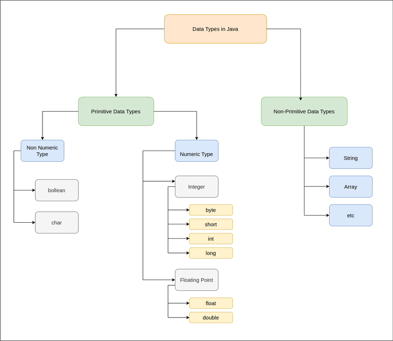
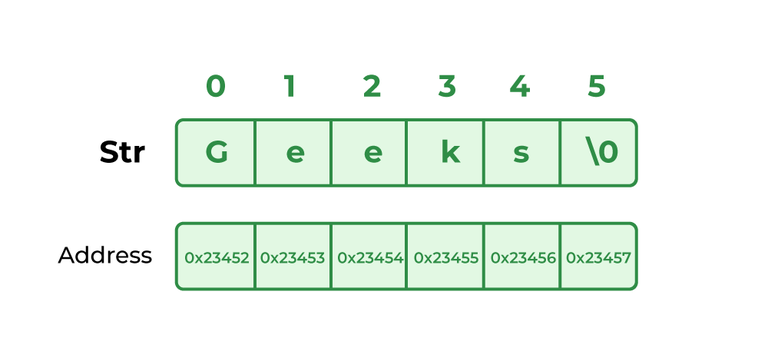
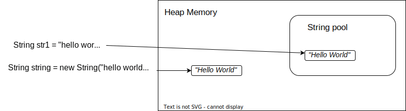
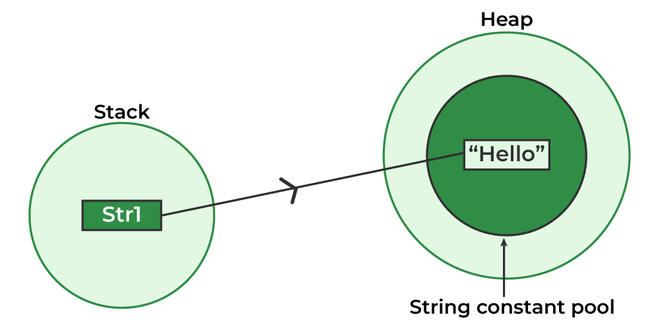
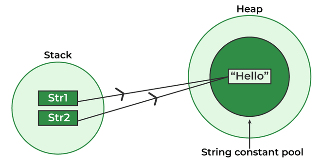
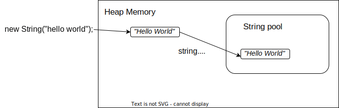
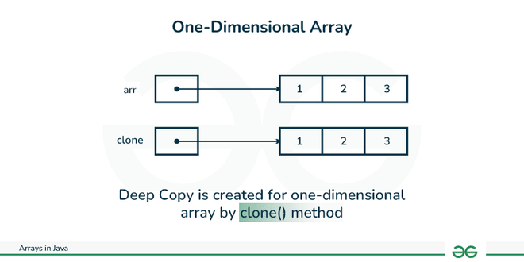
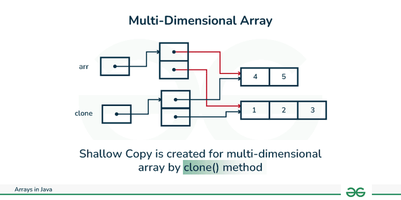
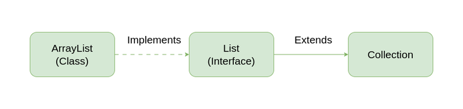
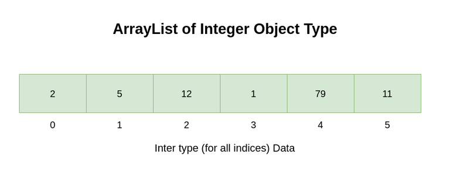

# Java

[TOC]

## 基本概念

### 資料型別

- 原生型別 (Primitive Data Type)

	- boolean, char, int, short, byte, long, float, and double

		| Data Type |   Size    |     Default Value      |
		| :-------- | :-------: | :--------------------: |
		| boolean   | 1 **bit** |      true, false       |
		| char      |  2 bytes  |       0 ~ 65535        |
		| byte      |  1 byte   |       -128 ~ 127       |
		| short     |  2 bytes  |     -32768 ~ 32767     |
		| int       |  4 bytes  | $-2^{31}$ ~ $2^{31}-1$ |
		| long      |  8 bytes  | $-2^{63}$ ~ $2^{63}-1$ |
		| float     |  4 bytes  |                        |
		| double    |  8 bytes  |                        |

- 參考型別 (Reference Data Types)

	- **Integer**, **String**, Class, Interface, **Array** ...等

	> **Java 使用 Unicode 系統**; 而不像 C++ 使用 ASCII code 系統
	>
	> - 因此，Java 的 char 型別需要 2 bytes 才足夠



### 迴圈 (for loop & for-each loop)

- for loop

	- 基本範例
		```java
		for (int i = 0; i < arr.length; i++) {
			System.out.println("Element at index " + i + " : "+ arr[i]);
		}
		```

- for-each loop

	- 常用於 Array, Collection 類別

	- 優點

		- **在 loop body 中，可直接使用 element**，而不是用 index 來存取元素

	- 限制

		- 僅能 **往前迭代(iterate forward)**，且 **一次前進一格(single step)**

			```java
			// cannot be converted to a for-each loop
			for (int i=numbers.length-1; i>0; i--)
			{
						System.out.println(numbers[i]);
			}
			```

		- **無法** 修改原陣列中的元素值

			```java
			for (int num: marks)
			{
					// only changes num, not the array element
					num = num*2;
			}
			```

		- **無法** 追蹤 index

			```java
			for (int num: numbers)
			{
					if (num == target)
					{
							return ???;   // do not know the index of num
					}
			}
			```

		- **無法** 同時存取兩個不同的 Array (因為無法追蹤 index)

			```java
			// cannot be easily converted to a for-each loop
			for (int i=0; i<numbers.length; i++)
			{
					if (numbers[i] == arr[i])
					{ ...
					}
			}
			```

	- 基本範例
		```java
		for (int element: arr) {
			System.out.println(element);
		}
		```

## String

- String, StringBuffer, StringBuilder 皆實作了 **CharSequence** 介面
	
- String vs. StringBuffer vs. StringBuilder

	| 特色\字串                  |       String       |        StringBuffer         | StringBuilder |
	| :------------------------- | :----------------: | :-------------------------: | :-----------: |
	| 引入版本                   |      JDK 1.0       |           JDK 1.0           |    JDK 1.5    |
	| 可變性(mutable, immutable) |       不可變       |            可變             |     可變      |
	| thread-safe                |         是         |             是              |      否       |
	| 記憶體使用效率             |         高         |            較差             |     較佳      |
	| 執行效能                   |         高         | 較低 (因為 Synchronization) |     較高      |
	| 適用情境                   | 要求字串需為不可變 |          多執行緒           |   單執行緒    |

### 基本概念

- 字串 = char[]

	```java
	String name = "Geeks";
	```

	

- 不可變的 (immutable): 一旦建立字串物件後，該字串的字元序列就無法被更改了

	```java
	String original = "hello"; // 原字串物件
	String modified = original.toUpperCase();  // 建立一個新的字串物件

	System.out.println(original);  // "hello"
	System.out.println(modified);  // "HELLO"
	```

- thread-safe

### 建立字串

- 基本範例

	```java
	// 法 1: String Literal (動態分配在 heap memory，而不是在 string pool 中)
	String str1 = "hello world";
	// 法 2: 使用 new 關鍵字 (儲存在 string pool)
	String string = new String ("hello world");
	```

	

- 其他範例

	```java
	// 用 byte array 建立 string
	byte[] bArr = {71, 101, 101, 107, 115};
	String str =new String(bArr); // Geeks

	// 指定 byte array 的 index 範圍，建立 string
	String s_index = new String(bArr, 1, 3); // eek
	```

	```java
	// 用 character array 建立 string
	char[] charArr = {'G', 'e', 'e', 'k', 's'};
	String str = new String(charArr); // Geeks

	// 指定 character array 的 index 範圍，建立 string
	String str_index = new String(charArr , 1, 3); // eek
	```

	```java
	// 用 int array 對照 Unicode (offset: 指定 index 的起始位置; count: 要產生幾個元素數)
	// String(int[] uni_code_points, int offset, int count)
	int[] uni_code = {71, 101, 101, 107, 115};
	String str_index = new String(uni_code, 1, 3); // eek
	```

	```java
	// 用 StringBuffer 類別，建立 String
	StringBuffer sBuffer = new StringBuffer("Geeks");
	String str = new String(sBuffer); // Geeks
	```

	```java
	// 用 StringBuilder 類別，建立 String
	StringBuilder sBuilder = new StringBuilder("Geeks");
	String str = new String(sBuilder); // Geeks
	```

- stack 儲存變數(string object)

- heap 儲存變數值(string value)

	- string pool = 位於 heap memory 中的一個字串緩存空間 (深綠色處)

		```java
		// 情境 1: 建立一個 string object
		String str1 = "Hello";
		```

		

		```java
		// 情境 2: 建立兩個不同的 string object，但因為 string pool 中已存在 "Hello"，所以 str1, str2 會指向 string pool 中的同一個 string value
		String str1 = "Hello";
		String str2 = "Hello"; // "Hello" in string pool is reused
		```

		

		```java
		// 使用 new 關鍵字，會將變數值動態分配在 heap memory 中 (而不是在 string pool)
		String strObject = new String("hello world");
		// 使用 String.intern() 內建方法將字串值移動到 string pool
		String strLiteral = strObject.intern();

		System.out.println(strObject == strLiteral); // false
		```

		

### 基本操作

- 計算字串中的 character 數: `String.length()`

	```java
	"abc".length();  // 3
	```

- 獲取指定 index 位置的 character

	- 回傳 character 型別 (用單引號 ' ')

	```java
	"abcde".charAt(3);  // 'd'
	```

- 移除空白字元

	- **僅移除字串的首、尾處** 的空白字元; 不包括字串中間的空白字元

	```java
	String str1 = " a b c ";
	System.out.println(str1.trim()); // "a b c"
	```

- 替換字元

	- 會建立一個新字串 (所以 **不會** 影響到原字串)

	```java
	String str1 = "aabbcc";
	String str2 = str1.replace('b', 'f');

	System.out.println(str1); // "aabbcc"
	System.out.println(str2); // "aaffcc"
	```

- 將字串轉換成 char[]

	```java
	String str1="abcde";
	char[] charArr = str1.toCharArray();

	System.out.println(charArr); // ['a', 'b', 'c', 'd', 'e']
	```

- 檢查字串的前綴

	```java
	String str1="hello world";
	String str2="hello";

	System.out.println(str1.startsWith(str2)); // true
	```

- 找出指定 substring 於字串中 **第一次出現** 的 index 位置

	- 參數 **substring** 是 **case sensitive**
	- 若未搜尋到，回傳 -1

	```java
	String str = "A learns and B learns";
	System.out.println(str.indexOf("learns"));  // 2
	System.out.println(str.indexOf("AND")); // -1
	```

- 找出指定 substring 於字串中 **最後一次出現** 的 index 位置

	- 參數 **substring** 是 **case sensitive**
	- 若未搜尋到，回傳 -1

	```java
	String str = "abcabc";
	System.out.println(str.lastIndexOf("ab")); // 3
	System.out.println(str.lastIndexOf("c")); // 5 (注意! 參數型別必須是 String，因此若要搜尋 character，仍然必需用雙引號 "")
	```

- 合併 substring

	```java
	String substr1 = "abc";
	String substr2 = "def";
	String res = substr1.concat(substr2); // "abcdef"
	```

- 給定 index 範圍，切割出 substring

	- index 從 0 開始
	- 不包含末項 index 的值

	```java
	"abcdef".substring(2, 4); // "cd"
	```

- 檢查是否包含某個 substring

	- **參數僅能是 substring** ，而不能是 character

	```java
	String str1 = "abcdef";

	System.out.println(str1.contains("bcd")); // true, 完全連續存在
	System.out.println(str1.contains("bcf")); // false, 不能有間隔
	```

- 比較兩個 String 是否完全相同 (每一個 character)

	- 採 case sensitive: `str1.equals(str2)`
	- 採 case insensitive: `str1.equalsIgnoreCase(str2)`

	```java
	// String.equals.()
	Boolean res1 = "abc".equals("abc"); // true
	Boolean res2 = "ABC".equals("abc"); // false

	// String.equalsIgnoreCase.()
	Boolean res3 = "abc".equalsIgnoreCase("abc"); // true
	Boolean res4 = "ABC".equalsIgnoreCase("abc"); // true
	```

- 比較兩個 String 的字符順序 (lexicographically)

	- 字符順序 = (每個 character 的) Unicode 值的編碼順序
	- 用法 1: 比較字典順序
		- 回傳 str1, str2 之間的字符順序的差距，比較 str1, str2 之間的第一個不相同的 character 的字符順序
			- 若 str1 comes before str2: 回傳負值 (< 0)
			- 若 str1 & str2 are same: 回傳 0
			- 若 str1 comes after str2: 回傳正值 (> 0)
	- 用法 2: 若 str1 是 str2 的前綴的情況
		- 回傳 str1, str2 兩個字串長度的差值: `str1.length() - str2.length()`
	- 採 case sensitive: `str1.compareTo(str2)`
	- 採 case insensitive: `str1.compareToIgnoreCase(str2)`

	```java
	String str1 = "hello";
	String str2 = "hello";
	String str3 = "heck";
	String str4 = "hello world";

	// 用法 1 (字典順序): 當兩個字串不相等時，比較的是字元的 Unicode 值
	// 例如:str1 和 str3 的比較首先會比較第一個不同的字元（'l' 和 'c'），由於 'l' 的 Unicode 值大於 'c' 的，因此返回一個正值
	System.out.println(str1.compareTo(str3));  // 9 (正值)

	// 用法 2 (長度問題): 當一個字串是另一個字串的前綴時，比較結果基於長度差異
	// 例如: str1 和 str4 的比較。str1 較短，所以返回一個負值，其值通常是兩個字串長度的差
	System.out.println(s1.compareTo(s4));  // -6 (負值)

	// 因為 str1 和 str2 完全相同
	System.out.println(str1.compareTo(str2));  // 0
	```

### 參考資料

- [GeeksForGeeks-Strings in Java](https://www.geeksforgeeks.org/strings-in-java/?ref=lbp)
- [GeeksForGeeks-String constant pool in Java](https://www.geeksforgeeks.org/string-constant-pool-in-java/)

- [Java-String intern()](https://howtodoinjava.com/java/string/java-string-intern-method-example/)

- [GeeksForGeeks-String class in Java](https://www.geeksforgeeks.org/string-class-in-java/)

- [GeeksForGeeks-String vs. StringBuffer vs. StringBuilder in Java](https://www.geeksforgeeks.org/string-vs-stringbuilder-vs-stringbuffer-in-java/)

## StringBuffer

### 基本概念

- StringBuffer = char[]
- 可變的(mutable): 方便修改字串值，而不需每次都要建立新的字串
- thread-**safe**: 因此，常用於 **multi**-threaded 程式

### 建立 StringBuffer

```java
// 法 1: 建立一個空的 StringBuffer，初始容量為 16
StringBuffer buffer1 = new StringBuffer();
// 法 2: 使用字串建立 StringBuffer
StringBuffer buffer2 = new StringBuffer("Java");
// 法 3: 建立一個指定容量的 StringBuffer
StringBuffer buffer3 = new StringBuffer(50);
```

### 基本操作

- 取得當前 StringBuffer 的容量

	- 預設為 16 個 character

	```java
	StringBuffer sb = new StringBuffer();
	System.out.println(sb.capacity()); // 預設為 16 個 character 的容量

	sb.append("hello");
	System.out.println(sb.capacity()); // 容量不會受到影響
	```

- 計算當前 StringBuffer 的元素數

	- 預設為 0

	```java
	StringBuffer sb = new StringBuffer();
	System.out.println(sb.length()); // 0

	sb.append("hello");
	System.out.println(sb.length()); // 5
	```

- 附加新字串到原字串的最後面

	- 會影響到原字串

	```java
	StringBuffer sb = new StringBuffer("hello ");
	sb.append("world"); // 會影響到原本字串

	System.out.println(sb); // "hello world"
	```

- 插入新字串到指定 index 位置

	- 會影響到原字串

	```java
	StringBuffer sb = new StringBuffer("hello ");
	sb.insert(1, "bbb"); // 會影響到原本字串

	System.out.println(sb); // "hbbbello"
	```

- 於指定 index 範圍，替換為新字串

	- 會影響到原字串
	- 指定 index 範圍: beginIndex ~ endIndex (包含 beginIndex， 但不包含 endIndex)

	```java
	StringBuffer sb = new StringBuffer("abcde");
	sb.replace(1, 3, "java"); // 表示要將 'e', 'l' 的 index 位置，替換成 "java"

	System.out.println(sb); // "ajavade"
	```

- 於指定 index 範圍，刪除 substring

	- 會影響到原字串
	- 指定 index 範圍: beginIndex ~ endIndex (包含 beginIndex， 但不包含 endIndex)

	```java
	StringBuffer sb = new StringBuffer("abcde");
	sb.delete(1, 3); // 表示要刪除 "bc"

	System.out.println(sb); // "ade"
	```

- 反轉 StringBuffer

	- 會影響到原字串

	```java
	StringBuffer sb = new StringBuffer("hello");
	sb.reverse();

	System.out.println(sb); // olleh
	```

### 參考資料

- [GeeksForGeeks-StringBuffer class in Java](https://www.geeksforgeeks.org/stringbuffer-class-in-java/)

## StringBuilder

### 基本概念

- 從 Java SE 5.0 後，推出 StringBuilder 類別

	- 相較 StringBuffer 類別，StringBuilder 類別執行效能更快，但不保證同步性(synchronization)

- StringBuilder = char[]
- **非** thread-safe: 因此，常用於 **single**-threaded 程式

### 建立 StringBuilder

```java
// 法 1: 建立一個空的 StringBuilder，初始容量為 16
StringBuilder sb1 = new StringBuilder();
// 法 2: 使用字串建立 StringBuffer
StringBuilder sb2 = new StringBuilder("Java");
// 法 3: 建立一個指定容量的 StringBuffer
StringBuilder sb3 = new StringBuilder(50);
```

### 基本操作

- 取得當前 StringBuilder 的容量

	- 預設為 16 個 character

	```java
	StringBuilder sb = new StringBuilder();
	System.out.println(sb.capacity()); // 預設為 16 個 character 的容量

	sb.append("hello");
	System.out.println(sb.capacity()); // 容量不會受到影響
	```

- 計算當前 StringBuffer 的元素數

	- 預設為 0

	```java
	StringBuilder sb = new StringBuilder();
	System.out.println(sb.length()); // 0

	sb.append("hello");
	System.out.println(sb.length()); // 5
	```

- 將 StringBuilder 類別，轉換成 String 類別

	```java
	StringBuilder sb = new StringBuilder("abc");
	System.out.println(sb.getClass()); // class java.lang.StringBuilder

	String str = sb.toString();
	System.out.println(str.getClass()); // class java.lang.String
	```

- 根據指定 index 位置，取得 character

	```java
	StringBuilder sb = new StringBuilder("abcde");
	System.out.println(sb.charAt(2)); // 'c'
	```

- 找出指定 substring 於字串中 **第一次出現** 的 index 位置

	- 參數 **substring** 是 **case sensitive**
	- 若未搜尋到，回傳 -1

	```java
	StringBuilder sb = new StringBuilder("A learns and B learns");
	System.out.println(sb.indexOf("learns"));  // 2
	System.out.println(sb.indexOf("AND")); // -1
	```

- 找出指定 substring 於字串中 **最後一次出現** 的 index 位置

	- 參數 **substring** 是 **case sensitive**
	- 若未搜尋到，回傳 -1

	```java
	StringBuilder sb = new StringBuilder("abcabc");
	System.out.println(sb.lastIndexOf("ab")); // 3
	System.out.println(sb.lastIndexOf("c")); // 5 (注意! 參數型別必須是 String，因此若要搜尋 character，仍然必需用雙引號 "")
	```

- 給定 index 範圍，切割出 substring

	- index 從 0 開始
	- 不包含末項 index 的值

	```java
	StringBuilder sb = new StringBuilder("abcdef");
	System.out.println(sb.substring(2, 4)); // "cd"
	```

- 附加新字串到原字串的最後面

	- 會影響到原字串

	```java
	StringBuilder sb = new StringBuilder("hello ");
	sb.append("world"); // 會影響到原本字串

	System.out.println(sb); // "hello world"
	```

- 插入元素到指定 index 位置

	```java
	StringBuilder sb = new StringBuilder("aaa");
	sb.insert(1, 'b');
	System.out.println(sb); // "abaa"

	sb.insert(2, "cd");
	System.out.println(sb); // "abcdaa"
	```

- 於指定 index 範圍，替換為新字串

	- 會影響到原字串
	- 指定 index 範圍: beginIndex ~ endIndex (包含 beginIndex， 但不包含 endIndex)

	```java
	StringBuilder sb = new StringBuilder("abcdefg");
	sb.replace(1, 3, "x"); // 表示要將 'b', 'c' 的 index 位置，替換成 "x"

	System.out.println(sb); // "axdefg"
	```

- 於指定 index 範圍，刪除 substring

	- 會影響到原字串

	- 指定 index 範圍: beginIndex ~ endIndex (包含 beginIndex， 但不包含 endIndex)

	```java
	StringBuilder sb = new StringBuilder("abcde");
	sb.delete(1, 3); // 表示要刪除 "bc"

	System.out.println(sb); // "ade"
	```

### 參考資料

- [GeeksForGeeks-StringBuilder class in Java](https://www.geeksforgeeks.org/stringbuilder-class-in-java-with-examples/)

## Array

### 基本概念

- 在記憶體中連續儲存 (store a collection of elements sequentially)
- 使用 index 來隨機存取元素 (randomly access)

	

- 可儲存原生型別 or 物件型別，但各元素需為相同型別

- 一旦宣告後，為固定大小 (fixed-size)

- Array 類別 **繼承 Object 類別**

- Array 類別 **實作 Cloneable & java.io.Serializable 介面**

### 宣告 & 初始化

- 宣告 (有 2 種寫法)

	- 原生型別

		- ```java
			int[] arr; // 推薦這個寫法，較直覺
			```
		- ```java
			int arr[];
			```

	- 參考型別

		- ```java
			Student[] arr = new Student[5]; // student is a user-defined class
			```

	- 多維陣列 (e.g. 2D Array)

		```java
		int[][] arr = new int[3][3];
		```

- 初始化 (分配記憶體給該 Array)

	```java
	arr = new int[5];
	```

- 同時宣告 + 初始化

	```java
	int[] arr = new int[5];
	```

### 基本操作

- 取得陣列容量(capacity)

	- `arr.length` 屬性

		```java
		int[] arr = new int[5]; // 宣告一個含有 5 格容量(capacity)的 Array
		System.out.println(arr.length); // 5

		String[] strArr = { "GEEKS", "FOR", "GEEKS" };
		System.out.println(strArr.length); // 3
		```

- 存取元素

	- 視情況可用 for loop, for-each loop 來存取 Array 元素

		- for loop 的 Array index 從 0 (首個元素) ~ -1 (最末項元素)

	- 若存取合法 index 範圍外的元素 => JVM 會拋出 **ArrayIndexOutOfBoundsException**

- 複製陣列

	- 1D Array

		- 採用 deep copy: 另外複製一個含有相同元素們的陣列

			

		- 基本範例

			```java
			int arr[] = { 1, 2, 3 };
			int cloneArr[] = arr.clone();
			System.out.println(intArr == arr); // false
			```

	- Multi-D Array

		- 採用 shallow copy: 僅複製原始物件的最外層結構(外殼)，裡面的元素仍是指向原資料的記憶體位置

			

		- 基本範例

			```java
			int intArray[][] = {{ 1, 2, 3 }, { 4, 5 }};
			int cloneArr[] = arr.clone();

			System.out.println(intArray == cloneArray); // false
			System.out.println(intArray[0] == cloneArray[0]); // true (sub-arrays are shared)
			System.out.println(intArray[1] == cloneArray[1]); // true (sub-arrays are shared)
			```

### 參考資料

- [GeeksForGeeks-Arrays in Java](https://www.geeksforgeeks.org/arrays-in-java/?ref=lbp)

## ArrayList

### 基本概念

- ArrayList 類別 **繼承 Collection 類別**，且屬於 java.util package 的其中一個類別

	- ArrayList 類別 **實作 List 介面**
	- 類似 C++ 的 vector

	

- 使用 index 來隨機存取元素 (randomly access)
	

- 可變大小 (dynamic size): 表示新增, 刪除元素會自動調整 ArrayList.size()

- ArrayList 僅能裝 wrapper class，而不能裝原生型別

- 非 Synchronized: 當 Multi-thread 同時修改同一個 ArrayList 時，無法保證 thread-safe (數據一致性)

### 宣告 & 初始化

- 基本範例

	```java
	ArrayList<Integer> arrL = new ArrayList<Integer>(2);
	```

### 基本操作

- 取得 ArrayList 的元素數

	- `ArrayList.size()` 方法

	```java
	int sz = arrL.size();  // 4
	```

- 新增元素

	- 若 ArrayList 的 size 滿了，預設會自動 doubled size 來儲存更多的元素
	- ArrayList 可以接受 null, 重複值

	```java
	ArrayList<String> arrL = new ArrayList<>();
	// 法 1: 正常加入元素
	arrL.add("Alice");
	arrL.add("Bob");
	// 法 2: 指定 index，插入元素
	arrL.add(1, "and")
	System.out.println(al); // [Alice, and, Bob]
	```

- 設定/更新元素值

	```java
	arrL.set(2, "John");
	System.out.println(arrL); // [Alice, and, John]
	```

- 刪除元素

	```java
	// 法 1: 刪除指定元素 (若 ArrayList 中存在相同的物件，則刪除第一個出現的物件)
	arrL.remove("John");
	// 法 2: 刪除指定 index 上的元素
	arrL.remove(0);
	System.out.println(arrL); [and]
	```

- 迭代元素

	```java
	ArrayList<String> arrL = new ArrayList<>();
	// 初始化時，賦值多個元素值 (Java 9+)
	ArrayList<String> arrL = new ArrayList<>(List.of("Alice", "and", "Bob"));

	// 法 1: 使用 for loop
	for (int i = 0; i < arrL.size(); i++) {
		System.out.print(al.get(i) + ", "); // Alice, and, Bob
	}
	// 法 2: 使用 for-each loop
	for (String str: arrL) {
		System.out.print(str + ", "); // Alice, and, Bob
	}
	```

- 排列元素

	```java
	ArrayList<Integer> arrL = new ArrayList();
	list.add(2);
	list.add(4);
	list.add(3);
	list.add(1);

	System.out.println("Before sorting list:");
	System.out.println(arrL);
	// 運用 Collection 類別的 sort() 方法
	Collections.sort(arrL); // [2, 4, 3, 1]

	System.out.println("after sorting list:");
	System.out.println(arrL); // [1, 2, 3, 4]
	```

- 取得元素

	```java
	Integer n = list.get(1); // and
	```

### 參考資料

- [GeeksForGeeks-ArrayList in Java](https://www.geeksforgeeks.org/arraylist-in-java/)
- [GeeksForGeeks-Array vs. ArrayList in Java](https://www.geeksforgeeks.org/array-vs-arraylist-in-java/)
- [GeeksForGeeks-How to find length or size of an Array in Java?](https://www.geeksforgeeks.org/how-to-find-length-or-size-of-an-array-in-java/)
